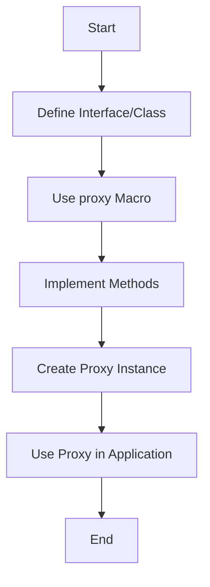

## 11.4.1 The `proxy` Macro

In the realm of Clojure, a language that thrives on the Java Virtual Machine (JVM), the ability to interact seamlessly with Java code is not just a feature but a necessity. One of the most powerful tools in Clojure's interoperability arsenal is the `proxy` macro. This macro allows you to create instances of Java classes or implement Java interfaces directly within your Clojure code, providing a bridge between the functional world of Clojure and the object-oriented paradigm of Java.

### Understanding the `proxy` Macro

The `proxy` macro in Clojure is a versatile construct that allows you to create anonymous classes that implement one or more interfaces or extend a class. This is particularly useful when you need to interact with Java libraries or frameworks that require you to implement specific interfaces or extend certain classes.

#### Basic Syntax

The basic syntax of the `proxy` macro is as follows:

```clojure
(proxy [InterfaceName] []
  (methodName [args] body))
```

- **InterfaceName**: The Java interface you wish to implement.
- **methodName**: The method from the interface that you need to implement.
- **args**: The arguments that the method takes.
- **body**: The implementation of the method.

#### Extending Classes

In addition to implementing interfaces, the `proxy` macro can also be used to extend Java classes. This is done by specifying the class you wish to extend in the vector:

```clojure
(proxy [ClassName] []
  (methodName [args] body))
```

### Practical Examples

Let's delve into some practical examples to illustrate how the `proxy` macro can be used to implement interfaces and extend classes.

#### Implementing a Java Interface

Suppose you have a Java interface `Runnable` that you want to implement in Clojure. The `Runnable` interface has a single method `run` that needs to be implemented.

```clojure
(def my-runnable
  (proxy [Runnable] []
    (run []
      (println "Running in a separate thread!"))))

(.start (Thread. my-runnable))
```

In this example, we create an instance of `Runnable` using the `proxy` macro and implement the `run` method to print a message. We then start a new thread using this runnable.

#### Extending a Java Class

Consider a scenario where you need to extend the `java.util.TimerTask` class, which requires you to implement the `run` method.

```clojure
(def my-task
  (proxy [java.util.TimerTask] []
    (run []
      (println "Task executed!"))))

(let [timer (java.util.Timer.)]
  (.schedule timer my-task 1000))
```

Here, we extend `TimerTask` and provide an implementation for the `run` method. We then schedule this task to run after a delay using a `Timer`.

### Advanced Usage

The `proxy` macro is not limited to simple implementations. It can be used in more complex scenarios involving multiple interfaces or classes with constructors.

#### Implementing Multiple Interfaces

You can implement multiple interfaces by listing them in the vector:

```clojure
(proxy [java.util.EventListener java.lang.Runnable] []
  (run []
    (println "Running!"))
  (handleEvent [event]
    (println "Event handled!")))
```

In this example, we implement both `EventListener` and `Runnable`. Each method required by these interfaces is implemented within the `proxy` block.

#### Handling Constructors

When extending a class with constructors, you can pass arguments to the superclass constructor by including them after the empty vector:

```clojure
(proxy [java.awt.event.MouseAdapter] []
  (mouseClicked [event]
    (println "Mouse clicked!")))
```

In this case, `MouseAdapter` is a class with a default constructor, so no additional arguments are needed. If the class had a constructor with parameters, you would pass them in the vector.

### Best Practices and Optimization Tips

When using the `proxy` macro, consider the following best practices to ensure efficient and maintainable code:

- **Limit Complexity**: Avoid implementing too many interfaces or extending complex classes within a single `proxy` call. This can lead to difficult-to-maintain code.
- **Use Descriptive Names**: When defining methods within a `proxy`, use descriptive names for arguments to enhance readability.
- **Leverage Clojure's Functional Features**: While `proxy` allows for Java-like object-oriented programming, try to leverage Clojure's functional programming features where possible to maintain idiomatic Clojure code.
- **Performance Considerations**: Be mindful of performance implications when using `proxy`, especially in performance-critical applications. The use of `proxy` can introduce overhead due to the dynamic nature of the generated classes.

### Common Pitfalls

Despite its power, the `proxy` macro can introduce certain pitfalls if not used carefully:

- **Method Signature Mismatch**: Ensure that the method signatures in your `proxy` implementation match those of the interface or class you are implementing or extending.
- **State Management**: Be cautious when managing state within a `proxy`. Clojure's immutable data structures can help avoid common pitfalls associated with mutable state.
- **Error Handling**: Properly handle exceptions within `proxy` methods to prevent unexpected behavior or crashes.

### Diagrams and Flowcharts

To better understand the flow of using the `proxy` macro, consider the following flowchart illustrating the process of creating a proxy instance:



### Conclusion

The `proxy` macro in Clojure is a powerful tool for Java interoperability, allowing you to implement interfaces and extend classes with ease. By understanding its syntax and capabilities, you can effectively bridge the gap between Clojure's functional paradigm and Java's object-oriented world. Whether you're integrating with existing Java libraries or building new applications, the `proxy` macro provides the flexibility and power needed to harness the full potential of the JVM.

## Quiz Time!



### What is the primary purpose of the `proxy` macro in Clojure?

- [x] To implement Java interfaces and extend classes
- [ ] To define new Clojure functions
- [ ] To create immutable data structures
- [ ] To handle exceptions in Clojure

> **Explanation:** The `proxy` macro is used to create instances of Java classes or implement Java interfaces directly within Clojure code.

### Which of the following is a correct usage of the `proxy` macro to implement a Java interface?

- [x] `(proxy [Runnable] [] (run [] (println "Running!")))`
- [ ] `(proxy Runnable [] (run [] (println "Running!")))`
- [ ] `(proxy [Runnable] [run [] (println "Running!")])`
- [ ] `(proxy [Runnable] [] (println "Running!"))`

> **Explanation:** The correct syntax involves specifying the interface in a vector followed by method implementations.

### How can you implement multiple interfaces using the `proxy` macro?

- [x] List all interfaces in the vector: `(proxy [Interface1 Interface2] [] ...)`
- [ ] Use separate `proxy` calls for each interface
- [ ] Implement one interface and extend a class
- [ ] It's not possible to implement multiple interfaces

> **Explanation:** You can implement multiple interfaces by listing them in the vector within the `proxy` macro.

### What should you be cautious about when managing state within a `proxy`?

- [x] Avoiding mutable state
- [ ] Using too many interfaces
- [ ] Implementing too many methods
- [ ] Using descriptive argument names

> **Explanation:** Managing state within a `proxy` should be done carefully, preferably using Clojure's immutable data structures to avoid common pitfalls associated with mutable state.

### Which of the following is a common pitfall when using the `proxy` macro?

- [x] Method signature mismatch
- [ ] Using too many interfaces
- [ ] Implementing too few methods
- [ ] Using immutable data structures

> **Explanation:** A common pitfall is ensuring that method signatures in your `proxy` implementation match those of the interface or class.

### What is the benefit of using descriptive names for arguments in `proxy` methods?

- [x] Enhances readability
- [ ] Increases performance
- [ ] Reduces code size
- [ ] Avoids runtime errors

> **Explanation:** Using descriptive names for arguments improves code readability, making it easier to understand and maintain.

### What does the `proxy` macro return?

- [x] An instance of an anonymous class
- [ ] A new Clojure function
- [ ] A list of implemented methods
- [ ] A Java interface

> **Explanation:** The `proxy` macro returns an instance of an anonymous class that implements the specified interfaces or extends the specified class.

### How can you pass arguments to a superclass constructor in a `proxy`?

- [x] Include them in the vector after the empty vector: `(proxy [ClassName] [arg1 arg2] ...)`
- [ ] Pass them as arguments to the `proxy` macro
- [ ] Use a separate constructor function
- [ ] It's not possible to pass arguments

> **Explanation:** Arguments to a superclass constructor can be passed by including them in the vector after the empty vector in the `proxy` macro.

### What is a best practice when using the `proxy` macro?

- [x] Limit complexity by avoiding too many interfaces
- [ ] Implement all methods of an interface
- [ ] Use mutable state for efficiency
- [ ] Avoid using descriptive argument names

> **Explanation:** Limiting complexity by avoiding too many interfaces or complex classes within a single `proxy` call is a best practice.

### True or False: The `proxy` macro can only be used to implement Java interfaces, not to extend classes.

- [ ] True
- [x] False

> **Explanation:** The `proxy` macro can be used to both implement Java interfaces and extend Java classes.


