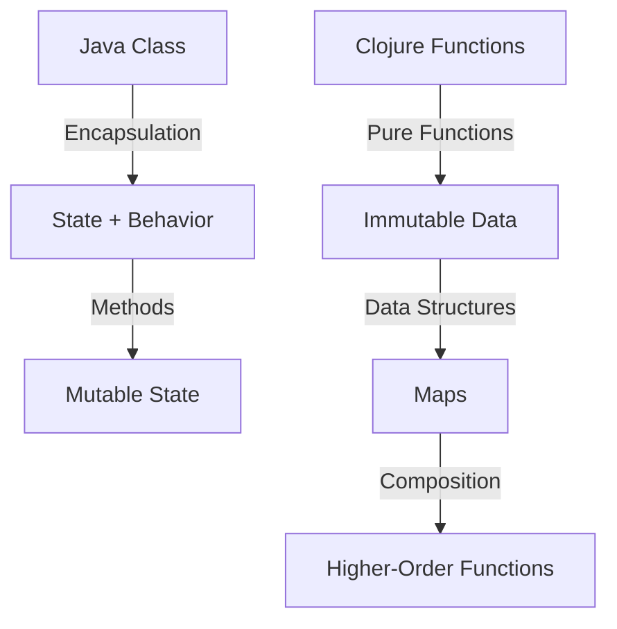

## 11.4.1 Decomposing Java Classes into Clojure Functions and Data Structures

As experienced Java developers, we are accustomed to thinking in terms of classes and objects. Java's object-oriented paradigm encourages encapsulating data and behavior within classes, often leading to complex hierarchies and tightly coupled systems. Transitioning to Clojure, a functional programming language, requires a shift in mindset. In this section, we'll explore how to decompose Java classes into Clojure functions and data structures, embracing immutability and simplicity.

### Understanding the Shift from Object-Oriented to Functional

In Java, classes serve as blueprints for creating objects, encapsulating both state (fields) and behavior (methods). Clojure, on the other hand, emphasizes functions and immutable data structures. This shift allows us to focus on what the program should accomplish rather than how it should be structured.

#### Key Differences:

- **State Management**: Java uses mutable objects, while Clojure relies on immutable data structures.
- **Behavior**: Java encapsulates behavior in methods within classes, whereas Clojure uses standalone functions.
- **Inheritance**: Java uses class hierarchies for code reuse, while Clojure encourages composition and higher-order functions.

### Decomposing a Java Class

Let's consider a simple Java class and see how we can transform it into a Clojure equivalent.

#### Java Example: A `Rectangle` Class

```java
public class Rectangle {
    private double length;
    private double width;

    public Rectangle(double length, double width) {
        this.length = length;
        this.width = width;
    }

    public double area() {
        return length * width;
    }

    public double perimeter() {
        return 2 * (length + width);
    }
}
```

In this Java class, we have encapsulated the properties `length` and `width` along with methods to calculate the area and perimeter.

#### Clojure Equivalent: Using Functions and Data Structures

In Clojure, we can represent the `Rectangle` using a map and define functions to operate on this data structure.

```clojure
(defn create-rectangle [length width]
  {:length length :width width})

(defn area [rectangle]
  (* (:length rectangle) (:width rectangle)))

(defn perimeter [rectangle]
  (* 2 (+ (:length rectangle) (:width rectangle))))
```

**Explanation**:
- **Data Representation**: We use a map to represent the rectangle, with keys `:length` and `:width`.
- **Functions**: The `area` and `perimeter` functions take a rectangle map as an argument and compute the respective values.

### Embracing Immutability

One of the core principles of Clojure is immutability. Unlike Java, where objects can change state, Clojure's data structures are immutable. This leads to safer and more predictable code.

#### Benefits of Immutability:

- **Thread Safety**: Immutable data structures eliminate the need for locks in concurrent programming.
- **Simplified Reasoning**: Functions that operate on immutable data are easier to reason about.
- **Enhanced Testability**: Pure functions with immutable inputs and outputs are straightforward to test.

### Transforming Methods into Pure Functions

In Java, methods often operate on the internal state of an object. In Clojure, we aim to create pure functions that take data as input and return new data as output.

#### Example: Transforming a Method

Consider a Java method that updates the dimensions of a rectangle:

```java
public void resize(double newLength, double newWidth) {
    this.length = newLength;
    this.width = newWidth;
}
```

In Clojure, we can create a pure function that returns a new rectangle with updated dimensions:

```clojure
(defn resize [rectangle new-length new-width]
  (assoc rectangle :length new-length :width new-width))
```

**Explanation**:
- **Pure Function**: The `resize` function returns a new map with updated values, leaving the original rectangle unchanged.
- **`assoc` Function**: This function is used to create a new map with updated key-value pairs.

### Decomposing Class Hierarchies

Java developers often use inheritance to create class hierarchies. In Clojure, we can achieve similar functionality through composition and higher-order functions.

#### Java Example: Inheritance

```java
public class Square extends Rectangle {
    public Square(double side) {
        super(side, side);
    }
}
```

#### Clojure Equivalent: Composition

In Clojure, we can use functions to achieve similar behavior without inheritance.

```clojure
(defn create-square [side]
  (create-rectangle side side))
```

**Explanation**:
- **Composition**: We use the `create-rectangle` function to create a square, demonstrating how composition can replace inheritance.

### Higher-Order Functions and Composition

Clojure's support for higher-order functions allows us to create flexible and reusable code. We can pass functions as arguments, return them from other functions, and compose them to build complex behavior.

#### Example: Composing Functions

Let's create a function that calculates the diagonal of a rectangle.

```clojure
(defn diagonal [rectangle]
  (Math/sqrt (+ (Math/pow (:length rectangle) 2)
                (Math/pow (:width rectangle) 2))))
```

We can compose this with other functions to create more complex operations.

```clojure
(defn rectangle-info [rectangle]
  {:area (area rectangle)
   :perimeter (perimeter rectangle)
   :diagonal (diagonal rectangle)})
```

**Explanation**:
- **Function Composition**: The `rectangle-info` function composes multiple functions to provide a comprehensive view of the rectangle.

### Try It Yourself

Experiment with the following tasks to deepen your understanding:

1. Modify the `create-rectangle` function to include additional properties, such as color or border thickness.
2. Create a function that takes a list of rectangles and returns the one with the largest area.
3. Implement a function that scales a rectangle by a given factor, returning a new rectangle.

### Visualizing the Transition

To better understand the transition from Java's object-oriented paradigm to Clojure's functional approach, let's visualize the flow of data and functions.



**Diagram Description**: This diagram illustrates the transition from Java's encapsulated classes with mutable state to Clojure's pure functions and immutable data structures, highlighting the role of composition and higher-order functions.

### Further Reading

For more information on Clojure's functional programming paradigm, consider exploring the following resources:

- [Official Clojure Documentation](https://clojure.org/)
- [ClojureDocs](https://clojuredocs.org/)
- [Functional Programming in Clojure](https://www.braveclojure.com/)

### Exercises

1. **Refactor a Java Class**: Choose a simple Java class from your codebase and refactor it into Clojure functions and data structures.
2. **Create a Function Library**: Develop a library of functions that operate on a common data structure, such as a geometric shape or a financial transaction.
3. **Explore Immutability**: Implement a small application in Clojure that leverages immutable data structures to manage state.

### Key Takeaways

- **Immutability**: Embrace immutable data structures for safer and more predictable code.
- **Pure Functions**: Transform methods into pure functions that operate on data and return new data.
- **Composition**: Use composition and higher-order functions to build flexible and reusable code.
- **Functional Paradigm**: Shift from object-oriented thinking to a functional mindset, focusing on data transformation and function composition.

By decomposing Java classes into Clojure functions and data structures, we can create more maintainable, testable, and scalable applications. As you continue your journey into Clojure, remember to leverage the power of immutability and functional programming to simplify complex systems.

## Quiz: Mastering the Transition from Java Classes to Clojure Functions



### What is a key difference between Java and Clojure in terms of state management?

- [x] Java uses mutable objects, while Clojure relies on immutable data structures.
- [ ] Java uses immutable objects, while Clojure relies on mutable data structures.
- [ ] Both Java and Clojure use mutable objects.
- [ ] Both Java and Clojure use immutable objects.

> **Explanation:** Java typically uses mutable objects, allowing state changes, whereas Clojure emphasizes immutability, leading to safer and more predictable code.

### How can we represent a Java class in Clojure?

- [x] By using maps and functions.
- [ ] By using classes and objects.
- [ ] By using arrays and loops.
- [ ] By using inheritance and polymorphism.

> **Explanation:** In Clojure, we represent data using maps and behavior using functions, moving away from the class-based structure of Java.

### What is the benefit of using pure functions in Clojure?

- [x] They are easier to test and reason about.
- [ ] They allow for mutable state changes.
- [ ] They require more complex syntax.
- [ ] They are less efficient than methods.

> **Explanation:** Pure functions, which do not have side effects, are easier to test and reason about, as they consistently produce the same output for the same input.

### How does Clojure handle inheritance?

- [x] Through composition and higher-order functions.
- [ ] Through class hierarchies.
- [ ] Through polymorphism.
- [ ] Through interfaces.

> **Explanation:** Clojure uses composition and higher-order functions to achieve code reuse, avoiding the class hierarchies common in Java.

### What is a higher-order function?

- [x] A function that takes other functions as arguments or returns them as results.
- [ ] A function that only operates on numbers.
- [ ] A function that is defined within a class.
- [ ] A function that modifies global state.

> **Explanation:** Higher-order functions can take other functions as arguments or return them, enabling powerful abstractions and code reuse.

### What is the purpose of the `assoc` function in Clojure?

- [x] To create a new map with updated key-value pairs.
- [ ] To modify an existing map in place.
- [ ] To delete keys from a map.
- [ ] To concatenate two maps.

> **Explanation:** The `assoc` function is used to create a new map with updated key-value pairs, maintaining immutability.

### How can we achieve code reuse in Clojure?

- [x] By using composition and higher-order functions.
- [ ] By using inheritance and polymorphism.
- [ ] By using global variables.
- [ ] By using mutable state.

> **Explanation:** Clojure encourages code reuse through composition and higher-order functions, avoiding the pitfalls of inheritance.

### What is the role of immutability in Clojure?

- [x] To ensure thread safety and predictability.
- [ ] To allow for state changes.
- [ ] To complicate code structure.
- [ ] To reduce performance.

> **Explanation:** Immutability ensures thread safety and predictability, as data cannot be changed once created, eliminating many concurrency issues.

### How does Clojure's approach to data structures differ from Java's?

- [x] Clojure uses immutable data structures, while Java often uses mutable ones.
- [ ] Clojure uses mutable data structures, while Java uses immutable ones.
- [ ] Both Clojure and Java use mutable data structures.
- [ ] Both Clojure and Java use immutable data structures.

> **Explanation:** Clojure's data structures are immutable by default, contrasting with Java's often mutable data structures, leading to different approaches to state management.

### True or False: Clojure's functional paradigm requires a shift from thinking in terms of objects to thinking in terms of data and functions.

- [x] True
- [ ] False

> **Explanation:** Clojure's functional paradigm emphasizes data and functions over objects, requiring a shift in mindset for developers accustomed to object-oriented programming.


