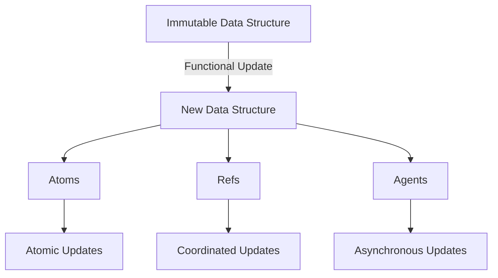

## 11.4.2 Managing State Functionally

As experienced Java developers, you're likely accustomed to managing state through mutable objects and variables. In Clojure, however, we embrace a functional paradigm that emphasizes immutability and pure functions. This shift offers numerous benefits, including enhanced concurrency, easier reasoning about code, and improved reliability. In this section, we'll explore how to manage state functionally in Clojure, using immutable data structures and functional updates. We'll also introduce state management tools like atoms, refs, and agents for scenarios where stateful behavior is necessary.

### Understanding Immutability

In Java, mutable objects are the norm. You might use setters to change an object's state or modify a collection directly. In contrast, Clojure's data structures are immutable by default. This means that once a data structure is created, it cannot be changed. Instead, any "modification" results in a new data structure.

#### Immutable Data Structures

Clojure provides a rich set of immutable data structures, including lists, vectors, maps, and sets. These structures are designed to be efficient, leveraging techniques like structural sharing to minimize memory usage and improve performance.

```clojure
(def my-vector [1 2 3 4 5])
(def updated-vector (conj my-vector 6))

;; my-vector remains unchanged
;; updated-vector is a new vector with the additional element
```

In the example above, `conj` adds an element to the vector, but instead of modifying `my-vector`, it returns a new vector `updated-vector`. This approach ensures that the original data remains unchanged, allowing for safer concurrent operations.

#### Functional Updates

Functional updates are a key concept in managing state functionally. Instead of changing an object in place, you create a new version of the object with the desired changes. This approach is akin to creating a new version of a document rather than editing the original.

```clojure
(def my-map {:name "Alice" :age 30})
(def updated-map (assoc my-map :age 31))

;; my-map remains unchanged
;; updated-map is a new map with the updated age
```

Here, `assoc` creates a new map with the updated age, leaving the original `my-map` intact.

### State Management Tools

While immutability is powerful, there are cases where stateful behavior is necessary, such as managing application state or handling concurrent updates. Clojure provides several tools for managing state in a functional way: atoms, refs, and agents.

#### Atoms

Atoms are used for managing shared, synchronous, and independent state. They provide a way to manage state changes safely in a concurrent environment.

```clojure
(def counter (atom 0))

;; Increment the counter atomically
(swap! counter inc)

;; Retrieve the current value
@counter
```

Atoms ensure that updates are atomic, meaning that concurrent modifications are handled safely without explicit locks.

#### Refs and Software Transactional Memory (STM)

Refs are used for managing coordinated, synchronous state changes. They leverage Software Transactional Memory (STM) to ensure consistency across multiple state changes.

```clojure
(def account1 (ref 100))
(def account2 (ref 200))

;; Transfer money between accounts
(dosync
  (alter account1 - 50)
  (alter account2 + 50))
```

In this example, `dosync` ensures that the operations on `account1` and `account2` are atomic and consistent, even in a concurrent environment.

#### Agents

Agents are used for managing asynchronous state changes. They allow you to perform updates in the background, without blocking the main thread.

```clojure
(def logger (agent []))

;; Send a message to the logger
(send logger conj "Log entry")

;; Retrieve the current log
@logger
```

Agents are ideal for tasks like logging or background processing, where updates can occur independently of the main application flow.

### Comparing with Java

In Java, managing state often involves mutable objects and explicit synchronization mechanisms like locks and monitors. This approach can lead to complex and error-prone code, especially in concurrent applications.

#### Java Example: Mutable State

```java
public class Counter {
    private int count = 0;

    public synchronized void increment() {
        count++;
    }

    public synchronized int getCount() {
        return count;
    }
}
```

In this Java example, we use synchronized methods to ensure thread safety. However, this approach can lead to performance bottlenecks and deadlocks if not managed carefully.

#### Clojure Example: Immutable State

In Clojure, we achieve thread safety through immutability and functional updates, reducing the need for explicit synchronization.

```clojure
(def counter (atom 0))

(swap! counter inc)
@counter
```

This Clojure example demonstrates how atoms provide a simpler and more efficient way to manage state changes concurrently.

### Try It Yourself

To deepen your understanding, try modifying the examples above. Experiment with different data structures and state management tools. For instance, try using refs to manage a bank account system with multiple accounts and transactions. Observe how Clojure's STM ensures consistency across state changes.

### Diagrams and Visualizations

Below is a diagram illustrating the flow of data through Clojure's state management tools:



**Diagram Caption**: This diagram shows how immutable data structures in Clojure are updated functionally, leading to new data structures. Atoms, refs, and agents provide different mechanisms for managing state changes.

### Exercises

1. **Immutable Data Structures**: Create a Clojure program that manages a list of tasks. Use vectors and maps to represent tasks and their attributes. Implement functions to add, remove, and update tasks without mutating the original data structures.

2. **State Management with Atoms**: Implement a simple counter using an atom. Extend the program to support multiple counters, each managed independently. Ensure that updates are atomic and thread-safe.

3. **Coordinated State Changes with Refs**: Simulate a banking system with multiple accounts. Use refs to manage account balances and ensure that transfers between accounts are consistent and atomic.

4. **Asynchronous Updates with Agents**: Create a logging system using agents. Implement functions to log messages asynchronously and retrieve the current log state.

### Key Takeaways

- **Immutability**: Clojure's immutable data structures provide a foundation for safe and efficient state management.
- **Functional Updates**: By creating new versions of data structures, we can manage state changes without mutating the original data.
- **State Management Tools**: Atoms, refs, and agents offer powerful mechanisms for managing state in concurrent applications.
- **Comparison with Java**: Clojure's approach to state management simplifies concurrency and reduces the need for explicit synchronization.

### Further Reading

For more information on Clojure's state management tools, check out the [Official Clojure Documentation](https://clojure.org/reference/atoms) and [ClojureDocs](https://clojuredocs.org/).

---

## Quiz: Mastering State Management in Clojure



### Which Clojure tool is best suited for managing asynchronous state changes?

- [ ] Atoms
- [ ] Refs
- [x] Agents
- [ ] Vars

> **Explanation:** Agents are designed for managing asynchronous state changes, allowing updates to occur in the background without blocking the main thread.

### What is the primary advantage of using immutable data structures in Clojure?

- [x] They provide thread safety without explicit locks.
- [ ] They are faster than mutable data structures.
- [ ] They use less memory.
- [ ] They are easier to serialize.

> **Explanation:** Immutable data structures provide thread safety by ensuring that data cannot be changed once created, eliminating the need for explicit locks.

### How does Clojure's Software Transactional Memory (STM) ensure consistency?

- [x] By coordinating state changes across multiple refs.
- [ ] By using locks and monitors.
- [ ] By serializing all updates.
- [ ] By using a global state manager.

> **Explanation:** Clojure's STM coordinates state changes across multiple refs, ensuring that all changes are consistent and atomic.

### What function is used to update the state of an atom in Clojure?

- [ ] assoc
- [x] swap!
- [ ] alter
- [ ] send

> **Explanation:** The `swap!` function is used to update the state of an atom in Clojure, applying a function to the current state.

### Which of the following is NOT a characteristic of Clojure's refs?

- [ ] They use STM for consistency.
- [ ] They allow coordinated updates.
- [ ] They are suitable for asynchronous updates.
- [x] They are used for independent state changes.

> **Explanation:** Refs are used for coordinated updates and rely on STM for consistency, but they are not suitable for asynchronous updates.

### In Clojure, what does the `dosync` block do?

- [x] It ensures that all operations within the block are atomic.
- [ ] It synchronizes access to a shared resource.
- [ ] It logs all state changes.
- [ ] It queues updates for later execution.

> **Explanation:** The `dosync` block ensures that all operations within it are atomic and consistent, using STM to manage state changes.

### What is the main difference between atoms and refs in Clojure?

- [x] Atoms are for independent state changes, refs are for coordinated changes.
- [ ] Atoms are asynchronous, refs are synchronous.
- [ ] Atoms are mutable, refs are immutable.
- [ ] Atoms use STM, refs do not.

> **Explanation:** Atoms are used for independent state changes, while refs are used for coordinated changes that require consistency across multiple state variables.

### Which Clojure tool would you use for logging messages asynchronously?

- [ ] Atoms
- [ ] Refs
- [x] Agents
- [ ] Vars

> **Explanation:** Agents are ideal for tasks like logging, where updates can occur asynchronously and independently of the main application flow.

### How do you retrieve the current value of an atom in Clojure?

- [ ] (get atom)
- [ ] (value atom)
- [x] @atom
- [ ] (deref atom)

> **Explanation:** You can retrieve the current value of an atom using the `@` symbol, which is shorthand for the `deref` function.

### True or False: In Clojure, mutable objects are preferred for managing state.

- [ ] True
- [x] False

> **Explanation:** False. Clojure prefers immutable data structures for managing state, as they provide thread safety and simplify reasoning about code.


