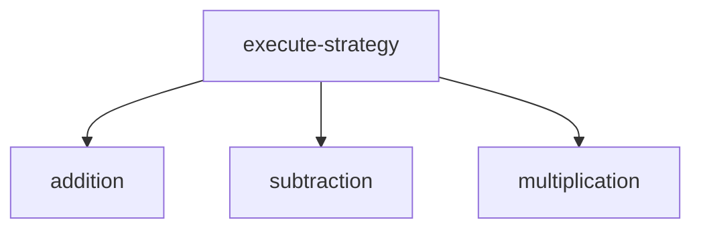
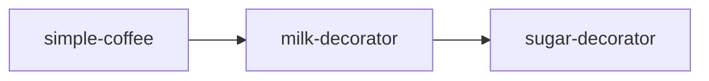

## 11.5.1 Adapting Object-Oriented Design Patterns

As experienced Java developers, you are likely familiar with the Gang of Four (GoF) design patterns, which provide solutions to common software design problems. These patterns are deeply rooted in object-oriented programming (OOP) principles such as encapsulation, inheritance, and polymorphism. However, when transitioning to Clojure, a functional programming language, the way we approach these patterns changes significantly. In this section, we will explore how some of these patterns translate to Clojure, which patterns become unnecessary due to Clojure's features, and how others evolve to fit the functional paradigm.

### Understanding the Shift from OOP to Functional Programming

Before diving into specific patterns, it's important to understand the fundamental differences between OOP and functional programming. In OOP, design patterns often revolve around managing state and behavior through objects. In contrast, functional programming emphasizes immutability, first-class functions, and data transformation.

#### Key Differences:

- **State Management**: OOP uses objects to encapsulate state, whereas functional programming prefers immutable data structures and pure functions.
- **Behavior Encapsulation**: In OOP, behavior is encapsulated within objects. In functional programming, behavior is expressed through functions that can be passed around and composed.
- **Inheritance vs. Composition**: OOP often relies on inheritance hierarchies, while functional programming favors composition of functions and data.

### Patterns That Become Redundant

Some design patterns are rendered unnecessary in Clojure due to its language features. Let's explore a few examples:

#### Singleton Pattern

The Singleton pattern ensures that a class has only one instance and provides a global point of access to it. In Clojure, immutability and the use of namespaces make this pattern redundant. You can simply define a constant or a function within a namespace to achieve the same effect.

**Java Example: Singleton Pattern**

```java
public class Singleton {
    private static Singleton instance;

    private Singleton() {}

    public static Singleton getInstance() {
        if (instance == null) {
            instance = new Singleton();
        }
        return instance;
    }
}
```

**Clojure Equivalent**

```clojure
(ns myapp.singleton)

(def singleton-instance
  {:key "value"}) ; Immutable map as a singleton

;; Access it directly
(singleton-instance)
```

In Clojure, the `singleton-instance` is immutable and can be accessed directly, eliminating the need for a class-based Singleton pattern.

#### Factory Pattern

The Factory pattern provides an interface for creating objects without specifying their concrete classes. In Clojure, this pattern is often unnecessary because functions can be used to create and return data structures or other functions.

**Java Example: Factory Pattern**

```java
public interface Shape {
    void draw();
}

public class Circle implements Shape {
    public void draw() {
        System.out.println("Circle drawn");
    }
}

public class ShapeFactory {
    public Shape getShape(String shapeType) {
        if (shapeType.equalsIgnoreCase("CIRCLE")) {
            return new Circle();
        }
        return null;
    }
}
```

**Clojure Equivalent**

```clojure
(defn draw-circle []
  (println "Circle drawn"))

(defn shape-factory [shape-type]
  (case shape-type
    "CIRCLE" draw-circle
    nil))

;; Usage
((shape-factory "CIRCLE"))
```

In Clojure, we use a simple function `shape-factory` to return another function based on the input, demonstrating how functions can replace the need for a Factory pattern.

### Patterns That Evolve

Some patterns take on new forms in Clojure, adapting to the functional paradigm:

#### Strategy Pattern

The Strategy pattern defines a family of algorithms, encapsulates each one, and makes them interchangeable. In Clojure, this is naturally achieved through higher-order functions.

**Java Example: Strategy Pattern**

```java
public interface Strategy {
    int execute(int a, int b);
}

public class Addition implements Strategy {
    public int execute(int a, int b) {
        return a + b;
    }
}

public class Context {
    private Strategy strategy;

    public Context(Strategy strategy) {
        this.strategy = strategy;
    }

    public int executeStrategy(int a, int b) {
        return strategy.execute(a, b);
    }
}
```

**Clojure Equivalent**

```clojure
(defn addition [a b]
  (+ a b))

(defn execute-strategy [strategy a b]
  (strategy a b))

;; Usage
(execute-strategy addition 5 3) ; => 8
```

In Clojure, strategies are simply functions, and `execute-strategy` is a higher-order function that takes a strategy function as an argument.

#### Decorator Pattern

The Decorator pattern attaches additional responsibilities to an object dynamically. In Clojure, this can be achieved by composing functions.

**Java Example: Decorator Pattern**

```java
public interface Coffee {
    String getDescription();
    double getCost();
}

public class SimpleCoffee implements Coffee {
    public String getDescription() {
        return "Simple coffee";
    }

    public double getCost() {
        return 5.0;
    }
}

public class MilkDecorator extends CoffeeDecorator {
    public MilkDecorator(Coffee coffee) {
        super(coffee);
    }

    public String getDescription() {
        return super.getDescription() + ", milk";
    }

    public double getCost() {
        return super.getCost() + 1.5;
    }
}
```

**Clojure Equivalent**

```clojure
(defn simple-coffee []
  {:description "Simple coffee"
   :cost 5.0})

(defn milk-decorator [coffee]
  (update coffee :description #(str % ", milk"))
  (update coffee :cost + 1.5))

;; Usage
(def my-coffee (milk-decorator (simple-coffee)))
```

In Clojure, we use functions to transform data, effectively decorating the `coffee` map with additional attributes.

### Patterns That Take on New Forms

#### Observer Pattern

The Observer pattern defines a one-to-many dependency between objects so that when one object changes state, all its dependents are notified. In Clojure, this can be implemented using atoms and watches.

**Java Example: Observer Pattern**

```java
import java.util.ArrayList;
import java.util.List;

interface Observer {
    void update(String message);
}

class Subject {
    private List<Observer> observers = new ArrayList<>();

    public void addObserver(Observer observer) {
        observers.add(observer);
    }

    public void notifyObservers(String message) {
        for (Observer observer : observers) {
            observer.update(message);
        }
    }
}
```

**Clojure Equivalent**

```clojure
(defn observer [message]
  (println "Received message:" message))

(def subject (atom []))

(defn add-observer [obs]
  (swap! subject conj obs))

(defn notify-observers [message]
  (doseq [obs @subject]
    (obs message)))

;; Usage
(add-observer observer)
(notify-observers "Hello, Observers!")
```

In Clojure, we use an `atom` to hold a list of observers and `doseq` to notify each observer.

### Try It Yourself

To deepen your understanding, try modifying the examples above:

- **Singleton**: Experiment with different immutable data structures as singletons.
- **Factory**: Create a factory function that returns different types of data structures.
- **Strategy**: Implement a new strategy function and use it with `execute-strategy`.
- **Decorator**: Add more decorators to the coffee example, such as sugar or cream.
- **Observer**: Implement a new observer and see how it reacts to notifications.

### Diagrams

To visualize these concepts, let's look at a few diagrams that illustrate the flow of data and function composition in Clojure.

#### Strategy Pattern Flow



*Diagram 1: The flow of data through different strategy functions.*

#### Decorator Pattern Composition



*Diagram 2: Function composition in the Decorator pattern.*

### Further Reading

For more information on Clojure's approach to design patterns, consider exploring the following resources:

- [Official Clojure Documentation](https://clojure.org/)
- [ClojureDocs](https://clojuredocs.org/)
- [Functional Programming Patterns in Scala and Clojure](https://www.amazon.com/Functional-Programming-Patterns-Scala-Clojure/dp/1937785475)

### Exercises

1. **Implement a new design pattern**: Choose a design pattern not covered here and implement it in Clojure.
2. **Refactor Java code**: Take a Java project that uses design patterns and refactor it into Clojure.
3. **Create a DSL**: Use Clojure's macro system to create a simple domain-specific language (DSL) for a specific problem domain.

### Key Takeaways

- Clojure's functional paradigm often makes traditional OOP design patterns unnecessary or transforms them into simpler forms.
- Patterns like Singleton and Factory are often redundant due to Clojure's immutability and first-class functions.
- Patterns like Strategy and Decorator naturally fit into Clojure's use of higher-order functions and function composition.
- Understanding how to adapt these patterns can help you write more idiomatic and efficient Clojure code.

Now that we've explored how to adapt object-oriented design patterns to Clojure, let's apply these concepts to refactor existing Java code and embrace the functional paradigm.

## Quiz: Adapting Object-Oriented Design Patterns to Clojure



### Which design pattern is often unnecessary in Clojure due to its immutability and namespace features?

- [x] Singleton
- [ ] Strategy
- [ ] Decorator
- [ ] Observer

> **Explanation:** The Singleton pattern is often unnecessary in Clojure because immutability and namespaces provide a simple way to manage single instances.

### How does the Strategy pattern translate to Clojure?

- [x] Through higher-order functions
- [ ] Using classes and interfaces
- [ ] By implementing inheritance
- [ ] Through mutable state

> **Explanation:** In Clojure, the Strategy pattern is implemented using higher-order functions that encapsulate different strategies.

### What is a key difference between OOP and functional programming regarding state management?

- [x] OOP uses objects to encapsulate state, while functional programming prefers immutable data structures.
- [ ] Functional programming uses objects to encapsulate state, while OOP prefers immutable data structures.
- [ ] Both paradigms use mutable state extensively.
- [ ] Neither paradigm uses state management.

> **Explanation:** OOP encapsulates state within objects, whereas functional programming emphasizes immutability and uses immutable data structures.

### In Clojure, how is the Decorator pattern typically implemented?

- [x] By composing functions
- [ ] Using inheritance
- [ ] Through mutable objects
- [ ] By creating subclasses

> **Explanation:** The Decorator pattern in Clojure is implemented by composing functions to add behavior.

### Which of the following is a benefit of using functions as first-class citizens in Clojure?

- [x] They can be passed as arguments and returned from other functions.
- [ ] They require complex inheritance hierarchies.
- [ ] They are always mutable.
- [ ] They cannot be composed.

> **Explanation:** Functions as first-class citizens can be passed around and composed, allowing for flexible and reusable code.

### What is the primary advantage of using immutable data structures in Clojure?

- [x] They simplify reasoning and concurrency.
- [ ] They require more memory.
- [ ] They are slower than mutable structures.
- [ ] They complicate state management.

> **Explanation:** Immutable data structures simplify reasoning about code and make concurrency easier to manage.

### How can the Observer pattern be implemented in Clojure?

- [x] Using atoms and watches
- [ ] Through inheritance
- [ ] By creating subclasses
- [ ] Using mutable objects

> **Explanation:** In Clojure, the Observer pattern can be implemented using atoms to hold state and watches to notify observers.

### Which pattern is naturally suited to Clojure's use of higher-order functions?

- [x] Strategy
- [ ] Singleton
- [ ] Factory
- [ ] Observer

> **Explanation:** The Strategy pattern is naturally suited to Clojure's higher-order functions, which can encapsulate different strategies.

### What is a common way to replace the Factory pattern in Clojure?

- [x] Using functions to create and return data structures
- [ ] Implementing classes and interfaces
- [ ] Using inheritance
- [ ] Creating mutable objects

> **Explanation:** In Clojure, functions can be used to create and return data structures, replacing the need for a Factory pattern.

### True or False: In Clojure, the Singleton pattern is often implemented using mutable state.

- [ ] True
- [x] False

> **Explanation:** In Clojure, the Singleton pattern is typically implemented using immutable data structures, not mutable state.


