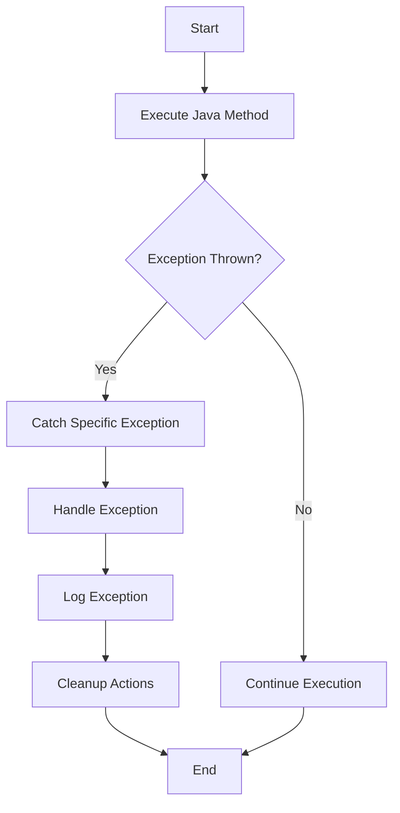

## 11.5.1 Catching Java Exceptions in Clojure: A Comprehensive Guide

As a Java developer venturing into the world of Clojure, one of the key areas you'll need to master is handling exceptions, especially those thrown by Java code. Clojure, being a language that runs on the Java Virtual Machine (JVM), provides robust interoperability with Java, including the ability to catch and handle Java exceptions. This section delves into the intricacies of catching exceptions thrown by Java code within Clojure applications, offering detailed insights, practical examples, and best practices.

### Understanding Exception Handling in Clojure

In Clojure, exception handling is accomplished using the `try-catch` construct, which is conceptually similar to Java's `try-catch` block. However, Clojure's approach is more functional and concise, aligning with its overall design philosophy. The `try` block contains the code that might throw an exception, while the `catch` block specifies how to handle specific exceptions.

#### Basic Syntax of `try-catch` in Clojure

Here's a basic example of using `try-catch` in Clojure:

```clojure
(try
  ;; Code that might throw an exception
  (some-java-method)
  (catch Exception e
    ;; Handle the exception
    (println "An exception occurred:" (.getMessage e))))
```

In this example, `some-java-method` represents a call to a Java method that might throw an exception. The `catch` block catches any `Exception` and prints a message.

### Catching Specific Java Exceptions

Clojure allows you to catch specific Java exceptions by specifying the exception class in the `catch` block. This is particularly useful for handling different types of exceptions in a granular manner.

#### Example: Handling Specific Exceptions

Consider a scenario where you are interacting with Java's file I/O operations, which can throw various exceptions such as `FileNotFoundException` and `IOException`. Here's how you can handle these exceptions in Clojure:

```clojure
(import '(java.io FileNotFoundException IOException))

(try
  ;; Attempt to read a file
  (read-file "nonexistent-file.txt")
  (catch FileNotFoundException e
    (println "File not found:" (.getMessage e)))
  (catch IOException e
    (println "I/O error occurred:" (.getMessage e)))
  (catch Exception e
    (println "An unexpected error occurred:" (.getMessage e))))
```

In this example, the `read-file` function represents a hypothetical function that attempts to read a file and might throw a `FileNotFoundException` or `IOException`. The `catch` blocks handle these exceptions specifically, providing tailored error messages.

### Practical Code Examples

Let's explore some practical examples that demonstrate catching exceptions from Java code within Clojure.

#### Example 1: Handling Database Exceptions

Suppose you are using a Java-based database library that throws `SQLException` when a database error occurs. Here's how you can handle this exception in Clojure:

```clojure
(import '(java.sql SQLException))

(defn execute-query [query]
  (try
    ;; Execute a database query
    (some-database-method query)
    (catch SQLException e
      (println "Database error:" (.getMessage e)))
    (catch Exception e
      (println "An unexpected error occurred:" (.getMessage e)))))
```

In this example, `some-database-method` represents a call to a Java method that executes a database query. The `catch` block for `SQLException` handles database-specific errors, while the generic `Exception` catch block handles any other unexpected errors.

#### Example 2: Handling Network Exceptions

Consider a scenario where you are using a Java networking library that throws `SocketException` for network-related errors. Here's how you can handle this exception in Clojure:

```clojure
(import '(java.net SocketException))

(defn connect-to-server [url]
  (try
    ;; Connect to a server
    (some-network-method url)
    (catch SocketException e
      (println "Network error:" (.getMessage e)))
    (catch Exception e
      (println "An unexpected error occurred:" (.getMessage e)))))
```

In this example, `some-network-method` represents a call to a Java method that connects to a server. The `catch` block for `SocketException` handles network-specific errors.

### Best Practices for Exception Handling

When handling exceptions in Clojure, especially those thrown by Java code, it's important to follow best practices to ensure robust and maintainable code.

#### 1. Catch Specific Exceptions

Whenever possible, catch specific exceptions rather than using a generic `Exception` catch block. This allows you to handle different error conditions appropriately and provides more meaningful error messages.

#### 2. Log Exceptions

Consider logging exceptions using a logging library such as [Log4j](https://logging.apache.org/log4j/2.x/) or [SLF4J](http://www.slf4j.org/). Logging provides valuable information for debugging and monitoring applications in production environments.

#### 3. Avoid Swallowing Exceptions

Avoid swallowing exceptions by simply printing a message and continuing execution. Instead, consider rethrowing the exception or taking corrective actions to address the error condition.

#### 4. Use `finally` for Cleanup

If you need to perform cleanup actions regardless of whether an exception is thrown, use the `finally` block. This is similar to Java's `finally` block and ensures that cleanup code is executed.

```clojure
(try
  ;; Code that might throw an exception
  (some-java-method)
  (catch Exception e
    (println "An exception occurred:" (.getMessage e)))
  (finally
    ;; Cleanup actions
    (println "Cleanup actions executed")))
```

### Advanced Exception Handling Techniques

For more advanced exception handling, consider using Clojure's capabilities to create custom exception handling functions or leverage higher-order functions to encapsulate error handling logic.

#### Custom Exception Handling Functions

You can create custom functions to handle exceptions in a consistent manner across your application. This approach promotes code reuse and simplifies error handling.

```clojure
(defn handle-exception [e]
  (println "An error occurred:" (.getMessage e)))

(defn execute-with-error-handling [f]
  (try
    (f)
    (catch Exception e
      (handle-exception e))))

;; Usage
(execute-with-error-handling #(some-java-method))
```

In this example, `handle-exception` is a custom function that handles exceptions, and `execute-with-error-handling` is a higher-order function that executes a given function with error handling.

### Diagrams and Visualizations

To enhance understanding, let's include a flowchart that illustrates the flow of exception handling in Clojure when interacting with Java code.



### Common Pitfalls and Optimization Tips

#### Pitfalls

1. **Overusing Generic Catch Blocks**: Catching `Exception` without handling specific exceptions can lead to missed opportunities for meaningful error handling.

2. **Ignoring Exception Messages**: Failing to log or display exception messages can hinder debugging efforts.

3. **Neglecting Cleanup**: Forgetting to perform necessary cleanup actions can lead to resource leaks.

#### Optimization Tips

1. **Use Descriptive Error Messages**: Provide detailed error messages that include context about the error condition.

2. **Leverage Clojure's Functional Nature**: Use higher-order functions and functional patterns to encapsulate error handling logic.

3. **Integrate with Monitoring Tools**: Consider integrating your application with monitoring tools to track exceptions and application health.

### Conclusion

Catching exceptions thrown by Java code in Clojure is a crucial skill for developers working in a JVM environment. By leveraging Clojure's `try-catch` construct, you can effectively handle exceptions, ensuring robust and reliable applications. Remember to follow best practices, such as catching specific exceptions, logging errors, and performing necessary cleanup actions. With these techniques, you'll be well-equipped to manage exceptions in your Clojure applications.

## Quiz Time!



### Which Clojure construct is used for exception handling?

- [x] `try-catch`
- [ ] `if-else`
- [ ] `cond`
- [ ] `loop-recur`

> **Explanation:** Clojure uses the `try-catch` construct for exception handling, similar to Java's `try-catch` blocks.


### What is the benefit of catching specific exceptions in Clojure?

- [x] Provides more meaningful error handling
- [ ] Reduces code complexity
- [ ] Increases execution speed
- [ ] Eliminates the need for logging

> **Explanation:** Catching specific exceptions allows for more meaningful error handling and tailored responses to different error conditions.


### How can you log exceptions in Clojure?

- [x] Use a logging library like Log4j or SLF4J
- [ ] Print to the console using `println`
- [ ] Use the `log` function
- [ ] Store in a file using `spit`

> **Explanation:** Logging libraries like Log4j or SLF4J provide robust logging capabilities for tracking exceptions and application events.


### What should you do in a `finally` block?

- [x] Perform cleanup actions
- [ ] Handle exceptions
- [ ] Execute main logic
- [ ] Initialize variables

> **Explanation:** The `finally` block is used to perform cleanup actions that should occur regardless of whether an exception was thrown.


### Which exception is caught by the following code: `(catch Exception e ...)`?

- [x] Any exception that is a subclass of `Exception`
- [ ] Only `IOException`
- [ ] Only `RuntimeException`
- [ ] Only `NullPointerException`

> **Explanation:** The `catch Exception e` block catches any exception that is a subclass of `Exception`, which includes most exceptions.


### Why is it important to avoid swallowing exceptions?

- [x] To ensure errors are properly handled and logged
- [ ] To reduce code size
- [ ] To improve performance
- [ ] To simplify error handling

> **Explanation:** Swallowing exceptions can lead to unhandled errors and make debugging difficult, so it's important to handle and log exceptions appropriately.


### What is a higher-order function in the context of exception handling?

- [x] A function that takes another function as an argument and handles exceptions
- [ ] A function that returns an exception
- [ ] A function that only handles specific exceptions
- [ ] A function that executes without exceptions

> **Explanation:** A higher-order function in exception handling is one that takes another function as an argument and provides error handling logic.


### How can you enhance exception handling in Clojure?

- [x] Use custom exception handling functions
- [ ] Use more `try` blocks
- [ ] Avoid using `catch` blocks
- [ ] Use only `finally` blocks

> **Explanation:** Custom exception handling functions promote code reuse and consistent error handling across an application.


### What is the role of the `catch` block in Clojure?

- [x] To handle exceptions thrown in the `try` block
- [ ] To execute main logic
- [ ] To initialize variables
- [ ] To perform cleanup actions

> **Explanation:** The `catch` block is used to handle exceptions that are thrown in the associated `try` block.


### True or False: Clojure can only catch exceptions thrown by Clojure code.

- [ ] True
- [x] False

> **Explanation:** Clojure can catch exceptions thrown by both Clojure and Java code, thanks to its interoperability with the JVM.


