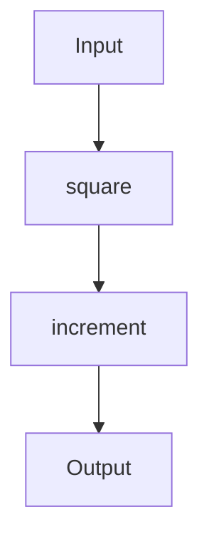
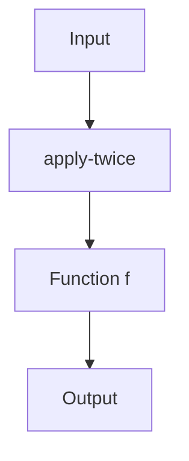

## 11.5.2 Implementing Functional Design Patterns

As experienced Java developers, you're likely familiar with object-oriented design patterns such as Singleton, Factory, and Observer. These patterns help manage complexity in Java's imperative and object-oriented paradigm. However, when transitioning to Clojure, a functional programming language, you'll encounter a different set of design patterns that leverage immutability, higher-order functions, and function composition. In this section, we'll explore these functional design patterns, illustrating how they can lead to more concise and expressive code.

### Understanding Functional Design Patterns

Functional design patterns in Clojure focus on the composition of pure functions, immutability, and declarative data transformations. These patterns often result in code that is easier to reason about, test, and maintain. Let's delve into some key functional design patterns and how they can be implemented in Clojure.

### Function Composition

Function composition is a fundamental concept in functional programming. It involves combining simple functions to build more complex ones. In Clojure, this is achieved using the `comp` function, which takes multiple functions as arguments and returns a new function that is the composition of those functions.

#### Example: Function Composition in Clojure

```clojure
;; Define simple functions
(defn square [x]
  (* x x))

(defn increment [x]
  (+ x 1))

;; Compose functions using comp
(def square-and-increment (comp increment square))

;; Use the composed function
(println (square-and-increment 4)) ; Output: 17
```

In this example, `square-and-increment` is a composed function that first squares a number and then increments it. This pattern allows for modular and reusable code.

#### Comparison with Java

In Java, achieving similar functionality often involves creating multiple methods and invoking them sequentially. Java 8 introduced lambda expressions and the `Function` interface, which can be used for composition, but the syntax is less concise compared to Clojure.

```java
import java.util.function.Function;

Function<Integer, Integer> square = x -> x * x;
Function<Integer, Integer> increment = x -> x + 1;
Function<Integer, Integer> squareAndIncrement = square.andThen(increment);

System.out.println(squareAndIncrement.apply(4)); // Output: 17
```

### Higher-Order Functions

Higher-order functions are functions that take other functions as arguments or return them as results. They are a powerful tool in Clojure, enabling abstraction and code reuse.

#### Example: Using Higher-Order Functions

```clojure
;; Define a higher-order function
(defn apply-twice [f x]
  (f (f x)))

;; Use apply-twice with different functions
(println (apply-twice increment 5)) ; Output: 7
(println (apply-twice square 3))    ; Output: 81
```

Here, `apply-twice` is a higher-order function that applies a given function `f` to an argument `x` twice. This pattern is useful for creating flexible and reusable code.

#### Comparison with Java

In Java, higher-order functions can be implemented using functional interfaces, but the syntax is more verbose.

```java
import java.util.function.Function;

Function<Integer, Integer> applyTwice(Function<Integer, Integer> f, Integer x) {
    return f.apply(f.apply(x));
}

System.out.println(applyTwice(increment, 5)); // Output: 7
System.out.println(applyTwice(square, 3));    // Output: 81
```

### Immutability

Immutability is a cornerstone of functional programming. In Clojure, data structures are immutable by default, which simplifies reasoning about code and enhances concurrency.

#### Example: Working with Immutable Data Structures

```clojure
;; Define an immutable vector
(def numbers [1 2 3 4 5])

;; Add an element to the vector
(def new-numbers (conj numbers 6))

(println numbers)      ; Output: [1 2 3 4 5]
(println new-numbers)  ; Output: [1 2 3 4 5 6]
```

In this example, `conj` adds an element to the vector, returning a new vector without modifying the original. This immutability ensures that data remains consistent and predictable.

#### Comparison with Java

In Java, immutability is achieved through final classes and fields, but it requires more boilerplate code.

```java
import java.util.Collections;
import java.util.List;
import java.util.ArrayList;

List<Integer> numbers = new ArrayList<>(List.of(1, 2, 3, 4, 5));
List<Integer> newNumbers = new ArrayList<>(numbers);
newNumbers.add(6);

System.out.println(numbers);     // Output: [1, 2, 3, 4, 5]
System.out.println(newNumbers);  // Output: [1, 2, 3, 4, 5, 6]
```

### Declarative Data Transformations

Clojure excels at declarative data transformations, allowing you to express complex operations on data succinctly.

#### Example: Transforming Data with `map`, `filter`, and `reduce`

```clojure
;; Define a collection
(def numbers [1 2 3 4 5 6 7 8 9 10])

;; Use map, filter, and reduce
(def even-squares (->> numbers
                       (filter even?)
                       (map square)
                       (reduce +)))

(println even-squares) ; Output: 220
```

In this example, we filter even numbers, square them, and then sum them up using `map`, `filter`, and `reduce`. This approach is both concise and expressive.

#### Comparison with Java

Java's Streams API provides similar functionality, but the syntax is more verbose.

```java
import java.util.List;
import java.util.stream.Collectors;

List<Integer> numbers = List.of(1, 2, 3, 4, 5, 6, 7, 8, 9, 10);
int evenSquares = numbers.stream()
                         .filter(x -> x % 2 == 0)
                         .map(x -> x * x)
                         .reduce(0, Integer::sum);

System.out.println(evenSquares); // Output: 220
```

### Try It Yourself

Experiment with the following modifications to deepen your understanding:

- **Modify the `square-and-increment` function** to include a third operation, such as doubling the result.
- **Create a higher-order function** that applies a function three times instead of twice.
- **Explore immutability** by attempting to modify an immutable data structure directly and observing the results.
- **Transform data** using different combinations of `map`, `filter`, and `reduce` to achieve various outcomes.

### Diagrams and Visualizations

To further illustrate these concepts, let's use diagrams to visualize the flow of data and function composition.

#### Function Composition Flow



*Diagram 1: Flow of data through the composed function `square-and-increment`.*

#### Higher-Order Function Application



*Diagram 2: Application of a higher-order function `apply-twice`.*

### Exercises

1. **Function Composition Challenge**: Create a composed function that takes a number, doubles it, squares it, and then subtracts one.
2. **Higher-Order Function Exercise**: Write a higher-order function that applies a given function `n` times to an input.
3. **Immutability Practice**: Implement a function that takes a list of numbers and returns a new list with each number incremented by one, without modifying the original list.
4. **Data Transformation Task**: Use `map`, `filter`, and `reduce` to transform a list of strings into a single concatenated string of all uppercase words.

### Key Takeaways

- **Function Composition**: Allows for building complex functions from simple ones, promoting code reuse and modularity.
- **Higher-Order Functions**: Enable abstraction and flexibility by accepting and returning functions.
- **Immutability**: Ensures data consistency and simplifies reasoning about code, especially in concurrent environments.
- **Declarative Data Transformations**: Provide a concise and expressive way to manipulate data.

By embracing these functional design patterns, you'll be able to write Clojure code that is not only more concise and expressive but also easier to maintain and reason about. As you continue your journey into Clojure, keep experimenting with these patterns to fully leverage the power of functional programming.

### Further Reading

- [Official Clojure Documentation](https://clojure.org/reference/documentation)
- [ClojureDocs](https://clojuredocs.org/)
- [Functional Programming in Java](https://www.oreilly.com/library/view/functional-programming-in/9781449365516/)

## Quiz: Test Your Understanding of Functional Design Patterns in Clojure



### What is function composition in Clojure?

- [x] Combining simple functions to build more complex ones
- [ ] Using loops to iterate over data
- [ ] Creating classes and objects
- [ ] Implementing interfaces

> **Explanation:** Function composition involves combining simple functions to create more complex ones, allowing for modular and reusable code.

### How do higher-order functions enhance code flexibility?

- [x] By accepting and returning functions
- [ ] By using inheritance
- [ ] By creating new classes
- [ ] By modifying global state

> **Explanation:** Higher-order functions enhance flexibility by allowing functions to be passed as arguments and returned as results, enabling abstraction and code reuse.

### What is the primary benefit of immutability in Clojure?

- [x] Data consistency and simplified reasoning
- [ ] Faster execution speed
- [ ] Easier debugging
- [ ] Reduced memory usage

> **Explanation:** Immutability ensures data consistency and simplifies reasoning about code, especially in concurrent environments.

### Which Clojure function is used for declarative data transformations?

- [x] `map`, `filter`, and `reduce`
- [ ] `for`, `while`, and `do`
- [ ] `class`, `interface`, and `enum`
- [ ] `try`, `catch`, and `finally`

> **Explanation:** `map`, `filter`, and `reduce` are used for declarative data transformations, allowing concise and expressive data manipulation.

### How does Clojure's approach to function composition differ from Java's?

- [x] Clojure uses `comp` for concise composition
- [ ] Java uses `comp` for composition
- [ ] Clojure requires more boilerplate code
- [ ] Java has a more concise syntax

> **Explanation:** Clojure uses the `comp` function for concise function composition, while Java requires more verbose syntax using the `Function` interface.

### What is a key advantage of using higher-order functions in Clojure?

- [x] They enable abstraction and code reuse
- [ ] They simplify class inheritance
- [ ] They reduce the need for interfaces
- [ ] They increase execution speed

> **Explanation:** Higher-order functions enable abstraction and code reuse by allowing functions to be passed and returned, making code more flexible.

### Why is immutability important in functional programming?

- [x] It ensures data consistency and simplifies reasoning
- [ ] It allows for faster execution
- [ ] It reduces code complexity
- [ ] It enhances debugging capabilities

> **Explanation:** Immutability ensures data consistency and simplifies reasoning about code, particularly in concurrent environments.

### What is the role of `comp` in Clojure?

- [x] To compose multiple functions into one
- [ ] To create classes and objects
- [ ] To manage state changes
- [ ] To handle exceptions

> **Explanation:** The `comp` function in Clojure is used to compose multiple functions into a single function, promoting modularity and reuse.

### How does Clojure handle data transformations?

- [x] Through declarative functions like `map`, `filter`, and `reduce`
- [ ] By using loops and conditionals
- [ ] By creating new classes
- [ ] By modifying global variables

> **Explanation:** Clojure handles data transformations through declarative functions like `map`, `filter`, and `reduce`, allowing concise and expressive data manipulation.

### True or False: Immutability in Clojure leads to easier concurrency management.

- [x] True
- [ ] False

> **Explanation:** True. Immutability in Clojure leads to easier concurrency management by ensuring data consistency and eliminating race conditions.


