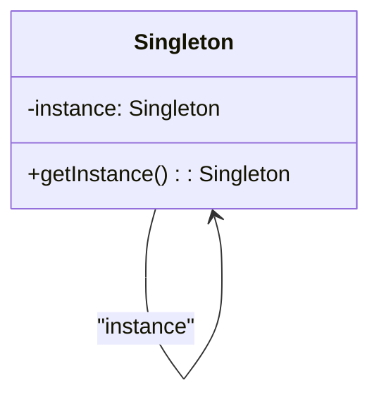
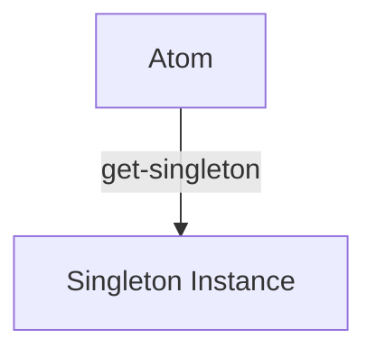
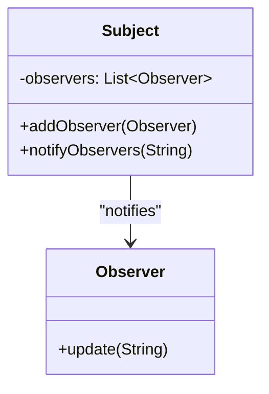
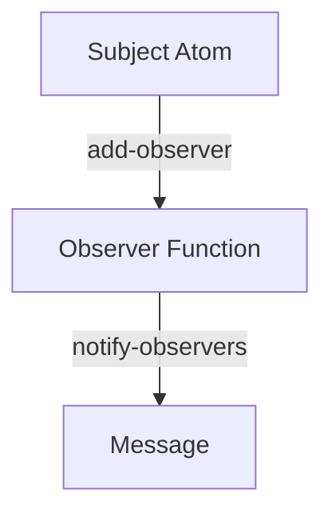

## 11.5.3 Case Studies of Pattern Transformation

In this section, we will explore how traditional design patterns in Java can be transformed into functional equivalents in Clojure. This transformation not only simplifies the code but also leverages Clojure's strengths in immutability and concurrency. We'll walk through several case studies, highlighting the refactoring process and the benefits gained from adopting a functional approach.

### Introduction to Design Patterns

Design patterns are proven solutions to common software design problems. In Java, these patterns often rely on object-oriented principles such as inheritance and polymorphism. However, Clojure's functional paradigm offers alternative approaches that can lead to more concise and maintainable code.

### Case Study 1: The Singleton Pattern

#### Java Implementation

The Singleton pattern ensures that a class has only one instance and provides a global point of access to it. Here's a typical implementation in Java:

```java
public class Singleton {
    private static Singleton instance;

    private Singleton() {}

    public static Singleton getInstance() {
        if (instance == null) {
            instance = new Singleton();
        }
        return instance;
    }
}
```

#### Clojure Transformation

In Clojure, we can achieve the same effect using an atom, which provides a thread-safe way to manage state:

```clojure
(defonce singleton-instance (atom nil))

(defn get-singleton []
  (when (nil? @singleton-instance)
    (reset! singleton-instance {}))
  @singleton-instance)
```

**Benefits:**

- **Immutability**: The use of `atom` ensures that state changes are controlled and thread-safe.
- **Simplicity**: The code is more concise and leverages Clojure's built-in concurrency primitives.

### Case Study 2: The Observer Pattern

#### Java Implementation

The Observer pattern defines a one-to-many dependency between objects so that when one object changes state, all its dependents are notified. Here's a Java example:

```java
import java.util.ArrayList;
import java.util.List;

interface Observer {
    void update(String message);
}

class Subject {
    private List<Observer> observers = new ArrayList<>();

    public void addObserver(Observer observer) {
        observers.add(observer);
    }

    public void notifyObservers(String message) {
        for (Observer observer : observers) {
            observer.update(message);
        }
    }
}
```

#### Clojure Transformation

In Clojure, we can use functions and immutable data structures to achieve the same behavior:

```clojure
(defn create-subject []
  (atom {:observers []}))

(defn add-observer [subject observer]
  (swap! subject update :observers conj observer))

(defn notify-observers [subject message]
  (doseq [observer (:observers @subject)]
    (observer message)))
```

**Benefits:**

- **Functional Approach**: Observers are simply functions, making the pattern more flexible and easier to test.
- **Immutable Data**: The use of atoms and immutable data structures ensures thread safety and simplifies state management.

### Case Study 3: The Strategy Pattern

#### Java Implementation

The Strategy pattern defines a family of algorithms, encapsulates each one, and makes them interchangeable. Here's a Java example:

```java
interface Strategy {
    int execute(int a, int b);
}

class AddStrategy implements Strategy {
    public int execute(int a, int b) {
        return a + b;
    }
}

class Context {
    private Strategy strategy;

    public Context(Strategy strategy) {
        this.strategy = strategy;
    }

    public int executeStrategy(int a, int b) {
        return strategy.execute(a, b);
    }
}
```

#### Clojure Transformation

In Clojure, we can use higher-order functions to achieve the same effect:

```clojure
(defn add-strategy [a b]
  (+ a b))

(defn execute-strategy [strategy a b]
  (strategy a b))

;; Usage
(execute-strategy add-strategy 5 3) ; => 8
```

**Benefits:**

- **Higher-Order Functions**: Strategies are functions, allowing for greater flexibility and composability.
- **Reduced Boilerplate**: The pattern is implemented with fewer lines of code, enhancing readability.

### Case Study 4: The Command Pattern

#### Java Implementation

The Command pattern encapsulates a request as an object, thereby allowing for parameterization of clients with queues, requests, and operations. Here's a Java example:

```java
interface Command {
    void execute();
}

class LightOnCommand implements Command {
    private Light light;

    public LightOnCommand(Light light) {
        this.light = light;
    }

    public void execute() {
        light.on();
    }
}

class RemoteControl {
    private Command command;

    public void setCommand(Command command) {
        this.command = command;
    }

    public void pressButton() {
        command.execute();
    }
}
```

#### Clojure Transformation

In Clojure, we can use functions to represent commands:

```clojure
(defn light-on-command [light]
  (fn [] (println "Light is on")))

(defn remote-control [command]
  (command))

;; Usage
(def light-command (light-on-command "Living Room Light"))
(remote-control light-command)
```

**Benefits:**

- **Function as Command**: Commands are functions, simplifying the pattern and making it more flexible.
- **Conciseness**: The pattern is implemented with minimal code, focusing on functionality.

### Case Study 5: The Factory Pattern

#### Java Implementation

The Factory pattern provides an interface for creating objects in a superclass but allows subclasses to alter the type of objects that will be created. Here's a Java example:

```java
abstract class Shape {
    abstract void draw();
}

class Circle extends Shape {
    void draw() {
        System.out.println("Drawing Circle");
    }
}

class ShapeFactory {
    public Shape getShape(String shapeType) {
        if (shapeType.equals("CIRCLE")) {
            return new Circle();
        }
        return null;
    }
}
```

#### Clojure Transformation

In Clojure, we can use maps and functions to achieve a similar effect:

```clojure
(defn draw-circle []
  (println "Drawing Circle"))

(def shape-factory
  {"CIRCLE" draw-circle})

(defn get-shape [shape-type]
  (get shape-factory shape-type))

;; Usage
((get-shape "CIRCLE"))
```

**Benefits:**

- **Data-Driven Design**: The use of maps allows for easy extension and modification of the factory.
- **Simplicity**: The pattern is implemented with fewer lines of code, enhancing maintainability.

### Try It Yourself

Now that we've explored these transformations, try modifying the Clojure code examples to implement additional features or patterns. For instance, you could:

- Extend the `Observer` pattern to include filtering of notifications based on certain criteria.
- Implement a `Strategy` pattern that supports multiple operations like subtraction or multiplication.
- Create a `Command` pattern that logs each command execution.

### Diagrams and Visualizations

To better understand the transformation process, let's visualize the flow of data and control in these patterns.

#### Singleton Pattern Diagram



*Diagram 1: Java Singleton Pattern Structure*



*Diagram 2: Clojure Singleton Pattern with Atom*

#### Observer Pattern Diagram



*Diagram 3: Java Observer Pattern Structure*



*Diagram 4: Clojure Observer Pattern with Functions*

### Conclusion

Transforming Java design patterns into Clojure's functional equivalents can lead to more concise, flexible, and maintainable code. By leveraging Clojure's strengths in immutability and higher-order functions, we can simplify complex patterns and enhance code readability.

### Key Takeaways

- **Functional Patterns**: Clojure's functional paradigm allows for simpler and more flexible pattern implementations.
- **Immutability**: Using immutable data structures ensures thread safety and simplifies state management.
- **Higher-Order Functions**: Functions as first-class citizens enable powerful abstractions and composability.

### Further Reading

For more information on Clojure and functional programming, consider exploring the following resources:

- [Official Clojure Documentation](https://clojure.org/)
- [ClojureDocs](https://clojuredocs.org/)
- [Functional Programming in Clojure](https://www.braveclojure.com/)

### Exercises

1. Refactor a Java `Decorator` pattern into Clojure using higher-order functions.
2. Implement a `Chain of Responsibility` pattern in Clojure and compare it with a Java implementation.
3. Create a `Visitor` pattern in Clojure and explore how it can be simplified using functions.

## Quiz: Transforming Java Design Patterns to Clojure



### Which Clojure feature is primarily used to implement the Singleton pattern?

- [x] Atom
- [ ] Ref
- [ ] Agent
- [ ] Var

> **Explanation:** Atoms provide a thread-safe way to manage state, making them suitable for implementing the Singleton pattern in Clojure.

### How does Clojure's Observer pattern differ from Java's?

- [x] Observers are functions
- [ ] Observers are classes
- [ ] Observers are interfaces
- [ ] Observers are threads

> **Explanation:** In Clojure, observers are implemented as functions, which simplifies the pattern and enhances flexibility.

### What is a key benefit of using higher-order functions in Clojure's Strategy pattern?

- [x] Flexibility and composability
- [ ] Increased complexity
- [ ] More boilerplate code
- [ ] Reduced performance

> **Explanation:** Higher-order functions allow for greater flexibility and composability, making the Strategy pattern more powerful in Clojure.

### In the Command pattern, what does Clojure use instead of classes?

- [x] Functions
- [ ] Macros
- [ ] Atoms
- [ ] Refs

> **Explanation:** Clojure uses functions to represent commands, simplifying the pattern and enhancing flexibility.

### What is a key advantage of using maps in Clojure's Factory pattern?

- [x] Data-driven design
- [ ] Increased complexity
- [ ] More boilerplate code
- [ ] Reduced flexibility

> **Explanation:** Maps allow for easy extension and modification, making the Factory pattern more flexible and maintainable.

### Which Clojure feature ensures thread safety in the Singleton pattern?

- [x] Atom
- [ ] Ref
- [ ] Agent
- [ ] Var

> **Explanation:** Atoms provide a thread-safe way to manage state, ensuring thread safety in the Singleton pattern.

### How does Clojure's functional paradigm simplify design patterns?

- [x] By reducing boilerplate code
- [ ] By increasing complexity
- [ ] By using more classes
- [ ] By requiring more interfaces

> **Explanation:** Clojure's functional paradigm reduces boilerplate code, making design patterns simpler and more concise.

### What is a benefit of using functions as commands in Clojure?

- [x] Simplification and flexibility
- [ ] Increased complexity
- [ ] More boilerplate code
- [ ] Reduced performance

> **Explanation:** Functions as commands simplify the pattern and enhance flexibility, making it easier to implement and maintain.

### How does immutability benefit Clojure's design patterns?

- [x] Ensures thread safety
- [ ] Increases complexity
- [ ] Requires more memory
- [ ] Reduces flexibility

> **Explanation:** Immutability ensures thread safety, simplifying state management and enhancing reliability in design patterns.

### True or False: Clojure's design patterns often require more lines of code than Java's.

- [ ] True
- [x] False

> **Explanation:** Clojure's design patterns typically require fewer lines of code due to its functional paradigm and concise syntax.


