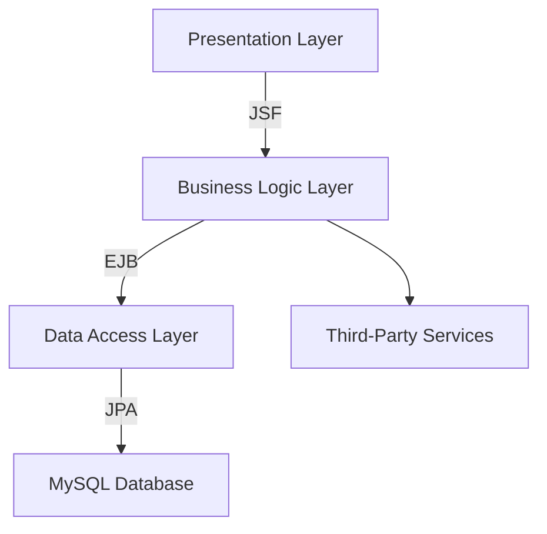

## 11.6.1 Overview of the Java Application

In this section, we delve into the details of a Java application selected for migration to Clojure. This exploration will provide insights into the application's purpose, architecture, and key functionalities, as well as the motivations driving the transition to Clojure. By understanding these aspects, we can better appreciate the benefits and challenges of adopting Clojure for existing Java projects.

### Purpose of the Java Application

The Java application in question is a comprehensive **Customer Relationship Management (CRM) system** designed for small to medium-sized enterprises (SMEs). Its primary purpose is to streamline customer interactions, manage sales processes, and enhance customer service efficiency. The application provides a centralized platform for managing customer data, tracking sales leads, and automating marketing campaigns.

#### Key Features

- **Customer Data Management**: Stores and organizes customer information, including contact details, purchase history, and communication logs.
- **Sales Pipeline Tracking**: Visualizes sales processes, allowing sales teams to track leads, opportunities, and deals.
- **Marketing Automation**: Automates email campaigns, social media posts, and other marketing activities.
- **Reporting and Analytics**: Generates reports on sales performance, customer engagement, and marketing effectiveness.
- **Integration with Third-Party Services**: Connects with email services, social media platforms, and payment gateways.

### Architecture of the Java Application

The CRM system is built using a traditional **three-tier architecture**, consisting of the presentation layer, business logic layer, and data access layer. This architecture is common in enterprise applications and provides a clear separation of concerns.

#### Presentation Layer

The presentation layer is implemented using **JavaServer Faces (JSF)**, a Java specification for building component-based user interfaces for web applications. JSF provides a robust framework for creating reusable UI components and managing user interactions.

#### Business Logic Layer

The business logic layer is where the core functionalities of the CRM system reside. It is implemented using **Enterprise JavaBeans (EJB)**, which provides a scalable and transactional environment for business logic execution. EJBs handle tasks such as customer data processing, sales tracking, and marketing automation.

#### Data Access Layer

The data access layer is responsible for interacting with the database. It uses **Java Persistence API (JPA)** to manage database operations, ensuring data consistency and integrity. The application connects to a **MySQL database**, where all customer and sales data is stored.

### Motivations for Migrating to Clojure

The decision to migrate the CRM system from Java to Clojure is driven by several factors, including the desire to leverage Clojure's strengths in functional programming, immutability, and concurrency. Let's explore these motivations in detail.

#### Embracing Functional Programming

Clojure is a functional programming language that encourages the use of pure functions, higher-order functions, and immutable data structures. By migrating to Clojure, the development team aims to improve code readability, maintainability, and testability. Functional programming paradigms can lead to more predictable and less error-prone code, which is particularly beneficial in complex systems like CRM applications.

#### Leveraging Immutability

Immutability is a core concept in Clojure, where data structures are immutable by default. This approach simplifies reasoning about code and reduces the likelihood of bugs related to shared mutable state. In the context of a CRM system, where data consistency is crucial, immutability can enhance data integrity and simplify state management.

#### Enhancing Concurrency

Clojure provides powerful concurrency primitives, such as atoms, refs, and agents, which facilitate safe and efficient concurrent programming. The CRM system handles numerous simultaneous user interactions, making concurrency a critical aspect of its architecture. By adopting Clojure, the team can leverage these concurrency models to improve performance and scalability.

#### Simplifying Integration

Clojure's seamless interoperability with Java allows the CRM system to integrate with existing Java libraries and frameworks. This capability ensures that the migration process can be incremental, with parts of the application gradually rewritten in Clojure while maintaining compatibility with Java components.

### Key Functionalities of the Java Application

To understand the scope of the migration, let's examine the key functionalities of the CRM system and how they are implemented in Java.

#### Customer Data Management

The customer data management module is responsible for storing and retrieving customer information. It uses JPA to interact with the MySQL database, providing CRUD (Create, Read, Update, Delete) operations for customer records. The module also includes validation logic to ensure data accuracy and consistency.

```java
// Java code snippet for customer data retrieval
public Customer getCustomerById(Long id) {
    EntityManager em = entityManagerFactory.createEntityManager();
    try {
        return em.find(Customer.class, id);
    } finally {
        em.close();
    }
}
```

#### Sales Pipeline Tracking

The sales pipeline tracking module visualizes the sales process, allowing sales teams to monitor leads and opportunities. It uses EJBs to manage business logic related to sales stages, deal values, and expected close dates. The module also integrates with the presentation layer to display sales data in a user-friendly format.

```java
// Java code snippet for updating sales stage
@Stateless
public class SalesService {
    public void updateSalesStage(Long dealId, SalesStage newStage) {
        Deal deal = em.find(Deal.class, dealId);
        deal.setStage(newStage);
        em.merge(deal);
    }
}
```

#### Marketing Automation

The marketing automation module automates marketing activities, such as email campaigns and social media posts. It uses EJBs to schedule and execute marketing tasks, leveraging third-party APIs for email and social media integration. The module also tracks campaign performance and generates analytics reports.

```java
// Java code snippet for scheduling email campaign
@Stateless
public class MarketingService {
    public void scheduleEmailCampaign(EmailCampaign campaign) {
        // Logic to schedule email campaign
    }
}
```

#### Reporting and Analytics

The reporting and analytics module generates reports on sales performance, customer engagement, and marketing effectiveness. It uses JPA to query the database and generate data visualizations. The module provides customizable reports that can be exported in various formats, such as PDF and Excel.

```java
// Java code snippet for generating sales report
public List<SalesReport> generateSalesReport(Date startDate, Date endDate) {
    TypedQuery<SalesReport> query = em.createQuery(
        "SELECT new SalesReport(d.stage, SUM(d.value)) " +
        "FROM Deal d WHERE d.closeDate BETWEEN :startDate AND :endDate " +
        "GROUP BY d.stage", SalesReport.class);
    query.setParameter("startDate", startDate);
    query.setParameter("endDate", endDate);
    return query.getResultList();
}
```

### Diagram: Java Application Architecture

Below is a diagram illustrating the architecture of the Java CRM application, highlighting the three-tier structure and key components.



**Diagram Description**: This diagram represents the three-tier architecture of the Java CRM application, with the presentation layer using JSF, the business logic layer using EJB, and the data access layer using JPA to interact with a MySQL database.

### Conclusion

The Java CRM application serves as a robust platform for managing customer relationships, sales processes, and marketing activities. Its architecture, based on a three-tier model, provides a clear separation of concerns and facilitates scalability. However, the transition to Clojure offers numerous advantages, including improved code readability, enhanced concurrency, and simplified integration with existing Java components.

By understanding the purpose, architecture, and key functionalities of the Java application, we can better appreciate the motivations for migrating to Clojure. In the subsequent sections, we will explore the migration process in detail, examining how Clojure's features can be leveraged to enhance the CRM system.

### Try It Yourself

To get a hands-on understanding of the concepts discussed, try modifying the Java code snippets provided. For example, experiment with different sales stages in the `updateSalesStage` method or customize the `generateSalesReport` query to include additional filters.

### Key Takeaways

- The Java CRM application is a comprehensive system for managing customer relationships, sales processes, and marketing activities.
- Its architecture is based on a three-tier model, with JSF for the presentation layer, EJB for the business logic layer, and JPA for the data access layer.
- Migrating to Clojure offers benefits such as improved code readability, enhanced concurrency, and simplified integration with existing Java components.

### Exercises

1. **Identify Functionalities**: List the key functionalities of a Java application you are familiar with and consider how they might be implemented in Clojure.
2. **Explore Clojure's Features**: Research Clojure's concurrency primitives and compare them with Java's concurrency mechanisms.
3. **Diagram Your Application**: Create a diagram of your Java application's architecture and identify areas where Clojure could provide improvements.

### Further Reading

- [Official Clojure Documentation](https://clojure.org/)
- [ClojureDocs](https://clojuredocs.org/)
- [Java Persistence API (JPA) Documentation](https://javaee.github.io/tutorial/persistence-intro.html)

---

## Quiz: Understanding Java Application Migration to Clojure



### What is the primary purpose of the Java CRM application discussed in this section?

- [x] To streamline customer interactions and manage sales processes
- [ ] To provide a platform for e-commerce transactions
- [ ] To serve as a content management system
- [ ] To facilitate online learning

> **Explanation:** The Java CRM application is designed to streamline customer interactions, manage sales processes, and enhance customer service efficiency.

### Which Java technology is used for the presentation layer of the CRM application?

- [x] JavaServer Faces (JSF)
- [ ] Spring MVC
- [ ] Apache Struts
- [ ] JavaFX

> **Explanation:** The presentation layer of the CRM application is implemented using JavaServer Faces (JSF), a Java specification for building component-based user interfaces for web applications.

### What is the role of Enterprise JavaBeans (EJB) in the CRM application?

- [x] To manage business logic execution
- [ ] To handle database operations
- [ ] To provide user interface components
- [ ] To facilitate email communication

> **Explanation:** Enterprise JavaBeans (EJB) are used in the CRM application to manage business logic execution, providing a scalable and transactional environment for core functionalities.

### Why is immutability considered beneficial in the context of the CRM system?

- [x] It enhances data integrity and simplifies state management
- [ ] It allows for dynamic data modification
- [ ] It reduces memory usage
- [ ] It improves user interface responsiveness

> **Explanation:** Immutability enhances data integrity and simplifies state management, which is crucial in a CRM system where data consistency is important.

### What is one of the motivations for migrating the CRM application to Clojure?

- [x] To leverage Clojure's strengths in functional programming
- [ ] To reduce the application's codebase size
- [ ] To eliminate the use of third-party libraries
- [ ] To improve the application's graphical user interface

> **Explanation:** One of the motivations for migrating to Clojure is to leverage its strengths in functional programming, which can lead to more predictable and less error-prone code.

### Which concurrency primitive is NOT mentioned as a feature of Clojure?

- [ ] Atoms
- [ ] Refs
- [ ] Agents
- [x] Threads

> **Explanation:** While threads are a general concurrency concept, Clojure specifically provides concurrency primitives like atoms, refs, and agents to facilitate safe and efficient concurrent programming.

### How does Clojure's interoperability with Java benefit the migration process?

- [x] It allows for incremental migration while maintaining compatibility with Java components
- [ ] It requires rewriting all Java code in Clojure at once
- [ ] It eliminates the need for a database
- [ ] It simplifies user interface design

> **Explanation:** Clojure's interoperability with Java allows for incremental migration, enabling parts of the application to be gradually rewritten in Clojure while maintaining compatibility with existing Java components.

### What is the primary database technology used in the CRM application?

- [ ] PostgreSQL
- [ ] Oracle Database
- [x] MySQL
- [ ] MongoDB

> **Explanation:** The CRM application uses MySQL as its primary database technology, where all customer and sales data is stored.

### Which layer of the CRM application uses Java Persistence API (JPA)?

- [ ] Presentation Layer
- [ ] Business Logic Layer
- [x] Data Access Layer
- [ ] Integration Layer

> **Explanation:** The data access layer of the CRM application uses Java Persistence API (JPA) to manage database operations, ensuring data consistency and integrity.

### True or False: The CRM application uses a microservices architecture.

- [ ] True
- [x] False

> **Explanation:** The CRM application is built using a traditional three-tier architecture, not a microservices architecture.




