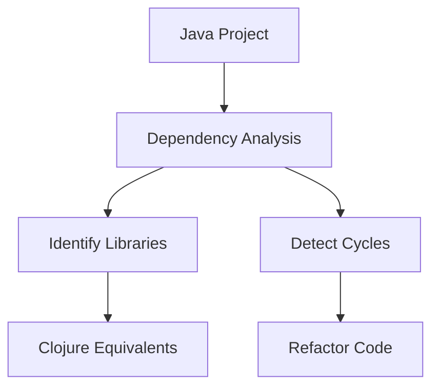

## 11.7.1 Code Analysis Tools

In the journey of migrating Java codebases to Clojure, understanding the existing code structure, dependencies, and complexity is crucial. Code analysis tools play a vital role in this process by providing insights that help developers make informed decisions. This section will introduce you to some of the most effective code analysis tools available for Java developers, focusing on how they can aid in the migration to Clojure.

### Understanding Code Analysis

Code analysis involves examining source code to gather information about its structure, dependencies, complexity, and potential issues. This process can be automated using tools that provide detailed reports and visualizations. For Java developers transitioning to Clojure, these tools can help identify areas that require attention during migration, such as tightly coupled components, complex logic, and dependencies on Java-specific libraries.

### Key Benefits of Code Analysis Tools

- **Dependency Identification**: Recognize external libraries and frameworks your Java application relies on, which may need equivalent Clojure libraries.
- **Code Complexity Assessment**: Evaluate the complexity of your codebase to prioritize refactoring efforts.
- **Potential Migration Issues**: Identify code patterns and constructs that may not translate directly to Clojure.
- **Quality Assurance**: Ensure code quality and maintainability through metrics and standards.

### Popular Code Analysis Tools

#### SonarQube

**SonarQube** is a widely used open-source platform for continuous inspection of code quality. It provides detailed reports on code smells, bugs, vulnerabilities, and technical debt.

- **Features**:
  - Supports multiple languages, including Java and Clojure.
  - Provides a comprehensive dashboard with metrics on code quality.
  - Integrates with CI/CD pipelines for continuous monitoring.
  - Offers plugins for additional functionality, such as dependency analysis.

- **Usage in Migration**:
  - Identify Java-specific code smells that need refactoring before migration.
  - Monitor code quality during the migration process to ensure standards are maintained.

```java
// Example Java code with potential issues
public class Example {
    private List<String> items;

    public Example() {
        items = new ArrayList<>();
    }

    public void addItem(String item) {
        if (item != null) {
            items.add(item);
        }
    }
}
```

```clojure
;; Equivalent Clojure code with improved immutability
(defn add-item [items item]
  (if (some? item)
    (conj items item)
    items))
```

> **Try It Yourself**: Use SonarQube to analyze a sample Java project and identify areas for improvement. Consider how these issues might be addressed in Clojure.

#### Dependency Analysis Tools

Dependency analysis tools help map out the dependencies within a Java project, which is crucial for understanding the impact of migration.

- **Maven Dependency Plugin**: A tool that provides insights into the dependencies of a Maven project, including dependency trees and conflicts.
- **JDepend**: Analyzes Java packages and classes to measure design quality and identify dependency cycles.

- **Usage in Migration**:
  - Identify third-party libraries that need Clojure equivalents.
  - Detect circular dependencies that may complicate migration.



*Diagram: Dependency analysis flow for Java to Clojure migration.*

#### Code Complexity Tools

Understanding code complexity is essential for prioritizing refactoring efforts. Tools like **Checkstyle** and **PMD** can help identify complex code segments.

- **Checkstyle**: Enforces coding standards and detects code style issues.
- **PMD**: Scans Java code for potential bugs, dead code, and suboptimal practices.

- **Usage in Migration**:
  - Highlight complex methods that may benefit from functional refactoring.
  - Ensure consistent coding standards across the codebase.

```java
// Complex Java method example
public int calculate(int a, int b) {
    int result = 0;
    for (int i = 0; i < b; i++) {
        result += a;
    }
    return result;
}
```

```clojure
;; Simplified Clojure function using recursion
(defn calculate [a b]
  (loop [i b, result 0]
    (if (zero? i)
      result
      (recur (dec i) (+ result a)))))
```

> **Try It Yourself**: Analyze a Java project with Checkstyle and PMD to identify complex methods. Refactor these methods using Clojure's functional approach.

### Integrating Code Analysis into Your Workflow

Integrating code analysis tools into your development workflow ensures continuous monitoring and improvement of code quality. Here are some best practices:

- **Automate Analysis**: Use CI/CD pipelines to run code analysis tools automatically on each commit.
- **Set Quality Gates**: Define thresholds for code quality metrics and enforce them as part of the build process.
- **Review Reports Regularly**: Regularly review analysis reports to identify trends and areas for improvement.

### Challenges and Considerations

While code analysis tools provide valuable insights, they also come with challenges:

- **False Positives**: Tools may report issues that are not relevant to your specific context.
- **Configuration Overhead**: Setting up and configuring tools can be time-consuming.
- **Tool Limitations**: Some tools may not fully support all Java or Clojure features.

### Conclusion

Code analysis tools are indispensable for Java developers transitioning to Clojure. They provide critical insights into code dependencies, complexity, and potential migration issues, enabling a smoother transition. By integrating these tools into your workflow, you can maintain high code quality and make informed decisions throughout the migration process.

### Key Takeaways

- Code analysis tools help identify dependencies, complexity, and migration issues in Java codebases.
- SonarQube, Maven Dependency Plugin, and Checkstyle are valuable tools for analyzing Java projects.
- Integrating these tools into your workflow ensures continuous code quality monitoring.
- Be aware of the challenges and limitations of code analysis tools.

### Exercises

1. **Analyze a Java Project**: Use SonarQube to analyze a Java project and identify code smells. Refactor the code to address these issues and consider how they would be handled in Clojure.
2. **Dependency Mapping**: Use the Maven Dependency Plugin to map out the dependencies of a Java project. Identify which libraries have Clojure equivalents.
3. **Complexity Reduction**: Use Checkstyle to identify complex methods in a Java project. Refactor these methods using Clojure's functional programming techniques.

## Quiz: Mastering Code Analysis Tools for Java to Clojure Migration



### Which tool is widely used for continuous inspection of code quality?

- [x] SonarQube
- [ ] JDepend
- [ ] Checkstyle
- [ ] PMD

> **Explanation:** SonarQube is a popular tool for continuous inspection of code quality, providing detailed reports on code smells, bugs, and vulnerabilities.


### What is the primary purpose of dependency analysis tools?

- [x] To identify external libraries and frameworks a project relies on
- [ ] To enforce coding standards
- [ ] To measure code complexity
- [ ] To detect code smells

> **Explanation:** Dependency analysis tools help identify external libraries and frameworks that a project relies on, which is crucial for understanding the impact of migration.


### Which tool can be used to enforce coding standards in Java projects?

- [ ] SonarQube
- [ ] JDepend
- [x] Checkstyle
- [ ] PMD

> **Explanation:** Checkstyle is used to enforce coding standards and detect code style issues in Java projects.


### What is a common challenge when using code analysis tools?

- [x] False positives
- [ ] Lack of integration with CI/CD
- [ ] High cost
- [ ] Limited language support

> **Explanation:** False positives are a common challenge with code analysis tools, as they may report issues that are not relevant to the specific context.


### Which tool provides insights into the dependencies of a Maven project?

- [x] Maven Dependency Plugin
- [ ] SonarQube
- [ ] Checkstyle
- [ ] PMD

> **Explanation:** The Maven Dependency Plugin provides insights into the dependencies of a Maven project, including dependency trees and conflicts.


### How can code analysis tools be integrated into the development workflow?

- [x] By using CI/CD pipelines
- [ ] By running them manually
- [ ] By using them only in production
- [ ] By ignoring their reports

> **Explanation:** Code analysis tools can be integrated into the development workflow by using CI/CD pipelines to automate their execution on each commit.


### What is a benefit of using SonarQube during migration?

- [x] It helps identify Java-specific code smells
- [ ] It automatically converts Java code to Clojure
- [ ] It provides a list of Clojure libraries
- [ ] It detects hardware issues

> **Explanation:** SonarQube helps identify Java-specific code smells that need refactoring before migration, ensuring code quality is maintained.


### Which tool analyzes Java packages and classes to measure design quality?

- [ ] SonarQube
- [x] JDepend
- [ ] Checkstyle
- [ ] PMD

> **Explanation:** JDepend analyzes Java packages and classes to measure design quality and identify dependency cycles.


### What is a key takeaway from using code analysis tools?

- [x] They help identify dependencies, complexity, and migration issues
- [ ] They replace the need for manual code review
- [ ] They are only useful for large codebases
- [ ] They automatically fix code issues

> **Explanation:** Code analysis tools help identify dependencies, complexity, and migration issues, enabling a smoother transition from Java to Clojure.


### Code analysis tools can help maintain high code quality during migration.

- [x] True
- [ ] False

> **Explanation:** Code analysis tools provide insights into code quality, helping maintain high standards during the migration process.


