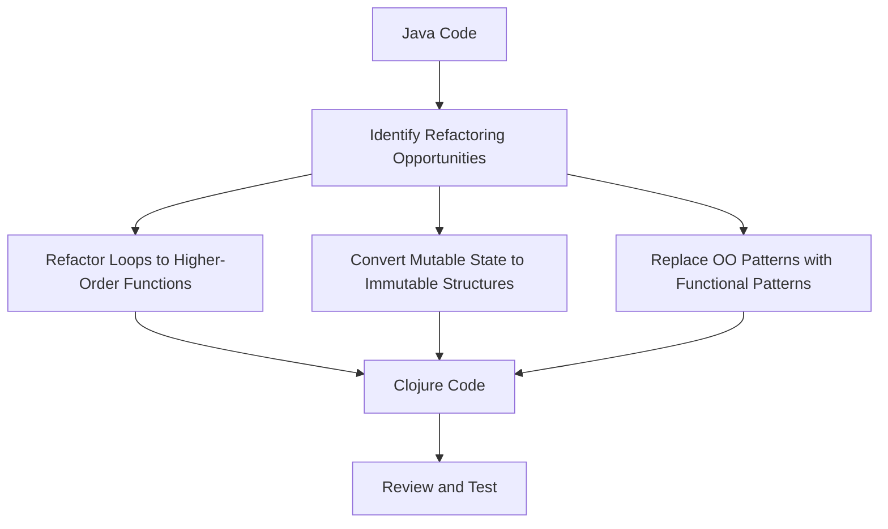

## 11.7.2 Automated Refactoring Tools

As experienced Java developers, transitioning to Clojure involves not only learning a new language but also adapting to a different programming paradigm. Automated refactoring tools can significantly ease this transition by transforming Java code into Clojure, maintaining code quality, and reducing manual errors. In this section, we will explore various tools and techniques that can assist in this process, focusing on how they can streamline migration while ensuring the integrity of your codebase.

### Understanding Automated Refactoring

Automated refactoring involves using software tools to modify code structure without changing its external behavior. These tools can identify patterns in Java code that can be transformed into equivalent Clojure constructs, thus facilitating a smoother migration process. The goal is to leverage these tools to automate repetitive tasks, allowing developers to focus on more complex aspects of the migration.

### Key Benefits of Automated Refactoring Tools

1. **Efficiency**: Automated tools can quickly refactor large codebases, saving time compared to manual refactoring.
2. **Consistency**: Ensures uniform application of refactoring rules across the entire codebase.
3. **Error Reduction**: Minimizes human errors by automating repetitive and complex transformations.
4. **Focus on Logic**: Allows developers to concentrate on business logic and functional aspects rather than syntactic changes.

### Popular Automated Refactoring Tools

#### IntelliJ IDEA's Refactoring Features

IntelliJ IDEA is a powerful IDE that offers extensive refactoring capabilities for Java developers. While it does not directly convert Java to Clojure, its features can be leveraged to prepare Java code for migration:

- **Code Analysis**: Identifies code smells and suggests improvements, which can be useful before migrating to Clojure.
- **Structural Search and Replace**: Allows for pattern-based code transformations, which can be adapted for Clojure migration.
- **Refactoring Shortcuts**: Provides quick actions for renaming, extracting methods, and other common refactoring tasks.

#### Cursive Plugin for IntelliJ IDEA

The Cursive plugin enhances IntelliJ IDEA with Clojure support, making it easier to work with both Java and Clojure codebases within the same environment. It offers features such as:

- **Clojure Code Navigation**: Facilitates easy navigation between Java and Clojure code.
- **Refactoring Support**: Provides basic refactoring tools for Clojure, aiding in the transition from Java.

#### Dedicated Migration Tools

While there are no widely recognized tools that automatically convert Java code to Clojure, several tools can assist in specific aspects of the migration:

- **JavaParser**: A library that can parse Java code into an abstract syntax tree (AST), which can then be transformed into Clojure syntax.
- **ClojureScript Transpilers**: Tools like `cljs-oops` can help in converting JavaScript (and indirectly Java) patterns to ClojureScript, offering insights into similar transformations for Clojure.

### Refactoring Java Code for Clojure Migration

#### Identifying Refactoring Opportunities

Before migrating Java code to Clojure, it's essential to identify parts of the codebase that can benefit from refactoring. Common candidates include:

- **Loops and Iterations**: Convert to Clojure's recursive functions or higher-order functions like `map` and `reduce`.
- **Mutable State**: Transition to Clojure's immutable data structures.
- **Object-Oriented Patterns**: Refactor to functional patterns, such as replacing inheritance with composition.

#### Example: Refactoring a Java Loop to Clojure

Let's consider a simple Java loop that calculates the sum of an array of integers:

```java
// Java code to sum an array of integers
int[] numbers = {1, 2, 3, 4, 5};
int sum = 0;
for (int number : numbers) {
    sum += number;
}
System.out.println("Sum: " + sum);
```

In Clojure, we can refactor this loop using the `reduce` function:

```clojure
;; Clojure code to sum a vector of integers
(def numbers [1 2 3 4 5])

;; Using reduce to calculate the sum
(def sum (reduce + numbers))

(println "Sum:" sum) ;; Output: Sum: 15
```

**Explanation**: The `reduce` function in Clojure takes a function and a collection, applying the function cumulatively to the elements of the collection. This approach is more concise and leverages Clojure's functional programming capabilities.

### Visualizing Refactoring with Diagrams

To better understand the transformation from Java to Clojure, let's visualize the process using a flowchart:



**Diagram Explanation**: This flowchart illustrates the steps involved in refactoring Java code for Clojure migration. It highlights the identification of refactoring opportunities, transformation of specific patterns, and the final review and testing phase.

### Try It Yourself: Refactor Java Code

To practice refactoring Java code to Clojure, try the following exercises:

1. **Convert a Java `for` loop** that iterates over a list of strings and prints each string to a Clojure `map` function.
2. **Refactor a Java class** with getter and setter methods to a Clojure map with keyword access.
3. **Transform a Java `switch` statement** to a Clojure `case` or `cond` expression.

### Challenges and Considerations

While automated refactoring tools can significantly aid in the migration process, there are challenges to consider:

- **Complex Logic**: Automated tools may struggle with complex business logic that requires manual intervention.
- **Performance**: Ensure that refactored code maintains or improves performance, especially when dealing with large datasets.
- **Testing**: Thorough testing is crucial to verify that the refactored code behaves as expected.

### Exercises and Practice Problems

1. **Exercise 1**: Given a Java method that calculates the factorial of a number using iteration, refactor it into a Clojure function using recursion.
2. **Exercise 2**: Identify a Java class that uses inheritance and refactor it into a Clojure namespace using composition.
3. **Exercise 3**: Take a Java method that uses a `HashMap` and refactor it to use a Clojure map with keyword keys.

### Key Takeaways

- Automated refactoring tools can significantly streamline the migration from Java to Clojure, enhancing efficiency and reducing errors.
- IntelliJ IDEA, with the Cursive plugin, offers powerful features to assist in code transformation and navigation.
- While no tool can fully automate the migration, leveraging these tools can help focus on more complex aspects of the transition.
- Practice and experimentation are crucial to mastering the art of refactoring Java code into idiomatic Clojure.

By embracing these tools and techniques, we can make the transition from Java to Clojure smoother and more efficient, ultimately leading to cleaner, more maintainable code.

## Quiz: Test Your Knowledge on Automated Refactoring Tools



### Which of the following is a benefit of using automated refactoring tools?

- [x] Efficiency in refactoring large codebases
- [ ] Increased manual errors
- [ ] Decreased code consistency
- [ ] Reduced focus on business logic

> **Explanation:** Automated refactoring tools enhance efficiency by quickly refactoring large codebases, ensuring consistency and reducing manual errors.

### What is the primary purpose of IntelliJ IDEA's refactoring features?

- [x] To prepare Java code for migration to Clojure
- [ ] To directly convert Java code to Clojure
- [ ] To compile Clojure code
- [ ] To execute Java applications

> **Explanation:** IntelliJ IDEA's refactoring features help prepare Java code for migration by identifying code smells and suggesting improvements.

### How does the `reduce` function in Clojure differ from a Java loop?

- [x] It applies a function cumulatively to elements of a collection
- [ ] It iterates over elements without applying any function
- [ ] It modifies elements in place
- [ ] It requires explicit iteration control

> **Explanation:** The `reduce` function in Clojure applies a function cumulatively to elements of a collection, unlike Java loops that require explicit iteration control.

### What is a common challenge when using automated refactoring tools?

- [x] Handling complex business logic
- [ ] Improving code performance
- [ ] Ensuring code consistency
- [ ] Reducing manual errors

> **Explanation:** Automated tools may struggle with complex business logic that requires manual intervention.

### Which tool can parse Java code into an abstract syntax tree (AST)?

- [x] JavaParser
- [ ] Cursive
- [ ] Leiningen
- [ ] Maven

> **Explanation:** JavaParser is a library that can parse Java code into an abstract syntax tree (AST).

### What is the role of the Cursive plugin in IntelliJ IDEA?

- [x] To enhance Clojure support and facilitate code navigation
- [ ] To compile Java code
- [ ] To execute Clojure applications
- [ ] To convert Java code to Clojure

> **Explanation:** The Cursive plugin enhances Clojure support in IntelliJ IDEA, facilitating code navigation and refactoring.

### Which of the following is a step in refactoring Java code for Clojure migration?

- [x] Converting mutable state to immutable structures
- [ ] Increasing code complexity
- [ ] Removing all comments
- [ ] Ignoring code smells

> **Explanation:** Converting mutable state to immutable structures is a crucial step in refactoring Java code for Clojure migration.

### What is a key takeaway from using automated refactoring tools?

- [x] They streamline migration and reduce errors
- [ ] They eliminate the need for testing
- [ ] They increase manual intervention
- [ ] They decrease code quality

> **Explanation:** Automated refactoring tools streamline migration and reduce errors, enhancing code quality.

### Which of the following is NOT a feature of IntelliJ IDEA's refactoring tools?

- [ ] Code Analysis
- [ ] Structural Search and Replace
- [x] Direct Java to Clojure conversion
- [ ] Refactoring Shortcuts

> **Explanation:** IntelliJ IDEA's refactoring tools do not directly convert Java to Clojure; they assist in preparing code for migration.

### True or False: Automated refactoring tools can fully automate the migration from Java to Clojure.

- [ ] True
- [x] False

> **Explanation:** While automated refactoring tools can significantly aid in the migration process, they cannot fully automate it, especially for complex logic.


