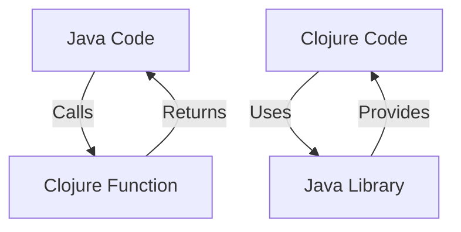

## 11.7.3 Interoperability Libraries

As experienced Java developers, you are likely familiar with the challenges and intricacies of integrating different programming languages within a single project. Clojure, being a JVM language, offers robust interoperability with Java, allowing developers to leverage existing Java libraries and frameworks while gradually transitioning to a more functional paradigm. In this section, we will explore various libraries and frameworks that facilitate interoperability between Java and Clojure, enabling seamless integration and coexistence of codebases.

### Understanding Java-Clojure Interoperability

Clojure's interoperability with Java is one of its most powerful features. It allows developers to call Java methods, create Java objects, and implement Java interfaces directly from Clojure code. This capability is crucial for projects that aim to migrate from Java to Clojure incrementally, as it enables the reuse of existing Java code and libraries without the need for complete rewrites.

#### Key Concepts in Java-Clojure Interoperability

- **Calling Java Methods**: Clojure provides a straightforward syntax for invoking Java methods, accessing fields, and handling Java exceptions.
- **Creating Java Objects**: You can instantiate Java objects and use them within Clojure code, enabling seamless integration with Java libraries.
- **Implementing Interfaces**: Clojure allows you to implement Java interfaces using constructs like `proxy` and `reify`, facilitating the integration of Clojure code with Java frameworks.

### Libraries and Tools for Interoperability

Several libraries and tools enhance the interoperability between Java and Clojure, providing additional functionality and simplifying common tasks. Let's explore some of the most popular and useful ones.

#### 1. **clojure.java.api**

The `clojure.java.api` namespace provides a set of functions and macros for interacting with Java classes and objects. It is part of the core Clojure library and offers a simple and consistent API for Java interop.

**Example: Calling a Java Method**

```clojure
;; Import the necessary Java class
(import 'java.util.Date)

;; Create a new Date object
(def today (Date.))

;; Call a method on the Date object
(.getTime today) ; Returns the current time in milliseconds
```

**Explanation**: In this example, we import the `java.util.Date` class, create a new instance, and call the `getTime` method to retrieve the current time in milliseconds.

#### 2. **clojure.java.jdbc**

For projects that involve database interactions, `clojure.java.jdbc` is a widely used library that provides a simple and idiomatic way to work with JDBC (Java Database Connectivity) from Clojure.

**Example: Querying a Database**

```clojure
(require '[clojure.java.jdbc :as jdbc])

(def db-spec {:subprotocol "mysql"
              :subname "//localhost:3306/mydb"
              :user "user"
              :password "password"})

;; Execute a query
(jdbc/query db-spec ["SELECT * FROM users"])
```

**Explanation**: This example demonstrates how to use `clojure.java.jdbc` to connect to a MySQL database and execute a simple query to retrieve all records from the `users` table.

#### 3. **clojure.java.shell**

The `clojure.java.shell` library provides functions for executing shell commands from Clojure, which can be useful for integrating with external systems or automating tasks.

**Example: Running a Shell Command**

```clojure
(require '[clojure.java.shell :refer [sh]])

;; Execute a shell command
(sh "ls" "-l")
```

**Explanation**: Here, we use the `sh` function to execute the `ls -l` command, which lists the contents of the current directory in long format.

#### 4. **clojure.tools.logging**

Logging is an essential aspect of any application, and `clojure.tools.logging` provides a flexible and extensible logging framework that integrates with popular Java logging libraries like SLF4J and Log4j.

**Example: Logging a Message**

```clojure
(require '[clojure.tools.logging :as log])

;; Log a message at the INFO level
(log/info "This is an informational message.")
```

**Explanation**: This example shows how to use `clojure.tools.logging` to log an informational message. The library supports various logging levels, including DEBUG, INFO, WARN, and ERROR.

### Gradual Migration and Coexistence

One of the significant advantages of Clojure's interoperability with Java is the ability to migrate codebases gradually. By leveraging interoperability libraries, you can start by integrating Clojure into specific parts of your application while maintaining the existing Java code. This approach allows for a smooth transition and minimizes the risk associated with large-scale rewrites.

#### Strategies for Gradual Migration

1. **Identify Suitable Components**: Start by identifying components or modules that can benefit from Clojure's functional programming features, such as data processing or concurrency management.

2. **Integrate Clojure Incrementally**: Begin by writing new features or refactoring existing ones in Clojure, using interoperability libraries to interact with Java code as needed.

3. **Leverage Java Libraries**: Continue to use Java libraries and frameworks where appropriate, taking advantage of Clojure's seamless interop capabilities.

4. **Refactor and Optimize**: As you gain confidence and experience with Clojure, refactor more of your codebase to adopt functional programming principles and idiomatic Clojure patterns.

### Comparing Java and Clojure Interoperability

To better understand the differences and similarities between Java and Clojure interoperability, let's compare some common tasks in both languages.

#### Java Code Example: Calling a Method

```java
import java.util.Date;

public class Example {
    public static void main(String[] args) {
        Date today = new Date();
        long time = today.getTime();
        System.out.println("Current time in milliseconds: " + time);
    }
}
```

#### Clojure Code Example: Calling a Method

```clojure
(import 'java.util.Date)

(def today (Date.))
(println "Current time in milliseconds:" (.getTime today))
```

**Comparison**: Both examples achieve the same result, but the Clojure code is more concise and leverages the language's dynamic nature. Clojure's syntax for calling Java methods is straightforward and integrates seamlessly with the language's functional style.

### Try It Yourself

To deepen your understanding of Java-Clojure interoperability, try modifying the examples above:

- **Experiment with Different Java Classes**: Import and use different Java classes, such as `java.util.Calendar` or `java.io.File`, to perform various tasks.
- **Integrate Clojure with Java Libraries**: Choose a Java library you are familiar with and explore how to use it from Clojure.
- **Refactor Java Code to Clojure**: Take a small piece of Java code and rewrite it in Clojure, using interoperability libraries to maintain functionality.

### Diagrams and Visual Aids

To visualize the flow of data and interactions between Java and Clojure, consider the following diagram:



**Diagram Description**: This flowchart illustrates the bidirectional interaction between Java and Clojure code. Java code can call Clojure functions, and Clojure code can use Java libraries, enabling seamless integration and interoperability.

### Further Reading and Resources

For more information on Java-Clojure interoperability, consider exploring the following resources:

- [Official Clojure Documentation](https://clojure.org/reference/java_interop)
- [ClojureDocs](https://clojuredocs.org/)
- [GitHub Repositories](https://github.com/clojure)

### Exercises and Practice Problems

To reinforce your understanding of interoperability libraries, try the following exercises:

1. **Exercise 1**: Use `clojure.java.jdbc` to connect to a different type of database (e.g., PostgreSQL) and execute a query.
2. **Exercise 2**: Implement a Clojure function that uses a Java library for a specific task, such as image processing or network communication.
3. **Exercise 3**: Refactor a Java class to a Clojure namespace, maintaining the same functionality and using interoperability libraries where necessary.

### Key Takeaways

- Clojure's interoperability with Java allows for seamless integration and gradual migration of codebases.
- Libraries like `clojure.java.api`, `clojure.java.jdbc`, and `clojure.tools.logging` enhance interoperability and simplify common tasks.
- By leveraging interoperability libraries, you can integrate Clojure into existing Java projects incrementally, minimizing risk and maximizing flexibility.

Now that we've explored interoperability libraries, let's apply these concepts to facilitate the coexistence of Java and Clojure code in your projects.

## Quiz: Test Your Knowledge on Java-Clojure Interoperability



### Which Clojure namespace provides functions for interacting with Java classes and objects?

- [x] clojure.java.api
- [ ] clojure.core
- [ ] clojure.java.shell
- [ ] clojure.tools.logging

> **Explanation:** The `clojure.java.api` namespace provides functions and macros for interacting with Java classes and objects.

### What is the primary use of the `clojure.java.jdbc` library?

- [x] Database interactions
- [ ] Logging
- [ ] Shell command execution
- [ ] Java method invocation

> **Explanation:** The `clojure.java.jdbc` library is used for database interactions, providing a simple and idiomatic way to work with JDBC from Clojure.

### How can you execute a shell command in Clojure?

- [x] Using the `sh` function from `clojure.java.shell`
- [ ] Using the `exec` function from `clojure.core`
- [ ] Using the `run` function from `clojure.tools.logging`
- [ ] Using the `shell` function from `clojure.java.api`

> **Explanation:** The `sh` function from `clojure.java.shell` is used to execute shell commands from Clojure.

### Which library provides a flexible logging framework that integrates with Java logging libraries?

- [x] clojure.tools.logging
- [ ] clojure.java.jdbc
- [ ] clojure.java.shell
- [ ] clojure.core

> **Explanation:** `clojure.tools.logging` provides a flexible and extensible logging framework that integrates with popular Java logging libraries.

### What is one advantage of Clojure's interoperability with Java?

- [x] Gradual migration of codebases
- [ ] Complete rewrite of Java code
- [ ] Incompatibility with Java libraries
- [ ] Elimination of Java dependencies

> **Explanation:** Clojure's interoperability with Java allows for the gradual migration of codebases, enabling the reuse of existing Java code and libraries.

### How can you implement a Java interface in Clojure?

- [x] Using `proxy` or `reify`
- [ ] Using `defn`
- [ ] Using `import`
- [ ] Using `require`

> **Explanation:** You can implement a Java interface in Clojure using constructs like `proxy` and `reify`.

### What is the purpose of the `clojure.java.shell` library?

- [x] Executing shell commands
- [ ] Database interactions
- [ ] Logging
- [ ] Java method invocation

> **Explanation:** The `clojure.java.shell` library provides functions for executing shell commands from Clojure.

### Which of the following is a strategy for gradual migration from Java to Clojure?

- [x] Integrate Clojure incrementally
- [ ] Rewrite the entire codebase at once
- [ ] Avoid using Java libraries
- [ ] Eliminate all Java dependencies

> **Explanation:** Integrating Clojure incrementally is a strategy for gradual migration, allowing for a smooth transition and minimizing risk.

### What is the benefit of using `clojure.tools.logging`?

- [x] Flexible logging with integration to Java logging libraries
- [ ] Executing shell commands
- [ ] Database interactions
- [ ] Java method invocation

> **Explanation:** `clojure.tools.logging` provides flexible logging with integration to popular Java logging libraries like SLF4J and Log4j.

### True or False: Clojure's interoperability with Java allows for seamless integration and coexistence of codebases.

- [x] True
- [ ] False

> **Explanation:** True. Clojure's interoperability with Java allows for seamless integration and coexistence of codebases, enabling the reuse of existing Java code and libraries.


