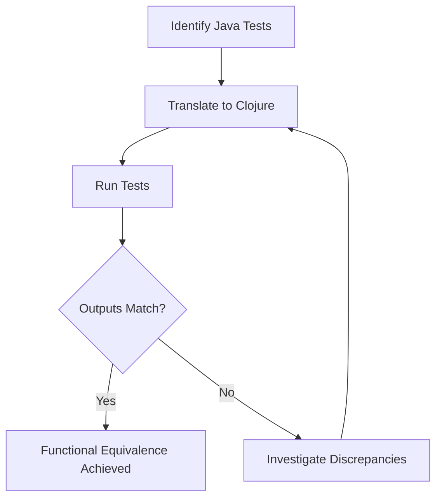

## 11.8.1 Ensuring Functional Equivalence

Migrating a codebase from Java to Clojure is a significant undertaking that requires careful planning and execution. One of the most critical aspects of this process is ensuring that the new Clojure code behaves identically to the original Java code. This section will guide you through various techniques to verify functional equivalence, including regression testing, property-based testing, and output comparison. By the end of this section, you'll be equipped with the knowledge to confidently validate your migrated code.

### Understanding Functional Equivalence

Functional equivalence means that two pieces of code, despite being written in different languages or paradigms, produce the same results given the same inputs. This is crucial when migrating from Java to Clojure, as it ensures that the new system maintains the same functionality and behavior as the original.

#### Key Concepts

- **Behavioral Consistency**: The migrated code should exhibit the same behavior as the original code under all expected conditions.
- **Output Equivalence**: For any given input, the output of the Clojure code should match the output of the Java code.
- **Performance Parity**: While not strictly part of functional equivalence, ensuring similar performance characteristics can be important for user experience.

### Techniques for Ensuring Functional Equivalence

#### Regression Testing

Regression testing involves running a suite of tests that were originally used to validate the Java code against the new Clojure code. This ensures that the Clojure code meets the same specifications and requirements.

##### Steps for Regression Testing

1. **Identify Existing Tests**: Gather all existing unit and integration tests from the Java codebase.
2. **Translate Tests to Clojure**: Convert these tests into Clojure using a testing framework like `clojure.test`.
3. **Run Tests**: Execute the tests against the Clojure codebase and compare the results with the Java tests.

##### Example: Translating a Java Test to Clojure

**Java Test Example**

```java
import static org.junit.Assert.assertEquals;
import org.junit.Test;

public class CalculatorTest {
    @Test
    public void testAddition() {
        Calculator calc = new Calculator();
        assertEquals(5, calc.add(2, 3));
    }
}
```

**Clojure Test Example**

```clojure
(ns calculator-test
  (:require [clojure.test :refer :all]
            [calculator :refer :all]))

(deftest test-addition
  (is (= 5 (add 2 3))))
```

> **Note**: Ensure that the Clojure test framework is set up correctly to run these tests.

#### Property-Based Testing

Property-based testing is a powerful technique that involves specifying properties that should hold true for a wide range of inputs. This can be particularly useful for verifying functional equivalence, as it allows you to test more scenarios than traditional example-based tests.

##### Steps for Property-Based Testing

1. **Define Properties**: Identify properties that should hold true for both the Java and Clojure implementations.
2. **Use a Library**: Utilize a library like `test.check` in Clojure to generate random inputs and verify that the properties hold.
3. **Compare Results**: Ensure that both implementations produce equivalent results for the generated inputs.

##### Example: Property-Based Test in Clojure

```clojure
(ns calculator-property-test
  (:require [clojure.test.check :as tc]
            [clojure.test.check.generators :as gen]
            [clojure.test.check.properties :as prop]
            [calculator :refer :all]))

(def addition-property
  (prop/for-all [a gen/int
                 b gen/int]
    (= (add a b) (+ a b))))

(tc/quick-check 1000 addition-property)
```

> **Explanation**: This test checks that the `add` function in Clojure behaves like the built-in `+` operator for a wide range of integers.

#### Output Comparison

Output comparison involves running both the Java and Clojure implementations with the same inputs and comparing their outputs. This can be automated using scripts or tools that capture and compare outputs.

##### Steps for Output Comparison

1. **Generate Inputs**: Create a set of representative inputs that cover various edge cases and typical scenarios.
2. **Run Both Implementations**: Execute both the Java and Clojure code with these inputs.
3. **Compare Outputs**: Use a tool or script to compare the outputs and identify discrepancies.

##### Example: Output Comparison Script

```bash
#!/bin/bash

# Run Java implementation
java_output=$(java -cp . Calculator 2 3)

# Run Clojure implementation
clojure_output=$(clojure -M -m calculator 2 3)

# Compare outputs
if [ "$java_output" == "$clojure_output" ]; then
  echo "Outputs are equivalent."
else
  echo "Outputs differ: Java($java_output) vs Clojure($clojure_output)"
fi
```

> **Note**: Ensure both implementations are accessible and can be executed from the command line.

### Challenges and Solutions

#### Handling Non-Deterministic Behavior

Some Java code may exhibit non-deterministic behavior due to concurrency or reliance on external systems. In such cases, ensure that the Clojure code handles these scenarios appropriately, possibly by using Clojure's concurrency primitives like atoms, refs, and agents.

#### Dealing with Side Effects

Clojure's functional nature encourages minimizing side effects. When migrating Java code with side effects, consider isolating these effects and using constructs like `do` blocks or `core.async` channels to manage them.

#### Performance Considerations

While functional equivalence focuses on behavior, performance differences can impact user experience. Profile both implementations to ensure that performance is within acceptable bounds.

### Try It Yourself

Experiment with the following exercises to deepen your understanding of ensuring functional equivalence:

1. **Translate a Java Test Suite**: Take a small Java project with a test suite and translate it into Clojure. Run the tests and compare the results.
2. **Create Property-Based Tests**: Identify a function in your Java code that can benefit from property-based testing. Implement a property-based test in Clojure and verify its behavior.
3. **Automate Output Comparison**: Write a script to automate the output comparison between a Java and Clojure implementation of a simple algorithm.

### Diagrams and Visual Aids

Below is a flowchart illustrating the process of ensuring functional equivalence between Java and Clojure code:



*Caption*: This flowchart outlines the steps to ensure functional equivalence through regression testing.

### Further Reading

- [Clojure Official Documentation](https://clojure.org/)
- [ClojureDocs](https://clojuredocs.org/)
- [Test.check GitHub Repository](https://github.com/clojure/test.check)

### Exercises and Practice Problems

1. **Exercise 1**: Choose a Java method with complex logic and rewrite it in Clojure. Use regression testing to verify equivalence.
2. **Exercise 2**: Implement a property-based test for a Clojure function that processes collections. Ensure it behaves like its Java counterpart.
3. **Exercise 3**: Create a script to compare outputs of a Java and Clojure implementation for a given set of inputs. Identify any discrepancies and resolve them.

### Summary and Key Takeaways

- Ensuring functional equivalence is crucial when migrating from Java to Clojure.
- Techniques like regression testing, property-based testing, and output comparison are effective for verifying equivalence.
- Handling non-deterministic behavior and side effects requires careful consideration in Clojure.
- Performance should be monitored to ensure user experience is not adversely affected.
- Practice and experimentation are key to mastering these techniques and ensuring successful code migration.

By following these guidelines and leveraging the power of Clojure's functional paradigm, you can confidently ensure that your migrated codebase maintains the same functionality and reliability as the original Java implementation.

## Quiz: Ensuring Functional Equivalence in Clojure Migration



### What is functional equivalence in the context of code migration?

- [x] Ensuring that the new code behaves identically to the original code.
- [ ] Ensuring that the new code is written in a functional programming style.
- [ ] Ensuring that the new code is more efficient than the original code.
- [ ] Ensuring that the new code uses the latest programming paradigms.

> **Explanation:** Functional equivalence means that the new code behaves identically to the original code, producing the same results for the same inputs.

### Which testing technique involves specifying properties that should hold true for a wide range of inputs?

- [ ] Regression Testing
- [x] Property-Based Testing
- [ ] Output Comparison
- [ ] Unit Testing

> **Explanation:** Property-based testing involves specifying properties that should hold true for a wide range of inputs, allowing for more comprehensive testing than example-based tests.

### What is the first step in regression testing for code migration?

- [x] Identify existing tests in the Java codebase.
- [ ] Translate tests to Clojure.
- [ ] Run tests against the Clojure codebase.
- [ ] Compare test results.

> **Explanation:** The first step in regression testing is to identify existing tests in the Java codebase that can be used to validate the Clojure code.

### How can non-deterministic behavior in Java code be handled in Clojure?

- [ ] By ignoring it in the Clojure implementation.
- [x] By using Clojure's concurrency primitives like atoms, refs, and agents.
- [ ] By converting it to deterministic behavior.
- [ ] By using Java's concurrency mechanisms.

> **Explanation:** Non-deterministic behavior can be handled in Clojure using its concurrency primitives like atoms, refs, and agents to manage state changes predictably.

### Which of the following is NOT a step in output comparison?

- [ ] Generate inputs.
- [ ] Run both implementations.
- [ ] Compare outputs.
- [x] Translate tests to Clojure.

> **Explanation:** Translating tests to Clojure is part of regression testing, not output comparison.

### What is a key benefit of property-based testing?

- [x] It tests a wide range of inputs automatically.
- [ ] It is easier to write than unit tests.
- [ ] It requires no setup.
- [ ] It guarantees performance improvements.

> **Explanation:** Property-based testing automatically tests a wide range of inputs, providing more comprehensive coverage than traditional unit tests.

### Why is performance parity important in code migration?

- [x] To ensure user experience is not adversely affected.
- [ ] To ensure the new code is written in a functional style.
- [ ] To ensure the new code uses the latest libraries.
- [ ] To ensure the new code is more concise.

> **Explanation:** Performance parity ensures that the user experience remains consistent and is not negatively impacted by the migration.

### What is the purpose of the `macroexpand` function in Clojure?

- [ ] To execute macros.
- [x] To visualize macro transformations.
- [ ] To define new macros.
- [ ] To optimize macros.

> **Explanation:** The `macroexpand` function is used to visualize macro transformations, helping developers understand how macros are expanded.

### Which Clojure library is commonly used for property-based testing?

- [ ] clojure.test
- [x] test.check
- [ ] clojure.spec
- [ ] midje

> **Explanation:** The `test.check` library is commonly used for property-based testing in Clojure.

### True or False: Functional equivalence only concerns the correctness of outputs, not performance.

- [ ] True
- [x] False

> **Explanation:** While functional equivalence primarily concerns correctness, performance is also important to ensure the user experience is not negatively impacted.


