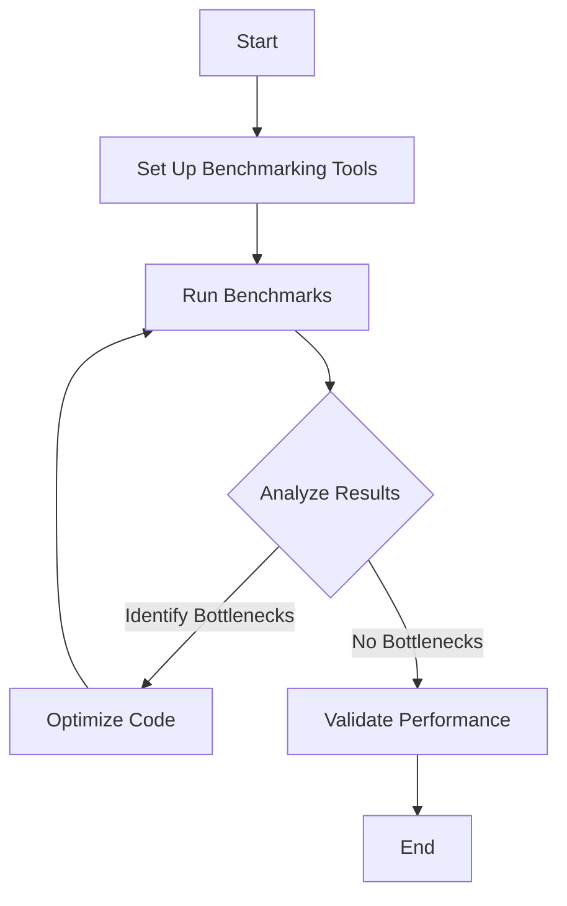

## 11.8.2 Performance Testing

Performance testing is a critical step in the migration process from Java to Clojure. It ensures that the transition has not introduced performance regressions and that the new Clojure codebase is as efficient, if not more so, than its Java predecessor. In this section, we will explore the importance of performance benchmarks, delve into profiling tools, and discuss methods for measuring and optimizing performance in Clojure.

### The Importance of Performance Testing

Performance testing is essential for several reasons:

1. **Validation of Migration Success**: Ensures that the migrated code performs at least as well as the original Java code.
2. **Identification of Bottlenecks**: Helps in identifying areas of the code that may be causing slowdowns.
3. **Optimization Opportunities**: Provides insights into potential optimizations that can be made to improve performance.
4. **User Experience**: Ensures that the end-user experience is not negatively impacted by performance issues.

### Benchmarking in Clojure

Benchmarking is the process of measuring the performance of a piece of code to establish a baseline. In Clojure, benchmarking can be done using libraries such as [Criterium](https://github.com/hugoduncan/criterium), which provides robust tools for measuring execution time and other performance metrics.

#### Setting Up Criterium

To use Criterium, add it to your `project.clj` or `deps.edn`:

```clojure
;; project.clj
:dependencies [[criterium "0.4.6"]]

;; deps.edn
{:deps {criterium {:mvn/version "0.4.6"}}}
```

#### Basic Benchmarking Example

Here's a simple example of how to benchmark a function in Clojure using Criterium:

```clojure
(ns performance-testing.core
  (:require [criterium.core :refer [quick-bench]]))

(defn example-function [n]
  (reduce + (range n)))

;; Benchmark the function
(quick-bench (example-function 1000000))
```

In this example, `quick-bench` is used to measure the execution time of `example-function`. The results provide insights into the average execution time, standard deviation, and other statistical data.

### Profiling Tools for Clojure

Profiling is the process of analyzing a program to determine where time is being spent. It helps identify bottlenecks and areas for optimization. Several tools are available for profiling Clojure applications:

1. **VisualVM**: A visual tool integrating several command-line JDK tools and lightweight profiling capabilities.
2. **YourKit**: A commercial Java profiler that supports Clojure.
3. **JVisualVM**: A free tool included with the JDK that provides profiling capabilities.

#### Using VisualVM

VisualVM is a powerful tool for profiling Clojure applications. It provides a graphical interface to monitor CPU and memory usage, thread activity, and more.

1. **Install VisualVM**: Download and install VisualVM from the [official website](https://visualvm.github.io/).
2. **Run Your Clojure Application**: Start your Clojure application with the JVM options to enable JMX monitoring.
3. **Connect VisualVM**: Open VisualVM and connect to your running application. You can then view various metrics and perform profiling.

### Measuring Performance in Clojure

When measuring performance, it's important to consider various aspects such as execution time, memory usage, and concurrency behavior. Here are some key metrics to focus on:

1. **Execution Time**: The time taken for a function or operation to complete.
2. **Memory Usage**: The amount of memory consumed by the application.
3. **Concurrency**: The behavior of the application when handling multiple threads or processes.

#### Execution Time

Execution time can be measured using Criterium, as shown in the benchmarking example. It's important to run benchmarks multiple times to account for variability in execution time.

#### Memory Usage

Memory usage can be monitored using VisualVM or similar tools. Look for memory leaks or excessive memory consumption that could impact performance.

#### Concurrency

Clojure's concurrency model, which includes atoms, refs, and agents, can be tested for performance using stress tests that simulate high concurrency scenarios.

### Comparing Clojure and Java Performance

When comparing Clojure and Java performance, consider the following:

- **Startup Time**: Clojure applications may have a longer startup time due to the JVM and Clojure's dynamic nature.
- **Execution Speed**: Clojure's functional nature can lead to more efficient code, but it may also introduce overhead due to immutable data structures.
- **Concurrency**: Clojure's concurrency primitives can simplify concurrent programming, potentially leading to better performance in multi-threaded applications.

#### Java vs. Clojure Code Example

Let's compare a simple Java and Clojure code snippet to highlight performance differences:

**Java Code:**

```java
public class SumExample {
    public static long sum(int n) {
        long total = 0;
        for (int i = 0; i < n; i++) {
            total += i;
        }
        return total;
    }

    public static void main(String[] args) {
        long result = sum(1000000);
        System.out.println("Sum: " + result);
    }
}
```

**Clojure Code:**

```clojure
(defn sum [n]
  (reduce + (range n)))

(defn -main []
  (println "Sum:" (sum 1000000)))
```

In this example, both Java and Clojure calculate the sum of numbers up to `n`. The Clojure version uses `reduce` and `range`, which are idiomatic and efficient for this task. However, the performance may vary based on the JVM optimizations and the nature of the task.

### Optimizing Clojure Code

Optimization involves improving the performance of your code without altering its functionality. Here are some tips for optimizing Clojure code:

1. **Avoid Reflection**: Use type hints to avoid reflection, which can slow down execution.
2. **Use Transients**: For local mutability, use transients to improve performance.
3. **Leverage Persistent Data Structures**: Clojure's persistent data structures are optimized for immutability and can improve performance.
4. **Parallel Processing**: Use `pmap` and other parallel processing techniques to leverage multi-core processors.

#### Example: Using Transients

```clojure
(defn transient-example [n]
  (persistent!
    (reduce (fn [acc x] (conj! acc x))
            (transient [])
            (range n))))
```

In this example, `transient` and `conj!` are used to create a mutable version of a vector for performance optimization. Once the operation is complete, `persistent!` is called to convert it back to an immutable structure.

### Try It Yourself

Experiment with the provided code examples by modifying the input size or the operations performed. Observe how these changes impact performance and consider how you might optimize further.

### Diagrams and Visualizations

Below is a flowchart illustrating the process of performance testing in Clojure:



**Diagram Caption**: This flowchart outlines the steps involved in performance testing and optimization in Clojure.

### Further Reading

For more information on performance testing and optimization in Clojure, consider the following resources:

- [Clojure Official Documentation](https://clojure.org/)
- [ClojureDocs](https://clojuredocs.org/)
- [Criterium GitHub Repository](https://github.com/hugoduncan/criterium)

### Exercises

1. **Benchmark a Clojure Function**: Choose a function in your Clojure project and benchmark it using Criterium. Analyze the results and identify any potential optimizations.
2. **Profile a Clojure Application**: Use VisualVM to profile a Clojure application. Identify any memory leaks or performance bottlenecks.
3. **Optimize Code**: Take a piece of Clojure code and apply the optimization techniques discussed. Measure the performance improvements.

### Key Takeaways

- Performance testing is crucial for ensuring efficient code post-migration from Java to Clojure.
- Benchmarking and profiling tools like Criterium and VisualVM are essential for identifying bottlenecks.
- Optimizing Clojure code involves avoiding reflection, using transients, and leveraging persistent data structures.
- Comparing Java and Clojure performance can highlight areas for improvement and optimization.

Now that we've explored performance testing in Clojure, let's apply these concepts to ensure your migrated applications run efficiently and effectively.

## Quiz: Mastering Performance Testing in Clojure



### What is the primary purpose of performance testing in Clojure?

- [x] To ensure that the migration from Java has not introduced performance regressions
- [ ] To replace all Java code with Clojure code
- [ ] To identify syntax errors in Clojure code
- [ ] To convert Clojure code back to Java

> **Explanation:** Performance testing ensures that the migrated code performs at least as well as the original Java code, without introducing regressions.

### Which library is commonly used for benchmarking in Clojure?

- [x] Criterium
- [ ] JUnit
- [ ] Mockito
- [ ] Log4j

> **Explanation:** Criterium is a popular library in Clojure for benchmarking and measuring execution time.

### What tool can be used to profile Clojure applications?

- [x] VisualVM
- [ ] Eclipse
- [ ] IntelliJ IDEA
- [ ] Git

> **Explanation:** VisualVM is a tool that provides profiling capabilities for Java and Clojure applications.

### What is a key benefit of using Clojure's persistent data structures?

- [x] They are optimized for immutability and can improve performance
- [ ] They allow for mutable state changes
- [ ] They are only used for debugging
- [ ] They replace all Java collections

> **Explanation:** Clojure's persistent data structures are designed for immutability, which can lead to performance improvements.

### How can you avoid reflection in Clojure?

- [x] Use type hints
- [ ] Use more loops
- [ ] Avoid using functions
- [ ] Use global variables

> **Explanation:** Type hints can be used in Clojure to avoid reflection, which can slow down execution.

### What is the purpose of using transients in Clojure?

- [x] To provide local mutability for performance optimization
- [ ] To make data structures immutable
- [ ] To replace all functions with macros
- [ ] To handle exceptions

> **Explanation:** Transients provide a way to use local mutability for performance optimization in Clojure.

### What is a common method for parallel processing in Clojure?

- [x] Using `pmap`
- [ ] Using `for` loops
- [ ] Using `while` loops
- [ ] Using `if` statements

> **Explanation:** `pmap` is used in Clojure for parallel processing, leveraging multi-core processors.

### What is a key difference between Java and Clojure performance?

- [x] Clojure may have a longer startup time due to its dynamic nature
- [ ] Java is always faster than Clojure
- [ ] Clojure does not support concurrency
- [ ] Java cannot be optimized

> **Explanation:** Clojure applications may have a longer startup time due to the JVM and Clojure's dynamic nature.

### Which of the following is NOT a profiling tool for Clojure?

- [ ] YourKit
- [ ] VisualVM
- [x] JUnit
- [ ] JVisualVM

> **Explanation:** JUnit is a testing framework, not a profiling tool.

### True or False: Performance testing is only necessary after migrating from Java to Clojure.

- [ ] True
- [x] False

> **Explanation:** Performance testing is an ongoing process that should be conducted regularly to ensure code efficiency and optimization.


