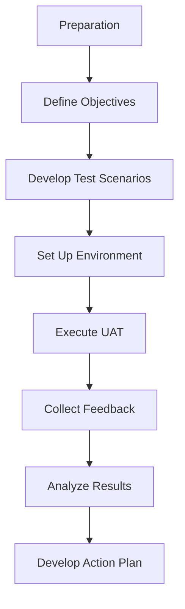

## 11.8.3 User Acceptance Testing

User Acceptance Testing (UAT) is a pivotal phase in the software development lifecycle, especially when transitioning from Java to Clojure. It serves as the final validation step to ensure that the application meets the business requirements and is ready for deployment. In this section, we will delve into the significance of UAT, how to effectively involve stakeholders, and best practices for conducting UAT in a Clojure environment.

### Understanding User Acceptance Testing

User Acceptance Testing is the process where end-users test the software to ensure it can handle required tasks in real-world scenarios, according to specifications. This phase is crucial for identifying any discrepancies between the developed application and user expectations.

#### Key Objectives of UAT

- **Validation of Business Requirements**: Ensure that the application meets all specified business needs.
- **User Satisfaction**: Confirm that the application is user-friendly and meets user expectations.
- **Error Detection**: Identify any bugs or issues that were not caught during earlier testing phases.
- **Feedback Collection**: Gather valuable feedback from stakeholders to make necessary adjustments.

### Involving Stakeholders in UAT

Stakeholder involvement is essential for successful UAT. It ensures that the application aligns with business goals and user expectations. Here’s how you can effectively involve stakeholders:

#### Identifying Key Stakeholders

- **End Users**: Individuals who will use the application daily.
- **Business Analysts**: Professionals who understand the business requirements and can validate them against the application.
- **Project Managers**: Responsible for overseeing the project and ensuring it meets deadlines and objectives.
- **Quality Assurance Teams**: Experts in testing who can guide the UAT process.

#### Engaging Stakeholders

1. **Communication**: Maintain open lines of communication with stakeholders throughout the development process.
2. **Workshops and Demos**: Conduct regular workshops and demonstrations to keep stakeholders informed and engaged.
3. **Feedback Mechanisms**: Implement structured feedback mechanisms, such as surveys or feedback forms, to gather insights from stakeholders.

### Conducting UAT in a Clojure Environment

Transitioning from Java to Clojure introduces unique challenges and opportunities in the UAT process. Here’s how to conduct UAT effectively in a Clojure environment:

#### Preparing for UAT

- **Define Clear Objectives**: Establish what you aim to achieve with UAT, such as validating specific features or ensuring overall usability.
- **Develop Test Scenarios**: Create realistic test scenarios that mimic actual user workflows.
- **Set Up the Environment**: Ensure that the testing environment mirrors the production environment as closely as possible.

#### Executing UAT

- **Test Execution**: Allow stakeholders to execute test scenarios and document their findings.
- **Issue Tracking**: Use tools like JIRA or Trello to track issues and feedback.
- **Iterative Testing**: Conduct multiple rounds of testing to refine the application based on stakeholder feedback.

#### Analyzing UAT Results

- **Feedback Analysis**: Analyze feedback to identify common issues or areas for improvement.
- **Prioritization**: Prioritize issues based on their impact on user satisfaction and business requirements.
- **Action Plan**: Develop an action plan to address identified issues before deployment.

### Comparing UAT in Java and Clojure

While the fundamental principles of UAT remain the same, there are differences in how UAT is conducted in Java versus Clojure:

- **Functional Paradigm**: Clojure’s functional paradigm may require different testing approaches, focusing more on data transformations and less on object state.
- **Immutability**: Clojure’s immutable data structures can simplify testing by reducing side effects and making it easier to predict application behavior.
- **Concurrency**: Clojure’s concurrency primitives, such as atoms and refs, may require specific testing strategies to ensure thread safety and performance.

### Clojure Code Example: UAT Scenario

Let's consider a simple Clojure application that processes user data. We'll demonstrate how to set up a UAT scenario for this application.

```clojure
;; Define a simple function to process user data
(defn process-user-data [user]
  ;; Simulate data processing
  (println "Processing user data for:" (:name user))
  ;; Return processed data
  {:name (:name user) :status "Processed"})

;; Sample user data
(def user {:name "Alice"})

;; Execute the function
(process-user-data user)
```

In this example, we have a function `process-user-data` that processes user data. During UAT, stakeholders would test this function with various user inputs to ensure it behaves as expected.

### Try It Yourself

Encourage stakeholders to modify the `process-user-data` function to handle different scenarios, such as missing data or invalid inputs. This hands-on approach can help identify potential issues and improve the application's robustness.

### Diagram: UAT Process Flow

Below is a flowchart illustrating the UAT process, from preparation to analysis.



**Diagram Description**: This flowchart outlines the steps involved in conducting User Acceptance Testing, from preparation to developing an action plan based on feedback.

### Best Practices for UAT in Clojure

- **Early Involvement**: Involve stakeholders early in the development process to align expectations.
- **Clear Documentation**: Provide clear documentation and instructions for stakeholders participating in UAT.
- **Iterative Feedback**: Use an iterative approach to incorporate feedback and make continuous improvements.
- **Automated Testing**: Complement UAT with automated tests to ensure consistent application behavior.

### External Resources

For further reading on UAT and Clojure testing strategies, consider the following resources:

- [Official Clojure Documentation](https://clojure.org/reference/documentation)
- [ClojureDocs](https://clojuredocs.org/)
- [User Acceptance Testing Guide](https://www.softwaretestinghelp.com/user-acceptance-testing/)

### Exercises

1. **Scenario Creation**: Develop a set of UAT scenarios for a simple Clojure application. Consider different user roles and workflows.
2. **Stakeholder Engagement**: Create a plan to engage stakeholders in the UAT process. Include communication strategies and feedback mechanisms.
3. **Feedback Analysis**: Analyze feedback from a UAT session and develop an action plan to address identified issues.

### Key Takeaways

- User Acceptance Testing is crucial for validating that a migrated application meets business requirements and user expectations.
- Involving stakeholders throughout the UAT process ensures alignment with business goals and enhances user satisfaction.
- Clojure’s functional paradigm and immutable data structures offer unique advantages in the UAT process, simplifying testing and reducing side effects.

By following these guidelines and best practices, you can ensure a successful UAT process that validates your Clojure application and meets stakeholder expectations.

## Quiz: Mastering User Acceptance Testing in Clojure



### What is the primary goal of User Acceptance Testing (UAT)?

- [x] To validate that the application meets business requirements and user expectations.
- [ ] To test the application's performance under load.
- [ ] To identify security vulnerabilities.
- [ ] To ensure code quality and maintainability.

> **Explanation:** UAT focuses on validating that the application meets business requirements and user expectations, ensuring it is ready for deployment.


### Which stakeholders are typically involved in UAT?

- [x] End Users
- [x] Business Analysts
- [x] Project Managers
- [ ] Database Administrators

> **Explanation:** UAT involves end users, business analysts, and project managers to ensure the application aligns with business goals and user expectations.


### How does Clojure's immutability benefit UAT?

- [x] It simplifies testing by reducing side effects.
- [ ] It increases the complexity of test scenarios.
- [ ] It requires more resources for testing.
- [ ] It makes testing more time-consuming.

> **Explanation:** Clojure's immutability simplifies testing by reducing side effects, making it easier to predict application behavior.


### What is a key difference between UAT in Java and Clojure?

- [x] Clojure's functional paradigm may require different testing approaches.
- [ ] Java requires more stakeholder involvement.
- [ ] UAT in Java is typically faster.
- [ ] Clojure does not support automated testing.

> **Explanation:** Clojure's functional paradigm may require different testing approaches, focusing more on data transformations and less on object state.


### What is the purpose of developing test scenarios for UAT?

- [x] To mimic actual user workflows and validate application functionality.
- [ ] To test the application's security features.
- [ ] To evaluate the application's performance.
- [ ] To ensure compliance with coding standards.

> **Explanation:** Test scenarios mimic actual user workflows and validate application functionality, ensuring it meets user expectations.


### Why is stakeholder feedback important in UAT?

- [x] It provides insights into user satisfaction and areas for improvement.
- [ ] It ensures the application is free of bugs.
- [ ] It guarantees the application will succeed in the market.
- [ ] It reduces the need for further testing.

> **Explanation:** Stakeholder feedback provides insights into user satisfaction and areas for improvement, helping refine the application.


### What tool can be used to track issues and feedback during UAT?

- [x] JIRA
- [ ] Microsoft Word
- [ ] Excel
- [ ] PowerPoint

> **Explanation:** JIRA is a popular tool for tracking issues and feedback during UAT, helping manage the testing process.


### How can UAT be complemented in a Clojure environment?

- [x] By using automated tests to ensure consistent application behavior.
- [ ] By reducing the number of test scenarios.
- [ ] By involving fewer stakeholders.
- [ ] By focusing solely on manual testing.

> **Explanation:** Automated tests complement UAT by ensuring consistent application behavior and catching issues early.


### What is the benefit of iterative testing in UAT?

- [x] It allows for continuous improvement based on stakeholder feedback.
- [ ] It reduces the overall testing time.
- [ ] It eliminates the need for automated tests.
- [ ] It focuses only on performance testing.

> **Explanation:** Iterative testing allows for continuous improvement based on stakeholder feedback, refining the application over time.


### True or False: UAT is the final validation step before deploying an application.

- [x] True
- [ ] False

> **Explanation:** UAT is indeed the final validation step before deploying an application, ensuring it meets business requirements and user expectations.




