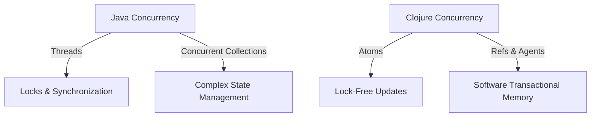
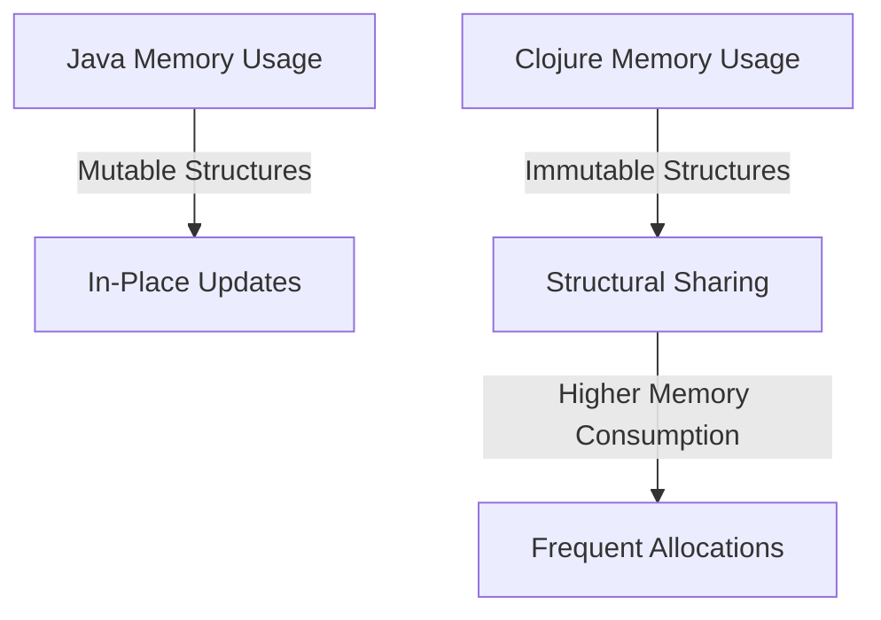

## 11.9.1 Analyzing Performance Metrics

Transitioning from Java to Clojure involves not only a paradigm shift but also a change in how performance is measured and optimized. In this section, we will delve into the performance metrics of a Java application before migration and its Clojure counterpart after migration. We will explore areas where performance improved or declined and analyze the underlying reasons. This analysis will help you understand the trade-offs and benefits of adopting Clojure in your projects.

### Understanding Performance Metrics

Performance metrics are quantitative measures used to assess the efficiency and speed of a program. Common metrics include:

- **Execution Time**: The time taken to complete a task.
- **Memory Usage**: The amount of memory consumed during execution.
- **Throughput**: The number of tasks completed in a given time frame.
- **Latency**: The delay before a transfer of data begins following an instruction.
- **Scalability**: The ability to handle increased load without performance degradation.

In Java, performance is often optimized through techniques like Just-In-Time (JIT) compilation, garbage collection tuning, and efficient use of threads. Clojure, being a functional language, introduces new paradigms such as immutability and concurrency primitives that can impact these metrics.

### Comparing Java and Clojure Performance

#### Execution Time

Java applications often benefit from JIT compilation, which optimizes bytecode at runtime. This can lead to highly efficient execution times, especially for long-running applications. In contrast, Clojure's functional nature and reliance on immutable data structures can introduce overhead due to the creation of new data structures rather than modifying existing ones.

**Java Example:**

```java
// Java code to calculate the sum of an array
public class SumArray {
    public static void main(String[] args) {
        int[] numbers = {1, 2, 3, 4, 5};
        int sum = 0;
        for (int number : numbers) {
            sum += number;
        }
        System.out.println("Sum: " + sum);
    }
}
```

**Clojure Example:**

```clojure
;; Clojure code to calculate the sum of a vector
(def numbers [1 2 3 4 5])
(def sum (reduce + numbers))
(println "Sum:" sum)
```

In the Clojure example, the use of `reduce` is idiomatic and concise, but it may not match the raw execution speed of the Java loop due to the overhead of function calls and immutable data structures.

#### Memory Usage

Java's garbage collector is highly optimized for managing memory, but it can still lead to pauses that affect performance. Clojure's persistent data structures, while reducing the need for defensive copying, can increase memory usage due to structural sharing.

**Memory Usage Comparison:**

- **Java**: Mutable data structures allow for in-place updates, reducing memory footprint.
- **Clojure**: Immutability leads to more frequent allocations, but structural sharing mitigates excessive memory use.

#### Concurrency and Throughput

Java provides robust concurrency support through threads and the `java.util.concurrent` package. However, managing shared mutable state can lead to complex synchronization issues. Clojure simplifies concurrency with its immutable data structures and concurrency primitives like atoms, refs, and agents.

**Java Concurrency Example:**

```java
// Java code using threads for concurrency
public class Counter {
    private int count = 0;

    public synchronized void increment() {
        count++;
    }

    public int getCount() {
        return count;
    }

    public static void main(String[] args) {
        Counter counter = new Counter();
        Thread t1 = new Thread(() -> {
            for (int i = 0; i < 1000; i++) {
                counter.increment();
            }
        });
        Thread t2 = new Thread(() -> {
            for (int i = 0; i < 1000; i++) {
                counter.increment();
            }
        });
        t1.start();
        t2.start();
    }
}
```

**Clojure Concurrency Example:**

```clojure
;; Clojure code using atoms for concurrency
(def counter (atom 0))

(defn increment-counter []
  (swap! counter inc))

(defn -main []
  (let [t1 (future (dotimes [_ 1000] (increment-counter)))
        t2 (future (dotimes [_ 1000] (increment-counter)))]
    @t1
    @t2
    (println "Counter:" @counter)))
```

Clojure's use of `atom` and `swap!` provides a simpler and more error-resistant way to handle concurrency, improving throughput by avoiding locks and synchronization.

### Analyzing Performance Improvements

#### Improved Concurrency

Clojure's concurrency model often leads to performance improvements in multi-threaded applications. By eliminating the need for locks and reducing the risk of race conditions, Clojure can achieve higher throughput and lower latency.

**Diagram: Concurrency Models in Java vs. Clojure**



*Caption: This diagram illustrates the differences between Java's and Clojure's concurrency models, highlighting Clojure's lock-free approach.*

#### Enhanced Code Readability and Maintainability

Clojure's concise syntax and functional style often lead to more readable and maintainable code. This can indirectly improve performance by reducing the likelihood of bugs and making it easier to optimize code.

### Analyzing Performance Declines

#### Execution Overhead

The functional nature of Clojure can introduce execution overhead due to frequent function calls and the creation of new data structures. This can lead to slower execution times compared to Java's imperative style.

**Challenge:**

Try modifying the Clojure example to use `transduce` instead of `reduce` and observe any changes in performance.

#### Memory Usage

While Clojure's structural sharing reduces memory usage, the persistent data structures can still lead to higher memory consumption compared to Java's mutable structures.

**Diagram: Memory Usage in Java vs. Clojure**



*Caption: This diagram compares memory usage in Java and Clojure, highlighting the trade-offs of immutability.*

### Key Takeaways

- **Concurrency**: Clojure's concurrency primitives provide a simpler and more efficient way to handle multi-threaded applications compared to Java's locks and synchronization.
- **Readability**: Clojure's concise syntax can lead to more maintainable code, indirectly improving performance.
- **Execution Time**: Java may have an edge in raw execution speed due to JIT compilation and mutable data structures.
- **Memory Usage**: Clojure's persistent data structures can lead to higher memory consumption, but structural sharing helps mitigate this.

### Exercises

1. **Modify the Java and Clojure examples** to handle larger datasets and measure the impact on execution time and memory usage.
2. **Experiment with different concurrency models** in Clojure, such as using `refs` and `agents`, and compare their performance with Java's concurrency mechanisms.
3. **Profile a Clojure application** using tools like VisualVM or YourKit and identify potential bottlenecks.

### Further Reading

- [Clojure Official Documentation](https://clojure.org/reference/documentation)
- [ClojureDocs](https://clojuredocs.org/)
- [Java Concurrency in Practice](https://www.oreilly.com/library/view/java-concurrency-in/0321349601/)

By understanding and analyzing performance metrics, you can make informed decisions about when and how to use Clojure in your projects. Embrace the strengths of Clojure's functional paradigm while being mindful of its trade-offs compared to Java.

## Quiz: Analyzing Performance Metrics in Java and Clojure



### Which performance metric measures the time taken to complete a task?

- [x] Execution Time
- [ ] Memory Usage
- [ ] Throughput
- [ ] Latency

> **Explanation:** Execution time is the metric that measures how long it takes to complete a task.

### What is a key advantage of Clojure's concurrency model over Java's?

- [x] Lock-free updates
- [ ] Faster execution time
- [ ] Lower memory usage
- [ ] Simpler syntax

> **Explanation:** Clojure's concurrency model uses lock-free updates, reducing the complexity and risk of race conditions.

### How does Clojure's immutability affect memory usage?

- [x] It can lead to higher memory consumption
- [ ] It reduces memory consumption
- [ ] It has no effect on memory usage
- [ ] It always improves performance

> **Explanation:** Clojure's immutability can lead to higher memory consumption due to the creation of new data structures.

### Which Java feature often leads to efficient execution times?

- [x] JIT compilation
- [ ] Immutable data structures
- [ ] Structural sharing
- [ ] Atoms

> **Explanation:** Java's Just-In-Time (JIT) compilation optimizes bytecode at runtime, leading to efficient execution times.

### What is a common challenge when using Clojure's persistent data structures?

- [x] Higher memory consumption
- [ ] Lack of concurrency support
- [ ] Poor readability
- [ ] Limited scalability

> **Explanation:** Clojure's persistent data structures can lead to higher memory consumption due to frequent allocations.

### Which Clojure feature simplifies concurrency by avoiding locks?

- [x] Atoms
- [ ] Threads
- [ ] Mutable data structures
- [ ] JIT compilation

> **Explanation:** Atoms in Clojure simplify concurrency by providing a lock-free mechanism for state updates.

### What is a benefit of Clojure's functional style?

- [x] Enhanced code readability
- [ ] Faster execution time
- [ ] Lower memory usage
- [ ] Complex syntax

> **Explanation:** Clojure's functional style often leads to more readable and maintainable code.

### How does Java handle memory management?

- [x] Through garbage collection
- [ ] Using immutable data structures
- [ ] With lock-free updates
- [ ] By avoiding function calls

> **Explanation:** Java uses garbage collection to manage memory, automatically reclaiming unused objects.

### What is a potential downside of Clojure's functional nature?

- [x] Execution overhead
- [ ] Lack of concurrency support
- [ ] Poor readability
- [ ] Limited scalability

> **Explanation:** Clojure's functional nature can introduce execution overhead due to frequent function calls.

### True or False: Clojure's structural sharing always reduces memory usage.

- [ ] True
- [x] False

> **Explanation:** While structural sharing helps mitigate memory usage, Clojure's immutable data structures can still lead to higher memory consumption.


