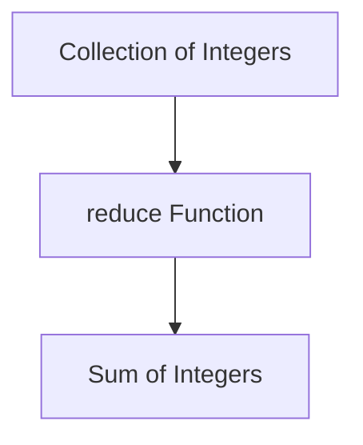

## 11.9.2 Optimizing Clojure Code

As experienced Java developers transitioning to Clojure, understanding how to optimize your Clojure code is crucial for achieving performance that meets or exceeds your expectations. In this section, we'll explore various techniques to enhance the performance of Clojure applications, focusing on type hints, avoiding reflection, and leveraging efficient data structures. We'll also discuss how to apply these optimizations to code that has been migrated from Java.

### Understanding Performance in Clojure

Before diving into specific optimization techniques, it's important to understand the performance characteristics of Clojure. Clojure runs on the Java Virtual Machine (JVM), which means it inherits many of the performance benefits and challenges associated with Java. However, Clojure's functional programming paradigm and immutable data structures introduce unique considerations.

#### Key Performance Considerations

1. **Immutability**: While immutability simplifies reasoning about code and enhances concurrency, it can introduce overhead due to the creation of new data structures. Clojure's persistent data structures are designed to mitigate this overhead through structural sharing.

2. **Dynamic Typing**: Clojure is dynamically typed, which can lead to performance overhead due to runtime type checks. Type hints can help alleviate this.

3. **Reflection**: Clojure's interop with Java can involve reflection, which is slower than direct method calls. Avoiding reflection is a key optimization strategy.

4. **Concurrency**: Clojure provides powerful concurrency primitives, but understanding their performance implications is essential for building efficient concurrent applications.

### Using Type Hints to Improve Performance

Type hints in Clojure provide the compiler with information about the expected types of expressions, allowing it to generate more efficient bytecode and avoid reflection.

#### Applying Type Hints

Type hints are specified using metadata. Here's an example of how to use type hints in a Clojure function:

```clojure
(defn add-integers
  "Adds two integers with type hints to avoid reflection."
  [^long a ^long b]
  (+ a b))
```

In this example, the `^long` type hints inform the compiler that `a` and `b` are of type `long`, enabling it to generate optimized bytecode.

#### Benefits of Type Hints

- **Avoid Reflection**: Type hints eliminate the need for reflection by providing the compiler with type information at compile time.
- **Improved Performance**: By avoiding reflection, type hints can significantly improve the performance of numerical computations and other operations.

### Avoiding Reflection

Reflection in Clojure occurs when the compiler cannot determine the types of objects at compile time, leading to slower method invocation. Avoiding reflection is crucial for optimizing performance.

#### Identifying Reflection

Clojure provides a way to identify reflection warnings during compilation. You can enable reflection warnings by setting the `*warn-on-reflection*` dynamic variable to `true`:

```clojure
(set! *warn-on-reflection* true)
```

This setting will cause the compiler to emit warnings whenever reflection is used, allowing you to identify and address these cases.

#### Strategies to Avoid Reflection

1. **Use Type Hints**: As discussed earlier, type hints are an effective way to avoid reflection.

2. **Explicit Method Calls**: When calling Java methods, use explicit method calls with type hints to avoid reflection. For example:

   ```clojure
   (.substring ^String "Hello, World!" 0 5)
   ```

3. **Avoid Dynamic Method Calls**: Avoid using dynamic method calls, such as `(.methodName obj)`, without type hints.

### Leveraging Efficient Data Structures

Clojure's persistent data structures are designed for efficiency, but choosing the right data structure for your use case is essential for optimal performance.

#### Persistent Data Structures

Clojure's core data structures—lists, vectors, maps, and sets—are persistent, meaning they share structure and are immutable. This design allows for efficient updates and access patterns.

#### Choosing the Right Data Structure

1. **Vectors vs. Lists**: Use vectors for indexed access and lists for sequential access. Vectors provide O(1) access time, while lists provide O(n) access time.

2. **Maps**: Use maps for key-value associations. Clojure maps are implemented as hash maps, providing efficient lookup times.

3. **Sets**: Use sets for collections of unique elements. Sets are implemented as hash sets, offering efficient membership tests.

#### Example: Optimizing Data Structure Usage

Consider a scenario where you need to frequently access elements by index. Using a vector is more efficient than a list:

```clojure
(def my-vector [1 2 3 4 5])
(nth my-vector 2) ; Efficient O(1) access
```

### Applying Optimizations to Migrated Code

When migrating Java code to Clojure, it's important to apply these optimization techniques to ensure the migrated code performs well.

#### Case Study: Migrating a Java Application

Let's consider a simple Java application that processes a list of integers and calculates their sum:

```java
public class SumCalculator {
    public static int calculateSum(List<Integer> numbers) {
        int sum = 0;
        for (int number : numbers) {
            sum += number;
        }
        return sum;
    }
}
```

#### Migrating to Clojure

Here's how you might migrate this code to Clojure, applying optimization techniques:

```clojure
(defn calculate-sum
  "Calculates the sum of a list of integers using optimized Clojure code."
  [numbers]
  (reduce + numbers))
```

In this Clojure version, we use the `reduce` function, which is idiomatic and efficient for summing a collection. The use of persistent data structures ensures efficient handling of the list.

### Try It Yourself

Experiment with the following code snippet by adding type hints and avoiding reflection:

```clojure
(defn multiply-integers
  "Multiplies two integers."
  [a b]
  (* a b))
```

### Diagrams and Visualizations

To further illustrate these concepts, let's use a diagram to visualize the flow of data through a higher-order function like `reduce`.



*Diagram 1: The flow of data through the `reduce` function to calculate the sum of integers.*

### Further Reading

For more information on optimizing Clojure code, consider exploring the following resources:

- [Official Clojure Documentation](https://clojure.org/reference/documentation)
- [ClojureDocs](https://clojuredocs.org/)
- [Clojure Performance Tips](https://clojure.org/guides/performance)

### Exercises

1. **Type Hinting Practice**: Add type hints to a function that calculates the product of two floating-point numbers.
2. **Reflection Avoidance**: Identify and eliminate reflection in a Clojure function that interacts with a Java library.
3. **Data Structure Selection**: Choose the appropriate data structure for a scenario where you need to frequently check for the presence of elements.

### Key Takeaways

- **Type Hints**: Use type hints to avoid reflection and improve performance.
- **Avoid Reflection**: Identify and eliminate reflection in your code for faster execution.
- **Efficient Data Structures**: Choose the right data structure for your use case to optimize performance.
- **Apply Optimizations**: Apply these techniques to migrated Java code to ensure optimal performance in Clojure.

By understanding and applying these optimization techniques, you'll be well-equipped to write performant Clojure code that leverages the strengths of the language and the JVM.

## Quiz Time!



### What is the primary benefit of using type hints in Clojure?

- [x] Avoiding reflection
- [ ] Improving code readability
- [ ] Simplifying syntax
- [ ] Enhancing security

> **Explanation:** Type hints help the Clojure compiler avoid reflection, which improves performance by allowing direct method calls.

### How can you enable reflection warnings in Clojure?

- [x] By setting `*warn-on-reflection*` to `true`
- [ ] By using the `:reflection` keyword
- [ ] By adding `:warn` to the project configuration
- [ ] By enabling `:warnings` in the REPL

> **Explanation:** Setting `*warn-on-reflection*` to `true` will cause the compiler to emit warnings whenever reflection is used.

### Which Clojure data structure provides O(1) access time for indexed elements?

- [x] Vector
- [ ] List
- [ ] Map
- [ ] Set

> **Explanation:** Vectors in Clojure provide O(1) access time for indexed elements, making them efficient for random access.

### What is the purpose of the `reduce` function in Clojure?

- [x] To aggregate elements of a collection
- [ ] To filter elements of a collection
- [ ] To map a function over a collection
- [ ] To sort elements of a collection

> **Explanation:** The `reduce` function is used to aggregate elements of a collection into a single value.

### Which of the following is a strategy to avoid reflection in Clojure?

- [x] Using explicit method calls with type hints
- [ ] Using dynamic method calls
- [x] Avoiding dynamic method calls without type hints
- [ ] Using reflection explicitly

> **Explanation:** Using explicit method calls with type hints and avoiding dynamic method calls without type hints are strategies to avoid reflection.

### What is a key characteristic of Clojure's persistent data structures?

- [x] They are immutable
- [ ] They are mutable
- [ ] They require manual memory management
- [ ] They are only available in ClojureScript

> **Explanation:** Clojure's persistent data structures are immutable, which allows for efficient updates through structural sharing.

### How can you identify reflection in your Clojure code?

- [x] By enabling reflection warnings
- [ ] By using a special reflection tool
- [x] By checking compiler output for warnings
- [ ] By running a reflection analysis script

> **Explanation:** Enabling reflection warnings and checking compiler output for warnings are ways to identify reflection in Clojure code.

### What is the benefit of using persistent data structures in Clojure?

- [x] Efficient updates through structural sharing
- [ ] Faster garbage collection
- [ ] Reduced memory usage
- [ ] Simplified syntax

> **Explanation:** Persistent data structures in Clojure allow for efficient updates through structural sharing, which minimizes memory usage.

### Which function is idiomatic for summing a collection in Clojure?

- [x] reduce
- [ ] map
- [ ] filter
- [ ] sort

> **Explanation:** The `reduce` function is idiomatic for aggregating elements, such as summing a collection, in Clojure.

### True or False: Type hints in Clojure can improve performance by avoiding runtime type checks.

- [x] True
- [ ] False

> **Explanation:** True. Type hints provide the compiler with type information, allowing it to generate optimized bytecode and avoid runtime type checks.


