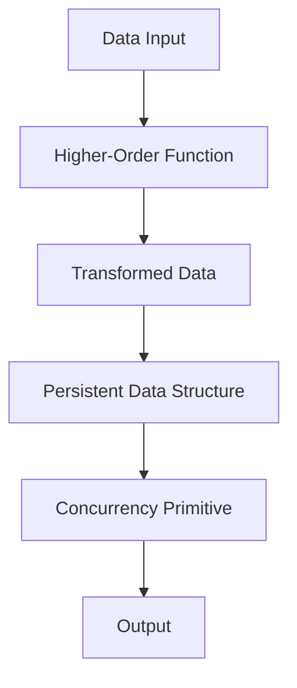

## 11.9.3 Leveraging Clojure's Strengths

As experienced Java developers, you are well-versed in object-oriented programming and imperative paradigms. Transitioning to Clojure, a functional programming language, offers a new set of tools and paradigms that can significantly enhance the performance and maintainability of your applications. In this section, we will explore how Clojure's unique features, such as persistent data structures and concurrency primitives, can be leveraged for performance gains. We will also provide examples of refactoring Java code to take advantage of these strengths.

### Understanding Persistent Data Structures

One of Clojure's most powerful features is its use of **persistent data structures**. Unlike traditional mutable data structures in Java, Clojure's data structures are immutable by default. This immutability offers several advantages, including thread safety and ease of reasoning about code.

#### What Are Persistent Data Structures?

Persistent data structures are immutable collections that preserve the previous version of themselves when modified. This is achieved through a technique called **structural sharing**, which allows new versions of data structures to share parts of their structure with old versions, minimizing the need for copying and thus improving performance.

**Example: Persistent Vector**

```clojure
(def original-vector [1 2 3])
(def new-vector (conj original-vector 4))

;; original-vector remains unchanged
;; new-vector is [1 2 3 4]
```

In this example, `original-vector` remains unchanged after `conj` is used to add an element, demonstrating immutability. The new vector shares most of its structure with the original, making the operation efficient.

#### Benefits Over Java's Mutable Collections

In Java, collections like `ArrayList` or `HashMap` are mutable, which can lead to issues in concurrent environments. Clojure's persistent data structures eliminate these issues by ensuring that data cannot be changed once created, thus avoiding race conditions and the need for complex synchronization mechanisms.

### Concurrency Primitives in Clojure

Clojure provides several concurrency primitives that simplify concurrent programming, making it easier to write efficient and safe multithreaded applications.

#### Atoms, Refs, and Agents

Clojure offers **atoms**, **refs**, and **agents** as tools for managing state changes in a concurrent environment.

- **Atoms**: Provide a way to manage shared, synchronous, independent state. They are ideal for managing simple state changes.

  ```clojure
  (def counter (atom 0))
  (swap! counter inc)
  ```

- **Refs**: Used for coordinated, synchronous state changes across multiple references, leveraging Software Transactional Memory (STM).

  ```clojure
  (def account1 (ref 100))
  (def account2 (ref 200))

  (dosync
    (alter account1 - 50)
    (alter account2 + 50))
  ```

- **Agents**: Designed for asynchronous state changes, allowing operations to be performed in the background.

  ```clojure
  (def agent-state (agent 0))
  (send agent-state inc)
  ```

#### Comparing with Java's Concurrency

Java provides concurrency through threads, locks, and synchronized blocks, which can be complex and error-prone. Clojure's concurrency primitives abstract away much of this complexity, allowing developers to focus on the logic rather than the mechanics of concurrency.

### Refactoring Java Code to Clojure

Let's explore how we can refactor Java code to leverage Clojure's strengths, focusing on immutability and concurrency.

#### Java Example: Mutable List

```java
import java.util.ArrayList;
import java.util.List;

public class MutableListExample {
    public static void main(String[] args) {
        List<Integer> numbers = new ArrayList<>();
        numbers.add(1);
        numbers.add(2);
        numbers.add(3);

        // Modify the list
        numbers.add(4);
        System.out.println(numbers);
    }
}
```

#### Clojure Refactor: Persistent Vector

```clojure
(def numbers [1 2 3])
(def updated-numbers (conj numbers 4))

;; numbers remains [1 2 3]
;; updated-numbers is [1 2 3 4]
```

In this refactor, we replace Java's mutable `ArrayList` with Clojure's immutable vector, which provides thread safety and avoids unintended side effects.

#### Java Example: Thread Synchronization

```java
public class Counter {
    private int count = 0;

    public synchronized void increment() {
        count++;
    }

    public synchronized int getCount() {
        return count;
    }
}
```

#### Clojure Refactor: Atom

```clojure
(def counter (atom 0))

(defn increment-counter []
  (swap! counter inc))

(defn get-count []
  @counter)
```

Here, we use an atom to manage state changes, eliminating the need for explicit synchronization and reducing the risk of concurrency-related bugs.

### Visualizing Data Flow and Concurrency

To better understand how data flows through Clojure's higher-order functions and concurrency models, let's visualize these concepts using diagrams.



**Diagram 1: Data Flow in Clojure**

This diagram illustrates the flow of data through a higher-order function, transformation into a persistent data structure, and management using a concurrency primitive, leading to the final output.

### Try It Yourself

Experiment with the following exercises to deepen your understanding of Clojure's strengths:

1. **Modify the Persistent Vector Example**: Add more elements to the vector and observe how the original vector remains unchanged.

2. **Create a Simple Bank Account System**: Use refs to simulate transactions between accounts, ensuring consistency with STM.

3. **Implement a Concurrent Counter**: Use an agent to increment a counter asynchronously and observe how it handles state changes.

### Exercises and Practice Problems

1. **Refactor a Java Collection**: Take a Java program that uses a mutable collection and refactor it to use Clojure's persistent data structures.

2. **Concurrency Challenge**: Implement a multithreaded application in Java and refactor it using Clojure's concurrency primitives. Compare the complexity and performance of both implementations.

3. **Build a Simple Web Server**: Use Clojure's Ring library to create a basic web server and explore how concurrency primitives can be used to handle requests efficiently.

### Key Takeaways

- **Immutability**: Clojure's persistent data structures provide thread safety and ease of reasoning, reducing bugs and improving performance.
- **Concurrency**: Clojure's concurrency primitives simplify multithreaded programming, allowing developers to focus on application logic.
- **Refactoring**: Transitioning from Java to Clojure involves embracing immutability and leveraging concurrency primitives for cleaner, more efficient code.

By leveraging Clojure's strengths, you can create applications that are not only performant but also easier to maintain and reason about. As you continue your journey with Clojure, remember to embrace its functional programming paradigms and explore the vast ecosystem of libraries and tools available to enhance your development experience.

For further reading, explore the [Official Clojure Documentation](https://clojure.org/reference/documentation) and [ClojureDocs](https://clojuredocs.org/).

## Quiz: Mastering Clojure's Strengths for Performance



### What is a key benefit of Clojure's persistent data structures?

- [x] They provide immutability and structural sharing.
- [ ] They allow direct mutation of data.
- [ ] They require complex synchronization mechanisms.
- [ ] They are slower than Java's mutable collections.

> **Explanation:** Clojure's persistent data structures provide immutability and structural sharing, which enhance performance and thread safety.

### How do Clojure's atoms differ from Java's synchronized methods?

- [x] Atoms manage state changes without explicit synchronization.
- [ ] Atoms require locks for state changes.
- [ ] Atoms are slower than synchronized methods.
- [ ] Atoms cannot be used in concurrent environments.

> **Explanation:** Atoms manage state changes without explicit synchronization, simplifying concurrent programming.

### What is the purpose of Clojure's `dosync` block?

- [x] To manage coordinated state changes using refs.
- [ ] To perform asynchronous operations.
- [ ] To create immutable data structures.
- [ ] To define higher-order functions.

> **Explanation:** The `dosync` block is used to manage coordinated state changes using refs in Clojure's STM.

### Which Clojure primitive is best suited for asynchronous state changes?

- [x] Agents
- [ ] Atoms
- [ ] Refs
- [ ] Vars

> **Explanation:** Agents are designed for asynchronous state changes, allowing operations to be performed in the background.

### What is a common advantage of both Clojure's atoms and refs?

- [x] They provide a way to manage state changes safely.
- [ ] They require explicit locks for synchronization.
- [ ] They are mutable by default.
- [ ] They cannot be used in multithreaded applications.

> **Explanation:** Both atoms and refs provide a way to manage state changes safely in concurrent environments.

### How does Clojure's `conj` function differ from Java's `add` method in collections?

- [x] `conj` returns a new collection with the added element.
- [ ] `conj` modifies the collection in place.
- [ ] `conj` is slower than `add`.
- [ ] `conj` can only be used with lists.

> **Explanation:** `conj` returns a new collection with the added element, maintaining immutability.

### What is the role of structural sharing in Clojure's data structures?

- [x] To minimize copying and improve performance.
- [ ] To allow direct mutation of data.
- [ ] To require complex synchronization.
- [ ] To slow down data access.

> **Explanation:** Structural sharing minimizes copying and improves performance by sharing parts of the data structure.

### Which Clojure feature simplifies multithreaded programming compared to Java?

- [x] Concurrency primitives like atoms, refs, and agents.
- [ ] Mutable collections.
- [ ] Synchronized methods.
- [ ] Complex locking mechanisms.

> **Explanation:** Concurrency primitives like atoms, refs, and agents simplify multithreaded programming by abstracting away complex locking mechanisms.

### What is a benefit of using Clojure's STM with refs?

- [x] It ensures consistency in coordinated state changes.
- [ ] It allows direct mutation of data.
- [ ] It requires explicit locks.
- [ ] It is slower than traditional synchronization.

> **Explanation:** Clojure's STM with refs ensures consistency in coordinated state changes without explicit locks.

### True or False: Clojure's persistent data structures are inherently thread-safe.

- [x] True
- [ ] False

> **Explanation:** Clojure's persistent data structures are inherently thread-safe due to their immutability.


