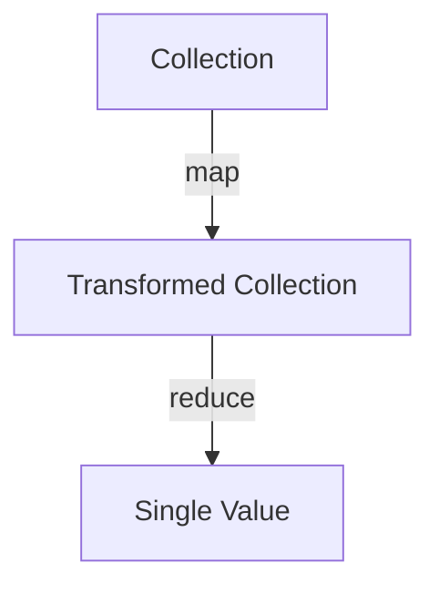

## 12.1.1 Introduction to Functional Patterns

As experienced Java developers, you are likely familiar with the concept of design patterns—reusable solutions to common problems in software design. In the object-oriented (OO) world, patterns like Singleton, Factory, and Observer are staples in the developer's toolkit. However, as we transition to functional programming (FP) with Clojure, we encounter a different set of patterns that align with the principles of immutability, higher-order functions, and declarative programming. This section introduces you to functional design patterns, highlighting their importance and how they differ from traditional OO patterns.

### Understanding Functional Design Patterns

Functional design patterns are abstractions that help solve recurring problems in functional programming. Unlike OO patterns, which often focus on object creation and interaction, functional patterns emphasize data transformation, function composition, and immutability. They leverage the core tenets of FP, such as first-class functions and pure functions, to create more predictable and maintainable code.

#### Key Characteristics of Functional Patterns

1. **Immutability**: Functional patterns often rely on immutable data structures, which prevent accidental state changes and simplify reasoning about code.

2. **Higher-Order Functions**: These patterns frequently use functions that take other functions as arguments or return them as results, enabling powerful abstractions and code reuse.

3. **Function Composition**: Combining simple functions to build more complex operations is a hallmark of functional patterns, promoting modularity and clarity.

4. **Declarative Style**: Functional patterns encourage a declarative approach, focusing on what to do rather than how to do it, which can lead to more concise and expressive code.

### Comparing Functional and Object-Oriented Patterns

To better understand functional patterns, let's compare them with their OO counterparts. In OO programming, patterns often revolve around class hierarchies and object interactions. For example, the Strategy pattern in OO involves defining a family of algorithms and making them interchangeable. In FP, this can be achieved more succinctly using higher-order functions.

#### Example: Strategy Pattern in Java

```java
// Java Strategy Pattern Example
interface Strategy {
    int execute(int a, int b);
}

class AddStrategy implements Strategy {
    public int execute(int a, int b) {
        return a + b;
    }
}

class Context {
    private Strategy strategy;

    public Context(Strategy strategy) {
        this.strategy = strategy;
    }

    public int executeStrategy(int a, int b) {
        return strategy.execute(a, b);
    }
}

// Usage
Context context = new Context(new AddStrategy());
int result = context.executeStrategy(5, 3); // Outputs 8
```

#### Example: Strategy Pattern in Clojure

```clojure
;; Clojure Strategy Pattern Example
(defn add-strategy [a b]
  (+ a b))

(defn execute-strategy [strategy a b]
  (strategy a b))

;; Usage
(def result (execute-strategy add-strategy 5 3)) ;; Outputs 8
```

In Clojure, we achieve the same functionality with fewer lines of code by leveraging first-class functions. The `add-strategy` is simply a function, and `execute-strategy` takes it as an argument, demonstrating the power and simplicity of functional patterns.

### Why Functional Patterns Matter in Clojure

Functional patterns are crucial in Clojure development for several reasons:

- **Simplicity and Clarity**: By focusing on pure functions and immutability, functional patterns reduce complexity, making code easier to understand and maintain.
- **Concurrency**: Immutability and statelessness make functional patterns naturally suited for concurrent programming, a key strength of Clojure.
- **Reusability**: Higher-order functions and function composition promote code reuse, allowing developers to build complex systems from simple, reusable components.

### Common Functional Patterns in Clojure

Let's explore some common functional patterns in Clojure:

#### 1. **Map-Reduce**

The Map-Reduce pattern is a powerful abstraction for processing collections. It involves two main operations: mapping a function over a collection to transform its elements and reducing the transformed elements to a single value.

```clojure
;; Map-Reduce Example in Clojure
(def numbers [1 2 3 4 5])

(defn square [x]
  (* x x))

(defn sum [a b]
  (+ a b))

(def squared-sum (reduce sum (map square numbers))) ;; Outputs 55
```

In this example, we map the `square` function over the `numbers` collection and then reduce the results using the `sum` function.

#### 2. **Filter-Transform**

This pattern involves filtering a collection based on a predicate and then transforming the filtered elements.

```clojure
;; Filter-Transform Example in Clojure
(defn even? [x]
  (zero? (mod x 2)))

(def even-squares (map square (filter even? numbers))) ;; Outputs [4 16]
```

Here, we filter the `numbers` collection to retain only even numbers and then map the `square` function over the filtered results.

#### 3. **Function Composition**

Function composition allows us to combine multiple functions into a single operation, enhancing modularity and readability.

```clojure
;; Function Composition Example in Clojure
(defn add-one [x]
  (+ x 1))

(defn square-and-add-one [x]
  ((comp add-one square) x))

(square-and-add-one 3) ;; Outputs 10
```

The `comp` function composes `add-one` and `square`, creating a new function that applies both operations in sequence.

### Visualizing Functional Patterns

To better understand how data flows through these patterns, let's use a diagram to illustrate the Map-Reduce pattern:



**Diagram Explanation**: This diagram shows the flow of data in the Map-Reduce pattern. We start with a collection, apply a mapping function to transform its elements, and then reduce the transformed elements to a single value.

### Try It Yourself

To deepen your understanding of functional patterns in Clojure, try modifying the examples above:

- Change the `square` function to cube the numbers instead.
- Use a different predicate in the Filter-Transform example, such as filtering for numbers greater than 3.
- Compose additional functions in the Function Composition example to create more complex operations.

### Further Reading

For more information on functional programming and design patterns in Clojure, consider exploring the following resources:

- [Official Clojure Documentation](https://clojure.org/)
- [ClojureDocs](https://clojuredocs.org/)
- [Functional Programming in Clojure](https://www.braveclojure.com/)

### Exercises

1. Implement a Clojure function that takes a collection of strings and returns a collection of their lengths using the Map-Reduce pattern.
2. Create a function that filters out negative numbers from a collection and then doubles the remaining numbers using the Filter-Transform pattern.
3. Write a composed function that takes a number, subtracts 2, and then multiplies the result by 5.

### Key Takeaways

- Functional design patterns in Clojure emphasize immutability, higher-order functions, and function composition.
- These patterns differ from OO patterns by focusing on data transformation and declarative programming.
- Understanding and applying functional patterns can lead to more concise, maintainable, and concurrent code.

Now that we've introduced functional patterns in Clojure, let's explore how these concepts can be applied to build robust and efficient applications.

## Quiz: Test Your Knowledge on Functional Patterns in Clojure



### What is a key characteristic of functional design patterns?

- [x] Immutability
- [ ] Inheritance
- [ ] Polymorphism
- [ ] Encapsulation

> **Explanation:** Functional design patterns emphasize immutability, which prevents accidental state changes and simplifies reasoning about code.


### How does the Strategy pattern differ in Clojure compared to Java?

- [x] It uses first-class functions instead of interfaces.
- [ ] It requires more lines of code.
- [ ] It relies on class hierarchies.
- [ ] It uses inheritance.

> **Explanation:** In Clojure, the Strategy pattern uses first-class functions, making it more concise and eliminating the need for interfaces and class hierarchies.


### Which function is used in Clojure for function composition?

- [x] `comp`
- [ ] `map`
- [ ] `reduce`
- [ ] `filter`

> **Explanation:** The `comp` function in Clojure is used to compose multiple functions into a single operation.


### What does the Map-Reduce pattern involve?

- [x] Mapping a function over a collection and reducing the results.
- [ ] Filtering a collection and transforming the results.
- [ ] Composing multiple functions.
- [ ] Using inheritance to create algorithms.

> **Explanation:** The Map-Reduce pattern involves mapping a function over a collection to transform its elements and then reducing the transformed elements to a single value.


### Which of the following is a benefit of functional patterns?

- [x] Simplicity and clarity
- [ ] Increased complexity
- [ ] More boilerplate code
- [ ] Dependence on class hierarchies

> **Explanation:** Functional patterns reduce complexity by focusing on pure functions and immutability, leading to simpler and clearer code.


### What is the purpose of higher-order functions in functional patterns?

- [x] To take other functions as arguments or return them as results.
- [ ] To create class hierarchies.
- [ ] To manage state changes.
- [ ] To enforce encapsulation.

> **Explanation:** Higher-order functions in functional patterns allow functions to take other functions as arguments or return them as results, enabling powerful abstractions and code reuse.


### How does immutability benefit concurrent programming in Clojure?

- [x] It prevents accidental state changes and simplifies reasoning about code.
- [ ] It increases the complexity of managing state.
- [ ] It requires more synchronization mechanisms.
- [ ] It relies on mutable data structures.

> **Explanation:** Immutability prevents accidental state changes, making it easier to reason about code and naturally suited for concurrent programming.


### What is a common use case for the Filter-Transform pattern?

- [x] Filtering a collection based on a predicate and transforming the filtered elements.
- [ ] Mapping a function over a collection and reducing the results.
- [ ] Composing multiple functions.
- [ ] Using inheritance to create algorithms.

> **Explanation:** The Filter-Transform pattern involves filtering a collection based on a predicate and then transforming the filtered elements.


### Which of the following is NOT a characteristic of functional patterns?

- [ ] Immutability
- [ ] Higher-Order Functions
- [ ] Function Composition
- [x] Inheritance

> **Explanation:** Inheritance is a characteristic of object-oriented patterns, not functional patterns.


### True or False: Functional patterns in Clojure often rely on mutable data structures.

- [ ] True
- [x] False

> **Explanation:** Functional patterns in Clojure rely on immutable data structures, which prevent accidental state changes and simplify reasoning about code.


