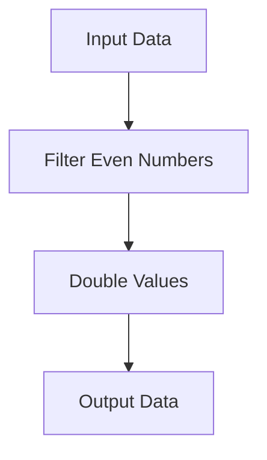

## 12.1.2 Benefits of Functional Design Patterns

As experienced Java developers, you're likely familiar with the object-oriented design patterns that have been instrumental in structuring and organizing code. However, as you transition to Clojure, a functional programming language, you'll discover a new set of design patterns that offer unique benefits. In this section, we'll explore the advantages of functional design patterns, focusing on improved code reuse, composability, and easier reasoning about code behavior. We'll also discuss how these patterns align with Clojure's idioms and enhance software development.

### Understanding Functional Design Patterns

Functional design patterns are a set of best practices and solutions to common problems in software design, tailored to the principles of functional programming. Unlike object-oriented patterns, which often revolve around classes and objects, functional patterns emphasize the use of pure functions, immutability, and higher-order functions.

#### Key Characteristics of Functional Patterns

- **Immutability**: Functional patterns leverage immutable data structures, reducing the risk of side effects and making code easier to reason about.
- **First-Class Functions**: Functions are treated as first-class citizens, allowing them to be passed as arguments, returned from other functions, and stored in data structures.
- **Higher-Order Functions**: These are functions that take other functions as arguments or return them as results, enabling powerful abstractions and code reuse.
- **Declarative Style**: Functional patterns encourage a declarative style of programming, where the focus is on what to do rather than how to do it.

### Benefits of Functional Patterns

#### 1. Improved Code Reuse

Functional patterns promote code reuse by encouraging the creation of small, composable functions that can be easily combined to form more complex operations. This modular approach allows developers to build libraries of reusable functions that can be applied across different projects.

**Example: Reusable Transformation Functions**

Consider a scenario where you need to transform a list of numbers by doubling each value. In Clojure, you can create a reusable function that performs this transformation:

```clojure
(defn double-values [numbers]
  (map #(* 2 %) numbers))

;; Usage
(double-values [1 2 3 4 5]) ; => (2 4 6 8 10)
```

In this example, the `double-values` function is a reusable component that can be applied to any list of numbers. By leveraging higher-order functions like `map`, we can easily adapt this pattern to other transformations.

#### 2. Enhanced Composability

Composability is a hallmark of functional programming, allowing developers to build complex functionality by composing simple functions. This approach leads to cleaner, more maintainable code and reduces duplication.

**Example: Composing Functions**

Let's say you want to filter a list of numbers to include only even values and then double them. In Clojure, you can achieve this by composing functions:

```clojure
(defn even? [n]
  (zero? (mod n 2)))

(defn double-values [numbers]
  (map #(* 2 %) numbers))

(defn process-numbers [numbers]
  (->> numbers
       (filter even?)
       (double-values)))

;; Usage
(process-numbers [1 2 3 4 5 6]) ; => (4 8 12)
```

Here, the `process-numbers` function composes `filter` and `double-values` to achieve the desired transformation. This composability makes it easy to extend or modify functionality without altering existing code.

#### 3. Easier Reasoning About Code Behavior

Functional patterns simplify reasoning about code behavior by minimizing side effects and emphasizing pure functions. Pure functions, which always produce the same output for a given input and have no side effects, make it easier to predict and understand code behavior.

**Example: Pure Function**

Consider a function that calculates the sum of a list of numbers:

```clojure
(defn sum [numbers]
  (reduce + numbers))

;; Usage
(sum [1 2 3 4 5]) ; => 15
```

The `sum` function is pure because it depends solely on its input and produces a consistent output. This predictability simplifies debugging and testing.

### Aligning with Clojure's Idioms

Clojure's design encourages the use of functional patterns through its emphasis on immutability, first-class functions, and a rich set of higher-order functions. By adopting these patterns, you can write idiomatic Clojure code that is concise, expressive, and robust.

#### Immutability and Persistent Data Structures

Clojure's persistent data structures provide a foundation for immutability, enabling efficient updates without modifying the original data. This immutability aligns with functional patterns by reducing side effects and enhancing code reliability.

**Example: Persistent Data Structures**

```clojure
(def original-list [1 2 3])
(def updated-list (conj original-list 4))

;; original-list remains unchanged
original-list ; => [1 2 3]
updated-list ; => [1 2 3 4]
```

In this example, the `conj` function adds an element to the list without altering the original, demonstrating the power of persistent data structures.

#### Higher-Order Functions and Function Composition

Clojure's extensive library of higher-order functions, such as `map`, `filter`, and `reduce`, facilitates function composition and code reuse. By leveraging these functions, you can build complex operations from simple components.

**Example: Function Composition with `comp`**

```clojure
(defn square [n]
  (* n n))

(defn increment [n]
  (+ n 1))

(def square-and-increment (comp increment square))

;; Usage
(square-and-increment 3) ; => 10
```

The `comp` function composes `square` and `increment`, creating a new function that applies both transformations in sequence.

### Comparing Functional Patterns with Java

As Java developers, you may be accustomed to object-oriented patterns like the Singleton, Factory, or Observer patterns. While these patterns are effective in certain contexts, functional patterns offer distinct advantages in terms of simplicity, flexibility, and expressiveness.

#### Java vs. Clojure: A Comparison

| Aspect                     | Java (Object-Oriented)                          | Clojure (Functional)                           |
|----------------------------|-------------------------------------------------|------------------------------------------------|
| **State Management**       | Mutable state, often managed through objects   | Immutable state, managed through functions    |
| **Code Reuse**             | Inheritance and interfaces                      | Higher-order functions and composition        |
| **Concurrency**            | Thread synchronization, locks                   | Immutable data, STM, and concurrency primitives|
| **Design Patterns**        | Class-based patterns (e.g., Singleton)          | Function-based patterns (e.g., Composition)   |

### Try It Yourself: Experimenting with Functional Patterns

To deepen your understanding of functional patterns, try modifying the examples provided:

1. **Create a new transformation function** that triples each value in a list and compose it with the `even?` filter.
2. **Implement a function** that calculates the factorial of a number using recursion and compare it with an iterative approach.
3. **Explore the use of transducers** to optimize the `process-numbers` function for large datasets.

### Visualizing Functional Patterns

To better understand the flow of data through functional patterns, let's visualize the process using a Mermaid.js diagram:



**Diagram Description**: This flowchart illustrates the process of filtering even numbers and doubling their values, highlighting the composability of functional patterns.

### Further Reading and Resources

For more information on functional patterns and Clojure, consider exploring the following resources:

- [Official Clojure Documentation](https://clojure.org/)
- [ClojureDocs](https://clojuredocs.org/)
- [Functional Programming in Clojure](https://www.braveclojure.com/)

### Exercises and Practice Problems

1. **Exercise 1**: Implement a function that filters out odd numbers from a list and then calculates the sum of the remaining even numbers.
2. **Exercise 2**: Create a pipeline of functions that transforms a list of strings by trimming whitespace, converting to uppercase, and filtering out empty strings.
3. **Exercise 3**: Write a function that takes a list of numbers and returns a new list with each number squared, using a combination of `map` and `comp`.

### Key Takeaways

- Functional patterns in Clojure offer improved code reuse, enhanced composability, and easier reasoning about code behavior.
- These patterns align with Clojure's idioms, emphasizing immutability, higher-order functions, and function composition.
- By adopting functional patterns, you can write concise, expressive, and robust Clojure code that leverages the language's strengths.

Now that we've explored the benefits of functional patterns, let's apply these concepts to enhance your Clojure applications and embrace the power of functional programming.

## Quiz: Mastering Functional Patterns in Clojure



### What is a key benefit of using functional design patterns in Clojure?

- [x] Improved code reuse
- [ ] Increased use of inheritance
- [ ] Greater reliance on mutable state
- [ ] More complex code structures

> **Explanation:** Functional design patterns promote improved code reuse by encouraging the creation of small, composable functions.

### How do functional patterns enhance composability?

- [x] By allowing functions to be easily combined
- [ ] By increasing the complexity of functions
- [ ] By relying on mutable state
- [ ] By using inheritance

> **Explanation:** Functional patterns enhance composability by allowing functions to be easily combined to form more complex operations.

### What is a characteristic of pure functions?

- [x] They have no side effects
- [ ] They rely on mutable state
- [ ] They produce different outputs for the same input
- [ ] They require inheritance

> **Explanation:** Pure functions have no side effects and always produce the same output for a given input.

### Which Clojure feature supports immutability?

- [x] Persistent data structures
- [ ] Mutable objects
- [ ] Inheritance
- [ ] Thread synchronization

> **Explanation:** Clojure's persistent data structures support immutability by enabling efficient updates without modifying the original data.

### What is a higher-order function?

- [x] A function that takes other functions as arguments or returns them
- [ ] A function that relies on mutable state
- [ ] A function that uses inheritance
- [ ] A function that has side effects

> **Explanation:** A higher-order function is one that takes other functions as arguments or returns them as results.

### How does Clojure's `comp` function work?

- [x] It composes multiple functions into a single function
- [ ] It creates a new class
- [ ] It modifies mutable state
- [ ] It synchronizes threads

> **Explanation:** Clojure's `comp` function composes multiple functions into a single function, applying them in sequence.

### What is a key difference between Java and Clojure regarding state management?

- [x] Java uses mutable state, while Clojure uses immutable state
- [ ] Java uses immutable state, while Clojure uses mutable state
- [ ] Both use mutable state
- [ ] Both use immutable state

> **Explanation:** Java typically uses mutable state, while Clojure emphasizes immutable state through its persistent data structures.

### Which of the following is an example of a functional pattern?

- [x] Function composition
- [ ] Singleton pattern
- [ ] Factory pattern
- [ ] Observer pattern

> **Explanation:** Function composition is a functional pattern that involves combining simple functions to build more complex operations.

### What is the role of higher-order functions in functional programming?

- [x] They enable powerful abstractions and code reuse
- [ ] They increase reliance on mutable state
- [ ] They require inheritance
- [ ] They complicate code structures

> **Explanation:** Higher-order functions enable powerful abstractions and code reuse by allowing functions to be passed as arguments or returned as results.

### True or False: Functional patterns in Clojure align with the language's idioms.

- [x] True
- [ ] False

> **Explanation:** Functional patterns align with Clojure's idioms, emphasizing immutability, higher-order functions, and function composition.


