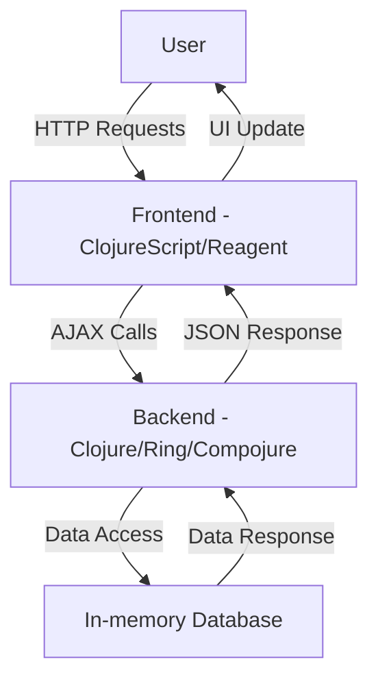

## 12.10.1 Case Study: Building a Web Application

In this case study, we will explore the process of building a web application using Clojure, focusing on the application of functional design patterns. We'll walk through the architecture, design, and implementation of a simple yet comprehensive web application. This guide is tailored for experienced Java developers transitioning to Clojure, leveraging your existing knowledge to highlight similarities and differences between the two languages.

### Overview of the Web Application

Our web application will be a simple task management system, allowing users to create, update, delete, and list tasks. The application will be built using Clojure for the backend and ClojureScript for the frontend. We'll use popular libraries such as Ring, Compojure, and Reagent to facilitate development.

### Architectural Design

The architecture of our web application will follow a typical client-server model:

- **Frontend**: Built with ClojureScript and Reagent, providing a reactive user interface.
- **Backend**: Developed in Clojure, exposing RESTful APIs using Ring and Compojure.
- **Database**: A simple in-memory database using Clojure's persistent data structures.

#### Diagram: Application Architecture



*Caption: The architecture of the task management web application, illustrating the flow of data between the user, frontend, backend, and database.*

### Setting Up the Development Environment

Before diving into the code, let's set up our development environment. Ensure you have the following installed:

- **Java**: As Clojure runs on the JVM, a Java installation is necessary.
- **Clojure**: Install Clojure using [Clojure CLI tools](https://clojure.org/guides/getting_started).
- **Leiningen**: A build automation tool for Clojure, which simplifies project management.
- **Node.js**: Required for building ClojureScript applications.

#### Installing Leiningen

Leiningen is a popular tool for managing Clojure projects. To install it, follow these steps:

1. Download the `lein` script from [Leiningen's official site](https://leiningen.org/).
2. Place the script in a directory included in your system's `PATH`.
3. Run `lein` in your terminal to download the necessary files.

### Backend Development with Clojure

Let's start by setting up the backend of our application. We'll use Ring and Compojure to handle HTTP requests and define routes.

#### Creating the Project

Create a new Leiningen project:

```bash
lein new app task-manager
```

This command generates a new Clojure application with a basic project structure.

#### Defining Routes with Compojure

Compojure is a routing library for Ring. It allows us to define routes in a concise and readable manner.

```clojure
(ns task-manager.core
  (:require [compojure.core :refer :all]
            [compojure.route :as route]
            [ring.adapter.jetty :refer [run-jetty]]
            [ring.middleware.json :refer [wrap-json-response wrap-json-body]]))

(defroutes app-routes
  (GET "/tasks" [] (get-tasks))
  (POST "/tasks" req (create-task (:body req)))
  (PUT "/tasks/:id" [id :as req] (update-task id (:body req)))
  (DELETE "/tasks/:id" [id] (delete-task id))
  (route/not-found "Not Found"))

(def app
  (-> app-routes
      wrap-json-response
      wrap-json-body))

(defn -main []
  (run-jetty app {:port 3000 :join? false}))
```

*Explanation*: This code defines a simple RESTful API with routes for managing tasks. The `wrap-json-response` and `wrap-json-body` middleware handle JSON serialization and deserialization.

#### Implementing Task Management Logic

Let's implement the functions for managing tasks. We'll use an atom to store tasks in memory.

```clojure
(def tasks (atom {}))

(defn get-tasks []
  {:status 200 :body @tasks})

(defn create-task [task]
  (let [id (str (java.util.UUID/randomUUID))]
    (swap! tasks assoc id task)
    {:status 201 :body (assoc task :id id)}))

(defn update-task [id task]
  (if-let [existing-task (@tasks id)]
    (do
      (swap! tasks assoc id (merge existing-task task))
      {:status 200 :body (assoc task :id id)})
    {:status 404 :body "Task not found"}))

(defn delete-task [id]
  (if (@tasks id)
    (do
      (swap! tasks dissoc id)
      {:status 204})
    {:status 404 :body "Task not found"}))
```

*Explanation*: We use an atom to manage the state of tasks. Atoms provide a way to manage shared, synchronous, independent state. The `swap!` function is used to update the state atomically.

### Frontend Development with ClojureScript

Now, let's build the frontend using ClojureScript and Reagent, a ClojureScript interface to React.

#### Setting Up ClojureScript

Add the following dependencies to your `project.clj` file:

```clojure
:dependencies [[org.clojure/clojure "1.10.3"]
               [org.clojure/clojurescript "1.10.844"]
               [reagent "1.1.0"]]
```

#### Creating the User Interface

We'll create a simple UI to interact with our task management API.

```clojure
(ns task-manager.core
  (:require [reagent.core :as r]
            [ajax.core :refer [GET POST PUT DELETE]]))

(defonce tasks (r/atom []))

(defn fetch-tasks []
  (GET "/tasks"
       {:handler #(reset! tasks %)
        :error-handler #(js/console.error "Failed to fetch tasks")}))

(defn task-list []
  [:ul
   (for [task @tasks]
     ^{:key (:id task)}
     [:li (:name task)])])

(defn app []
  [:div
   [:h1 "Task Manager"]
   [task-list]])

(defn init []
  (fetch-tasks)
  (r/render [app] (.getElementById js/document "app")))
```

*Explanation*: This code defines a simple Reagent component that fetches tasks from the backend and displays them in a list. The `fetch-tasks` function uses AJAX to retrieve tasks from the server.

### Integrating Frontend and Backend

To integrate the frontend and backend, we'll use CORS (Cross-Origin Resource Sharing) to allow the frontend to communicate with the backend.

#### Enabling CORS

Add the `ring-cors` middleware to your backend:

```clojure
:dependencies [[ring-cors "0.1.13"]]
```

```clojure
(ns task-manager.core
  (:require [ring.middleware.cors :refer [wrap-cors]]))

(def app
  (-> app-routes
      wrap-json-response
      wrap-json-body
      (wrap-cors :access-control-allow-origin [#"http://localhost:3000"]
                 :access-control-allow-methods [:get :post :put :delete])))
```

*Explanation*: The `wrap-cors` middleware configures CORS to allow requests from the frontend running on `localhost:3000`.

### Deploying the Application

For deployment, we'll package the application as a standalone JAR file using Leiningen.

#### Packaging the Application

Add the following to your `project.clj`:

```clojure
:main ^:skip-aot task-manager.core
:uberjar-name "task-manager.jar"
```

Run the following command to create the JAR file:

```bash
lein uberjar
```

This command packages the application and its dependencies into a single JAR file, ready for deployment.

### Summary and Key Takeaways

In this case study, we've built a simple web application using Clojure and ClojureScript, applying functional design patterns to structure our codebase. We've explored the use of atoms for state management, Reagent for building reactive UIs, and Compojure for defining RESTful APIs. By leveraging Clojure's functional programming paradigm, we've created a maintainable and scalable application.

### Try It Yourself

Experiment with the code by adding new features, such as user authentication or task categorization. Modify the UI to include additional components or improve the styling. Consider integrating a persistent database to store tasks permanently.

### Further Reading

- [Clojure Documentation](https://clojure.org/reference/documentation)
- [ClojureScript Documentation](https://clojurescript.org/)
- [Reagent Documentation](https://reagent-project.github.io/)

### Exercises

1. Extend the task management application to include user authentication.
2. Implement a feature to categorize tasks and filter them by category.
3. Integrate a persistent database, such as PostgreSQL, to store tasks.

---

## Quiz: Building a Web Application with Clojure



### What is the primary purpose of using Compojure in a Clojure web application?

- [x] To define routes and handle HTTP requests
- [ ] To manage application state
- [ ] To render HTML templates
- [ ] To perform database operations

> **Explanation:** Compojure is a routing library used to define routes and handle HTTP requests in Clojure web applications.


### Which ClojureScript library is used to create reactive user interfaces?

- [x] Reagent
- [ ] Ring
- [ ] Compojure
- [ ] Leiningen

> **Explanation:** Reagent is a ClojureScript library that provides a simple interface to React for building reactive user interfaces.


### What is the role of atoms in Clojure?

- [x] To manage shared, synchronous, independent state
- [ ] To handle asynchronous tasks
- [ ] To define routes in a web application
- [ ] To perform database transactions

> **Explanation:** Atoms in Clojure are used to manage shared, synchronous, independent state, allowing for atomic updates.


### How do you enable CORS in a Clojure web application?

- [x] By using the `ring-cors` middleware
- [ ] By configuring the web server
- [ ] By modifying the HTML headers
- [ ] By using Reagent

> **Explanation:** The `ring-cors` middleware is used to enable CORS in a Clojure web application, allowing cross-origin requests.


### What command is used to create a new Leiningen project?

- [x] `lein new app project-name`
- [ ] `lein create project-name`
- [ ] `lein init project-name`
- [ ] `lein start project-name`

> **Explanation:** The `lein new app project-name` command is used to create a new Leiningen project with a basic structure.


### Which function is used to update the state of an atom in Clojure?

- [x] `swap!`
- [ ] `reset!`
- [ ] `update!`
- [ ] `modify!`

> **Explanation:** The `swap!` function is used to update the state of an atom in Clojure, applying a function to the current state.


### What is the purpose of the `wrap-json-response` middleware?

- [x] To handle JSON serialization of responses
- [ ] To manage application state
- [ ] To define routes in a web application
- [ ] To perform database operations

> **Explanation:** The `wrap-json-response` middleware is used to handle JSON serialization of responses in a Clojure web application.


### Which tool is used to package a Clojure application as a standalone JAR file?

- [x] Leiningen
- [ ] Reagent
- [ ] Compojure
- [ ] Ring

> **Explanation:** Leiningen is a build automation tool used to package Clojure applications as standalone JAR files.


### What is the primary advantage of using functional design patterns in Clojure?

- [x] Improved code maintainability and scalability
- [ ] Faster execution speed
- [ ] Easier integration with Java
- [ ] Simplified syntax

> **Explanation:** Functional design patterns in Clojure improve code maintainability and scalability by promoting immutability and pure functions.


### True or False: ClojureScript is used to build the backend of a web application.

- [ ] True
- [x] False

> **Explanation:** ClojureScript is used to build the frontend of a web application, while Clojure is used for the backend.


