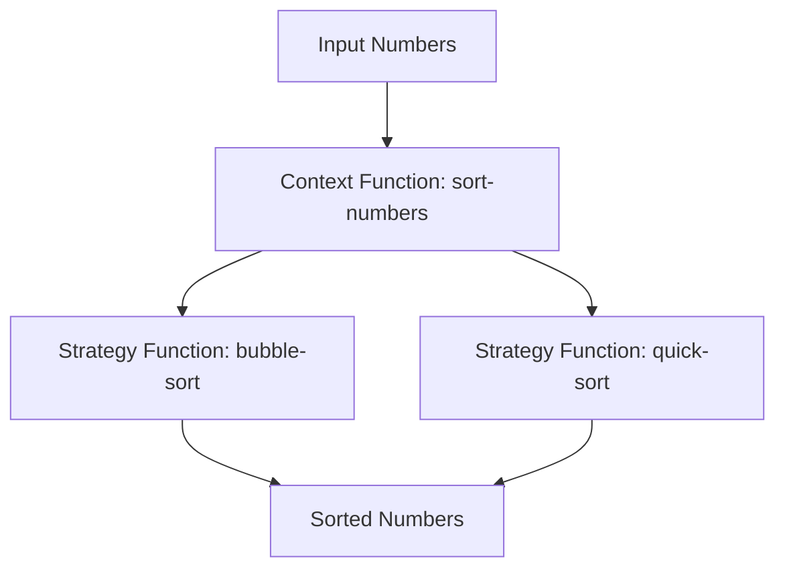

## 12.2.1 Understanding the Strategy Pattern

In the realm of software design, the **Strategy Pattern** is a powerful tool that allows developers to define a family of algorithms, encapsulate each one, and make them interchangeable. This pattern is particularly useful when you want to select an algorithm's behavior at runtime. In this section, we'll explore how the Strategy Pattern is traditionally implemented in object-oriented programming (OOP) with Java and how it can be adapted to functional programming using Clojure.

### The Strategy Pattern in Java

In Java, the Strategy Pattern is typically implemented using interfaces and classes. The pattern involves defining a strategy interface that declares a method for executing an algorithm. Concrete strategy classes implement this interface, providing specific algorithm implementations. The context class maintains a reference to a strategy object and delegates the algorithm execution to the strategy object.

#### Java Example: Strategy Pattern

Let's consider a simple example where we have different strategies for sorting a list of integers.

```java
// Strategy interface
interface SortStrategy {
    void sort(int[] numbers);
}

// Concrete strategy for bubble sort
class BubbleSortStrategy implements SortStrategy {
    @Override
    public void sort(int[] numbers) {
        // Bubble sort implementation
        for (int i = 0; i < numbers.length - 1; i++) {
            for (int j = 0; j < numbers.length - i - 1; j++) {
                if (numbers[j] > numbers[j + 1]) {
                    int temp = numbers[j];
                    numbers[j] = numbers[j + 1];
                    numbers[j + 1] = temp;
                }
            }
        }
    }
}

// Concrete strategy for quick sort
class QuickSortStrategy implements SortStrategy {
    @Override
    public void sort(int[] numbers) {
        // Quick sort implementation
        quickSort(numbers, 0, numbers.length - 1);
    }

    private void quickSort(int[] numbers, int low, int high) {
        if (low < high) {
            int pi = partition(numbers, low, high);
            quickSort(numbers, low, pi - 1);
            quickSort(numbers, pi + 1, high);
        }
    }

    private int partition(int[] numbers, int low, int high) {
        int pivot = numbers[high];
        int i = (low - 1);
        for (int j = low; j < high; j++) {
            if (numbers[j] <= pivot) {
                i++;
                int temp = numbers[i];
                numbers[i] = numbers[j];
                numbers[j] = temp;
            }
        }
        int temp = numbers[i + 1];
        numbers[i + 1] = numbers[high];
        numbers[high] = temp;
        return i + 1;
    }
}

// Context class
class SortContext {
    private SortStrategy strategy;

    public SortContext(SortStrategy strategy) {
        this.strategy = strategy;
    }

    public void setStrategy(SortStrategy strategy) {
        this.strategy = strategy;
    }

    public void executeStrategy(int[] numbers) {
        strategy.sort(numbers);
    }
}
```

In this example, `SortStrategy` is the strategy interface, `BubbleSortStrategy` and `QuickSortStrategy` are concrete strategies, and `SortContext` is the context class that uses a strategy to sort numbers.

### The Strategy Pattern in Clojure

In Clojure, we can leverage the power of **higher-order functions** to implement the Strategy Pattern. Instead of creating multiple classes, we define functions for each strategy and pass them as arguments to other functions. This approach aligns with Clojure's functional programming paradigm, where functions are first-class citizens.

#### Clojure Example: Strategy Pattern

Let's translate the Java example into Clojure.

```clojure
;; Define a function for bubble sort
(defn bubble-sort [numbers]
  (let [n (count numbers)]
    (loop [i 0
           nums numbers]
      (if (< i (dec n))
        (recur (inc i)
               (loop [j 0
                      nums nums]
                 (if (< j (- n i 1))
                   (if (> (nums j) (nums (inc j)))
                     (recur (inc j) (assoc nums j (nums (inc j)) (inc j) (nums j)))
                     (recur (inc j) nums))
                   nums)))
        nums))))

;; Define a function for quick sort
(defn quick-sort [numbers]
  (if (empty? numbers)
    numbers
    (let [pivot (first numbers)
          rest (rest numbers)]
      (concat
       (quick-sort (filter #(<= % pivot) rest))
       [pivot]
       (quick-sort (filter #(> % pivot) rest))))))

;; Context function that takes a sorting strategy
(defn sort-numbers [strategy numbers]
  (strategy numbers))

;; Usage
(def numbers [5 3 8 6 2])

;; Using bubble sort strategy
(println "Bubble Sort:" (sort-numbers bubble-sort numbers))

;; Using quick sort strategy
(println "Quick Sort:" (sort-numbers quick-sort numbers))
```

In this Clojure example, `bubble-sort` and `quick-sort` are functions that implement different sorting algorithms. The `sort-numbers` function acts as the context, taking a strategy function and a list of numbers to sort.

### Comparing Java and Clojure Implementations

The Java implementation of the Strategy Pattern relies on interfaces and classes to encapsulate algorithms, while the Clojure implementation uses functions. This difference highlights a key advantage of functional programming: **simplicity and flexibility**. In Clojure, we can easily switch strategies by passing different functions, without the need for additional classes or interfaces.

#### Key Differences:

- **Encapsulation**: In Java, algorithms are encapsulated within classes, whereas in Clojure, they are encapsulated within functions.
- **Flexibility**: Clojure's approach allows for more flexible and concise code, as functions can be easily passed around and composed.
- **Boilerplate**: Java requires more boilerplate code to define interfaces and classes, while Clojure's functional approach reduces boilerplate significantly.

### Advantages of the Strategy Pattern in Clojure

1. **Code Reusability**: By defining algorithms as functions, we can easily reuse them across different parts of our application.
2. **Interchangeability**: Functions can be passed as arguments, allowing us to change behavior at runtime without modifying existing code.
3. **Simplicity**: Clojure's functional approach simplifies the implementation of design patterns, reducing complexity and improving readability.

### Try It Yourself

To deepen your understanding of the Strategy Pattern in Clojure, try modifying the code examples:

- Implement a new sorting strategy, such as merge sort, and integrate it into the `sort-numbers` function.
- Experiment with different data structures, such as vectors or lists, and observe how the sorting algorithms behave.
- Create a new context function that applies multiple strategies in sequence, such as sorting and then filtering the numbers.

### Diagram: Strategy Pattern Flow in Clojure

Below is a diagram illustrating the flow of data through the Strategy Pattern in Clojure, using higher-order functions.



*Diagram Caption*: This diagram shows how the `sort-numbers` function acts as a context, taking an input list of numbers and a strategy function (either `bubble-sort` or `quick-sort`) to produce sorted numbers.

### Further Reading

For more information on the Strategy Pattern and its applications in functional programming, consider exploring the following resources:

- [Official Clojure Documentation](https://clojure.org/reference)
- [ClojureDocs](https://clojuredocs.org/)
- [Design Patterns: Elements of Reusable Object-Oriented Software](https://en.wikipedia.org/wiki/Design_Patterns) by Erich Gamma et al.

### Exercises

1. **Implement a New Strategy**: Write a new sorting strategy using a different algorithm and integrate it into the existing Clojure code.
2. **Refactor for Performance**: Analyze the performance of the sorting algorithms and refactor them to improve efficiency.
3. **Extend the Context**: Modify the `sort-numbers` function to accept additional parameters, such as a comparator function, to customize the sorting behavior.

### Key Takeaways

- The Strategy Pattern allows for flexible and interchangeable algorithms, making it a valuable tool in both OOP and functional programming.
- Clojure's functional approach simplifies the implementation of the Strategy Pattern, reducing boilerplate and enhancing code readability.
- By leveraging higher-order functions, we can easily switch strategies and compose complex behaviors in a concise manner.

Now that we've explored the Strategy Pattern in Clojure, let's apply these concepts to create flexible and reusable code in your applications.

## Quiz: Mastering the Strategy Pattern in Clojure



### What is the primary purpose of the Strategy Pattern?

- [x] To define a family of algorithms and make them interchangeable
- [ ] To encapsulate data within classes
- [ ] To enforce a single method signature
- [ ] To provide a default implementation for interfaces

> **Explanation:** The Strategy Pattern is used to define a family of algorithms, encapsulate each one, and make them interchangeable.

### How does Clojure implement the Strategy Pattern differently from Java?

- [x] By using higher-order functions instead of classes and interfaces
- [ ] By using macros to generate code
- [ ] By relying on mutable state
- [ ] By enforcing strict type checking

> **Explanation:** Clojure uses higher-order functions to implement the Strategy Pattern, allowing for more flexibility and less boilerplate compared to Java's class-based approach.

### In the Clojure example, what does the `sort-numbers` function represent?

- [x] The context that applies a sorting strategy
- [ ] A concrete sorting algorithm
- [ ] A data structure for storing numbers
- [ ] A macro for generating sorting code

> **Explanation:** The `sort-numbers` function acts as the context, taking a strategy function and a list of numbers to sort.

### What is a key advantage of using the Strategy Pattern in Clojure?

- [x] Reduced boilerplate code
- [ ] Increased complexity
- [ ] Strict type enforcement
- [ ] Mandatory use of macros

> **Explanation:** Clojure's functional approach reduces boilerplate code, making the Strategy Pattern simpler and more concise.

### Which of the following is a benefit of higher-order functions in Clojure?

- [x] They allow functions to be passed as arguments
- [ ] They enforce strict typing
- [ ] They require more boilerplate code
- [ ] They limit code reusability

> **Explanation:** Higher-order functions in Clojure allow functions to be passed as arguments, enabling flexible and reusable code.

### What is the role of the `bubble-sort` function in the Clojure example?

- [x] It is a concrete strategy implementing a sorting algorithm
- [ ] It is a context function
- [ ] It is a data structure
- [ ] It is a macro

> **Explanation:** The `bubble-sort` function is a concrete strategy implementing a specific sorting algorithm.

### How can you extend the `sort-numbers` function in Clojure?

- [x] By adding more strategy functions
- [ ] By using Java interfaces
- [ ] By adding more classes
- [ ] By using macros

> **Explanation:** You can extend the `sort-numbers` function by adding more strategy functions, allowing for different sorting behaviors.

### What is a common use case for the Strategy Pattern?

- [x] Selecting an algorithm's behavior at runtime
- [ ] Enforcing a single method signature
- [ ] Encapsulating data within classes
- [ ] Providing a default implementation for interfaces

> **Explanation:** The Strategy Pattern is commonly used to select an algorithm's behavior at runtime.

### In the Java example, what does the `SortContext` class do?

- [x] It maintains a reference to a strategy object and delegates sorting
- [ ] It implements a specific sorting algorithm
- [ ] It defines the sorting interface
- [ ] It stores the sorted numbers

> **Explanation:** The `SortContext` class maintains a reference to a strategy object and delegates the sorting task to it.

### True or False: Clojure's functional approach to the Strategy Pattern requires more boilerplate than Java's class-based approach.

- [ ] True
- [x] False

> **Explanation:** Clojure's functional approach requires less boilerplate than Java's class-based approach, making it simpler and more concise.


