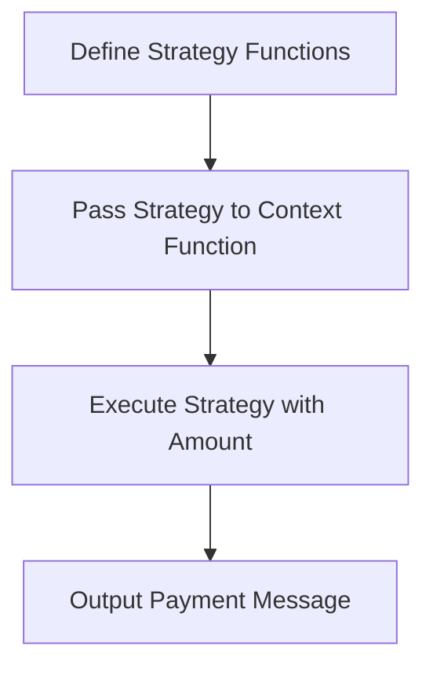

## 12.2.2 Functional Implementation

In this section, we will delve into the functional implementation of the Strategy Pattern in Clojure. As experienced Java developers, you are likely familiar with the Strategy Pattern as a behavioral design pattern that enables selecting an algorithm's behavior at runtime. In Java, this is typically achieved through interfaces and classes. However, in Clojure, we can leverage the power of higher-order functions to achieve the same flexibility and dynamism more succinctly and elegantly.

### Understanding the Strategy Pattern

The Strategy Pattern is a design pattern that defines a family of algorithms, encapsulates each one, and makes them interchangeable. The pattern lets the algorithm vary independently from the clients that use it.

#### Java Implementation Recap

In Java, the Strategy Pattern is often implemented using interfaces and classes. Here's a simple example:

```java
// Strategy interface
public interface PaymentStrategy {
    void pay(int amount);
}

// Concrete strategy classes
public class CreditCardStrategy implements PaymentStrategy {
    public void pay(int amount) {
        System.out.println("Paid " + amount + " using Credit Card.");
    }
}

public class PayPalStrategy implements PaymentStrategy {
    public void pay(int amount) {
        System.out.println("Paid " + amount + " using PayPal.");
    }
}

// Context class
public class ShoppingCart {
    private PaymentStrategy paymentStrategy;

    public void setPaymentStrategy(PaymentStrategy paymentStrategy) {
        this.paymentStrategy = paymentStrategy;
    }

    public void checkout(int amount) {
        paymentStrategy.pay(amount);
    }
}
```

In this example, `PaymentStrategy` is the interface, and `CreditCardStrategy` and `PayPalStrategy` are concrete implementations. The `ShoppingCart` class uses a `PaymentStrategy` to perform the payment operation.

### Functional Implementation in Clojure

In Clojure, we can achieve the same behavior using higher-order functions. Higher-order functions are functions that can take other functions as arguments or return them as results. This allows us to pass different strategies as functions.

#### Clojure Code Example

Let's implement the Strategy Pattern in Clojure:

```clojure
;; Define strategy functions
(defn credit-card-payment [amount]
  (println (str "Paid " amount " using Credit Card.")))

(defn paypal-payment [amount]
  (println (str "Paid " amount " using PayPal.")))

;; Context function that takes a strategy function
(defn checkout [payment-strategy amount]
  (payment-strategy amount))

;; Usage
(checkout credit-card-payment 100)
(checkout paypal-payment 200)
```

**Explanation:**

- **Strategy Functions:** We define `credit-card-payment` and `paypal-payment` as functions that take an amount and print a payment message.
- **Context Function:** The `checkout` function takes a `payment-strategy` function and an `amount`. It calls the strategy function with the amount.
- **Dynamic Behavior:** We can dynamically choose the payment strategy by passing different functions to `checkout`.

### Advantages of Functional Implementation

1. **Simplicity:** The functional approach reduces boilerplate code by eliminating the need for interfaces and classes.
2. **Flexibility:** Functions can be easily passed around and composed, allowing for more flexible and dynamic behavior.
3. **Immutability:** Clojure's immutable data structures ensure that functions do not have side effects, leading to more predictable and reliable code.

### Comparing Java and Clojure Implementations

| Aspect                | Java Implementation                          | Clojure Implementation                     |
|-----------------------|----------------------------------------------|--------------------------------------------|
| **Boilerplate**       | Requires interfaces and classes              | Uses simple functions                      |
| **Flexibility**       | Limited by class hierarchy                   | Highly flexible with function composition  |
| **Immutability**      | Requires explicit handling                   | Immutability is inherent                   |
| **Dynamic Behavior**  | Achieved through polymorphism                | Achieved through higher-order functions    |

### Try It Yourself

Experiment with the Clojure implementation by adding more payment strategies, such as `bitcoin-payment`. Try modifying the `checkout` function to apply a discount before executing the payment strategy.

### Visualizing the Flow

Below is a diagram illustrating the flow of data through the higher-order functions in the Clojure implementation:



**Diagram Description:** This diagram shows the flow from defining strategy functions, passing them to the context function, executing the strategy, and outputting the payment message.

### Exercises

1. **Implement a New Strategy:** Add a new payment strategy, such as `bank-transfer-payment`, and integrate it with the `checkout` function.
2. **Modify Existing Strategies:** Enhance the existing strategies to include additional logic, such as logging or validation.
3. **Compose Strategies:** Create a composed strategy that applies multiple payment methods in sequence.

### Key Takeaways

- The Strategy Pattern can be elegantly implemented in Clojure using higher-order functions.
- Clojure's functional programming paradigm offers simplicity, flexibility, and immutability.
- By leveraging functions as first-class citizens, we can achieve dynamic behavior without the need for complex class hierarchies.

For further reading on higher-order functions and functional programming in Clojure, consider exploring the [Official Clojure Documentation](https://clojure.org/reference/functions) and [ClojureDocs](https://clojuredocs.org/).

Now that we've explored the functional implementation of the Strategy Pattern in Clojure, let's apply these concepts to build more dynamic and flexible applications.

## Quiz Time!



### What is a key advantage of using higher-order functions in Clojure for implementing the Strategy Pattern?

- [x] They reduce boilerplate code by eliminating the need for interfaces and classes.
- [ ] They require more complex class hierarchies.
- [ ] They make the code less flexible.
- [ ] They increase the need for explicit state management.

> **Explanation:** Higher-order functions in Clojure reduce boilerplate code by allowing functions to be passed as arguments, eliminating the need for interfaces and classes.

### How does Clojure's immutability benefit the functional implementation of the Strategy Pattern?

- [x] It ensures that functions do not have side effects, leading to more predictable code.
- [ ] It requires explicit handling of state changes.
- [ ] It makes the code less reliable.
- [ ] It complicates the implementation of dynamic behavior.

> **Explanation:** Immutability in Clojure ensures that functions do not have side effects, making the code more predictable and reliable.

### In the Clojure implementation of the Strategy Pattern, what role does the `checkout` function play?

- [x] It acts as the context function that executes the strategy function with the given amount.
- [ ] It defines the strategy functions.
- [ ] It serves as a concrete strategy implementation.
- [ ] It manages state changes explicitly.

> **Explanation:** The `checkout` function in Clojure acts as the context function that takes a strategy function and an amount, executing the strategy with the given amount.

### What is a key difference between Java and Clojure implementations of the Strategy Pattern?

- [x] Java requires interfaces and classes, while Clojure uses simple functions.
- [ ] Java uses higher-order functions, while Clojure uses interfaces.
- [ ] Java is inherently immutable, while Clojure requires explicit handling of immutability.
- [ ] Java allows for more dynamic behavior than Clojure.

> **Explanation:** Java implementations of the Strategy Pattern require interfaces and classes, whereas Clojure uses simple functions, leveraging higher-order functions for dynamic behavior.

### Which of the following is a benefit of using functions as first-class citizens in Clojure?

- [x] They allow for more flexible and dynamic behavior.
- [ ] They increase the complexity of the code.
- [ ] They require more boilerplate code.
- [ ] They limit the ability to compose functions.

> **Explanation:** Functions as first-class citizens in Clojure allow for more flexible and dynamic behavior, as they can be passed around and composed easily.

### What is the purpose of the `credit-card-payment` function in the Clojure example?

- [x] It serves as a strategy function that prints a payment message using a credit card.
- [ ] It acts as the context function for executing strategies.
- [ ] It manages state changes explicitly.
- [ ] It defines the overall payment process.

> **Explanation:** The `credit-card-payment` function in Clojure serves as a strategy function that takes an amount and prints a payment message using a credit card.

### How can you achieve dynamic behavior in Clojure's functional implementation of the Strategy Pattern?

- [x] By passing different strategy functions to the context function.
- [ ] By using complex class hierarchies.
- [ ] By explicitly managing state changes.
- [ ] By relying on polymorphism.

> **Explanation:** Dynamic behavior in Clojure's functional implementation of the Strategy Pattern is achieved by passing different strategy functions to the context function.

### What is a potential exercise to enhance understanding of the Strategy Pattern in Clojure?

- [x] Implement a new payment strategy and integrate it with the `checkout` function.
- [ ] Create complex class hierarchies to manage strategies.
- [ ] Use interfaces to define strategy functions.
- [ ] Implement explicit state management for strategies.

> **Explanation:** A potential exercise is to implement a new payment strategy and integrate it with the `checkout` function to enhance understanding of the Strategy Pattern in Clojure.

### What is a key takeaway from the functional implementation of the Strategy Pattern in Clojure?

- [x] Clojure's functional programming paradigm offers simplicity, flexibility, and immutability.
- [ ] Clojure requires complex class hierarchies for dynamic behavior.
- [ ] Clojure's immutability complicates the implementation of the Strategy Pattern.
- [ ] Clojure's functional approach limits flexibility.

> **Explanation:** A key takeaway is that Clojure's functional programming paradigm offers simplicity, flexibility, and immutability, making it well-suited for implementing the Strategy Pattern.

### True or False: In Clojure, the Strategy Pattern can be implemented without using interfaces and classes.

- [x] True
- [ ] False

> **Explanation:** True. In Clojure, the Strategy Pattern can be implemented using higher-order functions without the need for interfaces and classes.


