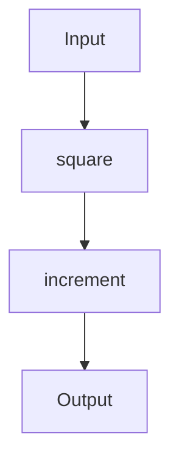
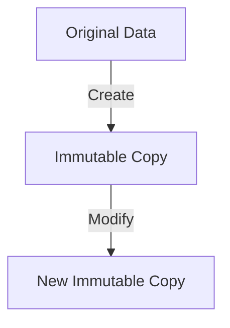

## 12.2.3 Advantages of Functional Approach

In this section, we delve into the advantages of adopting a functional approach in Clojure, particularly when implementing design patterns like the Strategy Pattern. As experienced Java developers, you're familiar with the object-oriented paradigm, which often involves creating classes and interfaces to encapsulate behavior. In contrast, Clojure's functional programming paradigm offers simplicity, reduced boilerplate, and increased flexibility. Let's explore these benefits in detail.

### Simplicity and Clarity

Functional programming emphasizes simplicity and clarity by focusing on pure functions and immutable data. This approach reduces complexity and makes code easier to understand and maintain.

#### Clojure Example: Strategy Pattern

In Clojure, the Strategy Pattern can be implemented using higher-order functions. Here's a simple example:

```clojure
;; Define strategies as functions
(defn add [a b] (+ a b))
(defn subtract [a b] (- a b))

;; Function that takes a strategy and applies it
(defn execute-strategy [strategy a b]
  (strategy a b))

;; Usage
(println (execute-strategy add 5 3))      ;; Output: 8
(println (execute-strategy subtract 5 3)) ;; Output: 2
```

In this example, strategies are simply functions that can be passed around and invoked. This eliminates the need for interfaces or classes, which are common in Java.

#### Java Example: Strategy Pattern

In Java, implementing the Strategy Pattern typically involves creating interfaces and classes:

```java
// Define the strategy interface
interface Strategy {
    int execute(int a, int b);
}

// Implement concrete strategies
class AddStrategy implements Strategy {
    public int execute(int a, int b) {
        return a + b;
    }
}

class SubtractStrategy implements Strategy {
    public int execute(int a, int b) {
        return a - b;
    }
}

// Context class that uses a strategy
class Context {
    private Strategy strategy;

    public Context(Strategy strategy) {
        this.strategy = strategy;
    }

    public int executeStrategy(int a, int b) {
        return strategy.execute(a, b);
    }
}

// Usage
Context context = new Context(new AddStrategy());
System.out.println(context.executeStrategy(5, 3)); // Output: 8

context = new Context(new SubtractStrategy());
System.out.println(context.executeStrategy(5, 3)); // Output: 2
```

As you can see, the Java implementation involves more boilerplate code, such as defining interfaces and classes, which can be cumbersome and less flexible.

### Reduced Boilerplate

Clojure's functional approach significantly reduces boilerplate code, allowing developers to focus on the logic rather than the structure. This is achieved through the use of first-class functions and higher-order functions.

#### Higher-Order Functions

Higher-order functions are functions that can take other functions as arguments or return them as results. This feature is central to Clojure's functional programming paradigm and is used extensively to reduce boilerplate.

```clojure
;; Example of a higher-order function
(defn apply-operation [operation a b]
  (operation a b))

;; Using the higher-order function
(println (apply-operation + 10 5)) ;; Output: 15
(println (apply-operation * 10 5)) ;; Output: 50
```

In this example, `apply-operation` is a higher-order function that takes an operation (a function) as an argument and applies it to two numbers. This approach is concise and eliminates the need for additional classes or interfaces.

### Increased Flexibility

Functional programming in Clojure offers increased flexibility by treating functions as first-class citizens. This means functions can be passed as arguments, returned from other functions, and assigned to variables, providing a high degree of flexibility in how code is structured and reused.

#### Function Composition

Function composition is a powerful technique in functional programming that allows developers to build complex operations by combining simpler functions. This leads to more modular and reusable code.

```clojure
;; Define simple functions
(defn square [x] (* x x))
(defn increment [x] (+ x 1))

;; Compose functions
(defn square-and-increment [x]
  (-> x
      square
      increment))

;; Usage
(println (square-and-increment 4)) ;; Output: 17
```

In this example, `square-and-increment` is a composed function that first squares a number and then increments it. The use of the `->` threading macro makes the composition clear and easy to read.

### Immutability and Concurrency

Clojure's emphasis on immutability simplifies concurrency, as immutable data structures eliminate the need for locks and synchronization. This leads to safer and more predictable concurrent programs.

#### Atoms for State Management

Clojure provides atoms for managing shared state in a concurrent environment. Atoms are mutable references to immutable data, allowing for safe and efficient state updates.

```clojure
;; Create an atom
(def counter (atom 0))

;; Update the atom
(swap! counter inc)

;; Read the atom's value
(println @counter) ;; Output: 1
```

In this example, `swap!` is used to update the atom's value safely in a concurrent environment. This approach is simpler and more reliable than traditional locking mechanisms in Java.

### Try It Yourself

To deepen your understanding, try modifying the Clojure examples above:

1. **Add a new strategy**: Implement a multiplication strategy and use it with the `execute-strategy` function.
2. **Compose more functions**: Create a new composed function that squares a number, increments it, and then doubles the result.
3. **Experiment with atoms**: Create an atom that holds a map and update its values using `swap!`.

### Diagrams and Visualizations

To further illustrate the concepts, let's use some diagrams.

#### Function Composition Flow



*Diagram 1: Flow of data through composed functions `square` and `increment`.*

#### Immutable Data Structure



*Diagram 2: Immutability ensures that modifications create new copies rather than altering the original data.*

### Further Reading

For more information on functional programming in Clojure, consider exploring the following resources:

- [Official Clojure Documentation](https://clojure.org/)
- [ClojureDocs](https://clojuredocs.org/)
- [Functional Programming in Clojure](https://www.braveclojure.com/)

### Exercises

1. **Implement a New Strategy**: Create a division strategy and integrate it into the existing Clojure example.
2. **Refactor Java Code**: Refactor the Java Strategy Pattern example to use lambda expressions introduced in Java 8.
3. **Concurrency Challenge**: Use atoms to implement a simple counter that can be safely updated by multiple threads.

### Key Takeaways

- **Simplicity**: Clojure's functional approach reduces complexity and makes code easier to understand.
- **Reduced Boilerplate**: By using higher-order functions, Clojure eliminates unnecessary code, allowing developers to focus on logic.
- **Flexibility**: Treating functions as first-class citizens provides flexibility in code structure and reuse.
- **Immutability**: Immutable data structures simplify concurrency and lead to safer, more predictable programs.

Now that we've explored the advantages of a functional approach in Clojure, let's apply these concepts to design patterns and state management in your applications.

## Quiz: Understanding the Advantages of Functional Programming in Clojure



### What is a key advantage of using higher-order functions in Clojure?

- [x] They reduce boilerplate code by allowing functions to be passed as arguments.
- [ ] They require more complex syntax compared to Java.
- [ ] They are only useful for mathematical operations.
- [ ] They make code less readable.

> **Explanation:** Higher-order functions in Clojure reduce boilerplate by allowing functions to be passed as arguments, making code more concise and flexible.

### How does Clojure handle state management in a concurrent environment?

- [x] By using immutable data structures and concurrency primitives like atoms.
- [ ] By using traditional locking mechanisms like in Java.
- [ ] By avoiding concurrency altogether.
- [ ] By using global variables.

> **Explanation:** Clojure uses immutable data structures and concurrency primitives like atoms to manage state safely in concurrent environments.

### What is a benefit of immutability in Clojure?

- [x] It simplifies concurrency by eliminating the need for locks.
- [ ] It makes data structures harder to use.
- [ ] It requires more memory than mutable structures.
- [ ] It is only useful for small programs.

> **Explanation:** Immutability simplifies concurrency by eliminating the need for locks, making programs safer and more predictable.

### In Clojure, how are strategies typically implemented?

- [x] As functions that can be passed around and invoked.
- [ ] As classes that implement a specific interface.
- [ ] As global variables.
- [ ] As static methods.

> **Explanation:** In Clojure, strategies are typically implemented as functions, which can be passed around and invoked, providing flexibility and simplicity.

### What is a key difference between Java and Clojure's approach to the Strategy Pattern?

- [x] Clojure uses functions, while Java uses interfaces and classes.
- [ ] Clojure requires more boilerplate code.
- [ ] Java is more flexible in its implementation.
- [ ] Clojure cannot implement the Strategy Pattern.

> **Explanation:** Clojure uses functions to implement the Strategy Pattern, reducing boilerplate compared to Java's use of interfaces and classes.

### What is the purpose of the `->` threading macro in Clojure?

- [x] To compose functions in a clear and readable manner.
- [ ] To increase the execution speed of functions.
- [ ] To handle exceptions in functional code.
- [ ] To declare variables.

> **Explanation:** The `->` threading macro in Clojure is used to compose functions in a clear and readable manner, improving code clarity.

### How does Clojure's functional approach increase flexibility?

- [x] By treating functions as first-class citizens.
- [ ] By enforcing strict type checking.
- [ ] By using global state.
- [ ] By limiting the use of recursion.

> **Explanation:** Clojure's functional approach increases flexibility by treating functions as first-class citizens, allowing them to be passed around and reused.

### What is a common use case for atoms in Clojure?

- [x] Managing shared state in a concurrent environment.
- [ ] Storing large datasets.
- [ ] Performing complex mathematical calculations.
- [ ] Handling user input.

> **Explanation:** Atoms in Clojure are commonly used for managing shared state in a concurrent environment, providing safe and efficient updates.

### Why is function composition beneficial in Clojure?

- [x] It allows building complex operations from simpler functions.
- [ ] It makes code harder to read.
- [ ] It requires more memory.
- [ ] It is only useful for mathematical operations.

> **Explanation:** Function composition in Clojure allows building complex operations from simpler functions, leading to more modular and reusable code.

### True or False: Clojure's functional approach requires more boilerplate code than Java.

- [ ] True
- [x] False

> **Explanation:** False. Clojure's functional approach reduces boilerplate code compared to Java, focusing on logic rather than structure.


