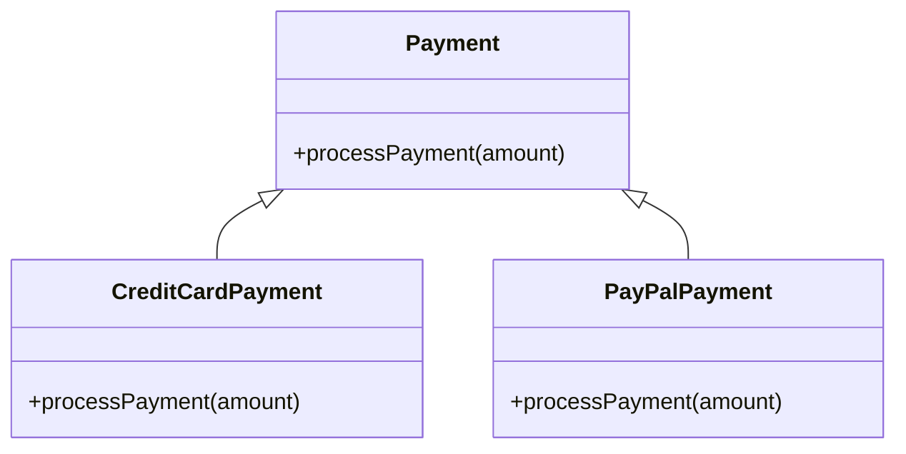
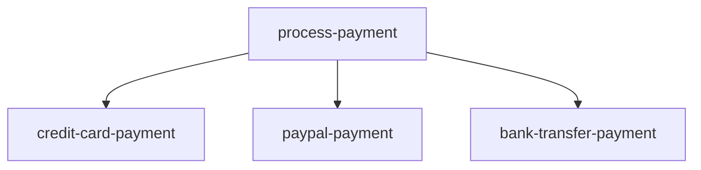

## 12.3.1 Limitations of Inheritance

In the realm of software design, inheritance has long been a cornerstone of object-oriented programming (OOP). While it offers a mechanism for code reuse and polymorphism, it also introduces several limitations that can hinder software flexibility and maintainability. As experienced Java developers, you may have encountered these challenges firsthand. In this section, we will delve into the drawbacks of inheritance, explore why it is less favored in functional programming, and highlight how Clojure's emphasis on composition can lead to more robust and adaptable software designs.

### Understanding Inheritance in Object-Oriented Design

Inheritance allows a class to inherit properties and behaviors from another class, promoting code reuse and establishing a hierarchical relationship between classes. In Java, inheritance is implemented using the `extends` keyword. Here's a simple example:

```java
// Java Example: Inheritance
class Animal {
    void eat() {
        System.out.println("This animal eats food.");
    }
}

class Dog extends Animal {
    void bark() {
        System.out.println("The dog barks.");
    }
}

public class Main {
    public static void main(String[] args) {
        Dog dog = new Dog();
        dog.eat(); // Inherited method
        dog.bark(); // Own method
    }
}
```

In this example, `Dog` inherits the `eat` method from `Animal`, showcasing the reuse of code. However, this seemingly straightforward mechanism comes with several limitations.

### Limitations of Inheritance

#### 1. **Tight Coupling**

Inheritance creates a strong coupling between the parent and child classes. Changes in the parent class can inadvertently affect all derived classes, leading to a fragile codebase. This tight coupling can make it difficult to modify or extend the system without introducing bugs.

#### 2. **Inflexibility**

Inheritance imposes a rigid hierarchy that can be difficult to change. Once a class hierarchy is established, altering it often requires significant refactoring. This inflexibility can be a barrier to adapting to new requirements or incorporating changes.

#### 3. **Code Reuse Limitations**

While inheritance promotes code reuse, it does so at the cost of flexibility. Inheritance is a form of white-box reuse, where the internal details of the parent class are exposed to the child class. This exposure can lead to unintended dependencies and make the system harder to understand and maintain.

#### 4. **Fragile Base Class Problem**

The fragile base class problem arises when changes to a base class affect derived classes in unexpected ways. This issue is particularly problematic in large systems where the base class is widely used.

#### 5. **Violation of Encapsulation**

Inheritance can violate the principle of encapsulation by exposing the internal details of a class to its subclasses. This exposure can lead to a situation where subclasses depend on the implementation details of their parent class, making the system brittle.

#### 6. **Difficulty in Testing**

Testing classes that rely heavily on inheritance can be challenging. The dependencies between classes can make it difficult to isolate and test individual components, leading to complex and brittle test suites.

#### 7. **Limited Scalability**

As systems grow, the limitations of inheritance become more pronounced. The rigid class hierarchies can hinder scalability and make it difficult to introduce new features or adapt to changing requirements.

### Why Functional Programming Favors Composition

Functional programming, and Clojure in particular, favors composition over inheritance. Composition involves building complex functionality by combining simpler functions or components. This approach offers several advantages:

#### 1. **Loose Coupling**

Composition promotes loose coupling between components, making it easier to modify and extend the system. Changes to one component are less likely to affect others, leading to a more robust and adaptable codebase.

#### 2. **Flexibility**

By avoiding rigid class hierarchies, composition allows for greater flexibility in software design. Components can be easily replaced or extended without requiring significant refactoring.

#### 3. **Encapsulation**

Composition respects the principle of encapsulation by keeping the internal details of components hidden. This separation of concerns makes the system easier to understand and maintain.

#### 4. **Reusability**

Composition promotes black-box reuse, where components are reused without exposing their internal details. This approach leads to more modular and reusable code.

#### 5. **Improved Testability**

The loose coupling and encapsulation provided by composition make it easier to test individual components in isolation. This leads to more reliable and maintainable test suites.

#### 6. **Scalability**

Composition scales well with the size and complexity of the system. New features can be added by composing existing components, reducing the need for extensive refactoring.

### Clojure's Approach to Composition

Clojure, as a functional programming language, emphasizes composition through its use of higher-order functions and immutable data structures. Let's explore how Clojure's features support composition over inheritance.

#### Higher-Order Functions

Higher-order functions are functions that take other functions as arguments or return them as results. They enable powerful composition patterns by allowing functions to be combined and reused in flexible ways.

```clojure
;; Clojure Example: Higher-Order Functions
(defn apply-discount [discount]
  (fn [price]
    (* price (- 1 discount))))

(defn apply-tax [tax]
  (fn [price]
    (* price (+ 1 tax))))

(defn calculate-final-price [price discount tax]
  ((comp (apply-tax tax) (apply-discount discount)) price))

;; Usage
(calculate-final-price 100 0.1 0.05) ;; => 94.5
```

In this example, `apply-discount` and `apply-tax` are higher-order functions that return functions. The `comp` function is used to compose these functions, demonstrating how composition can be used to build complex functionality from simpler components.

#### Immutable Data Structures

Clojure's immutable data structures support composition by ensuring that data is not modified in place. This immutability allows functions to be composed without side effects, leading to more predictable and reliable code.

```clojure
;; Clojure Example: Immutable Data Structures
(defn update-inventory [inventory item quantity]
  (update inventory item (fnil + 0) quantity))

(def inventory {:apples 10 :oranges 5})

;; Usage
(update-inventory inventory :apples 5) ;; => {:apples 15, :oranges 5}
```

In this example, the `update-inventory` function uses Clojure's immutable maps to update the inventory. The original `inventory` map remains unchanged, demonstrating how immutability supports composition by preventing unintended side effects.

### Comparing Inheritance and Composition

To illustrate the differences between inheritance and composition, let's consider a simple example: modeling a payment system with different payment methods.

#### Java Example: Inheritance

```java
// Java Example: Inheritance
abstract class Payment {
    abstract void processPayment(double amount);
}

class CreditCardPayment extends Payment {
    void processPayment(double amount) {
        System.out.println("Processing credit card payment of $" + amount);
    }
}

class PayPalPayment extends Payment {
    void processPayment(double amount) {
        System.out.println("Processing PayPal payment of $" + amount);
    }
}

public class PaymentProcessor {
    public static void main(String[] args) {
        Payment payment = new CreditCardPayment();
        payment.processPayment(100.0);
    }
}
```

In this Java example, `CreditCardPayment` and `PayPalPayment` inherit from the `Payment` class. While this approach works, it introduces tight coupling and limits flexibility.

#### Clojure Example: Composition

```clojure
;; Clojure Example: Composition
(defn credit-card-payment [amount]
  (println "Processing credit card payment of $" amount))

(defn paypal-payment [amount]
  (println "Processing PayPal payment of $" amount))

(defn process-payment [payment-fn amount]
  (payment-fn amount))

;; Usage
(process-payment credit-card-payment 100.0)
```

In this Clojure example, `credit-card-payment` and `paypal-payment` are functions that can be composed with `process-payment`. This approach promotes loose coupling and flexibility, allowing new payment methods to be added without modifying existing code.

### Try It Yourself

To deepen your understanding of composition in Clojure, try modifying the examples above:

- Add a new payment method, such as `bank-transfer-payment`, and integrate it with the `process-payment` function.
- Experiment with different function compositions using `comp` and `partial`.
- Explore how Clojure's immutable data structures can be used to model complex systems without relying on inheritance.

### Diagrams and Visuals

To further illustrate the concepts discussed, let's use a few diagrams to visualize the differences between inheritance and composition.

#### Inheritance Hierarchy



*Diagram 1: Inheritance Hierarchy* - This diagram shows the class hierarchy for the payment system using inheritance. The `Payment` class is the base class, and `CreditCardPayment` and `PayPalPayment` are derived classes.

#### Composition Model



*Diagram 2: Composition Model* - This flowchart illustrates the composition model for the payment system. The `process-payment` function can be composed with different payment functions, promoting flexibility and loose coupling.

### Further Reading

For more information on the limitations of inheritance and the benefits of composition, consider exploring the following resources:

- [Official Clojure Documentation](https://clojure.org/)
- [ClojureDocs](https://clojuredocs.org/)
- [Design Patterns: Elements of Reusable Object-Oriented Software](https://en.wikipedia.org/wiki/Design_Patterns) by Erich Gamma, Richard Helm, Ralph Johnson, and John Vlissides

### Exercises

To reinforce your understanding of the limitations of inheritance and the benefits of composition, try the following exercises:

1. Refactor a Java class hierarchy to use composition instead of inheritance. Consider how this change affects the flexibility and maintainability of the code.
2. Implement a simple Clojure application that models a real-world system using composition. Focus on using higher-order functions and immutable data structures.
3. Compare the testability of a system designed with inheritance versus one designed with composition. What are the key differences?

### Key Takeaways

- Inheritance introduces tight coupling and inflexibility, making it difficult to adapt to change.
- Functional programming, and Clojure in particular, favors composition over inheritance to promote loose coupling and flexibility.
- Higher-order functions and immutable data structures are key features of Clojure that support composition.
- By embracing composition, you can build more robust, adaptable, and maintainable software systems.

Now that we've explored the limitations of inheritance and the advantages of composition, let's continue our journey into functional design patterns and discover how Clojure can help you build better software.

## Quiz: Understanding the Limitations of Inheritance and Embracing Composition



### What is a major drawback of inheritance in object-oriented design?

- [x] Tight coupling between classes
- [ ] Enhanced code reuse
- [ ] Simplified testing
- [ ] Improved flexibility

> **Explanation:** Inheritance creates tight coupling between parent and child classes, making it difficult to modify or extend the system without introducing bugs.

### Why is composition favored over inheritance in functional programming?

- [x] It promotes loose coupling and flexibility
- [ ] It enforces a rigid class hierarchy
- [ ] It exposes internal details of components
- [ ] It makes testing more complex

> **Explanation:** Composition promotes loose coupling and flexibility, allowing components to be easily replaced or extended without significant refactoring.

### What is the fragile base class problem?

- [x] Changes to a base class affect derived classes unexpectedly
- [ ] Base classes cannot be extended
- [ ] Derived classes cannot override methods
- [ ] Base classes are always abstract

> **Explanation:** The fragile base class problem occurs when changes to a base class affect derived classes in unexpected ways, leading to a fragile codebase.

### How does Clojure's immutability support composition?

- [x] By preventing unintended side effects
- [ ] By allowing in-place modifications
- [ ] By enforcing class hierarchies
- [ ] By exposing internal details

> **Explanation:** Clojure's immutability prevents unintended side effects, allowing functions to be composed without altering the original data.

### What is a benefit of higher-order functions in Clojure?

- [x] They enable powerful composition patterns
- [ ] They enforce strict typing
- [ ] They require inheritance
- [ ] They expose internal details

> **Explanation:** Higher-order functions enable powerful composition patterns by allowing functions to be combined and reused in flexible ways.

### Which of the following is a limitation of inheritance?

- [x] Violation of encapsulation
- [ ] Enhanced modularity
- [ ] Simplified code reuse
- [ ] Improved scalability

> **Explanation:** Inheritance can violate encapsulation by exposing the internal details of a class to its subclasses, leading to a brittle system.

### How does composition improve testability?

- [x] By allowing components to be tested in isolation
- [ ] By creating tight coupling between components
- [ ] By enforcing a rigid class hierarchy
- [ ] By exposing internal details

> **Explanation:** Composition improves testability by allowing components to be tested in isolation, leading to more reliable and maintainable test suites.

### What is a key advantage of using composition in software design?

- [x] Greater flexibility in adapting to change
- [ ] Enforced class hierarchies
- [ ] Tight coupling between components
- [ ] Exposure of internal details

> **Explanation:** Composition offers greater flexibility in adapting to change, allowing components to be easily replaced or extended without significant refactoring.

### How does Clojure's approach to composition differ from Java's inheritance model?

- [x] Clojure uses functions and immutable data structures
- [ ] Clojure enforces strict class hierarchies
- [ ] Clojure relies on white-box reuse
- [ ] Clojure exposes internal details

> **Explanation:** Clojure's approach to composition uses functions and immutable data structures, promoting loose coupling and flexibility.

### True or False: Inheritance is always the best choice for code reuse.

- [ ] True
- [x] False

> **Explanation:** Inheritance is not always the best choice for code reuse due to its limitations, such as tight coupling and inflexibility. Composition is often a more flexible and maintainable alternative.


