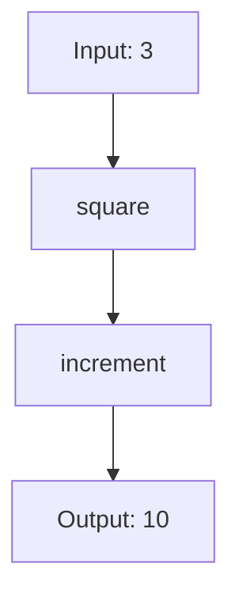

## 12.3.2 Embracing Composition

In the realm of software design, composition and inheritance are two fundamental paradigms for building complex systems. While Java developers are often familiar with inheritance as a means of code reuse and extension, Clojure, as a functional language, emphasizes composition. In this section, we will explore how composition is achieved in Clojure through function composition and data structure aggregation, and how these techniques can lead to more modular, flexible, and maintainable code.

### Understanding Composition in Clojure

Composition in Clojure is about building complex behavior by combining simple functions and data structures. This approach aligns with the functional programming paradigm, where the focus is on functions and their composition rather than on objects and their hierarchies.

#### Function Composition

Function composition is a powerful concept in Clojure that allows you to create new functions by combining existing ones. This is akin to mathematical function composition, where the output of one function becomes the input of another. In Clojure, function composition is facilitated by the `comp` function.

**Example: Basic Function Composition**

```clojure
(defn square [x]
  (* x x))

(defn increment [x]
  (+ x 1))

(def square-and-increment
  (comp increment square))

(println (square-and-increment 3)) ; Output: 10
```

In this example, `square-and-increment` is a new function created by composing `square` and `increment`. The `comp` function takes multiple functions as arguments and returns a new function that applies them from right to left.

**Diagram: Function Composition Flow**



*Caption: This diagram illustrates the flow of data through the composed functions `square` and `increment`.*

#### Data Structure Aggregation

In Clojure, data structure aggregation involves combining simple data structures to form more complex ones. This is often achieved using Clojure's rich set of immutable data structures, such as lists, vectors, maps, and sets.

**Example: Aggregating Data Structures**

```clojure
(def person {:name "Alice" :age 30})
(def address {:city "Wonderland" :zip "12345"})

(def person-with-address
  (merge person address))

(println person-with-address)
; Output: {:name "Alice", :age 30, :city "Wonderland", :zip "12345"}
```

Here, we use the `merge` function to combine two maps, `person` and `address`, into a single map, `person-with-address`. This demonstrates how aggregation can be used to build complex data structures from simpler ones.

### Composition vs. Inheritance

In Java, inheritance is often used to achieve code reuse and polymorphism. However, it can lead to rigid class hierarchies and tight coupling between components. Composition, on the other hand, promotes flexibility and modularity by allowing you to assemble behavior from smaller, reusable components.

**Java Example: Inheritance**

```java
class Animal {
    void eat() {
        System.out.println("Eating");
    }
}

class Dog extends Animal {
    void bark() {
        System.out.println("Barking");
    }
}

Dog dog = new Dog();
dog.eat(); // Eating
dog.bark(); // Barking
```

In this Java example, `Dog` inherits from `Animal`, gaining its `eat` method. While this works for simple hierarchies, it can become cumbersome as the hierarchy grows.

**Clojure Example: Composition**

```clojure
(defn eat []
  (println "Eating"))

(defn bark []
  (println "Barking"))

(def dog-behavior
  {:eat eat
   :bark bark})

((:eat dog-behavior)) ; Eating
((:bark dog-behavior)) ; Barking
```

In Clojure, we achieve similar behavior using composition. We define functions `eat` and `bark`, and then compose them into a map `dog-behavior`. This approach is more flexible, as we can easily modify or extend behavior without altering a class hierarchy.

### Advantages of Composition in Clojure

1. **Modularity**: Functions and data structures can be developed independently and composed as needed.
2. **Reusability**: Reusable components can be combined in different ways to achieve new functionality.
3. **Flexibility**: Changes to one component do not necessitate changes to others, reducing the risk of breaking existing code.
4. **Simplicity**: Avoids the complexity of deep inheritance hierarchies, making the codebase easier to understand and maintain.

### Practical Examples of Composition

Let's explore some practical examples where composition can be applied to solve real-world problems.

#### Example 1: Data Transformation Pipeline

Suppose we have a list of numbers and we want to apply a series of transformations: square each number, filter out even numbers, and then sum the result.

**Clojure Code**

```clojure
(defn square [x]
  (* x x))

(defn odd? [x]
  (not (even? x)))

(defn process-numbers [numbers]
  (->> numbers
       (map square)
       (filter odd?)
       (reduce +)))

(println (process-numbers [1 2 3 4 5])) ; Output: 35
```

In this example, we use the threading macro `->>` to compose a series of transformations on the `numbers` list. This approach is both concise and expressive, highlighting the power of composition in functional programming.

**Diagram: Data Transformation Pipeline**

```mermaid
graph LR;
    A[Input: [1, 2, 3, 4, 5]] --> B[square]
    B --> C[filter odd?]
    C --> D[reduce +]
    D --> E[Output: 35]
```

*Caption: This diagram shows the flow of data through the transformation pipeline.*

#### Example 2: Building a Simple Web Server

Consider a scenario where we want to build a simple web server that handles HTTP requests and responses. We can use composition to define middleware functions that process requests and responses.

**Clojure Code**

```clojure
(defn log-request [handler]
  (fn [request]
    (println "Received request:" request)
    (handler request)))

(defn wrap-response [handler]
  (fn [request]
    (let [response (handler request)]
      (assoc response :headers {"Content-Type" "text/plain"}))))

(defn handle-request [request]
  {:status 200 :body "Hello, World!"})

(def app
  (-> handle-request
      (log-request)
      (wrap-response)))

(println (app {:uri "/"}))
; Output: Received request: {:uri "/"}
; {:status 200, :body "Hello, World!", :headers {"Content-Type" "text/plain"}}
```

In this example, we define middleware functions `log-request` and `wrap-response`, and compose them with `handle-request` to form the `app` function. This demonstrates how composition can be used to build modular and extensible web applications.

### Try It Yourself

Experiment with the examples provided by modifying the functions or adding new ones. For instance, try adding a new transformation to the data pipeline or a new middleware function to the web server. Observe how easily you can extend the functionality without altering the existing code.

### Further Reading

For more information on function composition and data structure aggregation in Clojure, consider exploring the following resources:

- [Official Clojure Documentation](https://clojure.org/reference)
- [ClojureDocs](https://clojuredocs.org/)
- [Functional Programming in Clojure](https://github.com/functional-programming-in-clojure)

### Exercises

1. **Exercise 1**: Create a function that composes three simple arithmetic operations (addition, subtraction, multiplication) and applies them to a list of numbers.
2. **Exercise 2**: Implement a middleware function that adds a custom header to HTTP responses and compose it with the existing web server example.
3. **Exercise 3**: Refactor a Java class hierarchy into a set of Clojure functions and data structures using composition.

### Key Takeaways

- **Composition over Inheritance**: Emphasizes building complex behavior by combining simple functions and data structures.
- **Function Composition**: Allows for the creation of new functions by combining existing ones, promoting code reuse and modularity.
- **Data Structure Aggregation**: Facilitates the construction of complex data structures from simpler ones, enhancing flexibility and maintainability.
- **Advantages**: Composition leads to more modular, flexible, and maintainable code, avoiding the pitfalls of deep inheritance hierarchies.

By embracing composition in Clojure, you can create more robust and adaptable software systems. Now that we've explored how composition works in Clojure, let's apply these concepts to build more modular and maintainable applications.

## Quiz: Understanding Composition in Clojure



### What is the primary advantage of using composition over inheritance in Clojure?

- [x] Modularity and flexibility
- [ ] Faster execution
- [ ] Easier debugging
- [ ] More concise syntax

> **Explanation:** Composition promotes modularity and flexibility by allowing you to build complex behavior from simple, reusable components.

### How does the `comp` function in Clojure work?

- [x] It creates a new function by composing multiple functions from right to left.
- [ ] It creates a new function by composing multiple functions from left to right.
- [ ] It combines two functions into a single function.
- [ ] It applies a function to a list of arguments.

> **Explanation:** The `comp` function in Clojure creates a new function by composing multiple functions from right to left, where the output of one function becomes the input of the next.

### In the provided Clojure example, what does the `merge` function do?

- [x] Combines two maps into a single map.
- [ ] Combines two lists into a single list.
- [ ] Combines two vectors into a single vector.
- [ ] Combines two sets into a single set.

> **Explanation:** The `merge` function in Clojure combines two maps into a single map, aggregating their key-value pairs.

### What is the purpose of middleware functions in the web server example?

- [x] To process requests and responses in a modular way.
- [ ] To handle database connections.
- [ ] To manage user authentication.
- [ ] To optimize server performance.

> **Explanation:** Middleware functions in the web server example are used to process requests and responses in a modular way, allowing for easy extension and modification of server behavior.

### Which of the following is a benefit of function composition in Clojure?

- [x] Code reuse
- [x] Modularity
- [ ] Faster execution
- [ ] Less memory usage

> **Explanation:** Function composition in Clojure promotes code reuse and modularity by allowing you to build complex behavior from simple, reusable functions.

### What does the threading macro `->>` do in Clojure?

- [x] It threads a value through a series of functions from left to right.
- [ ] It threads a value through a series of functions from right to left.
- [ ] It applies a function to a list of arguments.
- [ ] It creates a new function by composing multiple functions.

> **Explanation:** The threading macro `->>` in Clojure threads a value through a series of functions from left to right, making the code more readable and expressive.

### How can you extend the functionality of the web server example?

- [x] By adding new middleware functions.
- [ ] By modifying the existing functions.
- [x] By composing additional functions with the existing ones.
- [ ] By changing the server configuration.

> **Explanation:** You can extend the functionality of the web server example by adding new middleware functions or composing additional functions with the existing ones, without altering the existing code.

### What is the result of the `process-numbers` function when applied to the list `[1, 2, 3, 4, 5]`?

- [x] 35
- [ ] 15
- [ ] 25
- [ ] 45

> **Explanation:** The `process-numbers` function squares each number, filters out even numbers, and then sums the result, yielding 35 for the list `[1, 2, 3, 4, 5]`.

### True or False: Composition in Clojure can lead to more maintainable code compared to inheritance in Java.

- [x] True
- [ ] False

> **Explanation:** True. Composition in Clojure can lead to more maintainable code by promoting modularity and flexibility, avoiding the complexity of deep inheritance hierarchies.


