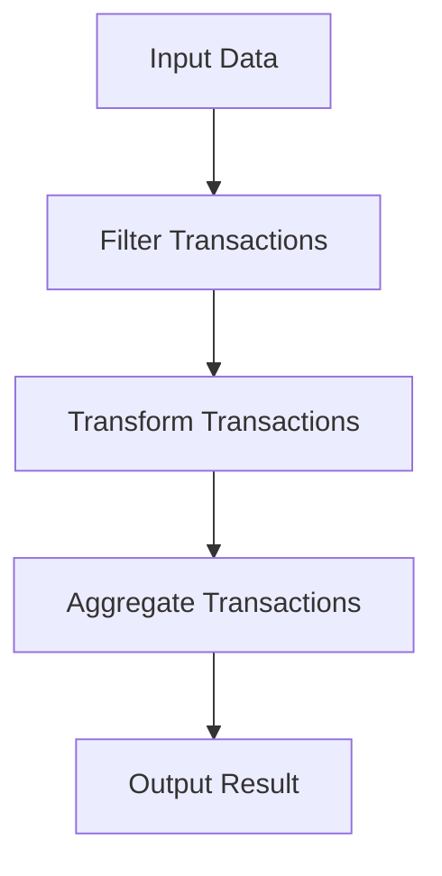

## 12.3.3 Practical Examples of Composition Over Inheritance in Clojure

In this section, we delve into practical examples of using **composition over inheritance** in Clojure, a concept that can lead to cleaner and more maintainable code. As experienced Java developers, you're likely familiar with the inheritance model, which is a cornerstone of object-oriented programming (OOP). However, Clojure, with its functional programming paradigm, encourages composition as a more flexible and modular approach. Let's explore how this can be applied in real-world scenarios, such as building data pipelines and modularizing application logic.

### Understanding Composition Over Inheritance

Before diving into examples, let's briefly revisit the concept of composition over inheritance. Inheritance allows a class to inherit properties and methods from another class, promoting code reuse. However, it can lead to rigid hierarchies and tightly coupled code. Composition, on the other hand, involves building complex functionality by combining simpler, independent components. This approach enhances flexibility and reusability, aligning well with Clojure's functional programming principles.

### Building Data Pipelines with Composition

Data pipelines are a common use case where composition shines. In a data pipeline, data flows through a series of processing steps, each transforming the data in some way. Let's see how we can implement a simple data pipeline in Clojure using composition.

#### Example: A Simple Data Pipeline

Suppose we have a dataset of customer transactions, and we want to process this data to extract insights. We'll create a data pipeline that filters, transforms, and aggregates the data.

```clojure
(defn filter-transactions [transactions]
  ;; Filter transactions to include only those above a certain amount
  (filter #(> (:amount %) 100) transactions))

(defn transform-transactions [transactions]
  ;; Transform transactions to include a new field 'discounted-amount'
  (map #(assoc % :discounted-amount (* 0.9 (:amount %))) transactions))

(defn aggregate-transactions [transactions]
  ;; Aggregate transactions to calculate total discounted amount
  (reduce + (map :discounted-amount transactions)))

(defn process-transactions [transactions]
  ;; Compose the pipeline functions
  (-> transactions
      filter-transactions
      transform-transactions
      aggregate-transactions))

;; Sample data
(def transactions [{:id 1 :amount 150}
                   {:id 2 :amount 50}
                   {:id 3 :amount 200}])

;; Process the transactions
(process-transactions transactions)
```

In this example, each function represents a step in the pipeline. We use the `->` threading macro to compose these functions, passing the result of each step to the next. This approach is modular and easy to extend or modify.

#### Try It Yourself

Experiment with the data pipeline by adding new processing steps, such as sorting the transactions or grouping them by customer ID. Notice how easy it is to modify the pipeline without affecting other parts of the code.

### Modularizing Application Logic

Another area where composition excels is in modularizing application logic. By breaking down complex logic into smaller, composable functions, we can create more maintainable and testable code.

#### Example: Modularizing a User Authentication System

Let's consider a user authentication system. We'll use composition to separate different concerns, such as validating user input, checking credentials, and generating authentication tokens.

```clojure
(defn validate-input [user-data]
  ;; Validate user input
  (if (and (:username user-data) (:password user-data))
    user-data
    (throw (Exception. "Invalid input"))))

(defn check-credentials [user-data]
  ;; Check user credentials
  (if (= (:username user-data) "admin")
    (assoc user-data :authenticated true)
    (assoc user-data :authenticated false)))

(defn generate-token [user-data]
  ;; Generate authentication token
  (if (:authenticated user-data)
    (assoc user-data :token "secure-token")
    (throw (Exception. "Authentication failed"))))

(defn authenticate-user [user-data]
  ;; Compose the authentication functions
  (-> user-data
      validate-input
      check-credentials
      generate-token))

;; Sample user data
(def user-data {:username "admin" :password "secret"})

;; Authenticate the user
(authenticate-user user-data)
```

Here, each function handles a specific aspect of the authentication process. By composing these functions, we create a clear and concise authentication flow.

#### Try It Yourself

Modify the authentication system to include additional checks, such as verifying user roles or logging authentication attempts. Observe how composition allows you to easily integrate new functionality.

### Comparing Composition and Inheritance

To highlight the benefits of composition, let's compare it with a traditional inheritance-based approach in Java.

#### Java Example: Inheritance-Based Data Pipeline

```java
abstract class TransactionProcessor {
    abstract void process(Transaction transaction);
}

class FilterProcessor extends TransactionProcessor {
    void process(Transaction transaction) {
        if (transaction.getAmount() > 100) {
            // Pass to next processor
        }
    }
}

class TransformProcessor extends TransactionProcessor {
    void process(Transaction transaction) {
        transaction.setDiscountedAmount(transaction.getAmount() * 0.9);
        // Pass to next processor
    }
}

class AggregateProcessor extends TransactionProcessor {
    private double total = 0;

    void process(Transaction transaction) {
        total += transaction.getDiscountedAmount();
    }

    double getTotal() {
        return total;
    }
}

// Usage
TransactionProcessor pipeline = new FilterProcessor();
pipeline.setNext(new TransformProcessor());
pipeline.setNext(new AggregateProcessor());
pipeline.process(transaction);
```

In this Java example, we use inheritance to create a chain of processors. While this works, it can become cumbersome as the pipeline grows, with each processor tightly coupled to the next.

#### Clojure Example: Composition-Based Data Pipeline

```clojure
(defn process-transactions [transactions]
  (-> transactions
      filter-transactions
      transform-transactions
      aggregate-transactions))
```

In contrast, the Clojure example uses composition, resulting in a more flexible and concise implementation. Each function is independent and can be easily reused or replaced.

### Visualizing Composition with Diagrams

To further illustrate the concept of composition, let's use a diagram to visualize the flow of data through a composed pipeline.



**Diagram Description**: This flowchart represents a data pipeline where input data is processed through a series of composed functions: filtering, transforming, and aggregating transactions.

### Advantages of Composition in Clojure

- **Flexibility**: Functions can be easily added, removed, or reordered without affecting other parts of the system.
- **Reusability**: Independent functions can be reused across different parts of the application.
- **Testability**: Smaller, focused functions are easier to test in isolation.
- **Maintainability**: Clear separation of concerns leads to more maintainable code.

### Exercises and Practice Problems

1. **Extend the Data Pipeline**: Add a new step to the data pipeline that categorizes transactions based on their amount (e.g., small, medium, large).

2. **Enhance the Authentication System**: Implement a logging mechanism that records each authentication attempt, including the timestamp and result.

3. **Refactor Java Code**: Take a Java class hierarchy and refactor it into a composition-based design in Clojure. Compare the two implementations in terms of readability and flexibility.

### Key Takeaways

- Composition over inheritance promotes flexibility, reusability, and maintainability.
- Clojure's functional programming paradigm aligns well with composition, enabling concise and modular code.
- By breaking down complex logic into smaller, composable functions, we can create more testable and maintainable systems.

Now that we've explored practical examples of using composition over inheritance in Clojure, let's apply these concepts to build more flexible and maintainable applications.

## Quiz: Mastering Composition Over Inheritance in Clojure



### What is a key advantage of using composition over inheritance in Clojure?

- [x] Flexibility and modularity
- [ ] Faster execution speed
- [ ] Easier to implement
- [ ] Requires less memory

> **Explanation:** Composition allows for flexible and modular code, making it easier to modify and extend.

### In the context of Clojure, what does the `->` macro do?

- [x] Threads the result of each function call as the first argument to the next function
- [ ] Reverses the order of function calls
- [ ] Combines multiple functions into a single function
- [ ] Creates a loop over a sequence

> **Explanation:** The `->` macro threads the result of each function call as the first argument to the next function, facilitating composition.

### How does composition improve testability?

- [x] By allowing functions to be tested in isolation
- [ ] By reducing the number of tests needed
- [ ] By making tests run faster
- [ ] By eliminating the need for tests

> **Explanation:** Composition leads to smaller, focused functions that can be tested independently, improving testability.

### Which of the following is a disadvantage of inheritance?

- [x] Tightly coupled code
- [ ] Increased code reuse
- [ ] Simplified code structure
- [ ] Enhanced flexibility

> **Explanation:** Inheritance can lead to tightly coupled code, making it harder to modify and extend.

### What is the primary purpose of the `assoc` function in Clojure?

- [x] To associate a key with a value in a map
- [ ] To remove a key from a map
- [ ] To concatenate two sequences
- [ ] To filter elements from a collection

> **Explanation:** The `assoc` function associates a key with a value in a map, returning a new map with the association.

### In the Java inheritance example, what is a potential drawback of using a chain of processors?

- [x] Tightly coupled processors
- [ ] Improved performance
- [ ] Simplified code
- [ ] Enhanced readability

> **Explanation:** A chain of processors can lead to tightly coupled components, reducing flexibility.

### What is a benefit of using smaller, focused functions in composition?

- [x] Easier to test and maintain
- [ ] Faster execution
- [ ] Less memory usage
- [ ] Simpler syntax

> **Explanation:** Smaller, focused functions are easier to test and maintain, contributing to better code quality.

### How can composition enhance code reusability?

- [x] By allowing independent functions to be reused across different parts of an application
- [ ] By reducing the number of functions needed
- [ ] By making functions run faster
- [ ] By eliminating the need for functions

> **Explanation:** Composition allows independent functions to be reused across different parts of an application, enhancing reusability.

### What is the role of the `filter` function in the data pipeline example?

- [x] To filter transactions based on a condition
- [ ] To transform transaction data
- [ ] To aggregate transaction amounts
- [ ] To sort transactions

> **Explanation:** The `filter` function is used to filter transactions based on a specified condition.

### True or False: Composition over inheritance is a concept exclusive to functional programming languages.

- [ ] True
- [x] False

> **Explanation:** While composition is emphasized in functional programming, it is a concept that can be applied in any programming paradigm, including object-oriented programming.




