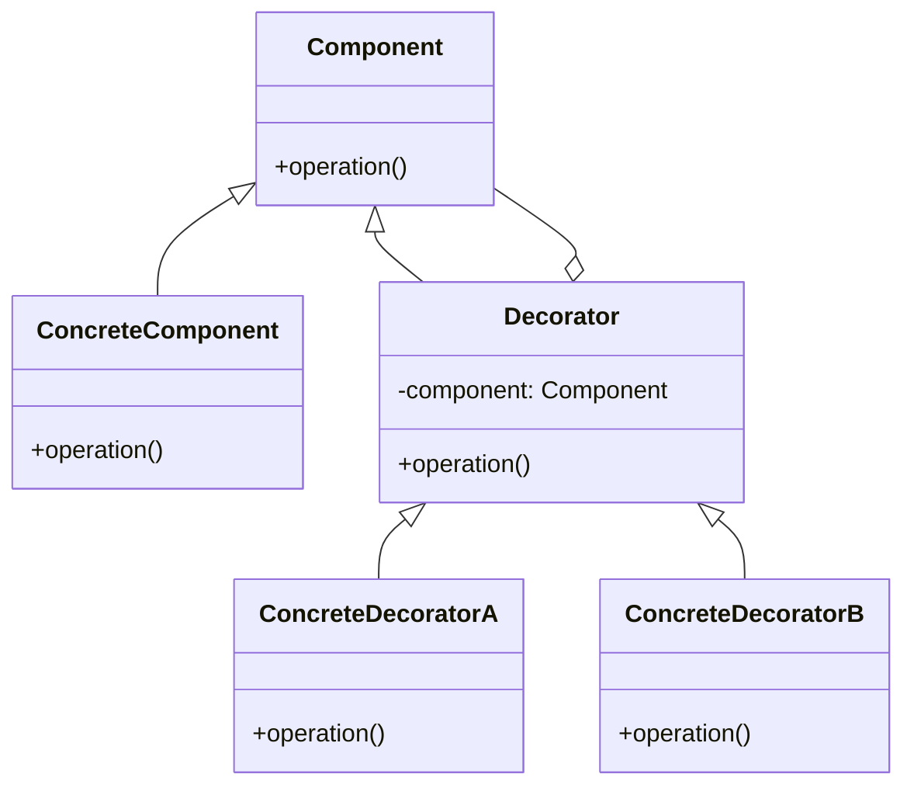

## 12.4.1 The Traditional Decorator Pattern

The Decorator pattern is a structural design pattern commonly used in object-oriented programming (OOP) to add new responsibilities to objects dynamically. This pattern is particularly useful when you want to enhance the functionality of an object without altering its structure or creating a complex inheritance hierarchy. Let's delve into the traditional Decorator pattern, its structure, applications, and how it can be translated into functional programming paradigms like Clojure.

### Understanding the Decorator Pattern

The Decorator pattern allows behavior to be added to individual objects, either statically or dynamically, without affecting the behavior of other objects from the same class. It is often used to adhere to the Open/Closed Principle, one of the SOLID principles of object-oriented design, which states that software entities should be open for extension but closed for modification.

#### Structure of the Decorator Pattern

The Decorator pattern involves several key components:

1. **Component Interface**: This defines the interface for objects that can have responsibilities added to them dynamically.
2. **Concrete Component**: This is the class of objects to which additional responsibilities can be attached.
3. **Decorator**: This is an abstract class that implements the component interface and contains a reference to a component object. It delegates all operations to the component.
4. **Concrete Decorators**: These are classes that extend the Decorator class and add responsibilities to the component.

#### UML Diagram of the Decorator Pattern

Below is a UML diagram illustrating the structure of the Decorator pattern:



**Diagram Description**: This UML diagram shows the relationship between the Component, ConcreteComponent, Decorator, and ConcreteDecorators. The Decorator class holds a reference to a Component and delegates operations to it, while ConcreteDecorators add additional behavior.

### Applying the Decorator Pattern in Java

Let's consider a simple example in Java to illustrate the Decorator pattern. Suppose we have a `Coffee` interface with a method `getCost()` and a `SimpleCoffee` class implementing this interface.

```java
// Component Interface
interface Coffee {
    double getCost();
}

// Concrete Component
class SimpleCoffee implements Coffee {
    @Override
    public double getCost() {
        return 5.0; // Base cost of coffee
    }
}

// Decorator
abstract class CoffeeDecorator implements Coffee {
    protected Coffee decoratedCoffee;

    public CoffeeDecorator(Coffee coffee) {
        this.decoratedCoffee = coffee;
    }

    @Override
    public double getCost() {
        return decoratedCoffee.getCost();
    }
}

// Concrete Decorator
class MilkDecorator extends CoffeeDecorator {
    public MilkDecorator(Coffee coffee) {
        super(coffee);
    }

    @Override
    public double getCost() {
        return super.getCost() + 1.5; // Adding cost of milk
    }
}

// Another Concrete Decorator
class SugarDecorator extends CoffeeDecorator {
    public SugarDecorator(Coffee coffee) {
        super(coffee);
    }

    @Override
    public double getCost() {
        return super.getCost() + 0.5; // Adding cost of sugar
    }
}

// Usage
public class CoffeeShop {
    public static void main(String[] args) {
        Coffee coffee = new SimpleCoffee();
        System.out.println("Cost: " + coffee.getCost());

        coffee = new MilkDecorator(coffee);
        System.out.println("Cost with milk: " + coffee.getCost());

        coffee = new SugarDecorator(coffee);
        System.out.println("Cost with milk and sugar: " + coffee.getCost());
    }
}
```

**Code Explanation**: In this example, `SimpleCoffee` is a basic coffee with a base cost. The `MilkDecorator` and `SugarDecorator` add additional costs for milk and sugar, respectively. The decorators wrap the original coffee object, allowing us to add features dynamically.

### Common Applications of the Decorator Pattern

The Decorator pattern is widely used in scenarios where:

- You need to add responsibilities to individual objects dynamically and transparently, without affecting other objects.
- You want to avoid an explosion of subclasses to support every combination of features.
- You need to adhere to the Open/Closed Principle by extending functionality without modifying existing code.

### Transitioning to Functional Programming

In functional programming, we often achieve similar outcomes using higher-order functions and function composition. Clojure, being a functional language, provides powerful abstractions that allow us to implement similar patterns without relying on inheritance or mutable state.

#### Clojure's Approach to the Decorator Pattern

In Clojure, we can use functions to achieve the same dynamic behavior as the Decorator pattern. Instead of creating classes and objects, we define functions that take other functions as arguments and return new functions with added behavior.

Here's how we can implement a similar pattern in Clojure:

```clojure
;; Base coffee function
(defn simple-coffee []
  {:cost 5.0})

;; Decorator function for milk
(defn milk-decorator [coffee-fn]
  (fn []
    (update (coffee-fn) :cost + 1.5)))

;; Decorator function for sugar
(defn sugar-decorator [coffee-fn]
  (fn []
    (update (coffee-fn) :cost + 0.5)))

;; Usage
(let [coffee (simple-coffee)
      coffee-with-milk ((milk-decorator simple-coffee))
      coffee-with-milk-and-sugar ((sugar-decorator (milk-decorator simple-coffee)))]
  (println "Cost:" (:cost coffee))
  (println "Cost with milk:" (:cost coffee-with-milk))
  (println "Cost with milk and sugar:" (:cost coffee-with-milk-and-sugar)))
```

**Code Explanation**: In this Clojure example, `simple-coffee` is a function that returns a map representing a coffee with a base cost. The `milk-decorator` and `sugar-decorator` are higher-order functions that take a coffee function and return a new function with added costs.

### Comparing Java and Clojure Implementations

- **Java**: Uses classes and inheritance to achieve dynamic behavior. The Decorator pattern in Java relies on object composition and delegation.
- **Clojure**: Uses higher-order functions and function composition. Clojure's approach is more flexible and concise, leveraging the language's functional nature.

### Advantages of Clojure's Functional Approach

- **Simplicity**: Clojure's approach reduces boilerplate code and complexity.
- **Flexibility**: Functions can be composed in various ways, offering more flexibility than class-based inheritance.
- **Immutability**: Clojure's immutable data structures ensure that state changes are explicit and controlled.

### Try It Yourself

Experiment with the Clojure code by adding new decorators, such as a `whipped-cream-decorator`, and see how it affects the total cost. Try composing decorators in different orders to observe the impact on the final result.

### Exercises

1. Implement a `whipped-cream-decorator` in the Clojure example and calculate the cost of coffee with milk, sugar, and whipped cream.
2. Modify the Java example to include a new decorator for chocolate syrup and update the cost calculations.

### Summary and Key Takeaways

- The Decorator pattern is a powerful design pattern for adding responsibilities to objects dynamically.
- In Java, it relies on object composition and delegation, while in Clojure, it leverages higher-order functions and function composition.
- Clojure's functional approach offers simplicity, flexibility, and immutability, making it a compelling choice for implementing similar patterns.

By understanding both the traditional and functional approaches to the Decorator pattern, we can choose the best strategy for our specific use cases and leverage the strengths of each paradigm.

### Further Reading

- [Official Clojure Documentation](https://clojure.org/)
- [ClojureDocs](https://clojuredocs.org/)
- [Design Patterns: Elements of Reusable Object-Oriented Software](https://en.wikipedia.org/wiki/Design_Patterns) by Erich Gamma et al.

## Quiz: Understanding the Traditional Decorator Pattern



### What is the primary purpose of the Decorator pattern?

- [x] To add responsibilities to objects dynamically
- [ ] To create a complex inheritance hierarchy
- [ ] To simplify object creation
- [ ] To enforce encapsulation

> **Explanation:** The Decorator pattern is used to add responsibilities to objects dynamically without altering their structure.

### Which principle does the Decorator pattern adhere to?

- [x] Open/Closed Principle
- [ ] Single Responsibility Principle
- [ ] Liskov Substitution Principle
- [ ] Interface Segregation Principle

> **Explanation:** The Decorator pattern adheres to the Open/Closed Principle, allowing objects to be extended without modifying existing code.

### How does the Decorator pattern achieve dynamic behavior in Java?

- [x] Through object composition and delegation
- [ ] Through inheritance and polymorphism
- [ ] Through reflection and proxies
- [ ] Through static methods and interfaces

> **Explanation:** In Java, the Decorator pattern achieves dynamic behavior through object composition and delegation.

### What is a key advantage of using Clojure's functional approach to the Decorator pattern?

- [x] It reduces boilerplate code and complexity
- [ ] It increases the number of classes needed
- [ ] It relies heavily on mutable state
- [ ] It requires extensive use of inheritance

> **Explanation:** Clojure's functional approach reduces boilerplate code and complexity by using higher-order functions and function composition.

### In Clojure, what is used to achieve similar outcomes as the Decorator pattern?

- [x] Higher-order functions and function composition
- [ ] Class inheritance and polymorphism
- [ ] Reflection and dynamic proxies
- [ ] Static methods and interfaces

> **Explanation:** In Clojure, higher-order functions and function composition are used to achieve similar outcomes as the Decorator pattern.

### Which of the following is a component of the traditional Decorator pattern?

- [x] Concrete Decorator
- [ ] Abstract Factory
- [ ] Singleton
- [ ] Observer

> **Explanation:** The Concrete Decorator is a component of the traditional Decorator pattern, responsible for adding responsibilities to the component.

### What does the Decorator pattern help avoid in object-oriented design?

- [x] An explosion of subclasses
- [ ] The use of interfaces
- [ ] The need for encapsulation
- [ ] The use of static methods

> **Explanation:** The Decorator pattern helps avoid an explosion of subclasses by allowing dynamic addition of responsibilities.

### How does Clojure's approach to the Decorator pattern differ from Java's?

- [x] It uses functions instead of classes
- [ ] It relies on inheritance
- [ ] It requires more boilerplate code
- [ ] It uses mutable state

> **Explanation:** Clojure's approach uses functions instead of classes, leveraging the language's functional nature.

### What is a benefit of using immutable data structures in Clojure's approach?

- [x] State changes are explicit and controlled
- [ ] State changes are implicit and uncontrolled
- [ ] It increases the complexity of code
- [ ] It requires more memory allocation

> **Explanation:** Immutable data structures in Clojure ensure that state changes are explicit and controlled, enhancing reliability.

### True or False: The Decorator pattern can only be implemented in object-oriented languages.

- [ ] True
- [x] False

> **Explanation:** The Decorator pattern can be implemented in both object-oriented and functional languages, using different approaches.


