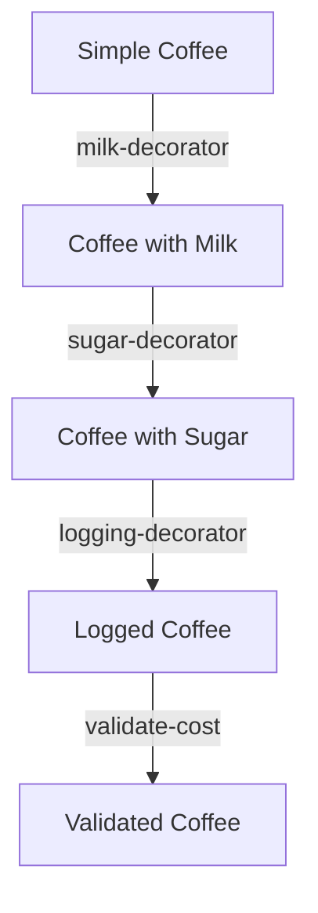

## 12.4.2 Functional Equivalent

In this section, we will explore how to implement the Decorator pattern in Clojure using higher-order functions. This approach allows us to enhance functions with additional behavior such as logging, validation, or other cross-cutting concerns. By leveraging Clojure's functional programming paradigm, we can achieve a more flexible and composable design compared to traditional object-oriented approaches.

### Understanding the Decorator Pattern

The Decorator pattern is a structural design pattern commonly used in object-oriented programming to add behavior to individual objects without affecting the behavior of other objects from the same class. In Java, this is typically achieved by creating a set of decorator classes that wrap the original object.

#### Java Example of the Decorator Pattern

Let's consider a simple Java example where we have a `Coffee` interface and a `SimpleCoffee` class. We want to add additional features like milk and sugar using decorators.

```java
// Coffee interface
public interface Coffee {
    double getCost();
    String getDescription();
}

// SimpleCoffee class
public class SimpleCoffee implements Coffee {
    public double getCost() {
        return 5.0;
    }

    public String getDescription() {
        return "Simple coffee";
    }
}

// MilkDecorator class
public class MilkDecorator implements Coffee {
    private final Coffee coffee;

    public MilkDecorator(Coffee coffee) {
        this.coffee = coffee;
    }

    public double getCost() {
        return coffee.getCost() + 1.5;
    }

    public String getDescription() {
        return coffee.getDescription() + ", milk";
    }
}

// SugarDecorator class
public class SugarDecorator implements Coffee {
    private final Coffee coffee;

    public SugarDecorator(Coffee coffee) {
        this.coffee = coffee;
    }

    public double getCost() {
        return coffee.getCost() + 0.5;
    }

    public String getDescription() {
        return coffee.getDescription() + ", sugar";
    }
}

// Usage
Coffee coffee = new SimpleCoffee();
coffee = new MilkDecorator(coffee);
coffee = new SugarDecorator(coffee);
System.out.println(coffee.getDescription() + " $" + coffee.getCost());
```

In this example, each decorator class wraps a `Coffee` object and adds its own behavior. This approach, while effective, can lead to a proliferation of classes.

### Functional Equivalent in Clojure

In Clojure, we can achieve the same result using higher-order functions. Higher-order functions are functions that take other functions as arguments or return them as results. This allows us to compose functionality in a more concise and flexible manner.

#### Clojure Implementation

Let's translate the Java example into Clojure using higher-order functions to achieve the same functionality.

```clojure
;; Define a simple coffee function
(defn simple-coffee []
  {:cost 5.0 :description "Simple coffee"})

;; Define a decorator function for milk
(defn milk-decorator [coffee-fn]
  (fn []
    (let [coffee (coffee-fn)]
      (-> coffee
          (update :cost + 1.5)
          (update :description str ", milk")))))

;; Define a decorator function for sugar
(defn sugar-decorator [coffee-fn]
  (fn []
    (let [coffee (coffee-fn)]
      (-> coffee
          (update :cost + 0.5)
          (update :description str ", sugar")))))

;; Usage
(def coffee (-> simple-coffee
                milk-decorator
                sugar-decorator))

(println (:description (coffee)) " $" (:cost (coffee)))
```

**Explanation:**

- **Simple Coffee Function**: We start with a basic `simple-coffee` function that returns a map with the cost and description.
- **Decorator Functions**: The `milk-decorator` and `sugar-decorator` are higher-order functions that take a coffee function as an argument and return a new function. This new function, when called, enhances the original coffee's properties.
- **Composition**: We use the `->` threading macro to compose the decorators, making it easy to add or remove decorators as needed.

### Advantages of Functional Approach

1. **Conciseness**: The functional approach reduces the need for multiple classes, resulting in more concise code.
2. **Flexibility**: Functions can be composed in any order, allowing for easy customization.
3. **Reusability**: Decorator functions can be reused across different contexts without modification.
4. **Immutability**: Clojure's immutable data structures ensure that the original coffee function remains unchanged.

### Enhancing Functions with Cross-Cutting Concerns

In addition to modifying cost and description, we can use decorators to add cross-cutting concerns such as logging and validation.

#### Adding Logging

Let's add logging to our coffee decorators to track when they are applied.

```clojure
(require '[clojure.tools.logging :as log])

(defn logging-decorator [coffee-fn]
  (fn []
    (log/info "Applying decorator")
    (coffee-fn)))

;; Usage with logging
(def coffee-with-logging (-> simple-coffee
                             milk-decorator
                             sugar-decorator
                             logging-decorator))

(println (:description (coffee-with-logging)) " $" (:cost (coffee-with-logging)))
```

**Explanation:**

- **Logging Decorator**: The `logging-decorator` wraps a coffee function and logs a message each time the function is called.
- **Integration**: We integrate logging by simply adding the `logging-decorator` to the composition chain.

#### Adding Validation

We can also add validation to ensure certain conditions are met before applying a decorator.

```clojure
(defn validate-cost [coffee-fn max-cost]
  (fn []
    (let [coffee (coffee-fn)]
      (if (<= (:cost coffee) max-cost)
        coffee
        (throw (ex-info "Cost exceeds maximum allowed" {:cost (:cost coffee)}))))))

;; Usage with validation
(def coffee-with-validation (-> simple-coffee
                                milk-decorator
                                sugar-decorator
                                (validate-cost 7.0)))

(try
  (println (:description (coffee-with-validation)) " $" (:cost (coffee-with-validation)))
  (catch Exception e
    (println "Validation failed:" (.getMessage e))))
```

**Explanation:**

- **Validation Decorator**: The `validate-cost` function checks if the coffee's cost exceeds a specified maximum. If it does, an exception is thrown.
- **Error Handling**: We use a `try-catch` block to handle validation errors gracefully.

### Visualizing Function Composition

To better understand how function composition works in Clojure, let's visualize the flow of data through our decorators.



**Diagram Explanation:**

- **Nodes**: Each node represents a state of the coffee object after a decorator is applied.
- **Edges**: Arrows indicate the flow of data through each decorator function.

### Try It Yourself

Experiment with the following modifications to deepen your understanding:

1. **Create a new decorator** that adds a flavor (e.g., vanilla) to the coffee.
2. **Modify the logging decorator** to include the current timestamp.
3. **Implement a discount decorator** that reduces the cost by a percentage.

### Exercises

1. **Implement a Tea Decorator**: Create a similar set of decorators for a `Tea` function. Consider adding decorators for lemon and honey.
2. **Chain Multiple Decorators**: Write a function that takes a list of decorators and applies them in sequence to a base function.
3. **Performance Analysis**: Measure the performance impact of adding multiple decorators. Use Clojure's `time` function to compare execution times.

### Key Takeaways

- **Higher-Order Functions**: Clojure's higher-order functions provide a powerful mechanism for implementing the Decorator pattern functionally.
- **Flexibility and Reusability**: The functional approach allows for flexible and reusable code, reducing the need for boilerplate.
- **Cross-Cutting Concerns**: Decorators can be used to add cross-cutting concerns such as logging and validation, enhancing the functionality of existing code.

By embracing Clojure's functional programming paradigm, we can implement design patterns like the Decorator in a more concise and expressive manner. This not only simplifies our code but also enhances its flexibility and maintainability.

For further reading on Clojure's functional programming capabilities, consider exploring the [Official Clojure Documentation](https://clojure.org/reference/documentation) and [ClojureDocs](https://clojuredocs.org/).

---

## Quiz: Understanding Functional Decorators in Clojure



### What is a key advantage of using higher-order functions in Clojure for implementing the Decorator pattern?

- [x] They allow for more concise and flexible code.
- [ ] They require more boilerplate code.
- [ ] They are only suitable for simple use cases.
- [ ] They make the code less readable.

> **Explanation:** Higher-order functions in Clojure enable concise and flexible code by allowing functions to be composed and reused easily.

### In the Clojure example, what does the `->` macro do?

- [x] It threads the result of each function call as the first argument to the next function.
- [ ] It creates a new thread for each function call.
- [ ] It converts a function into a macro.
- [ ] It is used for logging purposes.

> **Explanation:** The `->` macro in Clojure is used for threading the result of each function call as the first argument to the next function, simplifying function composition.

### How does the `logging-decorator` function enhance the coffee function?

- [x] By adding a log message each time the coffee function is called.
- [ ] By changing the cost of the coffee.
- [ ] By validating the coffee's description.
- [ ] By adding sugar to the coffee.

> **Explanation:** The `logging-decorator` function enhances the coffee function by adding a log message each time the function is called, providing insight into its usage.

### What happens if the `validate-cost` decorator finds the cost exceeds the maximum allowed?

- [x] An exception is thrown.
- [ ] The cost is automatically reduced.
- [ ] A warning is logged, but the function continues.
- [ ] The function returns `nil`.

> **Explanation:** If the `validate-cost` decorator finds the cost exceeds the maximum allowed, it throws an exception to prevent further execution.

### Which of the following is a benefit of using decorators for cross-cutting concerns?

- [x] They allow for separation of concerns and code reuse.
- [ ] They make the code more complex and harder to maintain.
- [ ] They are only applicable to logging.
- [ ] They require extensive refactoring of existing code.

> **Explanation:** Decorators allow for separation of concerns and code reuse, making it easier to manage cross-cutting concerns like logging and validation.

### What is the primary purpose of the `milk-decorator` function in the Clojure example?

- [x] To add milk to the coffee's description and increase its cost.
- [ ] To log the addition of milk to the coffee.
- [ ] To validate the coffee's ingredients.
- [ ] To remove milk from the coffee.

> **Explanation:** The `milk-decorator` function adds milk to the coffee's description and increases its cost, enhancing the original coffee function.

### How can decorators be composed in Clojure?

- [x] By using higher-order functions and threading macros like `->`.
- [ ] By creating a new class for each decorator.
- [ ] By using inheritance to extend the base function.
- [ ] By modifying the original function directly.

> **Explanation:** Decorators can be composed in Clojure using higher-order functions and threading macros like `->`, allowing for flexible and reusable function composition.

### What is a potential drawback of using decorators in a functional style?

- [x] They can introduce complexity if not managed properly.
- [ ] They require more classes and interfaces.
- [ ] They cannot handle cross-cutting concerns.
- [ ] They are not compatible with Clojure's immutable data structures.

> **Explanation:** While decorators offer flexibility, they can introduce complexity if not managed properly, especially when dealing with multiple layers of decoration.

### Which Clojure feature ensures that the original coffee function remains unchanged?

- [x] Immutability of data structures.
- [ ] The use of macros.
- [ ] The `def` keyword.
- [ ] The `let` binding.

> **Explanation:** Clojure's immutability of data structures ensures that the original coffee function remains unchanged, even when decorators are applied.

### True or False: In Clojure, decorators can only be used for modifying function outputs.

- [ ] True
- [x] False

> **Explanation:** False. In Clojure, decorators can be used for a variety of purposes, including modifying function outputs, adding logging, validation, and other cross-cutting concerns.


