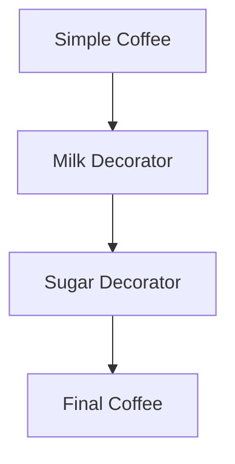

## 12.4.3 Benefits in Clojure

In this section, we will explore the benefits of implementing the Decorator Pattern in Clojure, focusing on the simplicity and elegance of the functional approach. We'll highlight how Clojure's features, such as immutability and higher-order functions, contribute to less code complexity and more straightforward composition compared to traditional object-oriented languages like Java.

### Introduction to the Decorator Pattern

The Decorator Pattern is a structural design pattern used to add new functionality to an object without altering its structure. In object-oriented programming (OOP), this is typically achieved by creating a set of decorator classes that are used to wrap concrete components. However, this approach can lead to a proliferation of classes and increased complexity.

**Java Example of the Decorator Pattern:**

```java
// Component Interface
interface Coffee {
    String getDescription();
    double getCost();
}

// Concrete Component
class SimpleCoffee implements Coffee {
    public String getDescription() {
        return "Simple Coffee";
    }

    public double getCost() {
        return 5.0;
    }
}

// Decorator
abstract class CoffeeDecorator implements Coffee {
    protected Coffee decoratedCoffee;

    public CoffeeDecorator(Coffee coffee) {
        this.decoratedCoffee = coffee;
    }

    public String getDescription() {
        return decoratedCoffee.getDescription();
    }

    public double getCost() {
        return decoratedCoffee.getCost();
    }
}

// Concrete Decorators
class MilkDecorator extends CoffeeDecorator {
    public MilkDecorator(Coffee coffee) {
        super(coffee);
    }

    public String getDescription() {
        return decoratedCoffee.getDescription() + ", Milk";
    }

    public double getCost() {
        return decoratedCoffee.getCost() + 1.5;
    }
}

class SugarDecorator extends CoffeeDecorator {
    public SugarDecorator(Coffee coffee) {
        super(coffee);
    }

    public String getDescription() {
        return decoratedCoffee.getDescription() + ", Sugar";
    }

    public double getCost() {
        return decoratedCoffee.getCost() + 0.5;
    }
}

// Usage
Coffee coffee = new SimpleCoffee();
coffee = new MilkDecorator(coffee);
coffee = new SugarDecorator(coffee);
System.out.println(coffee.getDescription() + " $" + coffee.getCost());
```

In this Java example, we see the use of multiple classes to achieve the desired functionality. Each decorator class adds a layer of functionality, which can lead to a complex hierarchy.

### The Functional Approach in Clojure

Clojure, being a functional language, allows us to implement the Decorator Pattern in a more concise and elegant manner using functions and higher-order functions. This approach reduces the need for multiple classes and leverages Clojure's strengths, such as immutability and first-class functions.

**Clojure Example of the Decorator Pattern:**

```clojure
;; Define a simple coffee function
(defn simple-coffee []
  {:description "Simple Coffee"
   :cost 5.0})

;; Define a decorator function for milk
(defn milk-decorator [coffee]
  (update coffee :description #(str % ", Milk"))
  (update coffee :cost #(+ % 1.5)))

;; Define a decorator function for sugar
(defn sugar-decorator [coffee]
  (update coffee :description #(str % ", Sugar"))
  (update coffee :cost #(+ % 0.5)))

;; Usage
(let [coffee (-> (simple-coffee)
                 milk-decorator
                 sugar-decorator)]
  (println (:description coffee) "$" (:cost coffee)))
```

In this Clojure example, we use functions to achieve the same result as the Java example. Each decorator is a function that takes a coffee map and returns a new map with the added functionality. This approach is not only more concise but also more flexible and easier to maintain.

### Benefits of the Functional Approach in Clojure

#### 1. **Simplicity and Conciseness**

Clojure's functional approach allows us to express the Decorator Pattern with fewer lines of code. By using functions instead of classes, we eliminate the need for a complex class hierarchy. This simplicity makes the code easier to read and understand.

#### 2. **Immutability**

Clojure's immutable data structures ensure that each decorator function returns a new coffee map without modifying the original. This immutability leads to safer and more predictable code, as there are no side effects or unexpected changes to shared state.

#### 3. **Higher-Order Functions**

Clojure's support for higher-order functions allows us to easily compose decorators. By chaining functions together, we can build complex behavior from simple, reusable components. This composability is a powerful feature that enhances code reuse and modularity.

#### 4. **Flexibility**

The functional approach provides greater flexibility in applying decorators. We can easily add, remove, or reorder decorators by modifying the function composition. This flexibility is harder to achieve with a rigid class-based structure.

#### 5. **Reduced Boilerplate**

By eliminating the need for multiple classes and interfaces, Clojure reduces boilerplate code. This reduction in boilerplate not only makes the codebase smaller but also reduces the potential for errors and simplifies maintenance.

### Visualizing the Functional Decorator Pattern

To better understand the flow of data through the functional decorators, let's visualize the process using a Mermaid.js diagram.



**Diagram Description:** This diagram illustrates the flow of data through the functional decorators. The `Simple Coffee` is first passed through the `Milk Decorator`, then through the `Sugar Decorator`, resulting in the `Final Coffee`.

### Comparing Clojure and Java Approaches

| Aspect                  | Java Approach                               | Clojure Approach                          |
|-------------------------|---------------------------------------------|-------------------------------------------|
| **Code Complexity**     | High due to multiple classes and interfaces | Low due to concise function definitions   |
| **Immutability**        | Requires careful management of state        | Built-in with immutable data structures   |
| **Composability**       | Limited by class hierarchy                  | High due to function composition          |
| **Flexibility**         | Rigid structure                             | Flexible function chaining                |
| **Boilerplate Code**    | Significant                                 | Minimal                                   |

### Try It Yourself

To deepen your understanding, try modifying the Clojure example:

- Add a new decorator function for "Whipped Cream" that adds $0.75 to the cost.
- Experiment with the order of decorators to see how it affects the final result.
- Create a function that applies a list of decorators to a coffee map.

### Further Reading

For more information on Clojure's functional programming capabilities, consider exploring the following resources:

- [Official Clojure Documentation](https://clojure.org/reference/documentation)
- [ClojureDocs](https://clojuredocs.org/)
- [Functional Programming in Clojure](https://www.braveclojure.com/)

### Exercises

1. Implement a new decorator function in Clojure that adds a "Vanilla Syrup" option to the coffee.
2. Refactor the Java example to use interfaces for decorators instead of abstract classes.
3. Compare the performance of the Java and Clojure implementations using a simple benchmarking tool.

### Key Takeaways

- Clojure's functional approach to the Decorator Pattern offers simplicity, conciseness, and flexibility.
- Immutability and higher-order functions are key features that enhance code safety and composability.
- The functional approach reduces boilerplate code and allows for easy modification and extension of functionality.

Now that we've explored the benefits of the functional Decorator Pattern in Clojure, let's apply these concepts to create more elegant and maintainable code in your applications.

## Quiz: Understanding the Benefits of the Functional Decorator Pattern in Clojure



### What is a key advantage of using the functional approach to the Decorator Pattern in Clojure?

- [x] Reduced code complexity
- [ ] Increased class hierarchy
- [ ] More boilerplate code
- [ ] Less flexibility

> **Explanation:** The functional approach in Clojure reduces code complexity by using functions instead of classes, leading to simpler and more concise code.

### How does Clojure's immutability benefit the Decorator Pattern?

- [x] Ensures no side effects
- [ ] Allows direct state modification
- [ ] Increases class dependencies
- [ ] Requires more boilerplate

> **Explanation:** Immutability in Clojure ensures that each decorator function returns a new object without side effects, leading to safer and more predictable code.

### What feature of Clojure enhances code composability in the Decorator Pattern?

- [x] Higher-order functions
- [ ] Class inheritance
- [ ] Interface implementation
- [ ] Static typing

> **Explanation:** Higher-order functions in Clojure allow for easy composition of decorators, enhancing code reuse and modularity.

### Which of the following is a benefit of using functions over classes in Clojure?

- [x] Reduced boilerplate code
- [ ] Increased code complexity
- [ ] More rigid structure
- [ ] Less flexibility

> **Explanation:** Using functions over classes in Clojure reduces boilerplate code, making the codebase smaller and easier to maintain.

### What is a common challenge when using the Decorator Pattern in Java?

- [x] Managing a complex class hierarchy
- [ ] Ensuring immutability
- [ ] Function composition
- [ ] Minimal boilerplate code

> **Explanation:** In Java, the Decorator Pattern often involves managing a complex class hierarchy, which can increase code complexity.

### How does Clojure's functional approach improve flexibility in the Decorator Pattern?

- [x] Allows easy modification of decorators
- [ ] Requires strict class structures
- [ ] Limits function chaining
- [ ] Increases boilerplate

> **Explanation:** Clojure's functional approach allows for easy modification and reordering of decorators through function composition, enhancing flexibility.

### What is the role of higher-order functions in Clojure's Decorator Pattern?

- [x] They enable function composition
- [ ] They enforce class inheritance
- [ ] They increase code rigidity
- [ ] They require more interfaces

> **Explanation:** Higher-order functions enable function composition, allowing decorators to be easily chained and combined in Clojure.

### In Clojure, what does immutability ensure when applying decorators?

- [x] No side effects or state changes
- [ ] Direct modification of objects
- [ ] Increased class dependencies
- [ ] More boilerplate code

> **Explanation:** Immutability ensures that applying decorators in Clojure does not cause side effects or state changes, leading to more reliable code.

### What is a benefit of using Clojure's functional approach over Java's class-based approach?

- [x] Simpler and more concise code
- [ ] More complex class hierarchies
- [ ] Increased boilerplate
- [ ] Less flexibility

> **Explanation:** Clojure's functional approach results in simpler and more concise code compared to Java's class-based approach, reducing complexity.

### True or False: Clojure's functional approach to the Decorator Pattern requires more boilerplate code than Java's class-based approach.

- [ ] True
- [x] False

> **Explanation:** False. Clojure's functional approach requires less boilerplate code than Java's class-based approach, making it more concise and easier to maintain.


