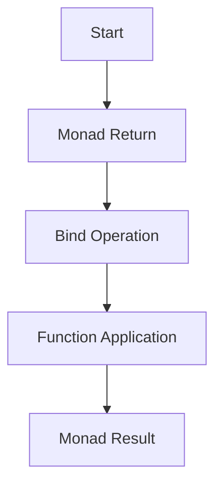

## 12.5.1 Introduction to Monads

Monads are a fundamental concept in functional programming, often described as a design pattern that allows for the composition of functions that produce computational effects. For Java developers transitioning to Clojure, understanding monads can enhance your ability to manage side effects, state, and other contextual computations in a functional way.

### What Are Monads?

At their core, monads provide a way to structure programs generically. They encapsulate behavior such as state, I/O, or exceptions, allowing you to build pipelines of operations while abstracting away the underlying complexities. In essence, a monad is a type that implements two essential operations: `bind` (often represented as `>>=`) and `return` (or `unit`).

#### Simple Analogy: The Burrito

Imagine a monad as a burrito. The filling represents your data or computation, and the tortilla is the monadic context that wraps around it. Just as you can add ingredients to a burrito without unwrapping it, monads allow you to apply functions to the data inside without exposing the context.

### Monads in Clojure

Clojure, being a Lisp dialect, doesn't have built-in monads like Haskell, but you can implement them using higher-order functions and closures. Let's explore how monads can be constructed and used in Clojure.

#### The Maybe Monad

The Maybe monad is a common example used to handle computations that may fail. It encapsulates an optional value, representing either a value (`Just`) or no value (`Nothing`).

```clojure
(defn maybe-bind [m f]
  (if (nil? m)
    nil
    (f m)))

(defn maybe-return [x]
  x)

;; Example usage
(defn safe-divide [x y]
  (if (zero? y)
    nil
    (/ x y)))

(def result (maybe-bind (safe-divide 10 2) (fn [x] (maybe-return (* x 2)))))
;; result => 10
```

In this example, `maybe-bind` checks if the value is `nil` and only applies the function `f` if it is not. This pattern prevents errors from propagating through your code.

### Comparing Monads to Java

In Java, handling optional values or computations that might fail is typically done using `Optional`, `try-catch` blocks, or similar constructs. Monads in Clojure provide a more compositional approach, allowing you to chain operations without explicit error handling at each step.

#### Java Example: Optional

```java
import java.util.Optional;

public class MaybeExample {
    public static Optional<Integer> safeDivide(int x, int y) {
        return y == 0 ? Optional.empty() : Optional.of(x / y);
    }

    public static void main(String[] args) {
        Optional<Integer> result = safeDivide(10, 2).map(x -> x * 2);
        result.ifPresent(System.out::println); // Prints 10
    }
}
```

### Monad Laws

Monads must adhere to three laws that ensure consistent behavior:

1. **Left Identity**: `return a >>= f` is equivalent to `f a`.
2. **Right Identity**: `m >>= return` is equivalent to `m`.
3. **Associativity**: `(m >>= f) >>= g` is equivalent to `m >>= (x -> f x >>= g)`.

These laws ensure that monadic operations are predictable and composable.

### Implementing Monads in Clojure

Let's implement a simple monad in Clojure to understand how these laws apply. We'll create a `Writer` monad, which logs messages alongside computations.

```clojure
(defn writer-bind [m f]
  (let [[value log] m
        [new-value new-log] (f value)]
    [new-value (str log new-log)]))

(defn writer-return [x]
  [x ""])

;; Example usage
(defn add-log [x]
  [x (str "Added " x "\n")])

(def result (writer-bind (writer-return 5) add-log))
;; result => [5 "Added 5\n"]
```

In this example, `writer-bind` combines the logs from multiple computations, demonstrating how monads can manage additional context.

### Try It Yourself

Experiment with the `Writer` monad by modifying the `add-log` function to include more complex logging. Consider how you might use this pattern to track state changes in a larger application.

### Visualizing Monads

To better understand how monads work, let's visualize the flow of data through a monadic pipeline using a Mermaid.js diagram.



**Diagram Explanation**: This diagram illustrates the flow of data through a monadic pipeline, starting with the `return` operation, followed by a series of `bind` operations that apply functions to the encapsulated data.

### Further Reading

To deepen your understanding of monads, consider exploring the following resources:

- [ClojureDocs: Monads](https://clojuredocs.org)
- [Official Clojure Documentation](https://clojure.org)
- [Learn You a Haskell for Great Good!](http://learnyouahaskell.com/)

### Exercises

1. Implement a `State` monad in Clojure and use it to manage stateful computations.
2. Compare the `Maybe` monad in Clojure to Java's `Optional` by implementing a similar example in both languages.
3. Create a custom monad for handling I/O operations in a functional way.

### Key Takeaways

- **Monads provide a way to handle computations with context**, such as state, I/O, or exceptions, in a functional programming paradigm.
- **Clojure allows you to implement monads using higher-order functions**, enabling you to manage side effects and state in a compositional manner.
- **Understanding monad laws ensures predictable and consistent behavior** when composing monadic operations.
- **Monads offer a more compositional approach compared to traditional Java constructs**, allowing for cleaner and more maintainable code.

Now that we've explored the concept of monads in Clojure, let's apply these principles to manage state and side effects effectively in your applications.

## Quiz: Understanding Monads in Clojure



### What is a monad in functional programming?

- [x] A design pattern for handling computations with context
- [ ] A data structure for storing values
- [ ] A type of loop in functional programming
- [ ] A method for optimizing performance

> **Explanation:** Monads are a design pattern used to handle computations with context, such as state, I/O, or exceptions.

### Which operation is not part of the monad definition?

- [ ] Bind
- [ ] Return
- [x] Map
- [ ] Unit

> **Explanation:** The core operations of a monad are `bind` and `return` (or `unit`), not `map`.

### What does the Maybe monad represent?

- [x] An optional value that can be present or absent
- [ ] A sequence of values
- [ ] A fixed-size collection
- [ ] A mutable state

> **Explanation:** The Maybe monad encapsulates an optional value, representing either a value (`Just`) or no value (`Nothing`).

### How does the Writer monad manage additional context?

- [x] By logging messages alongside computations
- [ ] By storing values in a list
- [ ] By creating new threads
- [ ] By modifying global state

> **Explanation:** The Writer monad logs messages alongside computations, managing additional context.

### Which law is not a monad law?

- [ ] Left Identity
- [ ] Right Identity
- [x] Commutativity
- [ ] Associativity

> **Explanation:** The monad laws are Left Identity, Right Identity, and Associativity. Commutativity is not a monad law.

### What is the purpose of the `bind` operation in a monad?

- [x] To apply a function to the encapsulated value and return a new monad
- [ ] To create a new monad from a value
- [ ] To concatenate two monads
- [ ] To transform a monad into a list

> **Explanation:** The `bind` operation applies a function to the encapsulated value and returns a new monad.

### How does the Maybe monad prevent errors from propagating?

- [x] By checking for `nil` values and only applying functions when a value is present
- [ ] By using exception handling
- [ ] By logging errors
- [ ] By retrying failed operations

> **Explanation:** The Maybe monad checks for `nil` values and only applies functions when a value is present, preventing errors from propagating.

### What is a key advantage of using monads in Clojure compared to Java?

- [x] Monads offer a compositional approach to managing side effects
- [ ] Monads are faster than Java constructs
- [ ] Monads require less code
- [ ] Monads eliminate all side effects

> **Explanation:** Monads offer a compositional approach to managing side effects, allowing for cleaner and more maintainable code.

### What does the `return` operation do in a monad?

- [x] It wraps a value in a monadic context
- [ ] It applies a function to a value
- [ ] It concatenates two monads
- [ ] It logs a message

> **Explanation:** The `return` operation wraps a value in a monadic context, preparing it for further monadic operations.

### True or False: Monads are unique to Clojure and cannot be implemented in Java.

- [ ] True
- [x] False

> **Explanation:** Monads are not unique to Clojure and can be implemented in any language that supports higher-order functions, including Java.


