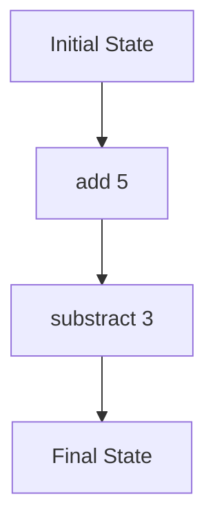

## 12.5.2 State Monad in Clojure

As experienced Java developers transitioning to Clojure, you may be familiar with managing state through mutable variables and objects. However, in functional programming, immutability is a core principle, and managing state requires a different approach. The **state monad** is a powerful tool that allows us to handle stateful computations in a purely functional way, without resorting to mutable variables. In this section, we'll explore how the state monad works in Clojure and how it can be used to manage state effectively.

### Understanding the State Monad

The state monad is a design pattern used in functional programming to encapsulate stateful computations. It allows us to thread state through a sequence of computations without explicitly passing it around. This is particularly useful in scenarios where multiple functions need to read from and write to a shared state.

#### Key Concepts

- **Stateful Computation**: A computation that depends on or modifies some state.
- **Monad**: An abstraction that allows for structuring programs generically. Monads provide a way to chain operations together.
- **State Monad**: A specific type of monad that deals with stateful computations.

In Java, managing state often involves mutable objects or static variables. In contrast, Clojure's state monad allows us to maintain immutability while still managing state.

### The State Monad in Clojure

Clojure does not have built-in support for monads like Haskell, but we can implement the state monad using Clojure's functional capabilities. Let's start by defining a simple state monad.

```clojure
(defn state [run-state]
  {:run-state run-state})

(defn run-state [state-monad initial-state]
  ((:run-state state-monad) initial-state))

(defn bind [state-monad f]
  (state (fn [initial-state]
           (let [[value new-state] (run-state state-monad initial-state)]
             (run-state (f value) new-state)))))
```

- **state**: Creates a state monad with a given state transition function.
- **run-state**: Executes the state monad with an initial state.
- **bind**: Chains stateful computations together.

#### Example: Counter

Let's illustrate the state monad with a simple example: a counter that increments its state.

```clojure
(defn increment []
  (state (fn [s] [s (inc s)])))

(defn example []
  (let [initial-state 0
        incremented (bind (increment) (fn [_] (increment)))]
    (run-state incremented initial-state)))

;; Usage
(example) ;; => [1 2]
```

In this example, we define an `increment` function that returns a state monad. The `example` function chains two increments together using `bind`, starting from an initial state of 0.

### Comparing with Java

In Java, managing state typically involves mutable variables:

```java
public class Counter {
    private int count;

    public Counter(int initialCount) {
        this.count = initialCount;
    }

    public int increment() {
        return ++count;
    }
}

// Usage
Counter counter = new Counter(0);
counter.increment(); // 1
counter.increment(); // 2
```

In contrast, the Clojure state monad maintains immutability by threading state through computations.

### Benefits of the State Monad

- **Immutability**: State is passed through computations without mutation.
- **Composability**: Stateful computations can be composed using `bind`.
- **Encapsulation**: State transitions are encapsulated within monadic functions.

### Implementing a State Monad Library

Let's build a more comprehensive state monad library in Clojure.

```clojure
(defn return [value]
  (state (fn [s] [value s])))

(defn get-state []
  (state (fn [s] [s s])))

(defn put-state [new-state]
  (state (fn [_] [nil new-state])))

(defn modify-state [f]
  (bind (get-state) (fn [s] (put-state (f s)))))
```

- **return**: Wraps a value in a state monad.
- **get-state**: Retrieves the current state.
- **put-state**: Replaces the current state with a new state.
- **modify-state**: Applies a function to modify the state.

#### Example: Stateful Computation

Let's use our state monad library to perform a stateful computation.

```clojure
(defn add [x]
  (modify-state (fn [s] (+ s x))))

(defn subtract [x]
  (modify-state (fn [s] (- s x))))

(defn stateful-computation []
  (bind (add 5)
        (fn [_] (bind (subtract 3)
                      (fn [_] (get-state))))))
```

In this example, we define `add` and `subtract` functions that modify the state. The `stateful-computation` function chains these operations together, returning the final state.

### Visualizing the State Monad

To better understand how the state monad works, let's visualize the flow of data through a stateful computation.



**Diagram Description**: This diagram illustrates the flow of state through a sequence of computations using the state monad. The initial state is transformed by adding 5 and then subtracting 3, resulting in the final state.

### Try It Yourself

Experiment with the state monad by modifying the code examples:

- Change the initial state and observe the effect on the final state.
- Add more operations to the stateful computation.
- Implement a new stateful operation, such as multiplication or division.

### Exercises

1. Implement a state monad function that simulates a simple banking system with deposit and withdrawal operations.
2. Create a stateful computation that tracks the history of state changes.
3. Refactor a Java class with mutable state into a Clojure state monad.

### Key Takeaways

- The state monad allows us to manage stateful computations in a functional way, maintaining immutability.
- Clojure's functional capabilities enable us to implement monads, even though they are not built-in.
- By using the state monad, we can compose stateful operations and encapsulate state transitions.

### Further Reading

- [Official Clojure Documentation](https://clojure.org/reference/documentation)
- [ClojureDocs](https://clojuredocs.org/)
- [Functional Programming in Scala](https://www.manning.com/books/functional-programming-in-scala) - A book that covers functional programming concepts, including monads.

Now that we've explored how the state monad can manage stateful computations in Clojure, let's apply these concepts to your applications and see how they can simplify state management while maintaining immutability.

## Quiz: Mastering the State Monad in Clojure



### What is the primary purpose of the state monad in Clojure?

- [x] To manage stateful computations without mutable variables
- [ ] To provide a way to handle exceptions
- [ ] To optimize performance of Clojure applications
- [ ] To facilitate object-oriented programming

> **Explanation:** The state monad is used to manage stateful computations in a functional way, maintaining immutability.


### How does the state monad maintain immutability in Clojure?

- [x] By threading state through computations without mutation
- [ ] By using mutable variables internally
- [ ] By relying on Java's concurrency mechanisms
- [ ] By using static variables

> **Explanation:** The state monad threads state through computations, ensuring that state is passed without mutation.


### What function in the state monad library retrieves the current state?

- [x] `get-state`
- [ ] `put-state`
- [ ] `modify-state`
- [ ] `return`

> **Explanation:** The `get-state` function retrieves the current state in the state monad.


### Which function in the state monad library is used to replace the current state?

- [x] `put-state`
- [ ] `get-state`
- [ ] `modify-state`
- [ ] `return`

> **Explanation:** The `put-state` function replaces the current state with a new state.


### What is the role of the `bind` function in the state monad?

- [x] To chain stateful computations together
- [ ] To initialize the state monad
- [ ] To retrieve the current state
- [ ] To replace the current state

> **Explanation:** The `bind` function is used to chain stateful computations, allowing for composability.


### In the state monad example, what is the initial state in the `example` function?

- [x] 0
- [ ] 1
- [ ] 5
- [ ] 10

> **Explanation:** The initial state in the `example` function is set to 0.


### What is the final state after executing the `stateful-computation` function?

- [x] 2
- [ ] 5
- [ ] 3
- [ ] 0

> **Explanation:** The final state is 2 after adding 5 and subtracting 3.


### How does the state monad compare to Java's mutable state management?

- [x] It maintains immutability by threading state through computations
- [ ] It uses static variables for state management
- [ ] It relies on Java's concurrency mechanisms
- [ ] It uses mutable objects internally

> **Explanation:** The state monad maintains immutability by threading state through computations, unlike Java's mutable state management.


### What is a key benefit of using the state monad in functional programming?

- [x] Composability of stateful operations
- [ ] Increased performance
- [ ] Simplified syntax
- [ ] Object-oriented design

> **Explanation:** The state monad allows for composability of stateful operations, enhancing functional programming practices.


### True or False: The state monad is built into Clojure's core library.

- [ ] True
- [x] False

> **Explanation:** The state monad is not built into Clojure's core library, but can be implemented using Clojure's functional capabilities.


