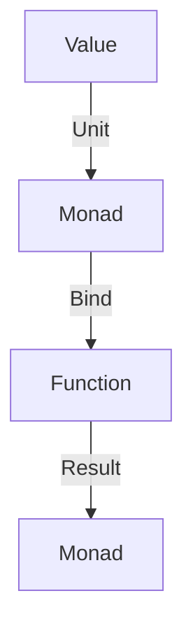

## 12.5.3 When to Use Monads

As experienced Java developers transitioning to Clojure, you might have encountered the concept of monads in the context of functional programming. While monads are not as pervasive in Clojure as they are in languages like Haskell, understanding them can be valuable in specific contexts. In this section, we will explore scenarios where monads are beneficial in Clojure programming, drawing parallels with Java concepts to facilitate understanding.

### Understanding Monads

Before diving into when to use monads, let's briefly revisit what a monad is. A monad is a design pattern used to handle program-wide concerns in a functional way, such as state management, I/O, exceptions, and more. It provides a way to chain operations together, managing side effects and enhancing code modularity and reusability.

In Clojure, monads are not built into the language but can be implemented using libraries like `cats` or `clojure.algo.monads`. The core idea is to encapsulate values and provide a mechanism to apply functions to these encapsulated values.

### Key Concepts of Monads

1. **Unit (or Return)**: A function that takes a value and returns a monad containing that value.
2. **Bind (or FlatMap)**: A function that takes a monad and a function, applies the function to the monad's value, and returns a new monad.

### When to Use Monads in Clojure

#### 1. Managing State

Monads can be particularly useful for managing state in a functional way. In Java, you might use mutable objects or static variables to manage state, which can lead to issues with concurrency and testability. In Clojure, monads can help manage state without resorting to mutable data structures.

**Example: State Monad**

```clojure
(require '[clojure.algo.monads :refer [defmonad domonad]])

(defmonad state-m
  [m-result (fn [v] (fn [s] [v s]))
   m-bind   (fn [mv f] (fn [s]
                         (let [[v s'] (mv s)]
                           ((f v) s'))))])

(defn increment [x]
  (domonad state-m
    [s (fn [state] [state (inc state)])]
    s))

;; Usage
(let [state-fn (increment 0)]
  (state-fn 10)) ;; => [10 11]
```

In this example, the state monad encapsulates state transformations, allowing you to chain operations without explicitly passing state around.

#### 2. Handling Side Effects

Monads can encapsulate side effects, making them easier to manage and reason about. In Java, you might use try-catch blocks or logging frameworks to handle side effects. In Clojure, monads can provide a more functional approach.

**Example: Maybe Monad for Error Handling**

```clojure
(require '[cats.monad.maybe :as maybe])

(defn safe-divide [num denom]
  (if (zero? denom)
    (maybe/nothing)
    (maybe/just (/ num denom))))

;; Usage
(maybe/with-monad maybe/maybe-m
  (maybe/mlet [result (safe-divide 10 2)]
    (maybe/return result))) ;; => Just 5

(maybe/with-monad maybe/maybe-m
  (maybe/mlet [result (safe-divide 10 0)]
    (maybe/return result))) ;; => Nothing
```

The Maybe monad allows you to handle potential errors without explicit error checking, similar to Java's Optional.

#### 3. Sequencing Computations

Monads can sequence computations, ensuring that each step is executed in order. This is useful in scenarios where the output of one computation is the input to the next.

**Example: Writer Monad for Logging**

```clojure
(require '[cats.monad.writer :as writer])

(defn log-add [x y]
  (writer/writer (+ x y) [(str "Added " x " and " y)]))

(defn log-multiply [x y]
  (writer/writer (* x y) [(str "Multiplied " x " and " y)]))

;; Usage
(writer/with-writer
  (writer/mlet [sum (log-add 3 4)
                product (log-multiply sum 2)]
    (writer/return product))) ;; => [14 ["Added 3 and 4" "Multiplied 7 and 2"]]
```

The Writer monad allows you to accumulate logs alongside computations, similar to using a logger in Java.

### Comparing Monads in Clojure and Java

In Java, monads are often implemented using classes and interfaces, such as `Optional`, `CompletableFuture`, or custom monadic types. Clojure, being a functional language, allows for more concise and expressive monadic implementations.

**Java Example: Optional**

```java
import java.util.Optional;

public class MonadExample {
    public static void main(String[] args) {
        Optional<Integer> result = Optional.of(10)
            .flatMap(x -> Optional.of(x / 2));

        result.ifPresent(System.out::println); // Output: 5
    }
}
```

In this Java example, `Optional` is used to handle potential null values, similar to the Maybe monad in Clojure.

### Try It Yourself

Experiment with the provided Clojure examples by modifying the functions or adding new operations. Try implementing a custom monad for a specific use case, such as handling asynchronous computations or managing configuration settings.

### Diagrams and Visualizations

Below is a diagram illustrating the flow of data through a monad, highlighting the unit and bind operations.



**Caption**: This diagram shows how a value is encapsulated in a monad using the unit operation, and how functions are applied using the bind operation to produce a new monad.

### Further Reading

For more in-depth exploration of monads in Clojure, consider the following resources:

- [Clojure's `clojure.algo.monads` library documentation](https://clojure.github.io/algo.monads/)
- [Cats library for Clojure](https://github.com/funcool/cats)
- [Official Clojure Documentation](https://clojure.org/reference/documentation)

### Exercises

1. Implement a custom monad to handle configuration settings in a Clojure application.
2. Refactor a Java program using `Optional` to a Clojure program using the Maybe monad.
3. Create a sequence of computations using the Writer monad to log operations in a Clojure application.

### Key Takeaways

- Monads provide a functional way to manage state, handle side effects, and sequence computations in Clojure.
- While not pervasive in Clojure, monads can be valuable in specific contexts, offering a more modular and reusable approach to common programming challenges.
- Understanding monads can enhance your ability to write idiomatic Clojure code and leverage functional programming principles effectively.

Now that we've explored when to use monads in Clojure, let's apply these concepts to manage state and side effects effectively in your applications.

## Quiz: Mastering Monads in Clojure



### What is a monad primarily used for in functional programming?

- [x] Managing side effects and sequencing computations
- [ ] Handling exceptions in a procedural way
- [ ] Optimizing performance of loops
- [ ] Simplifying object-oriented design

> **Explanation:** Monads are used to manage side effects and sequence computations in a functional way, enhancing modularity and reusability.

### Which function encapsulates a value into a monad?

- [x] Unit (or Return)
- [ ] Bind (or FlatMap)
- [ ] Map
- [ ] Filter

> **Explanation:** The Unit (or Return) function encapsulates a value into a monad, preparing it for further operations.

### In Clojure, which library is commonly used for implementing monads?

- [x] clojure.algo.monads
- [ ] clojure.core.async
- [ ] clojure.java.jdbc
- [ ] clojure.data.json

> **Explanation:** The `clojure.algo.monads` library provides tools for implementing monads in Clojure.

### What is the purpose of the Bind function in a monad?

- [x] To apply a function to a monad's value and return a new monad
- [ ] To encapsulate a value into a monad
- [ ] To execute a monad in parallel
- [ ] To convert a monad into a list

> **Explanation:** The Bind function applies a function to a monad's value and returns a new monad, allowing for chaining operations.

### Which monad is useful for handling potential errors without explicit error checking?

- [x] Maybe Monad
- [ ] State Monad
- [ ] Writer Monad
- [ ] IO Monad

> **Explanation:** The Maybe Monad is used to handle potential errors by encapsulating values that may or may not be present.

### How does the Writer monad help in logging operations?

- [x] By accumulating logs alongside computations
- [ ] By executing log statements in parallel
- [ ] By converting logs into JSON format
- [ ] By filtering out log messages

> **Explanation:** The Writer monad accumulates logs alongside computations, providing a functional way to handle logging.

### What is the equivalent of the Maybe monad in Java?

- [x] Optional
- [ ] CompletableFuture
- [ ] Stream
- [ ] List

> **Explanation:** Java's `Optional` is equivalent to the Maybe monad, handling potential null values in a functional way.

### Which operation is used to chain computations in a monad?

- [x] Bind (or FlatMap)
- [ ] Unit (or Return)
- [ ] Filter
- [ ] Reduce

> **Explanation:** The Bind (or FlatMap) operation is used to chain computations in a monad, applying functions to encapsulated values.

### What is a key benefit of using monads in Clojure?

- [x] Enhanced modularity and reusability
- [ ] Improved object-oriented design
- [ ] Faster execution of loops
- [ ] Simplified syntax for conditionals

> **Explanation:** Monads enhance modularity and reusability by providing a functional way to manage side effects and sequence computations.

### True or False: Monads are a built-in feature of Clojure.

- [ ] True
- [x] False

> **Explanation:** Monads are not a built-in feature of Clojure but can be implemented using libraries like `clojure.algo.monads`.


