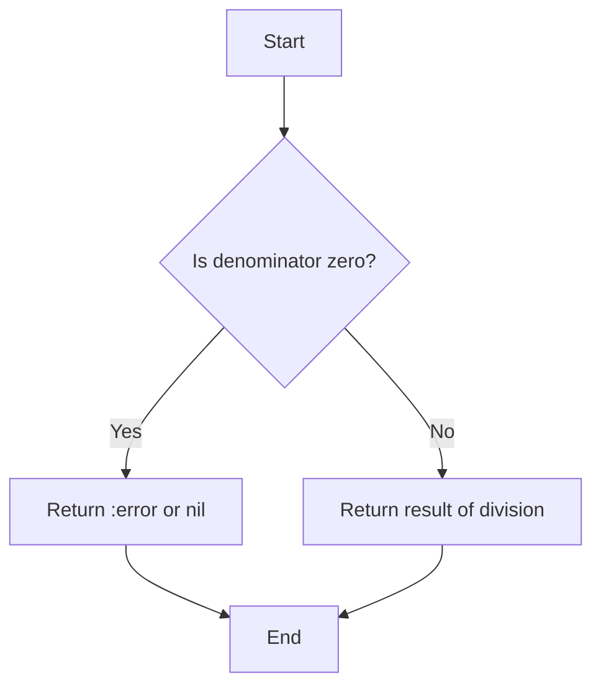

## 12.6.1 Pure Functions and Error Handling

In the realm of functional programming, **pure functions** are a cornerstone concept. They are functions where the output is determined solely by the input values, without observable side effects. This predictability makes them easier to test and reason about. However, handling errors in pure functions requires a different approach compared to imperative programming languages like Java. In this section, we'll explore how Clojure handles errors in pure functions, using return values to represent failure states, and compare these techniques with Java's error handling mechanisms.

### Understanding Pure Functions

Before diving into error handling, let's briefly revisit what makes a function pure:

- **Deterministic**: Given the same inputs, a pure function will always produce the same output.
- **No Side Effects**: Pure functions do not alter any state or interact with the outside world (e.g., no I/O operations).

In Clojure, pure functions are encouraged as they lead to more reliable and maintainable code. Here's a simple example of a pure function in Clojure:

```clojure
(defn add [x y]
  (+ x y))
```

This function is pure because it only depends on its inputs and does not modify any external state.

### Error Handling in Pure Functions

In functional programming, error handling is often done by returning values that indicate success or failure. This is in contrast to Java, where exceptions are commonly used. Let's explore some common patterns in Clojure for handling errors in pure functions.

#### Returning `nil`

One straightforward approach is to return `nil` to indicate a failure. This is similar to returning `null` in Java, but with the advantage that Clojure provides functions to safely handle `nil` values.

```clojure
(defn safe-divide [numerator denominator]
  (if (zero? denominator)
    nil
    (/ numerator denominator)))

;; Usage
(safe-divide 10 0)  ; => nil
(safe-divide 10 2)  ; => 5
```

In this example, `safe-divide` returns `nil` when the denominator is zero, avoiding a division by zero error.

#### Using Keywords like `:error`

Another approach is to return a keyword such as `:error` to indicate a failure state. This can make the code more expressive and self-documenting.

```clojure
(defn safe-divide [numerator denominator]
  (if (zero? denominator)
    :error
    (/ numerator denominator)))

;; Usage
(safe-divide 10 0)  ; => :error
(safe-divide 10 2)  ; => 5
```

This method provides a clear indication of an error, which can be useful for debugging and logging.

#### Custom Error Types

For more complex scenarios, you might define custom error types. This can be done using maps or records in Clojure.

```clojure
(defn safe-divide [numerator denominator]
  (if (zero? denominator)
    {:error "Division by zero"}
    (/ numerator denominator)))

;; Usage
(safe-divide 10 0)  ; => {:error "Division by zero"}
(safe-divide 10 2)  ; => 5
```

By returning a map with an error message, you provide more context about the failure, which can be invaluable for debugging.

### Comparing with Java's Error Handling

Java typically uses exceptions to handle errors, which can lead to complex control flow and make the code harder to follow. Here's a Java example of handling division by zero using exceptions:

```java
public class SafeDivide {
    public static Double safeDivide(double numerator, double denominator) {
        try {
            return numerator / denominator;
        } catch (ArithmeticException e) {
            return null;  // or throw a custom exception
        }
    }
}
```

In this Java example, we catch an `ArithmeticException` to handle division by zero. While exceptions are powerful, they can also lead to less predictable code paths and require additional handling logic.

### Advantages of Clojure's Approach

Clojure's approach to error handling in pure functions offers several advantages:

- **Predictability**: By returning values that represent failure states, the control flow remains predictable and easy to follow.
- **Composability**: Functions that return error values can be easily composed with other functions, allowing for more flexible and reusable code.
- **Immutability**: Error handling in Clojure aligns with the language's emphasis on immutability, reducing the risk of unintended side effects.

### Handling Errors with `Either` and `Maybe` Patterns

Clojure also supports more advanced error handling patterns inspired by Haskell's `Either` and `Maybe` types. These patterns can be implemented using libraries like `cats` or `core.match`.

#### The `Either` Pattern

The `Either` pattern represents a value that can be one of two types: a success or an error. This is similar to Java's `Optional` or `Result` types in other languages.

```clojure
(require '[cats.monad.either :as either])

(defn safe-divide [numerator denominator]
  (if (zero? denominator)
    (either/left :division-by-zero)
    (either/right (/ numerator denominator))))

;; Usage
(either/branch (safe-divide 10 0)
  (fn [error] (println "Error:" error))
  (fn [result] (println "Result:" result)))
```

In this example, `safe-divide` returns an `Either` value, which can be processed using `either/branch` to handle both success and error cases.

#### The `Maybe` Pattern

The `Maybe` pattern is used to represent an optional value that might be absent. This is akin to Java's `Optional`.

```clojure
(require '[cats.monad.maybe :as maybe])

(defn safe-divide [numerator denominator]
  (if (zero? denominator)
    maybe/nothing
    (maybe/just (/ numerator denominator))))

;; Usage
(maybe/branch (safe-divide 10 0)
  (fn [] (println "No result"))
  (fn [result] (println "Result:" result)))
```

Here, `safe-divide` returns a `Maybe` value, which can be processed to handle the absence of a result gracefully.

### Try It Yourself

To deepen your understanding, try modifying the `safe-divide` function to handle other error cases, such as invalid input types. Experiment with different error handling patterns and see how they affect the readability and maintainability of your code.

### Diagrams and Visualizations

To better understand how data flows through these error handling patterns, consider the following flowchart that illustrates the decision-making process in the `safe-divide` function:



**Diagram Description**: This flowchart shows the decision-making process in the `safe-divide` function, highlighting how different return values are used to indicate success or failure.

### Further Reading

For more information on error handling in Clojure, consider exploring the following resources:

- [Official Clojure Documentation](https://clojure.org/reference/documentation)
- [ClojureDocs](https://clojuredocs.org/)
- [Cats Library on GitHub](https://github.com/funcool/cats)

### Exercises

1. Implement a function that safely parses a string into an integer, returning `nil` or an error keyword if the string is not a valid integer.
2. Modify the `safe-divide` function to return a custom error type using a map with additional context.
3. Create a series of functions that use the `Either` pattern to handle errors in a data processing pipeline.

### Key Takeaways

- **Pure functions** in Clojure handle errors by returning values that represent failure states, such as `nil`, `:error`, or custom error types.
- This approach contrasts with Java's use of exceptions, offering more predictable and composable error handling.
- Advanced patterns like `Either` and `Maybe` provide additional flexibility for handling optional and error-prone computations.
- Experimenting with different error handling strategies can improve the readability and maintainability of your Clojure code.

Now that we've explored how pure functions handle errors in Clojure, let's apply these concepts to manage errors effectively in your applications.

## Quiz: Understanding Pure Functions and Error Handling in Clojure



### What is a pure function in Clojure?

- [x] A function that always produces the same output for the same input and has no side effects.
- [ ] A function that can modify global state.
- [ ] A function that handles exceptions internally.
- [ ] A function that performs I/O operations.

> **Explanation:** Pure functions are deterministic and do not cause side effects, making them predictable and easy to test.

### How does Clojure typically handle errors in pure functions?

- [x] By returning values that represent failure states, such as `nil` or `:error`.
- [ ] By throwing exceptions.
- [ ] By logging errors to a file.
- [ ] By using global error handlers.

> **Explanation:** Clojure uses return values to indicate errors, which aligns with functional programming principles.

### What is an advantage of using `Either` pattern in Clojure?

- [x] It allows handling both success and error cases explicitly.
- [ ] It automatically logs errors.
- [ ] It simplifies exception handling.
- [ ] It reduces code complexity by ignoring errors.

> **Explanation:** The `Either` pattern provides a structured way to handle both success and failure, enhancing code clarity.

### What does the `Maybe` pattern represent in Clojure?

- [x] An optional value that might be absent.
- [ ] A guaranteed non-null value.
- [ ] A function that always returns a value.
- [ ] A pattern for handling exceptions.

> **Explanation:** The `Maybe` pattern is used to represent values that may or may not be present, similar to Java's `Optional`.

### How does Clojure's error handling differ from Java's?

- [x] Clojure uses return values to indicate errors, while Java uses exceptions.
- [ ] Clojure uses exceptions, while Java uses return values.
- [ ] Both use exceptions for error handling.
- [ ] Both use return values for error handling.

> **Explanation:** Clojure favors return values for error handling, which is more predictable and composable than Java's exception-based approach.

### What is a benefit of using custom error types in Clojure?

- [x] They provide more context about the error.
- [ ] They automatically fix the error.
- [ ] They reduce the need for error handling.
- [ ] They simplify the code by ignoring errors.

> **Explanation:** Custom error types can include additional information, making debugging and error handling more effective.

### What is the role of `nil` in Clojure's error handling?

- [x] It can represent a failure state or absence of a value.
- [ ] It indicates a successful operation.
- [ ] It is used to throw exceptions.
- [ ] It is used to log errors.

> **Explanation:** `nil` is often used to signify the absence of a result or a failure, similar to `null` in Java.

### Which library can be used for advanced error handling patterns in Clojure?

- [x] Cats
- [ ] Log4j
- [ ] JUnit
- [ ] Mockito

> **Explanation:** The Cats library provides monadic constructs like `Either` and `Maybe` for advanced error handling.

### What is a key characteristic of pure functions?

- [x] They do not modify any external state.
- [ ] They can perform I/O operations.
- [ ] They handle exceptions internally.
- [ ] They always return `nil`.

> **Explanation:** Pure functions do not cause side effects, ensuring that they do not alter external state.

### True or False: Clojure's error handling approach makes code less predictable.

- [ ] True
- [x] False

> **Explanation:** Clojure's approach to error handling using return values makes code more predictable and easier to reason about.


