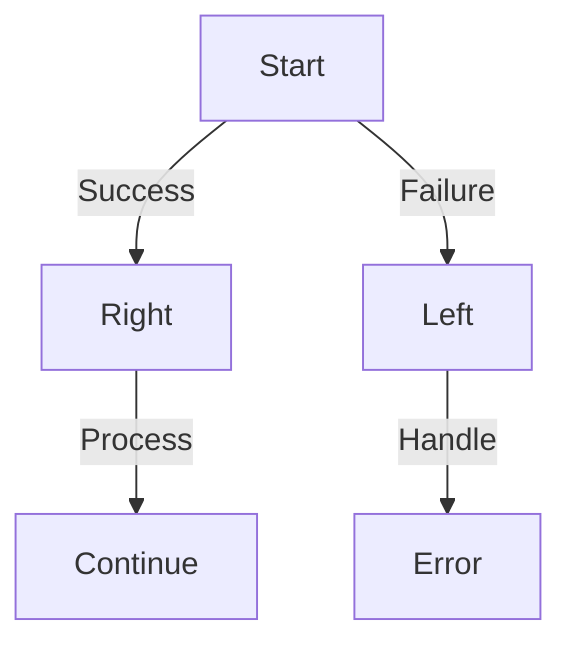

## 12.6.2 The Either Monad and `maybe` Pattern

In the world of functional programming, handling errors gracefully is a crucial aspect of writing robust and maintainable code. Unlike traditional imperative languages like Java, where exceptions are commonly used for error handling, functional programming languages like Clojure offer alternative patterns that align with their core principles. Two such patterns are the **Either Monad** and the **`maybe` Pattern**. These patterns provide a way to represent computations that may fail, without resorting to exceptions, thereby promoting a more declarative and predictable error-handling strategy.

### Understanding the Either Monad

The **Either Monad** is a powerful construct used to represent a value that can be one of two types: a success or a failure. In Clojure, this is typically represented using a data structure that can hold either a "right" value (indicating success) or a "left" value (indicating failure). This dual nature allows developers to handle errors in a functional way, chaining operations without breaking the flow of computation.

#### Either Monad Structure

The Either Monad can be visualized as follows:



*Diagram: The flow of data through the Either Monad, where computations can either continue with a Right (success) or handle an error with a Left (failure).*

#### Implementing the Either Monad in Clojure

Let's implement a simple version of the Either Monad in Clojure:

```clojure
(defn right [value]
  {:type :right, :value value})

(defn left [value]
  {:type :left, :value value})

(defn either [right-fn left-fn either-value]
  (case (:type either-value)
    :right (right-fn (:value either-value))
    :left (left-fn (:value either-value))))
```

In this implementation:
- `right` and `left` are constructors for creating success and failure values, respectively.
- `either` is a function that takes two functions (`right-fn` and `left-fn`) and an `either-value`. It applies the appropriate function based on whether the value is a `right` or a `left`.

#### Using the Either Monad

Consider a scenario where we want to parse an integer from a string. This operation can fail if the string is not a valid integer:

```clojure
(defn parse-int [s]
  (try
    (right (Integer/parseInt s))
    (catch NumberFormatException e
      (left (str "Invalid number: " s)))))

(defn process-number [n]
  (str "The number is " n))

(defn handle-error [err]
  (str "Error: " err))

(let [result (parse-int "123")]
  (either process-number handle-error result))
```

In this example:
- `parse-int` attempts to parse a string into an integer, returning a `right` on success and a `left` on failure.
- `either` is used to process the result, applying `process-number` if successful and `handle-error` if an error occurs.

### The `maybe` Pattern

The **`maybe` Pattern** is another functional approach to error handling, representing a computation that might return a value or nothing at all. This pattern is akin to Java's `Optional` type, providing a way to handle the absence of a value without resorting to null checks or exceptions.

#### Implementing the `maybe` Pattern in Clojure

A simple implementation of the `maybe` pattern can be achieved using Clojure's `nil` and `some`:

```clojure
(defn maybe [value]
  (if (nil? value)
    {:type :none}
    {:type :some, :value value}))

(defn maybe-bind [maybe-value f]
  (if (= (:type maybe-value) :some)
    (f (:value maybe-value))
    maybe-value))
```

In this implementation:
- `maybe` wraps a value, distinguishing between `some` (a present value) and `none` (absence of value).
- `maybe-bind` applies a function to the value if it exists, otherwise returns `none`.

#### Using the `maybe` Pattern

Let's use the `maybe` pattern to safely access a nested map:

```clojure
(defn get-nested-value [m keys]
  (reduce (fn [acc k]
            (maybe-bind acc #(get % k)))
          (maybe m)
          keys))

(let [data {:user {:name "Alice" :age 30}}]
  (get-nested-value data [:user :name])) ; => {:type :some, :value "Alice"}
```

In this example:
- `get-nested-value` attempts to traverse a map using a sequence of keys, returning `some` if all keys are found and `none` otherwise.

### Comparing with Java

In Java, error handling often involves exceptions or the use of `Optional` for nullable values. Let's compare these approaches with Clojure's functional patterns:

#### Java Example with Exceptions

```java
public Integer parseInt(String s) {
    try {
        return Integer.parseInt(s);
    } catch (NumberFormatException e) {
        return null; // or throw a custom exception
    }
}
```

#### Java Example with Optional

```java
import java.util.Optional;

public Optional<Integer> parseInt(String s) {
    try {
        return Optional.of(Integer.parseInt(s));
    } catch (NumberFormatException e) {
        return Optional.empty();
    }
}
```

#### Clojure's Advantage

Clojure's `Either` and `maybe` patterns provide a more declarative and composable approach to error handling, avoiding the pitfalls of exceptions and null values. These patterns encourage developers to think about error handling as part of the data flow, leading to more robust and maintainable code.

### Try It Yourself

To deepen your understanding, try modifying the provided Clojure examples:
- Extend the `either` function to log errors to a file.
- Implement a `maybe-map` function that applies a transformation to a `maybe` value.
- Create a chain of operations using the Either Monad to simulate a simple transaction system.

### Exercises

1. Implement a function using the Either Monad to handle division, returning a `left` if division by zero is attempted.
2. Use the `maybe` pattern to safely access elements in a list, returning `none` if the index is out of bounds.
3. Refactor a Java method that uses exceptions for control flow into a Clojure function using the Either Monad.

### Key Takeaways

- The **Either Monad** and **`maybe` Pattern** offer functional alternatives to traditional error handling methods.
- These patterns promote a declarative style, integrating error handling into the data flow.
- Clojure's approach to error handling can lead to more predictable and maintainable code compared to exception-driven models.
- By leveraging these patterns, developers can write code that is both expressive and resilient to errors.

For further reading, explore the [Official Clojure Documentation](https://clojure.org/reference/documentation) and [ClojureDocs](https://clojuredocs.org/).

## Quiz: Mastering the Either Monad and `maybe` Pattern



### What is the primary purpose of the Either Monad in Clojure?

- [x] To represent computations that can result in success or failure
- [ ] To handle asynchronous operations
- [ ] To optimize performance
- [ ] To manage state changes

> **Explanation:** The Either Monad is used to represent computations that can either succeed or fail, providing a functional way to handle errors.

### How does the `maybe` pattern differ from Java's `Optional`?

- [x] It uses `nil` and `some` to represent absence and presence of values
- [ ] It throws exceptions for missing values
- [ ] It is used for concurrency
- [ ] It is a type of collection

> **Explanation:** The `maybe` pattern in Clojure uses `nil` and `some` to represent the absence and presence of values, similar to Java's `Optional`.

### Which function is used to apply a transformation in the `maybe` pattern?

- [x] `maybe-bind`
- [ ] `either`
- [ ] `map`
- [ ] `filter`

> **Explanation:** `maybe-bind` is used to apply a transformation to a `maybe` value if it exists.

### In the Either Monad, what does the `right` constructor represent?

- [x] Success
- [ ] Failure
- [ ] Absence of value
- [ ] An exception

> **Explanation:** In the Either Monad, the `right` constructor represents a successful computation.

### What is a key advantage of using the Either Monad over exceptions?

- [x] It integrates error handling into the data flow
- [ ] It increases code verbosity
- [ ] It requires more boilerplate code
- [ ] It is only suitable for asynchronous code

> **Explanation:** The Either Monad integrates error handling into the data flow, making it more declarative and composable.

### How can you handle errors in a chain of operations using the Either Monad?

- [x] By using the `either` function to apply different functions for success and failure
- [ ] By throwing exceptions
- [ ] By using `try-catch` blocks
- [ ] By ignoring errors

> **Explanation:** The `either` function allows you to handle errors by applying different functions for success and failure cases.

### What does the `left` constructor in the Either Monad signify?

- [x] Failure
- [ ] Success
- [ ] A completed computation
- [ ] A concurrent operation

> **Explanation:** The `left` constructor in the Either Monad signifies a failure in the computation.

### Which of the following is a benefit of using the `maybe` pattern?

- [x] It avoids null checks
- [ ] It increases code complexity
- [ ] It is only useful for database operations
- [ ] It requires external libraries

> **Explanation:** The `maybe` pattern avoids null checks by providing a functional way to handle the absence of values.

### What is the role of `maybe-bind` in the `maybe` pattern?

- [x] To apply a function to a `maybe` value if it exists
- [ ] To create a new `maybe` value
- [ ] To handle exceptions
- [ ] To manage concurrency

> **Explanation:** `maybe-bind` is used to apply a function to a `maybe` value if it exists, allowing for chaining operations.

### True or False: The Either Monad and `maybe` pattern are only applicable in Clojure.

- [ ] True
- [x] False

> **Explanation:** While the Either Monad and `maybe` pattern are commonly used in Clojure, they are applicable in many functional programming languages.


