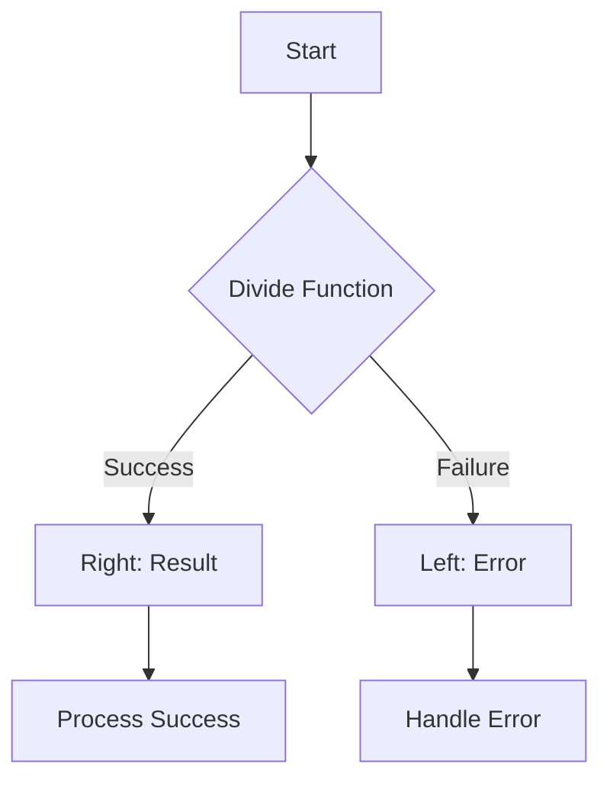
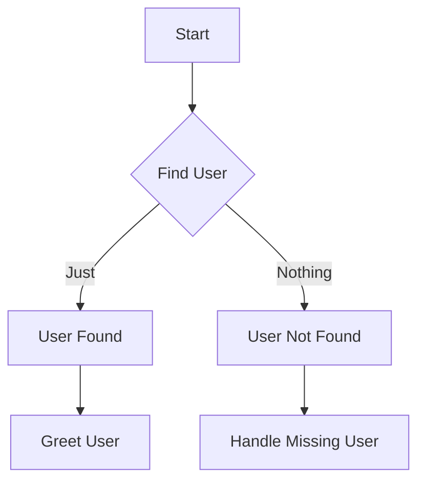

## 12.6.3 Practical Applications

In this section, we will delve into practical applications of error handling patterns in Clojure, focusing on how these patterns can lead to more robust and composable applications. We will explore how Clojure's functional approach to error handling can reduce the reliance on traditional try-catch blocks, which are prevalent in Java. By leveraging functional patterns such as the Either Monad and the `maybe` pattern, we can create applications that handle errors gracefully and maintain composability.

### Introduction to Error Handling in Clojure

Error handling is a critical aspect of software development. In Java, developers often rely on exceptions and try-catch blocks to manage errors. While this approach is effective, it can lead to code that is difficult to read and maintain. Clojure, with its functional programming paradigm, offers alternative patterns that promote cleaner and more maintainable code.

#### The Limitations of Try-Catch Blocks

In Java, try-catch blocks are used to handle exceptions. However, they can lead to several issues:

- **Scattered Error Handling**: Try-catch blocks can be scattered throughout the codebase, making it difficult to understand the overall error handling strategy.
- **Tight Coupling**: Error handling logic is often tightly coupled with business logic, reducing code readability and maintainability.
- **Limited Composability**: Try-catch blocks do not compose well, making it challenging to build complex error handling workflows.

### Functional Error Handling Patterns in Clojure

Clojure provides several functional patterns for error handling that address these limitations. Two of the most prominent patterns are the Either Monad and the `maybe` pattern.

#### The Either Monad

The Either Monad is a functional programming construct that represents a value that can be one of two types: a success or a failure. This pattern allows developers to handle errors without resorting to exceptions.

**Clojure Example: Using the Either Monad**

```clojure
(ns error-handling.either
  (:require [cats.monad.either :as either]))

(defn divide [numerator denominator]
  (if (zero? denominator)
    (either/left "Division by zero error")
    (either/right (/ numerator denominator))))

(defn safe-divide [numerator denominator]
  (either/bind (divide numerator denominator)
               (fn [result]
                 (either/right (str "Result: " result)))))

;; Usage
(let [result (safe-divide 10 0)]
  (either/branch result
                 (fn [error] (println "Error:" error))
                 (fn [success] (println "Success:" success))))
```

In this example, the `divide` function returns an Either Monad, which can be either a success (right) or a failure (left). The `safe-divide` function uses `either/bind` to chain operations, and `either/branch` to handle the result.

**Advantages of the Either Monad**

- **Composability**: The Either Monad allows for chaining operations, making it easy to build complex workflows.
- **Separation of Concerns**: Error handling logic is separated from business logic, improving code readability.
- **Explicit Error Handling**: Errors are handled explicitly, reducing the risk of unhandled exceptions.

#### The `maybe` Pattern

The `maybe` pattern is another functional construct that represents a value that may or may not be present. It is useful for handling optional values and avoiding null pointer exceptions.

**Clojure Example: Using the `maybe` Pattern**

```clojure
(ns error-handling.maybe
  (:require [cats.monad.maybe :as maybe]))

(defn find-user [user-id]
  (if (= user-id 1)
    (maybe/just {:id 1 :name "Alice"})
    (maybe/nothing)))

(defn greet-user [user-id]
  (maybe/bind (find-user user-id)
              (fn [user]
                (maybe/just (str "Hello, " (:name user) "!")))))

;; Usage
(let [greeting (greet-user 2)]
  (maybe/branch greeting
                (fn [] (println "User not found"))
                (fn [message] (println message))))
```

In this example, the `find-user` function returns a `maybe` value, which can be either `just` (a value is present) or `nothing` (no value). The `greet-user` function uses `maybe/bind` to chain operations, and `maybe/branch` to handle the result.

**Advantages of the `maybe` Pattern**

- **Null Safety**: The `maybe` pattern eliminates null pointer exceptions by handling optional values explicitly.
- **Composability**: Like the Either Monad, the `maybe` pattern allows for chaining operations.
- **Clear Semantics**: The presence or absence of a value is clearly represented, improving code clarity.

### Practical Applications of Error Handling Patterns

Now that we have explored the theoretical aspects of functional error handling patterns, let's look at some practical applications.

#### Building Robust APIs

When building APIs, error handling is crucial for providing meaningful responses to clients. By using functional patterns, we can create APIs that handle errors gracefully and return informative error messages.

**Example: API Error Handling with Either Monad**

```clojure
(ns api.error-handling
  (:require [cats.monad.either :as either]))

(defn fetch-data [endpoint]
  (if (= endpoint "/valid")
    (either/right {:data "Sample data"})
    (either/left "Invalid endpoint")))

(defn process-request [endpoint]
  (either/bind (fetch-data endpoint)
               (fn [response]
                 (either/right (str "Processed: " (:data response))))))

;; Usage
(let [result (process-request "/invalid")]
  (either/branch result
                 (fn [error] (println "API Error:" error))
                 (fn [success] (println "API Success:" success))))
```

In this example, the `fetch-data` function simulates an API call that can succeed or fail. The `process-request` function processes the response using the Either Monad, ensuring that errors are handled gracefully.

#### Enhancing Data Processing Pipelines

Data processing pipelines often involve multiple steps, each of which can fail. By using functional error handling patterns, we can build pipelines that handle errors at each step and continue processing.

**Example: Data Processing with `maybe` Pattern**

```clojure
(ns data-processing.maybe
  (:require [cats.monad.maybe :as maybe]))

(defn parse-data [data]
  (if (string? data)
    (maybe/just (clojure.string/split data #","))
    (maybe/nothing)))

(defn process-data [data]
  (maybe/bind (parse-data data)
              (fn [parsed]
                (maybe/just (map clojure.string/trim parsed)))))

;; Usage
(let [result (process-data "apple, banana, cherry")]
  (maybe/branch result
                (fn [] (println "Data parsing failed"))
                (fn [processed] (println "Processed data:" processed))))
```

In this example, the `parse-data` function parses a string into a list of values, and the `process-data` function processes the parsed data. The `maybe` pattern ensures that errors are handled at each step.

#### Simplifying User Input Validation

User input validation is another area where functional error handling patterns can be beneficial. By using these patterns, we can validate user input in a composable and readable manner.

**Example: User Input Validation with Either Monad**

```clojure
(ns user-input.validation
  (:require [cats.monad.either :as either]))

(defn validate-name [name]
  (if (and (string? name) (not (clojure.string/blank? name)))
    (either/right name)
    (either/left "Invalid name")))

(defn validate-age [age]
  (if (and (integer? age) (pos? age))
    (either/right age)
    (either/left "Invalid age")))

(defn validate-user [name age]
  (either/bind (validate-name name)
               (fn [valid-name]
                 (either/bind (validate-age age)
                              (fn [valid-age]
                                (either/right {:name valid-name :age valid-age}))))))

;; Usage
(let [result (validate-user "Alice" 30)]
  (either/branch result
                 (fn [error] (println "Validation Error:" error))
                 (fn [user] (println "Valid User:" user))))
```

In this example, the `validate-name` and `validate-age` functions validate user input, and the `validate-user` function combines these validations using the Either Monad. This approach ensures that errors are handled at each validation step.

### Try It Yourself

To deepen your understanding of functional error handling patterns in Clojure, try modifying the examples above:

1. **Extend the API Error Handling Example**: Add additional endpoints and error conditions to the `fetch-data` function. Implement a retry mechanism for failed requests.

2. **Enhance the Data Processing Pipeline**: Add additional processing steps to the `process-data` function. Implement error handling for each step.

3. **Expand User Input Validation**: Add additional validation rules to the `validate-user` function. Implement error aggregation to return all validation errors at once.

### Diagrams and Visualizations

To better understand the flow of data through these functional error handling patterns, let's visualize the process using Mermaid.js diagrams.

**Diagram: Either Monad Flow**



*Caption*: This diagram illustrates the flow of data through the Either Monad in the divide function example. The function can result in either a success (right) or a failure (left), and each outcome is handled accordingly.

**Diagram: Maybe Pattern Flow**



*Caption*: This diagram shows the flow of data through the `maybe` pattern in the find-user example. The function can return either a `just` value (user found) or `nothing` (user not found), and each case is handled appropriately.

### Further Reading

For more information on functional error handling patterns in Clojure, consider exploring the following resources:

- [Official Clojure Documentation](https://clojure.org/)
- [ClojureDocs](https://clojuredocs.org/)
- [Cats Library on GitHub](https://github.com/funcool/cats)

### Exercises and Practice Problems

To reinforce your understanding of functional error handling patterns in Clojure, try solving the following exercises:

1. **Implement a File Reader**: Create a function that reads a file and returns its contents using the Either Monad. Handle file not found and read errors gracefully.

2. **Build a Calculator**: Implement a simple calculator that performs basic arithmetic operations. Use the `maybe` pattern to handle invalid inputs.

3. **Create a User Registration System**: Develop a user registration system that validates user input using the Either Monad. Implement error aggregation to return all validation errors at once.

### Key Takeaways

- Functional error handling patterns in Clojure, such as the Either Monad and the `maybe` pattern, provide robust alternatives to traditional try-catch blocks.
- These patterns promote composability, separation of concerns, and explicit error handling, leading to cleaner and more maintainable code.
- By applying these patterns in practical applications, such as API error handling, data processing pipelines, and user input validation, we can create more robust and reliable software.

Now that we've explored how functional error handling patterns can enhance your Clojure applications, let's apply these concepts to build more robust and composable systems.

## Quiz: Mastering Error Handling Patterns in Clojure



### What is a key advantage of using the Either Monad for error handling in Clojure?

- [x] It allows for composable error handling workflows.
- [ ] It eliminates the need for any error handling.
- [ ] It automatically logs all errors.
- [ ] It is only useful for handling null values.

> **Explanation:** The Either Monad allows for composable error handling workflows, making it easy to chain operations and handle errors explicitly.

### How does the `maybe` pattern help in handling optional values?

- [x] It explicitly represents the presence or absence of a value.
- [ ] It converts all values to strings.
- [ ] It automatically retries failed operations.
- [ ] It only works with numeric values.

> **Explanation:** The `maybe` pattern explicitly represents the presence or absence of a value, eliminating null pointer exceptions and improving code clarity.

### In the context of error handling, what does "composability" refer to?

- [x] The ability to chain operations and handle errors in a structured manner.
- [ ] The ability to write code without any errors.
- [ ] The ability to automatically fix errors.
- [ ] The ability to use exceptions instead of functional patterns.

> **Explanation:** Composability refers to the ability to chain operations and handle errors in a structured manner, which is a key advantage of functional error handling patterns.

### What is a limitation of using try-catch blocks in Java for error handling?

- [x] They can lead to scattered and tightly coupled error handling logic.
- [ ] They automatically handle all errors without any additional code.
- [ ] They improve code readability and maintainability.
- [ ] They are only used for handling null values.

> **Explanation:** Try-catch blocks can lead to scattered and tightly coupled error handling logic, making code difficult to read and maintain.

### Which functional pattern is useful for handling optional values in Clojure?

- [x] The `maybe` pattern
- [ ] The Either Monad
- [ ] The State Monad
- [ ] The List Monad

> **Explanation:** The `maybe` pattern is useful for handling optional values in Clojure, explicitly representing the presence or absence of a value.

### How can functional error handling patterns improve API development?

- [x] By providing meaningful error messages and handling errors gracefully.
- [ ] By eliminating the need for any error handling.
- [ ] By automatically logging all API requests.
- [ ] By converting all responses to JSON format.

> **Explanation:** Functional error handling patterns improve API development by providing meaningful error messages and handling errors gracefully.

### What is a benefit of using the Either Monad for user input validation?

- [x] It allows for chaining validations and handling errors at each step.
- [ ] It automatically fixes invalid inputs.
- [ ] It eliminates the need for any validation logic.
- [ ] It only works with numeric inputs.

> **Explanation:** The Either Monad allows for chaining validations and handling errors at each step, making it ideal for user input validation.

### What does the `maybe/bind` function do in the `maybe` pattern?

- [x] It chains operations on a `maybe` value, handling the presence or absence of a value.
- [ ] It converts a `maybe` value to a string.
- [ ] It automatically retries failed operations.
- [ ] It only works with numeric values.

> **Explanation:** The `maybe/bind` function chains operations on a `maybe` value, handling the presence or absence of a value.

### How can functional error handling patterns enhance data processing pipelines?

- [x] By handling errors at each step and allowing the pipeline to continue processing.
- [ ] By eliminating the need for any error handling.
- [ ] By automatically logging all data transformations.
- [ ] By converting all data to JSON format.

> **Explanation:** Functional error handling patterns enhance data processing pipelines by handling errors at each step and allowing the pipeline to continue processing.

### True or False: Functional error handling patterns in Clojure can reduce the reliance on traditional try-catch blocks.

- [x] True
- [ ] False

> **Explanation:** True. Functional error handling patterns in Clojure can reduce the reliance on traditional try-catch blocks by providing robust alternatives for error handling.


