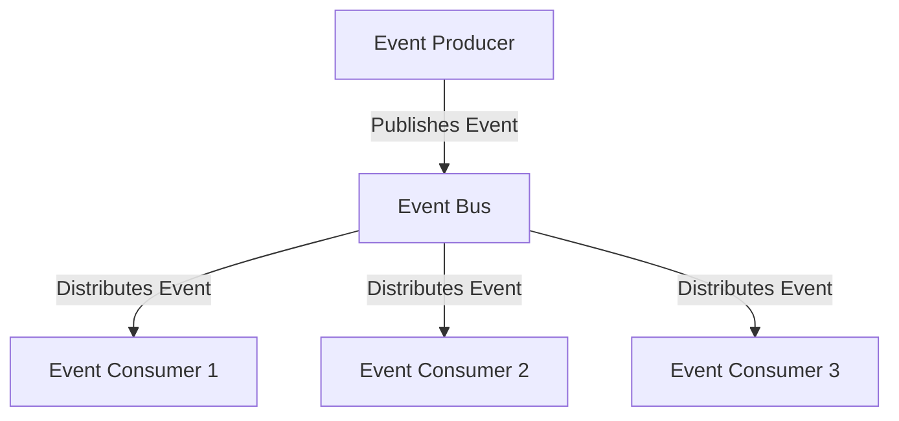

## 12.7.1 Principles of Event-Driven Design

Event-driven design is a powerful architectural paradigm that allows for the creation of highly decoupled and scalable systems. As experienced Java developers transitioning to Clojure, understanding these principles will enable you to leverage Clojure's functional programming strengths to build robust applications. In this section, we will explore the core concepts of event-driven design, compare them with traditional Java approaches, and provide practical examples in Clojure.

### Understanding Event-Driven Design

At its core, event-driven design revolves around the concept of events as the primary means of communication between system components. An **event** is a significant change in state or an occurrence that can trigger further processing. In an event-driven system, components are designed to react to these events rather than being directly invoked by other components.

#### Key Characteristics of Event-Driven Systems

1. **Decoupling**: Components in an event-driven system are loosely coupled, meaning they do not need to know about each other's existence. This decoupling is achieved through the use of events as intermediaries.

2. **Scalability**: Event-driven architectures can easily scale horizontally by distributing events across multiple consumers or producers, allowing for efficient load balancing and fault tolerance.

3. **Asynchronous Communication**: Events are often processed asynchronously, enabling non-blocking operations and improving system responsiveness.

4. **Flexibility and Extensibility**: New components can be added to the system without affecting existing ones, as long as they adhere to the event contracts.

#### Event-Driven Design vs. Traditional Java Approaches

In traditional Java applications, components often communicate through direct method calls, leading to tight coupling and limited flexibility. Event-driven design, on the other hand, promotes a more modular approach where components interact through events, reducing dependencies and enhancing maintainability.

**Java Example:**

```java
public class OrderService {
    private PaymentService paymentService;

    public OrderService(PaymentService paymentService) {
        this.paymentService = paymentService;
    }

    public void placeOrder(Order order) {
        paymentService.processPayment(order);
    }
}
```

In the above Java example, `OrderService` is tightly coupled with `PaymentService`. Any change in `PaymentService` might require modifications in `OrderService`.

**Clojure Example:**

```clojure
(defn place-order [order]
  (publish-event :order-placed order))

(defn handle-payment [order]
  (println "Processing payment for order:" order))

(subscribe-event :order-placed handle-payment)
```

In the Clojure example, `place-order` publishes an event, and `handle-payment` subscribes to it. This decouples the order placement logic from the payment processing logic.

### Benefits of Decoupling

Decoupling in event-driven systems offers several advantages:

- **Improved Maintainability**: Changes in one component do not necessitate changes in others, making the system easier to maintain.
- **Enhanced Testability**: Components can be tested independently, as they do not rely on the internal state of other components.
- **Increased Reusability**: Components can be reused across different parts of the system or even in different projects.

### Scalability in Event-Driven Systems

Scalability is a critical aspect of modern software systems. Event-driven architectures inherently support scalability through:

- **Load Balancing**: Events can be distributed across multiple consumers, allowing the system to handle increased load by simply adding more consumers.
- **Fault Tolerance**: If a consumer fails, other consumers can continue processing events, ensuring system resilience.
- **Elasticity**: The system can dynamically adjust to varying loads by scaling up or down the number of event producers or consumers.

### Implementing Event-Driven Design in Clojure

Clojure's functional programming paradigm and its emphasis on immutability make it well-suited for event-driven design. Let's explore how to implement event-driven systems in Clojure.

#### Event Publishing and Subscription

In Clojure, events can be represented as simple data structures, and event handlers can be functions that process these events. The following example demonstrates a basic event publishing and subscription mechanism:

```clojure
(def event-bus (atom {}))

(defn publish-event [event-type event-data]
  (let [handlers (get @event-bus event-type)]
    (doseq [handler handlers]
      (handler event-data))))

(defn subscribe-event [event-type handler]
  (swap! event-bus update event-type conj handler))
```

In this example, `event-bus` is an atom that holds a map of event types to their respective handlers. The `publish-event` function retrieves the handlers for a given event type and invokes them with the event data. The `subscribe-event` function registers a new handler for a specific event type.

#### Handling Asynchronous Events

To handle events asynchronously, we can leverage Clojure's `core.async` library, which provides channels for communication between concurrent processes.

```clojure
(require '[clojure.core.async :as async])

(defn async-publish-event [event-type event-data]
  (let [ch (async/chan)]
    (async/go
      (async/>! ch event-data)
      (async/close! ch))
    (let [handlers (get @event-bus event-type)]
      (doseq [handler handlers]
        (async/go
          (let [data (async/<! ch)]
            (handler data)))))))
```

In this example, `async-publish-event` uses a channel to send event data asynchronously to the handlers. The `async/go` block is used to perform non-blocking operations.

### Comparing Event-Driven Design in Java and Clojure

Java developers are familiar with event-driven programming through frameworks like Java EE and Spring. However, Clojure's approach to event-driven design is more lightweight and functional.

**Java Event-Driven Example:**

```java
public class EventBus {
    private Map<String, List<Consumer<Event>>> handlers = new HashMap<>();

    public void publishEvent(String eventType, Event event) {
        List<Consumer<Event>> eventHandlers = handlers.get(eventType);
        if (eventHandlers != null) {
            eventHandlers.forEach(handler -> handler.accept(event));
        }
    }

    public void subscribeEvent(String eventType, Consumer<Event> handler) {
        handlers.computeIfAbsent(eventType, k -> new ArrayList<>()).add(handler);
    }
}
```

**Clojure Event-Driven Example:**

```clojure
(def event-bus (atom {}))

(defn publish-event [event-type event-data]
  (let [handlers (get @event-bus event-type)]
    (doseq [handler handlers]
      (handler event-data))))

(defn subscribe-event [event-type handler]
  (swap! event-bus update event-type conj handler))
```

The Clojure example is more concise and leverages functional programming concepts, such as higher-order functions and immutability, to achieve the same functionality with less boilerplate code.

### Try It Yourself

Experiment with the Clojure event-driven examples by modifying the event handlers or adding new event types. Try implementing a simple notification system where different types of notifications (e.g., email, SMS) are handled by different components.

### Diagram: Event Flow in an Event-Driven System



**Diagram Description**: This diagram illustrates the flow of events in an event-driven system. The event producer publishes an event to the event bus, which then distributes the event to multiple consumers.

### Best Practices for Event-Driven Design

1. **Define Clear Event Contracts**: Ensure that events have well-defined structures and semantics to facilitate communication between components.
2. **Use Asynchronous Processing Wisely**: While asynchronous processing can improve performance, it can also introduce complexity. Use it judiciously.
3. **Monitor and Log Events**: Implement logging and monitoring to track event flow and diagnose issues.
4. **Test Event Handlers Independently**: Write unit tests for event handlers to ensure they behave correctly in isolation.

### Exercises

1. **Implement a Simple Event-Driven System**: Create a Clojure application that simulates a real-world scenario, such as a ticket booking system, using event-driven design principles.

2. **Extend the Notification System**: Add new notification types to the notification system you experimented with earlier. Implement a mechanism to prioritize certain notifications over others.

3. **Analyze an Existing Java Application**: Identify parts of a Java application that could benefit from an event-driven approach. Discuss how you would refactor these parts using Clojure.

### Key Takeaways

- Event-driven design promotes decoupling and scalability by using events as the primary means of communication between components.
- Clojure's functional programming paradigm and immutability make it well-suited for implementing event-driven systems.
- Asynchronous processing can enhance performance but should be used carefully to avoid complexity.
- Clear event contracts and independent testing of event handlers are essential for building robust event-driven systems.

By embracing event-driven design principles, you can build flexible, scalable, and maintainable systems that leverage the full power of Clojure's functional programming capabilities.

### Further Reading

- [Official Clojure Documentation](https://clojure.org/reference)
- [ClojureDocs](https://clojuredocs.org/)
- [Reactive Manifesto](https://www.reactivemanifesto.org/)

---

## Event-Driven Design Quiz: Test Your Knowledge



### What is a key characteristic of event-driven systems?

- [x] Decoupling
- [ ] Tight coupling
- [ ] Synchronous communication
- [ ] Direct method invocation

> **Explanation:** Event-driven systems are characterized by decoupling, where components communicate through events rather than direct method calls.

### How does Clojure's approach to event-driven design differ from Java's?

- [x] It uses functional programming concepts and immutability.
- [ ] It relies heavily on object-oriented principles.
- [ ] It requires more boilerplate code.
- [ ] It does not support asynchronous processing.

> **Explanation:** Clojure leverages functional programming and immutability, resulting in more concise and flexible event-driven designs compared to Java's object-oriented approach.

### Which Clojure library is commonly used for asynchronous event handling?

- [x] core.async
- [ ] clojure.java.jdbc
- [ ] ring
- [ ] compojure

> **Explanation:** The `core.async` library in Clojure is used for asynchronous event handling through channels and go blocks.

### What is the primary benefit of using event-driven design?

- [x] Scalability and decoupling
- [ ] Increased complexity
- [ ] Tight integration between components
- [ ] Synchronous processing

> **Explanation:** Event-driven design enhances scalability and decoupling by allowing components to communicate through events, reducing dependencies.

### In Clojure, how are events typically represented?

- [x] As simple data structures
- [ ] As classes and objects
- [ ] As XML documents
- [ ] As database records

> **Explanation:** In Clojure, events are typically represented as simple data structures, such as maps or vectors, which are easy to manipulate and pass around.

### What is a common use case for event-driven design?

- [x] Building scalable and flexible systems
- [ ] Creating tightly coupled applications
- [ ] Implementing synchronous workflows
- [ ] Designing monolithic architectures

> **Explanation:** Event-driven design is commonly used to build scalable and flexible systems that can easily adapt to changes and handle varying loads.

### How can event-driven systems achieve fault tolerance?

- [x] By distributing events across multiple consumers
- [ ] By relying on a single point of failure
- [ ] By using synchronous processing
- [ ] By tightly coupling components

> **Explanation:** Event-driven systems achieve fault tolerance by distributing events across multiple consumers, allowing the system to continue functioning even if some consumers fail.

### What is a best practice for testing event-driven systems?

- [x] Test event handlers independently
- [ ] Avoid testing event handlers
- [ ] Test only the event bus
- [ ] Use synchronous tests exclusively

> **Explanation:** Testing event handlers independently ensures they function correctly in isolation, improving the reliability of the event-driven system.

### What is an advantage of using Clojure for event-driven design?

- [x] Concise code and functional programming features
- [ ] Extensive use of inheritance
- [ ] Complex syntax and semantics
- [ ] Lack of support for immutability

> **Explanation:** Clojure's concise code and functional programming features, such as immutability and higher-order functions, make it well-suited for event-driven design.

### True or False: Event-driven design is only suitable for large-scale systems.

- [ ] True
- [x] False

> **Explanation:** Event-driven design can be applied to systems of any size, providing benefits such as decoupling and scalability even in smaller applications.


