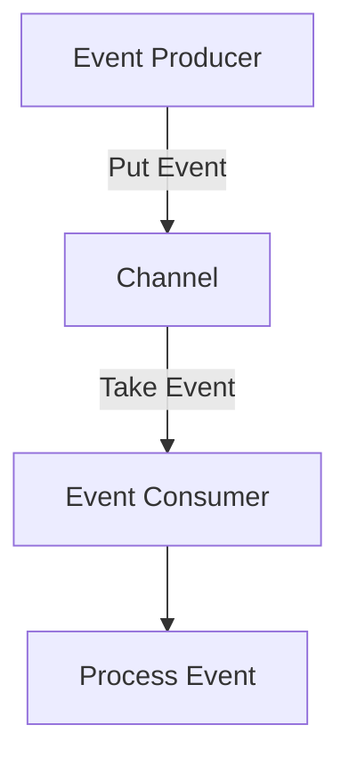

## 12.7.2 Implementing in Clojure

In this section, we will delve into implementing event-driven architectures using Clojure. Event-driven systems are designed to respond to events or changes in state, making them highly responsive and scalable. Clojure, with its functional programming paradigm and robust concurrency support, is well-suited for building such systems. We will explore how to leverage Clojure's `core.async` library, queues, and message brokers to process events asynchronously.

### Understanding Event-Driven Architectures

Event-driven architectures (EDA) are systems where the flow of the program is determined by events. These events can be user actions, sensor outputs, or messages from other programs. In an EDA, components communicate by emitting and responding to events, leading to decoupled and scalable systems.

**Key Concepts:**

- **Events**: Signals that something has happened.
- **Event Producers**: Components that generate events.
- **Event Consumers**: Components that respond to events.
- **Event Channels**: Pathways through which events travel.

### Clojure's Strengths in Event-Driven Systems

Clojure offers several features that make it ideal for event-driven systems:

- **Immutability**: Ensures that data changes do not lead to unexpected side effects.
- **Concurrency Primitives**: Atoms, refs, agents, and `core.async` provide robust tools for managing state and concurrency.
- **Functional Programming**: Encourages writing small, composable functions that are easy to reason about.

### Using `core.async` for Event-Driven Programming

`core.async` is a Clojure library that provides facilities for asynchronous programming using channels. Channels are queues that allow communication between different parts of a program.

#### Setting Up `core.async`

To use `core.async`, you need to include it in your project dependencies. Add the following to your `project.clj` if you're using Leiningen:

```clojure
:dependencies [[org.clojure/core.async "1.5.648"]]
```

#### Creating and Using Channels

Channels are the backbone of `core.async`. They allow you to pass messages between different parts of your application.

```clojure
(require '[clojure.core.async :refer [chan >!! <!! go]])

;; Create a channel
(def my-channel (chan))

;; Put a message onto the channel
(go (>!! my-channel "Hello, World!"))

;; Take a message from the channel
(go (println "Received message:" (<!! my-channel)))
```

**Explanation:**

- `chan`: Creates a new channel.
- `>!!`: Puts a message onto the channel.
- `<!!`: Takes a message from the channel.
- `go`: Launches a lightweight thread to perform asynchronous operations.

#### Asynchronous Event Processing

Let's build a simple event-driven system that processes user actions asynchronously.

```clojure
(require '[clojure.core.async :refer [chan go >!! <!!]])

(def user-actions (chan))

;; Event producer
(defn simulate-user-action [action]
  (go (>!! user-actions action)))

;; Event consumer
(defn process-action []
  (go (let [action (<!! user-actions)]
        (println "Processing action:" action))))

;; Simulate user actions
(simulate-user-action "click")
(simulate-user-action "scroll")

;; Process actions
(process-action)
(process-action)
```

**Explanation:**

- We create a channel `user-actions` to hold user actions.
- `simulate-user-action` is an event producer that puts actions onto the channel.
- `process-action` is an event consumer that takes actions from the channel and processes them.

### Integrating Queues and Message Brokers

For more complex systems, you might need to integrate with external message brokers like RabbitMQ or Kafka. These tools provide durable queues and advanced message routing capabilities.

#### Using RabbitMQ with Clojure

RabbitMQ is a popular message broker that supports various messaging protocols. To use RabbitMQ in Clojure, you can use the `langohr` library.

Add `langohr` to your dependencies:

```clojure
:dependencies [[com.novemberain/langohr "5.0.0"]]
```

**Example:**

```clojure
(require '[langohr.core :as rmq]
         '[langohr.channel :as lch]
         '[langohr.basic :as lb])

(defn setup-rabbitmq []
  (let [conn (rmq/connect)
        ch (lch/open conn)]
    (lb/publish ch "exchange" "routing-key" "Hello, RabbitMQ!")
    (rmq/close conn)))

(setup-rabbitmq)
```

**Explanation:**

- `rmq/connect`: Establishes a connection to RabbitMQ.
- `lch/open`: Opens a channel for communication.
- `lb/publish`: Publishes a message to a specified exchange with a routing key.

#### Using Kafka with Clojure

Kafka is another powerful tool for building event-driven systems. It is designed for high-throughput and fault-tolerant messaging.

To use Kafka, you can leverage the `clj-kafka` library:

```clojure
:dependencies [[clj-kafka "0.3.3"]]
```

**Example:**

```clojure
(require '[clj-kafka.producer :as producer])

(defn send-kafka-message []
  (let [config {"bootstrap.servers" "localhost:9092"}
        producer (producer/make-producer config)]
    (producer/send producer (producer/record "topic" "key" "Hello, Kafka!"))))

(send-kafka-message)
```

**Explanation:**

- `producer/make-producer`: Creates a Kafka producer with the given configuration.
- `producer/send`: Sends a message to a specified topic.

### Comparing Clojure and Java for Event-Driven Systems

Java has long been used for building event-driven systems, especially with frameworks like Spring. However, Clojure offers a more concise and expressive syntax, along with powerful concurrency primitives.

**Java Example:**

```java
import java.util.concurrent.BlockingQueue;
import java.util.concurrent.LinkedBlockingQueue;

public class EventDrivenJava {
    private static BlockingQueue<String> queue = new LinkedBlockingQueue<>();

    public static void main(String[] args) throws InterruptedException {
        new Thread(() -> {
            try {
                while (true) {
                    String event = queue.take();
                    System.out.println("Processing event: " + event);
                }
            } catch (InterruptedException e) {
                Thread.currentThread().interrupt();
            }
        }).start();

        queue.put("Event 1");
        queue.put("Event 2");
    }
}
```

**Clojure Example:**

```clojure
(require '[clojure.core.async :refer [chan go >!! <!!]])

(def events (chan))

(go (while true
      (let [event (<!! events)]
        (println "Processing event:" event))))

(go (>!! events "Event 1"))
(go (>!! events "Event 2"))
```

**Comparison:**

- **Conciseness**: Clojure's syntax is more concise, reducing boilerplate code.
- **Concurrency**: Clojure's `core.async` provides a more straightforward model for handling concurrency compared to Java's thread management.
- **Immutability**: Clojure's immutable data structures simplify reasoning about state changes.

### Try It Yourself

Experiment with the examples provided. Try modifying the code to:

- Add more event producers and consumers.
- Integrate with a different message broker.
- Implement error handling for failed message deliveries.

### Diagrams and Visualizations

Below is a diagram illustrating the flow of data through a simple event-driven system using `core.async`.



**Diagram Explanation:**

- **Event Producer**: Generates events and puts them onto a channel.
- **Channel**: Acts as a queue for events.
- **Event Consumer**: Takes events from the channel and processes them.

### Further Reading

For more information on `core.async`, RabbitMQ, and Kafka, consider the following resources:

- [Clojure `core.async` Documentation](https://clojure.github.io/core.async/)
- [RabbitMQ Official Documentation](https://www.rabbitmq.com/documentation.html)
- [Apache Kafka Documentation](https://kafka.apache.org/documentation/)

### Exercises

1. **Implement a Notification System**: Create a system where different types of notifications (email, SMS, push) are processed asynchronously.
2. **Build a Simple Chat Application**: Use `core.async` to handle messages between users in a chat room.
3. **Integrate with a REST API**: Use a message broker to queue API requests and process them asynchronously.

### Key Takeaways

- Clojure's `core.async` provides powerful tools for building event-driven systems.
- Channels facilitate communication between different parts of an application.
- Integrating with message brokers like RabbitMQ and Kafka can enhance scalability and reliability.
- Clojure's functional programming paradigm and concurrency primitives make it well-suited for event-driven architectures.

Now that we've explored how to implement event-driven architectures in Clojure, let's apply these concepts to build responsive and scalable systems.

## Quiz: Mastering Event-Driven Architectures in Clojure



### What is the primary purpose of `core.async` in Clojure?

- [x] To facilitate asynchronous programming using channels
- [ ] To provide a GUI framework for Clojure applications
- [ ] To replace all concurrency primitives in Clojure
- [ ] To compile Clojure code to Java bytecode

> **Explanation:** `core.async` is designed to facilitate asynchronous programming by providing channels for communication between different parts of a program.

### Which Clojure function is used to create a new channel?

- [x] `chan`
- [ ] `go`
- [ ] `>!!`
- [ ] `<!!`

> **Explanation:** The `chan` function is used to create a new channel in Clojure's `core.async` library.

### How do you put a message onto a channel in `core.async`?

- [x] `>!!`
- [ ] `<!!`
- [ ] `chan`
- [ ] `go`

> **Explanation:** The `>!!` function is used to put a message onto a channel in `core.async`.

### What is the role of an event consumer in an event-driven architecture?

- [x] To respond to and process events
- [ ] To generate and emit events
- [ ] To store events in a database
- [ ] To visualize events in a dashboard

> **Explanation:** An event consumer is responsible for responding to and processing events in an event-driven architecture.

### Which library is commonly used for integrating RabbitMQ with Clojure?

- [x] `langohr`
- [ ] `clj-kafka`
- [ ] `core.async`
- [ ] `clojure.java.jdbc`

> **Explanation:** The `langohr` library is commonly used for integrating RabbitMQ with Clojure.

### What is a key advantage of using Clojure for event-driven systems?

- [x] Immutability and concurrency primitives
- [ ] Built-in GUI components
- [ ] Automatic code generation
- [ ] Native support for all Java libraries

> **Explanation:** Clojure's immutability and concurrency primitives make it well-suited for event-driven systems.

### Which function is used to take a message from a channel in `core.async`?

- [x] `<!!`
- [ ] `>!!`
- [ ] `chan`
- [ ] `go`

> **Explanation:** The `<!!` function is used to take a message from a channel in `core.async`.

### What is the purpose of the `go` block in `core.async`?

- [x] To launch a lightweight thread for asynchronous operations
- [ ] To create a new channel
- [ ] To compile Clojure code
- [ ] To define a new function

> **Explanation:** The `go` block is used to launch a lightweight thread for performing asynchronous operations in `core.async`.

### Which message broker is known for high-throughput and fault-tolerant messaging?

- [x] Kafka
- [ ] RabbitMQ
- [ ] ActiveMQ
- [ ] ZeroMQ

> **Explanation:** Kafka is known for its high-throughput and fault-tolerant messaging capabilities.

### True or False: Clojure's `core.async` can only be used for local in-memory communication.

- [ ] True
- [x] False

> **Explanation:** While `core.async` is often used for local in-memory communication, it can also be integrated with external systems and message brokers for distributed communication.


