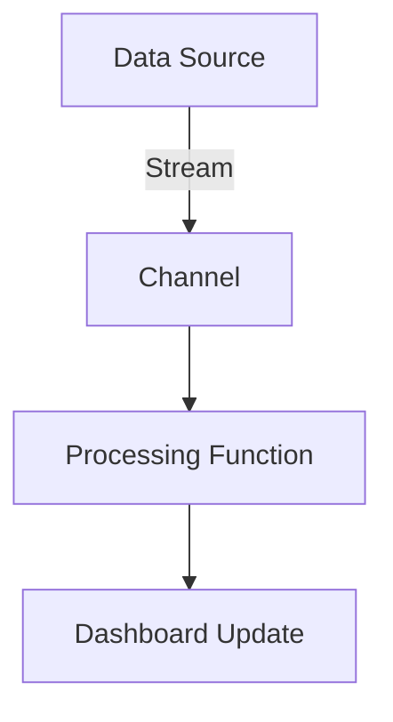
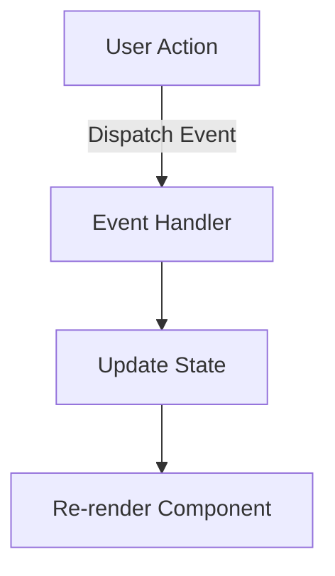
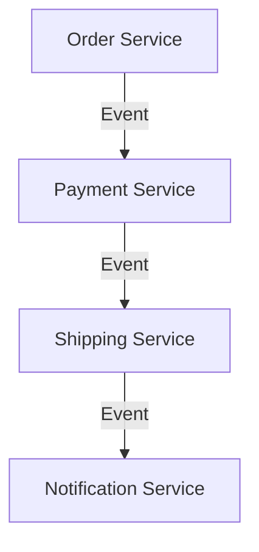

## 12.7.3 Use Cases

Event-driven architectures (EDA) are a powerful paradigm for building systems that respond to events or changes in state. In this section, we will explore various use cases for event-driven architectures in Clojure, focusing on real-time data processing, GUI applications, and microservices communication. By leveraging Clojure's functional programming capabilities and its robust concurrency primitives, developers can build scalable and responsive systems.

### Real-Time Data Processing

Real-time data processing involves handling data as it is produced, allowing for immediate insights and actions. This is crucial in industries such as finance, telecommunications, and e-commerce, where timely data processing can lead to competitive advantages.

#### Clojure's Strengths in Real-Time Processing

Clojure's immutable data structures and concurrency primitives make it well-suited for real-time data processing. The language's emphasis on immutability ensures that data can be safely shared across threads without the risk of race conditions, a common challenge in real-time systems.

**Example: Real-Time Stock Price Monitoring**

Let's consider a real-time stock price monitoring system. In this system, stock prices are streamed from a data source, and the application needs to process and display these prices in real-time.

```clojure
(ns stock-monitor.core
  (:require [clojure.core.async :as async]))

(defn process-stock-price [price]
  ;; Process the stock price, e.g., update a dashboard
  (println "Processing stock price:" price))

(defn start-monitoring [price-channel]
  (async/go-loop []
    (when-let [price (async/<! price-channel)]
      (process-stock-price price)
      (recur))))

(defn simulate-stock-price-stream [price-channel]
  (async/go-loop []
    (async/>! price-channel (rand-int 1000)) ;; Simulate a random stock price
    (async/<! (async/timeout 1000)) ;; Wait for 1 second
    (recur)))

(let [price-channel (async/chan)]
  (simulate-stock-price-stream price-channel)
  (start-monitoring price-channel))
```

In this example, we use Clojure's `core.async` library to create a channel for streaming stock prices. The `simulate-stock-price-stream` function simulates a data source by generating random stock prices and sending them to the channel. The `start-monitoring` function processes each price as it arrives.

#### Diagram: Real-Time Data Flow



*Diagram: The flow of data from the data source through the channel to the processing function and dashboard update.*

### GUI Applications

Graphical User Interfaces (GUIs) are inherently event-driven, responding to user actions such as clicks, key presses, and mouse movements. Clojure's functional approach and libraries like Reagent and Re-frame make it an excellent choice for building responsive and maintainable GUIs.

#### Building GUIs with Reagent and Re-frame

Reagent is a ClojureScript interface to React, allowing developers to build dynamic user interfaces using Clojure's functional programming model. Re-frame builds on Reagent, providing a framework for managing state and events in a structured way.

**Example: Simple Counter Application**

Let's build a simple counter application using Reagent and Re-frame.

```clojure
(ns counter.core
  (:require [reagent.core :as r]
            [re-frame.core :as rf]))

;; Define the app's state
(rf/reg-event-db
 :initialize
 (fn [_ _]
   {:count 0}))

;; Define an event to increment the counter
(rf/reg-event-db
 :increment
 (fn [db _]
   (update db :count inc)))

;; Define a subscription to access the counter value
(rf/reg-sub
 :count
 (fn [db _]
   (:count db)))

;; Define the main component
(defn counter []
  (let [count (rf/subscribe [:count])]
    (fn []
      [:div
       [:h1 "Counter: " @count]
       [:button {:on-click #(rf/dispatch [:increment])} "Increment"]])))

;; Initialize the app
(defn init []
  (rf/dispatch-sync [:initialize])
  (r/render [counter] (.getElementById js/document "app")))
```

In this example, we define a simple counter application. The application state is managed using Re-frame's event and subscription system. The `counter` component displays the current count and provides a button to increment it.

#### Diagram: GUI Event Flow



*Diagram: The flow of events in a GUI application from user action to state update and component re-rendering.*

### Microservices Communication

Microservices architecture involves building applications as a collection of loosely coupled services. These services often communicate via events, making event-driven architectures a natural fit.

#### Event-Driven Microservices

In a microservices architecture, services can communicate through events using message brokers like Kafka or RabbitMQ. This decouples services, allowing them to evolve independently and scale more easily.

**Example: Order Processing System**

Consider an order processing system where different services handle order creation, payment processing, and shipping.

```clojure
(ns order-processing.core
  (:require [clojure.core.async :as async]))

(defn process-order [order]
  ;; Process the order, e.g., validate and save to database
  (println "Processing order:" order))

(defn start-order-service [order-channel]
  (async/go-loop []
    (when-let [order (async/<! order-channel)]
      (process-order order)
      (recur))))

(defn simulate-order-stream [order-channel]
  (async/go-loop []
    (async/>! order-channel {:id (rand-int 1000) :item "Widget"})
    (async/<! (async/timeout 5000)) ;; Wait for 5 seconds
    (recur)))

(let [order-channel (async/chan)]
  (simulate-order-stream order-channel)
  (start-order-service order-channel))
```

In this example, we simulate an order stream using a channel. The `start-order-service` function processes each order as it arrives, demonstrating how services can handle events asynchronously.

#### Diagram: Microservices Event Flow



*Diagram: The flow of events between microservices in an order processing system.*

### Try It Yourself

To deepen your understanding, try modifying the examples above:

- **Real-Time Data Processing**: Change the data source to simulate different types of data, such as temperature readings or social media mentions.
- **GUI Applications**: Add more buttons to the counter application to decrement or reset the count.
- **Microservices Communication**: Introduce additional services, such as a logging service, to handle events.

### Further Reading

- [Clojure Official Documentation](https://clojure.org/reference)
- [ClojureDocs](https://clojuredocs.org/)
- [Reagent GitHub Repository](https://github.com/reagent-project/reagent)
- [Re-frame GitHub Repository](https://github.com/day8/re-frame)

### Exercises

1. **Real-Time Data Processing**: Implement a system that processes weather data in real-time, updating a dashboard with temperature and humidity readings.
2. **GUI Applications**: Create a simple to-do list application using Reagent and Re-frame, allowing users to add, remove, and mark tasks as complete.
3. **Microservices Communication**: Design a microservices architecture for a library system, with services for book inventory, user management, and notifications.

### Key Takeaways

- **Event-driven architectures** are ideal for systems that need to respond to changes in state or user actions.
- **Clojure's functional programming model** and concurrency primitives make it well-suited for building scalable and responsive event-driven systems.
- **Real-time data processing, GUI applications, and microservices** are common use cases for event-driven architectures in Clojure.

By exploring these use cases, you can leverage Clojure's strengths to build robust and efficient systems. Now that we've explored how event-driven architectures can be applied in various scenarios, let's apply these concepts to your projects and see the benefits firsthand.

## Quiz: Understanding Event-Driven Architectures in Clojure



### What is a key advantage of using Clojure for real-time data processing?

- [x] Immutability ensures safe data sharing across threads.
- [ ] Clojure is a compiled language.
- [ ] Clojure has a built-in GUI library.
- [ ] Clojure does not support concurrency.

> **Explanation:** Clojure's immutability ensures that data can be safely shared across threads, which is crucial for real-time data processing.

### Which library is commonly used in Clojure for building GUI applications?

- [ ] core.async
- [x] Reagent
- [ ] Ring
- [ ] Leiningen

> **Explanation:** Reagent is a ClojureScript interface to React, commonly used for building GUI applications in Clojure.

### How do microservices typically communicate in an event-driven architecture?

- [ ] Direct method calls
- [x] Events via message brokers
- [ ] Shared databases
- [ ] RESTful APIs only

> **Explanation:** In an event-driven architecture, microservices often communicate via events using message brokers like Kafka or RabbitMQ.

### What is the role of `core.async` in Clojure?

- [x] It provides concurrency primitives like channels and go blocks.
- [ ] It is a web framework for building APIs.
- [ ] It is a testing library.
- [ ] It is used for database interactions.

> **Explanation:** `core.async` provides concurrency primitives such as channels and go blocks, facilitating asynchronous programming in Clojure.

### Which of the following is a benefit of using event-driven architectures?

- [x] Decoupling of services
- [ ] Increased code complexity
- [ ] Reduced scalability
- [ ] Synchronous processing

> **Explanation:** Event-driven architectures decouple services, allowing them to evolve independently and scale more easily.

### In the context of GUI applications, what does Re-frame provide?

- [ ] A database interface
- [x] A framework for managing state and events
- [ ] A logging library
- [ ] A testing framework

> **Explanation:** Re-frame provides a framework for managing state and events in ClojureScript applications, building on top of Reagent.

### What is a common use case for event-driven architectures?

- [x] Real-time data processing
- [ ] Static website hosting
- [ ] Batch processing
- [ ] Single-threaded applications

> **Explanation:** Real-time data processing is a common use case for event-driven architectures, where timely data handling is crucial.

### How can you simulate a data stream in Clojure using `core.async`?

- [x] By using channels and go loops
- [ ] By using RESTful APIs
- [ ] By using Java's Thread class
- [ ] By using Clojure's `defn` keyword

> **Explanation:** You can simulate a data stream in Clojure using `core.async` channels and go loops to handle asynchronous data flow.

### What is a benefit of using immutable data structures in event-driven systems?

- [x] They prevent race conditions.
- [ ] They require more memory.
- [ ] They are slower to process.
- [ ] They complicate concurrency.

> **Explanation:** Immutable data structures prevent race conditions, making them ideal for use in event-driven systems where data is shared across threads.

### True or False: Event-driven architectures are only suitable for large-scale systems.

- [ ] True
- [x] False

> **Explanation:** Event-driven architectures can be beneficial for systems of all sizes, not just large-scale systems, as they provide flexibility and scalability.


