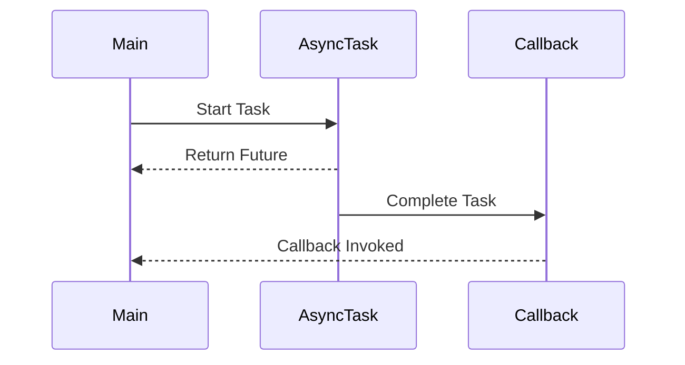

## 12.8.1 Challenges of Asynchronous Programming

Asynchronous programming is a powerful paradigm that allows developers to write non-blocking code, enabling applications to perform multiple tasks concurrently. However, it comes with its own set of challenges, especially for developers transitioning from Java to Clojure. In this section, we'll delve into the complexities of asynchronous programming, such as callback hell, managing concurrency, and error propagation, while drawing parallels between Java and Clojure.

### Understanding Asynchronous Programming

Asynchronous programming allows a program to initiate a potentially time-consuming task and continue executing other tasks without waiting for the first task to complete. This is particularly useful in scenarios involving I/O operations, such as network requests or file system access, where waiting for a response can block the main thread.

#### Key Concepts

- **Non-blocking Operations**: These operations allow the program to continue executing other tasks while waiting for the completion of an asynchronous task.
- **Concurrency**: The ability to execute multiple tasks simultaneously, improving the efficiency and responsiveness of applications.
- **Callback Functions**: Functions passed as arguments to other functions, which are invoked once an asynchronous operation completes.

### Challenges in Asynchronous Programming

#### 1. Callback Hell

**Callback hell** refers to the situation where callbacks are nested within other callbacks, leading to code that is difficult to read and maintain. This is a common issue in JavaScript and can also occur in Clojure if not managed properly.

**Example in JavaScript:**

```javascript
function fetchData(url, callback) {
    fetch(url)
        .then(response => response.json())
        .then(data => {
            processData(data, result => {
                displayResult(result, () => {
                    console.log('Process complete');
                });
            });
        })
        .catch(error => console.error('Error:', error));
}
```

**Clojure Approach:**

In Clojure, we can mitigate callback hell by using **core.async** or **promises** to handle asynchronous operations more elegantly.

```clojure
(require '[clojure.core.async :refer [go <!]])

(defn fetch-data [url]
  (go
    (let [response (<! (http/get url))
          data (<! (json/parse-string (:body response)))]
      (process-data data))))

(defn process-data [data]
  (go
    (let [result (<! (some-processing-fn data))]
      (display-result result))))

(defn display-result [result]
  (println "Process complete" result))
```

In this example, `go` blocks are used to manage asynchronous operations, making the code more readable and maintainable.

#### 2. Managing Concurrency

Concurrency involves executing multiple tasks simultaneously, which can lead to issues such as race conditions and deadlocks if not handled properly. In Java, concurrency is often managed using threads, locks, and synchronized blocks, which can be complex and error-prone.

**Java Example:**

```java
public class Counter {
    private int count = 0;

    public synchronized void increment() {
        count++;
    }

    public synchronized int getCount() {
        return count;
    }
}
```

**Clojure Approach:**

Clojure provides a more elegant solution with its immutable data structures and concurrency primitives like **atoms**, **refs**, and **agents**.

```clojure
(def counter (atom 0))

(defn increment-counter []
  (swap! counter inc))

(defn get-counter []
  @counter)
```

In this example, `atom` is used to manage state changes safely without the need for explicit locks.

#### 3. Error Propagation

Handling errors in asynchronous code can be challenging, as errors may occur at different stages of the execution flow. In Java, exceptions are used to propagate errors, but in asynchronous code, this can become complex.

**Java Example:**

```java
CompletableFuture.supplyAsync(() -> {
    if (someCondition) {
        throw new RuntimeException("Error occurred");
    }
    return "Success";
}).exceptionally(ex -> {
    System.out.println("Error: " + ex.getMessage());
    return "Failure";
});
```

**Clojure Approach:**

In Clojure, errors can be managed using **try/catch** blocks within `go` blocks or by using **core.async**'s error handling capabilities.

```clojure
(require '[clojure.core.async :refer [go <!]])

(defn async-task []
  (go
    (try
      (let [result (<! (some-async-operation))]
        (println "Success:" result))
      (catch Exception e
        (println "Error:" (.getMessage e))))))
```

### Comparing Java and Clojure

| Aspect                  | Java                                                                 | Clojure                                                                 |
|-------------------------|----------------------------------------------------------------------|-------------------------------------------------------------------------|
| **Concurrency Model**   | Threads, locks, synchronized blocks                                   | Atoms, refs, agents, core.async                                        |
| **Error Handling**      | Exceptions, CompletableFuture.exceptionally                           | try/catch within go blocks, core.async error handling                   |
| **Callback Management** | Nested callbacks, CompletableFuture.thenApply                         | core.async, promises, go blocks                                         |

### Diagrams and Visualizations

To better understand the flow of asynchronous operations, let's visualize the process using a sequence diagram.



**Diagram Description**: This sequence diagram illustrates the flow of an asynchronous task, where the main process starts the task, receives a future, and the callback is invoked upon task completion.

### Try It Yourself

Experiment with the provided Clojure code examples by modifying the asynchronous operations. Try adding additional steps or handling different types of errors to see how the flow changes.

### Exercises

1. **Refactor the JavaScript callback hell example** into a more readable format using Clojure's core.async.
2. **Implement a simple counter** using Clojure's atom and compare it with a Java implementation using synchronized methods.
3. **Create an asynchronous task** in Clojure that handles errors gracefully using try/catch within a go block.

### Key Takeaways

- Asynchronous programming allows for non-blocking operations, improving application responsiveness.
- Callback hell can be mitigated in Clojure using core.async and promises.
- Clojure's concurrency primitives provide a safer and more elegant way to manage state changes.
- Error propagation in asynchronous code requires careful handling to ensure robustness.

By understanding these challenges and leveraging Clojure's unique features, you can write more efficient and maintainable asynchronous code. Now that we've explored the complexities of asynchronous programming, let's apply these concepts to build robust and responsive applications.

### Further Reading

- [Official Clojure Documentation](https://clojure.org/)
- [ClojureDocs](https://clojuredocs.org/)
- [Core.async GitHub Repository](https://github.com/clojure/core.async)

## Quiz: Mastering Asynchronous Programming Challenges



### What is a common issue in asynchronous programming known as "callback hell"?

- [x] Nested callbacks leading to difficult-to-read code
- [ ] Using too many threads
- [ ] Lack of error handling
- [ ] Blocking operations

> **Explanation:** Callback hell occurs when callbacks are nested within other callbacks, making the code difficult to read and maintain.

### Which Clojure feature helps manage asynchronous operations more elegantly than nested callbacks?

- [x] core.async
- [ ] Atoms
- [ ] Refs
- [ ] Agents

> **Explanation:** core.async provides constructs like go blocks and channels to manage asynchronous operations more elegantly.

### How does Clojure handle concurrency differently from Java?

- [x] By using immutable data structures and concurrency primitives like atoms
- [ ] By using synchronized blocks
- [ ] By using threads and locks
- [ ] By using CompletableFutures

> **Explanation:** Clojure uses immutable data structures and concurrency primitives like atoms, refs, and agents to handle concurrency.

### What is the primary advantage of using atoms in Clojure for state management?

- [x] They provide a safe way to manage state changes without explicit locks
- [ ] They are faster than Java synchronized methods
- [ ] They allow for mutable state
- [ ] They are easier to use than threads

> **Explanation:** Atoms provide a safe way to manage state changes without the need for explicit locks, leveraging Clojure's immutability.

### Which of the following is a challenge in error propagation in asynchronous code?

- [x] Errors may occur at different stages of execution flow
- [ ] Errors are always caught by the main thread
- [ ] Errors are easier to handle than in synchronous code
- [ ] Errors do not occur in asynchronous code

> **Explanation:** In asynchronous code, errors may occur at different stages of the execution flow, making them challenging to handle.

### What is a key benefit of using core.async in Clojure?

- [x] It allows for non-blocking, asynchronous operations
- [ ] It simplifies synchronous programming
- [ ] It eliminates the need for error handling
- [ ] It is faster than Java's CompletableFuture

> **Explanation:** core.async allows for non-blocking, asynchronous operations, making it easier to write efficient code.

### How can callback hell be mitigated in Clojure?

- [x] By using core.async and promises
- [ ] By using more threads
- [ ] By using synchronized blocks
- [ ] By avoiding asynchronous programming

> **Explanation:** Callback hell can be mitigated in Clojure by using core.async and promises to manage asynchronous operations more elegantly.

### What is the role of a go block in Clojure's core.async?

- [x] To manage asynchronous operations within a lightweight thread
- [ ] To block the main thread
- [ ] To handle errors
- [ ] To create new threads

> **Explanation:** A go block in core.async manages asynchronous operations within a lightweight thread, allowing for non-blocking execution.

### Which concurrency primitive in Clojure is used for coordinating state changes across multiple threads?

- [x] Refs
- [ ] Atoms
- [ ] Agents
- [ ] Vars

> **Explanation:** Refs are used in Clojure for coordinating state changes across multiple threads, often with software transactional memory.

### True or False: Clojure's concurrency model relies heavily on mutable state.

- [ ] True
- [x] False

> **Explanation:** Clojure's concurrency model relies on immutable data structures and concurrency primitives, avoiding mutable state.


