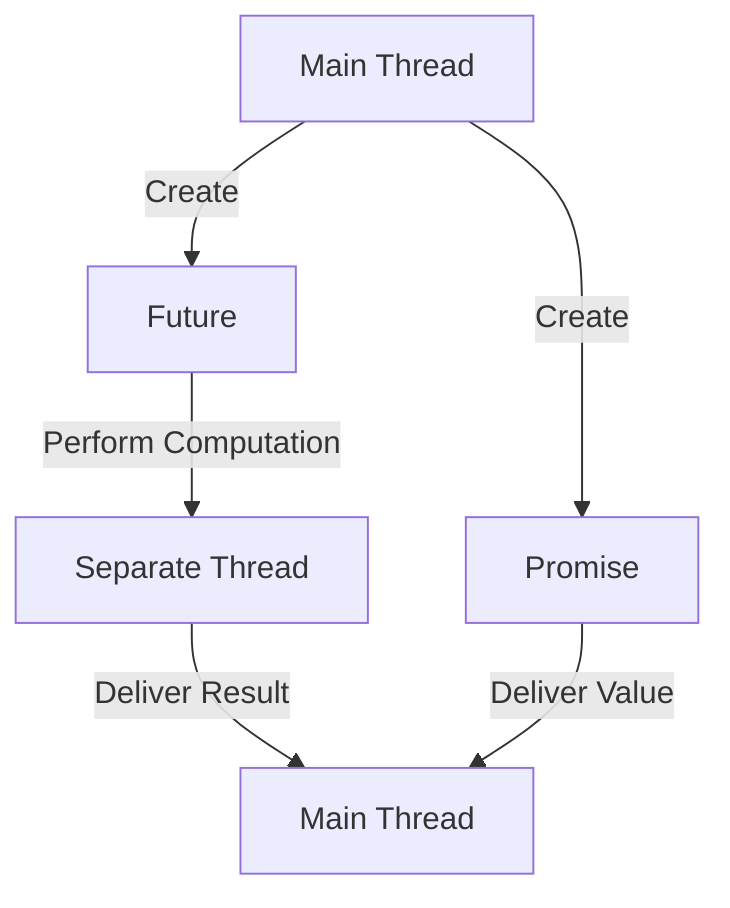
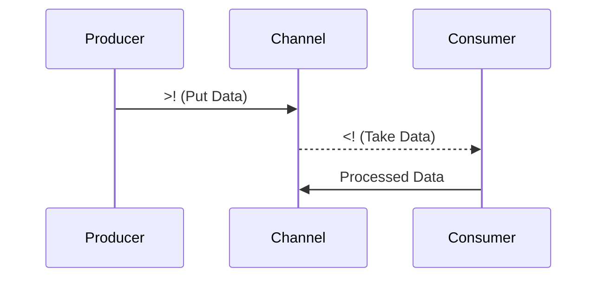

## 12.8.2 Futures, Promises, and `core.async`

Asynchronous programming is a powerful paradigm that allows us to perform tasks concurrently, improving the efficiency and responsiveness of applications. In Clojure, asynchronous programming is facilitated through constructs like **futures**, **promises**, and the **`core.async`** library. These tools provide a robust framework for handling asynchronous tasks, making it easier to write non-blocking code. In this section, we will explore these constructs, compare them with Java's asynchronous mechanisms, and provide practical examples to illustrate their use.

### Understanding Asynchronous Programming

Before diving into Clojure's specific tools, let's briefly review the concept of asynchronous programming. In traditional synchronous programming, tasks are executed sequentially, and each task must complete before the next one begins. This can lead to inefficiencies, especially when tasks involve waiting for I/O operations or network requests.

Asynchronous programming allows tasks to run concurrently, enabling a program to continue executing other tasks while waiting for a long-running operation to complete. This is particularly useful in applications that require high responsiveness, such as web servers or GUI applications.

### Futures in Clojure

**Futures** in Clojure are a simple way to perform asynchronous computations. A future represents a computation that will be performed in a separate thread, and it provides a way to retrieve the result once the computation is complete.

#### Creating and Using Futures

To create a future in Clojure, we use the `future` macro. Here's a basic example:

```clojure
;; Define a future that computes the sum of numbers from 1 to 1,000,000
(def my-future (future (reduce + (range 1 1000001))))

;; Retrieve the result of the future
(println @my-future)  ;; Output: 500000500000
```

In this example, the `future` macro starts a new thread to compute the sum of numbers from 1 to 1,000,000. The `@` symbol is used to dereference the future, blocking the current thread until the computation is complete and the result is available.

#### Comparing Futures in Java and Clojure

In Java, a similar concept is provided by the `Future` interface, which is part of the `java.util.concurrent` package. Here's how you might achieve the same result in Java:

```java
import java.util.concurrent.*;

public class FutureExample {
    public static void main(String[] args) throws Exception {
        ExecutorService executor = Executors.newSingleThreadExecutor();
        Future<Long> future = executor.submit(() -> {
            long sum = 0;
            for (int i = 1; i <= 1000000; i++) {
                sum += i;
            }
            return sum;
        });

        System.out.println(future.get());  // Output: 500000500000
        executor.shutdown();
    }
}
```

While both Clojure and Java provide futures for asynchronous computation, Clojure's futures are simpler to use, requiring less boilerplate code.

### Promises in Clojure

**Promises** in Clojure are another tool for asynchronous programming. A promise is a placeholder for a value that will be provided later. Unlike futures, promises are not tied to a specific computation; instead, they allow any part of the program to deliver the promised value.

#### Creating and Using Promises

Here's how you can create and use a promise in Clojure:

```clojure
;; Create a promise
(def my-promise (promise))

;; Deliver a value to the promise
(deliver my-promise 42)

;; Dereference the promise to get the value
(println @my-promise)  ;; Output: 42
```

In this example, we create a promise and then deliver the value `42` to it. The promise can be dereferenced to retrieve the value once it has been delivered.

#### Promises vs. Futures

While both promises and futures are used for asynchronous programming, they serve different purposes. A future is tied to a specific computation, whereas a promise is a more general construct that can be fulfilled by any part of the program. This makes promises more flexible in scenarios where the value might come from various sources.

### `core.async` Library

The **`core.async`** library in Clojure provides a more advanced framework for asynchronous programming. It introduces the concept of **channels**, which are used to communicate between different parts of a program asynchronously. Channels can be thought of as queues that allow data to be passed between threads.

#### Channels and Go Blocks

Channels are created using the `chan` function, and data can be put onto a channel using `>!!` (blocking) or `>!` (non-blocking) and taken from a channel using `<!!` (blocking) or `<!` (non-blocking). Here's a simple example:

```clojure
(require '[clojure.core.async :refer [chan >!! <!! go]])

;; Create a channel
(def my-channel (chan))

;; Start a go block to put a value onto the channel
(go (>! my-channel "Hello, core.async!"))

;; Take the value from the channel
(println (<!! my-channel))  ;; Output: Hello, core.async!
```

In this example, we create a channel and use a **go block** to put a value onto the channel. The `go` macro creates a lightweight thread that can perform asynchronous operations. We then take the value from the channel and print it.

#### Comparing `core.async` with Java's CompletableFuture

Java's `CompletableFuture` provides a similar mechanism for asynchronous programming, allowing tasks to be composed and executed asynchronously. Here's a basic example in Java:

```java
import java.util.concurrent.CompletableFuture;

public class CompletableFutureExample {
    public static void main(String[] args) {
        CompletableFuture<String> future = CompletableFuture.supplyAsync(() -> "Hello, CompletableFuture!");

        future.thenAccept(System.out::println);  // Output: Hello, CompletableFuture!
    }
}
```

While `CompletableFuture` offers powerful features for composing asynchronous tasks, `core.async` provides a more flexible model with channels and go blocks, allowing for complex data flows and coordination between tasks.

### Practical Examples and Exercises

Let's explore some practical examples to solidify our understanding of futures, promises, and `core.async`.

#### Example 1: Using Futures for Concurrent Computations

Suppose we want to perform multiple computations concurrently and combine their results. We can use futures to achieve this:

```clojure
(def future1 (future (reduce + (range 1 500001))))
(def future2 (future (reduce + (range 500001 1000001))))

;; Combine the results of the futures
(def total-sum (+ @future1 @future2))
(println total-sum)  ;; Output: 500000500000
```

In this example, we create two futures to compute the sum of numbers in different ranges and then combine their results.

#### Example 2: Using Promises for Event Handling

Promises can be useful for handling events where the result is not immediately available. Consider a scenario where we wait for a user input:

```clojure
(def user-input-promise (promise))

;; Simulate user input after some delay
(future
  (Thread/sleep 2000)
  (deliver user-input-promise "User input received"))

;; Wait for the user input
(println "Waiting for user input...")
(println @user-input-promise)  ;; Output: User input received
```

Here, we simulate user input by delivering a value to a promise after a delay. The main thread waits for the promise to be fulfilled.

#### Example 3: Using `core.async` for Data Processing

Let's use `core.async` to process a stream of data asynchronously:

```clojure
(require '[clojure.core.async :refer [chan go >! <!]])

(def data-channel (chan))

;; Producer: Puts data onto the channel
(go
  (doseq [i (range 5)]
    (>! data-channel i)
    (Thread/sleep 500)))

;; Consumer: Takes data from the channel and processes it
(go
  (loop []
    (when-let [data (<! data-channel)]
      (println "Processing data:" data)
      (recur))))
```

In this example, we have a producer that puts data onto a channel and a consumer that takes data from the channel and processes it. The producer and consumer run concurrently, demonstrating the power of `core.async` for handling asynchronous data flows.

### Try It Yourself

Now that we've explored futures, promises, and `core.async`, try modifying the examples to deepen your understanding:

- **Futures**: Create additional futures to perform different computations and combine their results.
- **Promises**: Use promises to handle multiple asynchronous events and coordinate their results.
- **`core.async`**: Experiment with different channel operations, such as `alts!` for selecting from multiple channels.

### Diagrams and Visualizations

To better understand the flow of data and control in asynchronous programming, let's visualize the concepts using diagrams.

#### Diagram: Futures and Promises



*Caption*: This diagram illustrates how futures and promises operate in Clojure. The main thread creates a future, which performs a computation in a separate thread. The result is delivered back to the main thread. Similarly, a promise is created and fulfilled by delivering a value.

#### Diagram: `core.async` Channels



*Caption*: This sequence diagram shows the interaction between a producer, a channel, and a consumer in `core.async`. The producer puts data onto the channel, and the consumer takes data from the channel for processing.

### Further Reading

For more information on asynchronous programming in Clojure, consider exploring the following resources:

- [Official Clojure Documentation](https://clojure.org/reference/async)
- [ClojureDocs on core.async](https://clojuredocs.org/clojure.core.async)
- [GitHub Repository for core.async](https://github.com/clojure/core.async)

### Exercises and Practice Problems

1. **Futures Exercise**: Create a program that uses futures to download multiple web pages concurrently and prints their lengths.
2. **Promises Exercise**: Implement a simple chat application where messages are delivered using promises.
3. **`core.async` Exercise**: Build a pipeline that processes a stream of numbers, doubling each number and filtering out even numbers.

### Key Takeaways

- **Futures** provide a simple way to perform asynchronous computations in Clojure, similar to Java's `Future` interface but with less boilerplate.
- **Promises** offer a flexible mechanism for handling asynchronous events, allowing values to be delivered from any part of the program.
- **`core.async`** introduces channels and go blocks, enabling complex asynchronous data flows and coordination between tasks.
- By leveraging these tools, we can write efficient, non-blocking code that improves the responsiveness of our applications.

Now that we've explored Clojure's asynchronous programming tools, let's apply these concepts to build responsive and efficient applications.

## Quiz: Test Your Knowledge on Clojure's Asynchronous Programming



### What is the primary purpose of using futures in Clojure?

- [x] To perform computations asynchronously in a separate thread
- [ ] To handle errors in asynchronous code
- [ ] To manage state changes in a concurrent environment
- [ ] To create immutable data structures

> **Explanation:** Futures in Clojure are used to perform computations asynchronously in a separate thread, allowing the main program to continue executing without waiting for the computation to complete.

### How do promises differ from futures in Clojure?

- [x] Promises are not tied to a specific computation and can be fulfilled by any part of the program
- [ ] Promises are used for error handling in asynchronous code
- [ ] Promises are a type of immutable data structure
- [ ] Promises are used to manage state changes in a concurrent environment

> **Explanation:** Promises in Clojure are placeholders for values that can be fulfilled by any part of the program, unlike futures, which are tied to a specific computation.

### What is the role of channels in `core.async`?

- [x] Channels facilitate communication between different parts of a program asynchronously
- [ ] Channels are used to manage state changes in a concurrent environment
- [ ] Channels are a type of immutable data structure
- [ ] Channels are used for error handling in asynchronous code

> **Explanation:** Channels in `core.async` are used to facilitate communication between different parts of a program asynchronously, allowing data to be passed between threads.

### Which of the following is a non-blocking operation in `core.async`?

- [x] `<!`
- [ ] `<!!`
- [ ] `>!!`
- [ ] `deliver`

> **Explanation:** `<!` is a non-blocking operation in `core.async` that takes a value from a channel without blocking the current thread.

### How can you create a future in Clojure?

- [x] Using the `future` macro
- [ ] Using the `promise` function
- [ ] Using the `chan` function
- [ ] Using the `go` macro

> **Explanation:** The `future` macro is used to create a future in Clojure, which performs a computation asynchronously in a separate thread.

### What is the purpose of the `go` macro in `core.async`?

- [x] To create a lightweight thread for asynchronous operations
- [ ] To manage state changes in a concurrent environment
- [ ] To handle errors in asynchronous code
- [ ] To create immutable data structures

> **Explanation:** The `go` macro in `core.async` is used to create a lightweight thread for performing asynchronous operations, allowing for non-blocking execution.

### Which of the following is true about `core.async`?

- [x] It provides a framework for asynchronous programming using channels and go blocks
- [ ] It is used for error handling in asynchronous code
- [ ] It is a type of immutable data structure
- [ ] It is used to manage state changes in a concurrent environment

> **Explanation:** `core.async` provides a framework for asynchronous programming in Clojure using channels and go blocks, enabling complex data flows and coordination between tasks.

### What is the function of the `deliver` function in Clojure?

- [x] To fulfill a promise with a value
- [ ] To create a future for asynchronous computation
- [ ] To create a channel for communication
- [ ] To handle errors in asynchronous code

> **Explanation:** The `deliver` function in Clojure is used to fulfill a promise with a value, allowing the promise to be dereferenced to retrieve the value.

### How can you retrieve the result of a future in Clojure?

- [x] Using the `@` symbol to dereference the future
- [ ] Using the `deliver` function
- [ ] Using the `chan` function
- [ ] Using the `go` macro

> **Explanation:** The `@` symbol is used to dereference a future in Clojure, blocking the current thread until the computation is complete and the result is available.

### True or False: `core.async` can be used to build complex data flows and coordination between tasks.

- [x] True
- [ ] False

> **Explanation:** True. `core.async` provides a powerful framework for building complex data flows and coordination between tasks using channels and go blocks.


