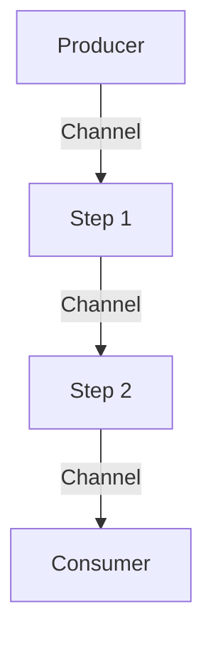

## 12.8.3 Patterns and Practices

Asynchronous programming is a powerful paradigm that enables applications to handle multiple tasks concurrently, improving responsiveness and performance. In Clojure, asynchronous programming is facilitated by the `core.async` library, which provides tools for managing concurrency through channels, go blocks, and more. This section will delve into common patterns and practices in asynchronous programming, focusing on channels for communication, applying backpressure, and composing asynchronous operations. We'll draw parallels with Java's concurrency model to help you transition smoothly.

### Understanding Channels for Communication

Channels in Clojure's `core.async` are akin to queues that allow different parts of your application to communicate asynchronously. They provide a way to pass messages between threads, enabling decoupled and concurrent processing.

#### Creating and Using Channels

In Clojure, channels are created using the `chan` function. You can specify a buffer size to control how many messages the channel can hold before blocking.

```clojure
(require '[clojure.core.async :refer [chan >!! <!! go]])

;; Create a channel with a buffer size of 10
(def my-channel (chan 10))

;; Put a message onto the channel
(go (>!! my-channel "Hello, Clojure!"))

;; Take a message from the channel
(go (println (<!! my-channel)))
```

**Explanation:**
- `chan`: Creates a new channel.
- `>!!`: Puts a message onto the channel, blocking if the channel is full.
- `<!!`: Takes a message from the channel, blocking if the channel is empty.
- `go`: Launches a lightweight thread to perform asynchronous operations.

#### Channels vs. Java's BlockingQueue

In Java, you might use a `BlockingQueue` to achieve similar functionality. Here's a comparison:

```java
import java.util.concurrent.ArrayBlockingQueue;
import java.util.concurrent.BlockingQueue;

public class ChannelExample {
    public static void main(String[] args) throws InterruptedException {
        BlockingQueue<String> queue = new ArrayBlockingQueue<>(10);

        // Producer
        new Thread(() -> {
            try {
                queue.put("Hello, Java!");
            } catch (InterruptedException e) {
                Thread.currentThread().interrupt();
            }
        }).start();

        // Consumer
        new Thread(() -> {
            try {
                System.out.println(queue.take());
            } catch (InterruptedException e) {
                Thread.currentThread().interrupt();
            }
        }).start();
    }
}
```

**Key Differences:**
- **Syntax and Simplicity**: Clojure's syntax is more concise and expressive, leveraging functional programming constructs.
- **Concurrency Model**: Clojure's `go` blocks are lightweight and non-blocking, unlike Java's threads.

### Applying Backpressure

Backpressure is a mechanism to prevent overwhelming a system with too much data, ensuring stability and performance. In Clojure, you can implement backpressure using buffered channels.

#### Implementing Backpressure

By controlling the buffer size of a channel, you can regulate the flow of data and apply backpressure.

```clojure
(defn producer [ch]
  (go-loop [i 0]
    (when (< i 100)
      (>!! ch i)
      (recur (inc i)))))

(defn consumer [ch]
  (go-loop []
    (when-let [value (<!! ch)]
      (println "Consumed:" value)
      (recur))))

(def my-buffered-channel (chan 5)) ; Buffer size of 5

(producer my-buffered-channel)
(consumer my-buffered-channel)
```

**Explanation:**
- **Buffer Size**: The channel's buffer size limits how many items can be queued before blocking the producer.
- **Flow Control**: The consumer processes items at its own pace, naturally applying backpressure to the producer.

#### Backpressure in Java

In Java, you might use a `BlockingQueue` with a fixed capacity to achieve backpressure.

```java
BlockingQueue<Integer> queue = new ArrayBlockingQueue<>(5);

Runnable producer = () -> {
    for (int i = 0; i < 100; i++) {
        try {
            queue.put(i); // Blocks if the queue is full
        } catch (InterruptedException e) {
            Thread.currentThread().interrupt();
        }
    }
};

Runnable consumer = () -> {
    while (true) {
        try {
            Integer value = queue.take(); // Blocks if the queue is empty
            System.out.println("Consumed: " + value);
        } catch (InterruptedException e) {
            Thread.currentThread().interrupt();
        }
    }
};

new Thread(producer).start();
new Thread(consumer).start();
```

**Key Differences:**
- **Blocking Behavior**: Both Clojure and Java use blocking to manage backpressure, but Clojure's `core.async` provides more flexibility with non-blocking operations.

### Composing Asynchronous Operations

Composing asynchronous operations allows you to build complex workflows by chaining simple tasks. In Clojure, you can use channels and go blocks to achieve this.

#### Chaining Operations with Channels

You can chain operations by passing data through multiple channels, each representing a step in the workflow.

```clojure
(defn step1 [input-ch output-ch]
  (go-loop []
    (when-let [value (<!! input-ch)]
      (>!! output-ch (* value 2))
      (recur))))

(defn step2 [input-ch output-ch]
  (go-loop []
    (when-let [value (<!! input-ch)]
      (>!! output-ch (+ value 3))
      (recur))))

(def input-channel (chan))
(def intermediate-channel (chan))
(def output-channel (chan))

(step1 input-channel intermediate-channel)
(step2 intermediate-channel output-channel)

(go (>!! input-channel 5))
(go (println "Final Result:" (<!! output-channel)))
```

**Explanation:**
- **Step Functions**: Each step function reads from an input channel, processes the data, and writes to an output channel.
- **Data Flow**: Data flows through the channels, allowing for modular and composable operations.

#### Java's CompletableFuture for Composition

In Java, you might use `CompletableFuture` to compose asynchronous operations.

```java
import java.util.concurrent.CompletableFuture;

public class AsyncComposition {
    public static void main(String[] args) {
        CompletableFuture.supplyAsync(() -> 5)
            .thenApply(value -> value * 2)
            .thenApply(value -> value + 3)
            .thenAccept(result -> System.out.println("Final Result: " + result));
    }
}
```

**Key Differences:**
- **Declarative Style**: Clojure's use of channels and go blocks provides a more declarative style compared to Java's method chaining.
- **Flexibility**: Clojure's approach allows for more complex data flows and transformations.

### Visualizing Data Flow and Concurrency

To better understand how data flows through asynchronous operations in Clojure, let's visualize it using a Mermaid.js diagram.



**Diagram Explanation:**
- **Producer**: Generates data and sends it to the first channel.
- **Step 1 and Step 2**: Process the data in sequence, each step reading from one channel and writing to the next.
- **Consumer**: Receives the final processed data.

### Best Practices for Asynchronous Programming in Clojure

1. **Use Channels Wisely**: Choose appropriate buffer sizes to balance throughput and backpressure.
2. **Leverage Go Blocks**: Use go blocks for lightweight concurrency, avoiding blocking operations within them.
3. **Compose Operations**: Break down complex workflows into smaller, composable steps using channels.
4. **Monitor and Debug**: Use logging and monitoring tools to track the flow of data and identify bottlenecks.
5. **Handle Errors Gracefully**: Implement error handling strategies to manage failures in asynchronous operations.

### Try It Yourself

Experiment with the provided code examples by modifying buffer sizes, adding more steps to the workflow, or introducing error handling. Observe how these changes affect the behavior of your asynchronous program.

### Further Reading

- [Clojure's core.async Documentation](https://clojure.github.io/core.async/)
- [Java's CompletableFuture Documentation](https://docs.oracle.com/javase/8/docs/api/java/util/concurrent/CompletableFuture.html)
- [Concurrency in Clojure](https://clojure.org/reference/concurrency)

### Exercises

1. **Implement a Producer-Consumer Pattern**: Create a producer-consumer pattern using channels, where the producer generates random numbers and the consumer calculates their sum.
2. **Chain Multiple Operations**: Extend the chaining example by adding a third step that filters out even numbers.
3. **Apply Backpressure**: Modify the producer-consumer pattern to apply backpressure when the consumer is slower than the producer.

### Key Takeaways

- **Channels**: Provide a powerful mechanism for asynchronous communication in Clojure.
- **Backpressure**: Ensures stability by controlling the flow of data.
- **Composition**: Enables building complex workflows from simple operations.
- **Flexibility and Expressiveness**: Clojure's asynchronous programming model offers greater flexibility and expressiveness compared to traditional Java approaches.

Now that we've explored asynchronous programming patterns in Clojure, let's apply these concepts to build responsive and efficient applications.

## Quiz: Mastering Asynchronous Programming Patterns in Clojure



### What is the primary purpose of channels in Clojure's core.async?

- [x] To facilitate asynchronous communication between different parts of an application
- [ ] To store data persistently
- [ ] To manage user authentication
- [ ] To handle file I/O operations

> **Explanation:** Channels in Clojure's core.async are used to facilitate asynchronous communication between different parts of an application, allowing for concurrent processing.

### How does backpressure help in asynchronous systems?

- [x] It prevents overwhelming the system with too much data
- [ ] It speeds up data processing
- [ ] It increases memory usage
- [ ] It simplifies code syntax

> **Explanation:** Backpressure helps prevent overwhelming the system with too much data by controlling the flow and ensuring stability and performance.

### Which Clojure function is used to create a channel?

- [x] `chan`
- [ ] `go`
- [ ] `async`
- [ ] `future`

> **Explanation:** The `chan` function is used to create a new channel in Clojure's core.async.

### In Clojure, what does the `go` block do?

- [x] Launches a lightweight thread for asynchronous operations
- [ ] Creates a new channel
- [ ] Blocks the current thread
- [ ] Handles exceptions

> **Explanation:** The `go` block in Clojure launches a lightweight thread to perform asynchronous operations without blocking the main thread.

### What is a key difference between Clojure's channels and Java's BlockingQueue?

- [x] Clojure's channels support non-blocking operations with go blocks
- [ ] Java's BlockingQueue is more expressive
- [ ] Clojure's channels are slower
- [ ] Java's BlockingQueue uses less memory

> **Explanation:** Clojure's channels support non-blocking operations with go blocks, providing more flexibility compared to Java's BlockingQueue.

### How can you implement backpressure in Clojure?

- [x] By controlling the buffer size of a channel
- [ ] By using a larger buffer size
- [ ] By increasing the number of threads
- [ ] By using synchronous operations

> **Explanation:** Backpressure can be implemented in Clojure by controlling the buffer size of a channel, which regulates the flow of data.

### What is the purpose of the `>!!` function in Clojure?

- [x] To put a message onto a channel, blocking if the channel is full
- [ ] To take a message from a channel
- [ ] To create a new channel
- [ ] To start a go block

> **Explanation:** The `>!!` function is used to put a message onto a channel, blocking if the channel is full.

### Which Java class is often used for asynchronous composition similar to Clojure's channels?

- [x] `CompletableFuture`
- [ ] `Thread`
- [ ] `ExecutorService`
- [ ] `BlockingQueue`

> **Explanation:** `CompletableFuture` in Java is often used for asynchronous composition, similar to how Clojure's channels are used.

### What is a benefit of composing asynchronous operations in Clojure?

- [x] It allows building complex workflows from simple operations
- [ ] It reduces code readability
- [ ] It increases memory usage
- [ ] It simplifies error handling

> **Explanation:** Composing asynchronous operations in Clojure allows building complex workflows from simple operations, enhancing modularity and maintainability.

### True or False: Clojure's core.async provides tools for managing concurrency through channels and go blocks.

- [x] True
- [ ] False

> **Explanation:** True. Clojure's core.async provides tools for managing concurrency through channels and go blocks, enabling asynchronous programming.


