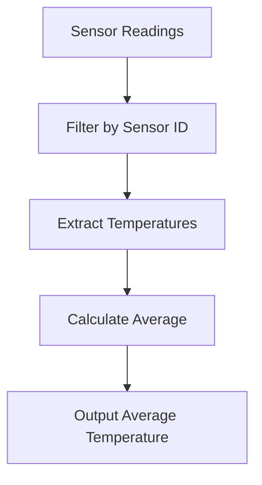

## 12.9.1 Data-Oriented Programming

Data-oriented programming (DOP) is a paradigm that emphasizes the use of simple, immutable data structures to represent and manipulate data. In Clojure, this approach is central to its design philosophy, contrasting with the object-oriented programming (OOP) model familiar to Java developers. By focusing on data rather than behavior, Clojure offers a powerful way to handle complex data transformations and state management, leading to benefits such as easier testing, serialization, and concurrency.

### Understanding Data-Oriented Programming

In traditional OOP, data and behavior are encapsulated within objects. This encapsulation can sometimes lead to complex hierarchies and tightly coupled systems. In contrast, DOP separates data from behavior, allowing developers to focus on transforming data through functions. This separation simplifies the codebase, making it more flexible and easier to maintain.

#### Key Principles of Data-Oriented Programming

1. **Immutable Data Structures**: Data is represented using immutable structures, ensuring that once created, data cannot be altered. This immutability leads to safer concurrent programming and easier reasoning about code.

2. **Separation of Data and Behavior**: Functions operate on data rather than being methods attached to objects. This separation allows for more reusable and composable code.

3. **Data as a First-Class Citizen**: Data is treated as a primary concern, with functions designed to transform and manipulate data in a straightforward manner.

4. **Simplicity and Transparency**: By using simple data structures like lists, maps, and vectors, the complexity of data manipulation is reduced, leading to more transparent and understandable code.

### Clojure's Approach to Data-Oriented Programming

Clojure's core philosophy revolves around treating data as a first-class citizen. It provides a rich set of immutable data structures and a powerful standard library for data manipulation. Let's explore how Clojure implements DOP and how it compares to Java's OOP model.

#### Immutable Data Structures in Clojure

Clojure offers several immutable data structures, including lists, vectors, maps, and sets. These structures are designed to be persistent, meaning that operations on them return new structures rather than modifying the original.

**Example: Immutable Data Structures**

```clojure
;; Define an immutable vector
(def my-vector [1 2 3 4 5])

;; Add an element to the vector
(def new-vector (conj my-vector 6))

;; Original vector remains unchanged
(println my-vector)   ; Output: [1 2 3 4 5]
(println new-vector)  ; Output: [1 2 3 4 5 6]
```

In Java, achieving immutability requires additional effort, such as using `Collections.unmodifiableList()` or creating custom immutable classes. Clojure's immutability by default simplifies this process.

#### Functions as Data Transformers

In Clojure, functions are the primary means of transforming data. They are first-class citizens, meaning they can be passed as arguments, returned from other functions, and stored in data structures.

**Example: Data Transformation with Functions**

```clojure
;; Define a function to double a number
(defn double [x]
  (* 2 x))

;; Use map to apply the function to each element in a vector
(def doubled-vector (map double my-vector))

(println doubled-vector)  ; Output: (2 4 6 8 10)
```

In Java, similar transformations would typically involve loops or streams, which can be more verbose and less intuitive.

#### Comparing Clojure and Java: Data Manipulation

Let's compare how data manipulation differs between Clojure and Java using a simple example: filtering a list of numbers to retain only even numbers.

**Clojure Example**

```clojure
;; Define a function to check if a number is even
(defn even? [n]
  (zero? (mod n 2)))

;; Filter even numbers from a vector
(def even-numbers (filter even? my-vector))

(println even-numbers)  ; Output: (2 4)
```

**Java Example**

```java
import java.util.Arrays;
import java.util.List;
import java.util.stream.Collectors;

public class EvenNumbers {
    public static void main(String[] args) {
        List<Integer> numbers = Arrays.asList(1, 2, 3, 4, 5);
        List<Integer> evenNumbers = numbers.stream()
                                           .filter(n -> n % 2 == 0)
                                           .collect(Collectors.toList());
        System.out.println(evenNumbers);  // Output: [2, 4]
    }
}
```

While Java's stream API provides a functional approach to data manipulation, Clojure's syntax is more concise and expressive, highlighting the benefits of DOP.

### Benefits of Data-Oriented Programming

Data-oriented programming offers several advantages, particularly for Java developers transitioning to Clojure:

1. **Easier Testing**: With data and behavior separated, testing becomes more straightforward. Functions can be tested independently of the data they operate on.

2. **Simplified Serialization**: Simple data structures are easier to serialize and deserialize, making data exchange between systems more efficient.

3. **Enhanced Concurrency**: Immutability eliminates issues related to shared mutable state, simplifying concurrent programming.

4. **Improved Code Reusability**: Functions that operate on data can be reused across different contexts, reducing code duplication.

5. **Greater Flexibility**: By focusing on data transformations, systems can adapt more easily to changing requirements.

### Practical Applications of Data-Oriented Programming

To illustrate the practical applications of DOP, let's consider a real-world scenario: processing a stream of sensor data to calculate average temperature readings.

**Clojure Example: Sensor Data Processing**

```clojure
;; Sample sensor data
(def sensor-readings [{:sensor-id 1 :temperature 22.5}
                      {:sensor-id 2 :temperature 23.0}
                      {:sensor-id 1 :temperature 22.8}
                      {:sensor-id 2 :temperature 23.2}])

;; Function to calculate average temperature
(defn average-temperature [readings]
  (let [temperatures (map :temperature readings)
        total (reduce + temperatures)
        count (count temperatures)]
    (/ total count)))

;; Calculate average temperature for sensor 1
(def sensor-1-readings (filter #(= (:sensor-id %) 1) sensor-readings))
(def avg-temp (average-temperature sensor-1-readings))

(println avg-temp)  ; Output: 22.65
```

In this example, we use simple data structures (maps) to represent sensor readings and leverage Clojure's powerful data manipulation functions to calculate the average temperature.

### Try It Yourself

Experiment with the code examples provided by modifying the data or functions. For instance, try adding more sensor readings or calculating the average temperature for all sensors.

### Diagrams and Visualizations

To further illustrate the flow of data through functions in Clojure, let's use a Mermaid.js diagram to visualize the process of filtering and transforming data.



**Diagram Description**: This flowchart represents the process of filtering sensor readings by sensor ID, extracting temperature values, calculating the average, and outputting the result.

### Further Reading

For more information on data-oriented programming and Clojure's approach to data manipulation, consider exploring the following resources:

- [Official Clojure Documentation](https://clojure.org/)
- [ClojureDocs](https://clojuredocs.org/)
- [GitHub - Clojure Examples](https://github.com/clojure-examples)

### Exercises and Practice Problems

1. **Exercise 1**: Modify the sensor data processing example to calculate the maximum and minimum temperatures for each sensor.

2. **Exercise 2**: Implement a function that takes a list of maps representing students and their grades, and returns a list of students who passed (grade >= 50).

3. **Exercise 3**: Create a Clojure function that merges two maps, combining their values for matching keys using a provided function.

### Key Takeaways

- Data-oriented programming emphasizes simple, immutable data structures and the separation of data from behavior.
- Clojure's approach to DOP offers benefits such as easier testing, serialization, and enhanced concurrency.
- By focusing on data transformations, Clojure enables more flexible and reusable code.
- Java developers can leverage their existing knowledge while embracing Clojure's unique features to enhance their programming skills.

Now that we've explored data-oriented programming in Clojure, let's apply these concepts to build more robust and flexible applications.

---

## Quiz: Test Your Knowledge on Data-Oriented Programming in Clojure



### What is a key principle of data-oriented programming in Clojure?

- [x] Separation of data and behavior
- [ ] Encapsulation of data and behavior
- [ ] Use of mutable data structures
- [ ] Inheritance and polymorphism

> **Explanation:** Data-oriented programming emphasizes the separation of data and behavior, allowing functions to operate on data independently.

### Which Clojure data structure is immutable by default?

- [x] Vector
- [ ] ArrayList
- [ ] HashMap
- [ ] LinkedList

> **Explanation:** Clojure's vector is an immutable data structure, meaning it cannot be modified once created.

### How does Clojure handle data transformations?

- [x] Through functions that operate on data
- [ ] By modifying objects directly
- [ ] Using class methods
- [ ] Through inheritance

> **Explanation:** Clojure uses functions to transform data, focusing on data manipulation rather than object modification.

### What is a benefit of using immutable data structures in Clojure?

- [x] Enhanced concurrency
- [ ] Easier inheritance
- [ ] Faster execution
- [ ] Simplified encapsulation

> **Explanation:** Immutable data structures eliminate issues related to shared mutable state, enhancing concurrency.

### Which of the following is a common Clojure data structure?

- [x] Map
- [ ] TreeSet
- [ ] PriorityQueue
- [ ] Stack

> **Explanation:** Clojure provides maps as a common data structure for key-value pairs.

### What is the primary focus of data-oriented programming?

- [x] Data manipulation
- [ ] Object creation
- [ ] Class hierarchy
- [ ] Method overriding

> **Explanation:** Data-oriented programming focuses on manipulating data through functions.

### How does Clojure's approach to data-oriented programming differ from Java's OOP?

- [x] Clojure separates data from behavior
- [ ] Clojure uses classes and objects
- [ ] Clojure relies on inheritance
- [ ] Clojure emphasizes encapsulation

> **Explanation:** Clojure separates data from behavior, contrasting with Java's encapsulation of data and behavior within objects.

### What is a practical application of data-oriented programming in Clojure?

- [x] Processing sensor data
- [ ] Implementing class hierarchies
- [ ] Creating mutable objects
- [ ] Using polymorphism

> **Explanation:** Data-oriented programming is well-suited for processing data, such as sensor readings, through transformations.

### Which function is used to filter data in Clojure?

- [x] filter
- [ ] map
- [ ] reduce
- [ ] sort

> **Explanation:** The `filter` function is used to select elements from a collection based on a predicate.

### True or False: Clojure's data-oriented programming simplifies serialization.

- [x] True
- [ ] False

> **Explanation:** Simple data structures in Clojure make serialization and deserialization more straightforward.


