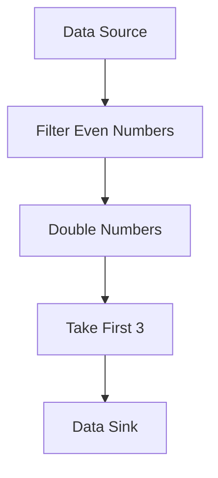

## 12.9.2 The Use of Transducers

In this section, we delve into **transducers**, a unique and powerful feature of Clojure that allows for efficient and flexible data processing. Transducers provide a way to decouple data transformation logic from the data sources and sinks, enabling reusable and composable transformations. This concept is particularly beneficial for Java developers transitioning to Clojure, as it offers a more functional approach to handling data streams compared to traditional Java methods.

### Understanding Transducers

Transducers are a form of composable algorithm that can be applied to various data structures, such as lists, vectors, and even streams. They are designed to be independent of the context in which they are used, meaning they can be applied to both in-memory collections and I/O streams without modification.

#### Key Concepts

- **Decoupling**: Transducers separate the transformation logic from the data source and sink, allowing for greater flexibility and reuse.
- **Composability**: Transducers can be composed together to form complex data processing pipelines.
- **Efficiency**: By eliminating intermediate collections, transducers can improve performance, especially in large data processing tasks.

### Transducers vs. Java Streams

In Java, the introduction of streams in Java 8 brought a more functional style to data processing. However, Java streams are tightly coupled with their data sources. Transducers, on the other hand, are more flexible as they are not bound to any specific data source or sink.

#### Java Streams Example

```java
List<String> names = Arrays.asList("Alice", "Bob", "Charlie");
List<String> upperCaseNames = names.stream()
    .filter(name -> name.length() > 3)
    .map(String::toUpperCase)
    .collect(Collectors.toList());
```

In this Java example, the stream operations are tied to the `List` data source.

#### Clojure Transducers Example

```clojure
(def names ["Alice" "Bob" "Charlie"])
(def xf (comp (filter #(> (count %) 3))
              (map clojure.string/upper-case)))

(transduce xf conj [] names)
```

In the Clojure example, the transformation logic (`xf`) is defined separately from the data source, making it reusable across different contexts.

### How Transducers Work

Transducers are essentially functions that take a reducing function and return a new reducing function. This allows them to be applied to any context that supports reduction, such as sequences, channels, or even custom data structures.

#### Creating a Transducer

Let's create a simple transducer that filters even numbers and then doubles them:

```clojure
(def xf (comp (filter even?) (map #(* 2 %))))
```

Here, `comp` is used to compose two transducers: one for filtering even numbers and another for doubling them.

#### Applying Transducers

Transducers can be applied using the `transduce` function, which takes a transducer, a reducing function, an initial value, and a collection:

```clojure
(transduce xf + 0 [1 2 3 4 5 6])
;; => 24
```

In this example, the transducer `xf` is applied to the collection `[1 2 3 4 5 6]`, filtering and doubling the even numbers before summing them.

### Benefits of Using Transducers

1. **Reusability**: Transducers can be reused across different data sources, reducing code duplication.
2. **Performance**: By avoiding intermediate collections, transducers can improve performance in data processing tasks.
3. **Flexibility**: Transducers can be applied to various contexts, including sequences, channels, and custom data structures.

### Advanced Transducer Concepts

#### Composing Transducers

Transducers can be composed using the `comp` function, allowing for complex data processing pipelines:

```clojure
(def xf (comp (filter even?) (map #(* 2 %)) (take 3)))
(transduce xf conj [] (range 10))
;; => [0 4 8]
```

In this example, the transducer `xf` filters even numbers, doubles them, and takes the first three results.

#### Custom Transducers

You can create custom transducers by defining a function that takes a reducing function and returns a new reducing function:

```clojure
(defn my-transducer [rf]
  (fn [result input]
    (if (even? input)
      (rf result (* 2 input))
      result)))

(transduce my-transducer conj [] [1 2 3 4 5 6])
;; => [4 8 12]
```

### Visualizing Transducers

To better understand how transducers work, let's visualize the flow of data through a transducer pipeline:



**Diagram Explanation**: This flowchart illustrates a transducer pipeline that filters even numbers, doubles them, and takes the first three results before sending them to the data sink.

### Try It Yourself

To get hands-on experience with transducers, try modifying the examples above:

- Change the filtering condition to odd numbers.
- Add a new transformation to the pipeline, such as squaring the numbers.
- Experiment with different data sources, such as channels or custom collections.

### Further Reading

For more information on transducers, consider exploring the following resources:

- [Clojure Transducers Guide](https://clojure.org/reference/transducers)
- [ClojureDocs Transducers Examples](https://clojuredocs.org/clojure.core/transduce)
- [Rich Hickey's Transducers Talk](https://www.youtube.com/watch?v=6mTbuzafcII)

### Exercises

1. **Exercise 1**: Create a transducer that filters out strings shorter than 5 characters and converts the remaining strings to lowercase.
2. **Exercise 2**: Implement a transducer pipeline that processes a sequence of numbers by filtering, mapping, and reducing them to a single value.
3. **Exercise 3**: Compare the performance of a transducer-based pipeline with a traditional sequence-based pipeline for large data sets.

### Key Takeaways

- Transducers provide a powerful way to decouple data transformation logic from data sources and sinks.
- They offer improved performance by eliminating intermediate collections and are highly reusable across different contexts.
- Understanding transducers can enhance your ability to write efficient and flexible data processing code in Clojure.

By mastering transducers, you'll be well-equipped to handle complex data processing tasks in Clojure, leveraging the language's functional programming strengths to their fullest potential.

## Quiz: Mastering Transducers in Clojure



### What is a key advantage of using transducers in Clojure?

- [x] They decouple transformation logic from data sources and sinks.
- [ ] They are only applicable to in-memory collections.
- [ ] They require intermediate collections.
- [ ] They are specific to Java interoperability.

> **Explanation:** Transducers decouple transformation logic from data sources and sinks, making them versatile and reusable.


### How do transducers improve performance in data processing?

- [x] By eliminating intermediate collections.
- [ ] By increasing memory usage.
- [ ] By adding more processing steps.
- [ ] By using reflection.

> **Explanation:** Transducers improve performance by eliminating the need for intermediate collections, reducing memory overhead.


### Which function is used to apply a transducer in Clojure?

- [x] `transduce`
- [ ] `reduce`
- [ ] `map`
- [ ] `filter`

> **Explanation:** The `transduce` function is used to apply a transducer to a collection in Clojure.


### What does the `comp` function do in the context of transducers?

- [x] Composes multiple transducers into a single transducer.
- [ ] Applies a transducer to a collection.
- [ ] Filters elements from a collection.
- [ ] Maps a function over a collection.

> **Explanation:** The `comp` function composes multiple transducers into a single transducer, allowing for complex pipelines.


### In the provided Clojure example, what does the transducer `xf` do?

- [x] Filters even numbers and doubles them.
- [ ] Filters odd numbers and triples them.
- [ ] Maps numbers to their square.
- [ ] Reduces numbers to a single value.

> **Explanation:** The transducer `xf` filters even numbers and doubles them, as defined in the example.


### Can transducers be applied to I/O streams in Clojure?

- [x] Yes
- [ ] No

> **Explanation:** Transducers can be applied to I/O streams, as they are independent of the data source or sink.


### What is the purpose of the `my-transducer` function in the custom transducer example?

- [x] To create a custom transducer that filters and transforms data.
- [ ] To apply a transducer to a collection.
- [ ] To compose multiple transducers.
- [ ] To reduce a collection to a single value.

> **Explanation:** The `my-transducer` function creates a custom transducer that filters even numbers and doubles them.


### How does the transducer pipeline in the diagram process data?

- [x] Filters even numbers, doubles them, and takes the first three results.
- [ ] Filters odd numbers, triples them, and takes the last three results.
- [ ] Maps numbers to their square and sums them.
- [ ] Reduces numbers to a single value.

> **Explanation:** The transducer pipeline filters even numbers, doubles them, and takes the first three results, as shown in the diagram.


### What is a common use case for transducers in Clojure?

- [x] Efficient data processing across different contexts.
- [ ] Creating intermediate collections.
- [ ] Enhancing Java interoperability.
- [ ] Increasing memory usage.

> **Explanation:** Transducers are commonly used for efficient data processing across different contexts, without creating intermediate collections.


### True or False: Transducers are specific to Clojure and cannot be used in other languages.

- [x] True
- [ ] False

> **Explanation:** Transducers are a concept specific to Clojure, designed to work with its functional programming paradigm.


