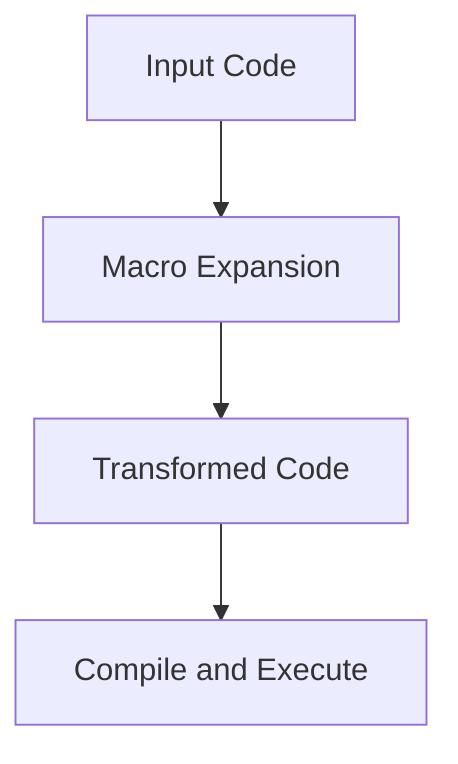

## 12.9.3 Leveraging Macro Systems

In the realm of programming languages, Clojure stands out with its powerful macro system, a feature inherited from its Lisp heritage. Macros in Clojure allow developers to perform metaprogramming, enabling the creation of code that writes code. This capability opens the door to patterns such as code generation and the creation of domain-specific languages (DSLs), which are unique to Lisp dialects like Clojure. In this section, we'll explore how macros work, how they compare to Java's capabilities, and how you can leverage them to enhance your Clojure applications.

### Understanding Macros in Clojure

Macros in Clojure are a form of metaprogramming that allows you to manipulate code as data. This is possible because Clojure, like other Lisp languages, is homoiconic, meaning the code structure is represented as data structures that the language itself can manipulate.

#### What Are Macros?

Macros are functions that take code as input and produce code as output. They are executed at compile time, allowing you to transform and generate code before it is evaluated. This is different from functions, which operate on data at runtime.

```clojure
(defmacro unless [condition & body]
  `(if (not ~condition)
     (do ~@body)))

;; Usage
(unless false
  (println "This will print because the condition is false."))
```

In the example above, the `unless` macro takes a condition and a body of code. It transforms the input into an `if` expression that negates the condition, effectively creating a new control structure.

#### Why Use Macros?

Macros are powerful because they allow you to extend the language itself. You can create new syntactic constructs, embed domain-specific languages, and perform complex code transformations that would be cumbersome or impossible with functions alone.

### Comparing Macros to Java's Reflection

Java provides reflection as a way to inspect and manipulate code at runtime. While reflection is powerful, it operates at a different level than macros. Reflection allows you to interact with the structure of classes and objects, but it doesn't enable you to transform code before it runs.

**Key Differences:**

- **Timing**: Macros operate at compile time, while reflection operates at runtime.
- **Purpose**: Macros are used for code generation and transformation, whereas reflection is used for introspection and dynamic behavior.
- **Performance**: Macros can optimize code by generating efficient constructs at compile time, whereas reflection can introduce runtime overhead.

### Creating Domain-Specific Languages (DSLs)

One of the most compelling uses of macros is the creation of DSLs. A DSL is a specialized language tailored to a specific problem domain, allowing developers to express solutions more naturally and concisely.

#### Designing a DSL in Clojure

To design a DSL, you need to define the syntax and semantics that best express the domain concepts. Macros play a crucial role in this process by allowing you to define new language constructs.

**Example: A Simple DSL for HTML Generation**

```clojure
(defmacro html [& body]
  `(str "<html>" ~@body "</html>"))

(defmacro head [& body]
  `(str "<head>" ~@body "</head>"))

(defmacro body [& body]
  `(str "<body>" ~@body "</body>"))

(defmacro title [text]
  `(str "<title>" ~text "</title>"))

;; Usage
(html
  (head
    (title "My Page"))
  (body
    (println "Welcome to my page!")))
```

In this example, we define a simple DSL for generating HTML. The macros `html`, `head`, `body`, and `title` allow us to express HTML structure in a more natural way, abstracting away the string concatenation.

### Code Generation with Macros

Macros can also be used for code generation, automating repetitive tasks and reducing boilerplate code. This is particularly useful in scenarios where you need to generate similar code patterns across different parts of your application.

#### Automating Repetitive Tasks

Consider a scenario where you need to define multiple similar functions. Instead of writing each function manually, you can use a macro to generate them.

```clojure
(defmacro defmathops [name op]
  `(defn ~(symbol (str name "-op")) [a b]
     (~op a b)))

;; Generate addition and subtraction functions
(defmathops add +)
(defmathops subtract -)

;; Usage
(println (add-op 5 3))      ;; Output: 8
(println (subtract-op 5 3)) ;; Output: 2
```

Here, the `defmathops` macro generates functions for mathematical operations, reducing redundancy and potential errors.

### Best Practices for Using Macros

While macros are powerful, they should be used judiciously. Overuse of macros can lead to code that is difficult to read and maintain. Here are some best practices to consider:

- **Keep Macros Simple**: Aim for simplicity and clarity in your macro definitions. Complex macros can be hard to debug and understand.
- **Use Macros for Code Generation**: Leverage macros to automate repetitive tasks and reduce boilerplate code.
- **Avoid Side Effects**: Macros should focus on code transformation and avoid introducing side effects.
- **Document Your Macros**: Provide clear documentation and examples for your macros to help others understand their purpose and usage.

### Try It Yourself

To deepen your understanding of macros, try modifying the examples provided:

1. **Extend the HTML DSL**: Add more macros to support additional HTML elements like `div`, `p`, and `a`.
2. **Create a Math DSL**: Design a DSL for mathematical expressions, allowing users to write expressions like `(add 5 3)` or `(multiply 4 2)` using macros.
3. **Refactor Java Code**: Identify repetitive patterns in your Java codebase and explore how you could use Clojure macros to simplify them.

### Diagrams and Visualizations

To better understand how macros transform code, let's visualize the process using a flowchart:



**Diagram Description**: This flowchart illustrates the macro expansion process in Clojure. The input code is transformed by macros during the macro expansion phase, resulting in transformed code that is then compiled and executed.

### Further Reading

For more information on Clojure macros and metaprogramming, consider exploring the following resources:

- [Official Clojure Documentation on Macros](https://clojure.org/reference/macros)
- [ClojureDocs: Macros](https://clojuredocs.org/quickref#macros)
- [Clojure Programming by Chas Emerick, Brian Carper, and Christophe Grand](https://www.oreilly.com/library/view/clojure-programming/9781449310387/)

### Exercises

To reinforce your understanding of macros, try the following exercises:

1. **Macro Expansion**: Write a macro that takes a list of numbers and generates a function that calculates their sum.
2. **DSL Creation**: Design a DSL for a simple task management system, allowing users to define tasks and dependencies using macros.
3. **Code Generation**: Create a macro that generates getter and setter functions for a given set of fields in a map.

### Key Takeaways

- **Macros Enable Metaprogramming**: Clojure's macro system allows you to manipulate code as data, enabling powerful code transformations and DSL creation.
- **Use Macros Wisely**: While macros are powerful, they should be used judiciously to avoid complexity and maintain readability.
- **Extend the Language**: Macros allow you to extend the language itself, creating new syntactic constructs and abstractions tailored to your needs.

Now that we've explored how to leverage macro systems in Clojure, let's apply these concepts to create more expressive and efficient code in your applications.

## Quiz: Mastering Clojure Macros and DSLs



### What is a macro in Clojure?

- [x] A function that takes code as input and produces code as output, executed at compile time.
- [ ] A runtime function that manipulates data.
- [ ] A tool for debugging Clojure applications.
- [ ] A library for handling concurrency in Clojure.

> **Explanation:** Macros in Clojure are functions that take code as input and produce code as output, allowing for compile-time code transformations.

### How do macros differ from Java's reflection?

- [x] Macros operate at compile time, while reflection operates at runtime.
- [ ] Macros are used for introspection, while reflection is used for code generation.
- [ ] Macros are slower than reflection.
- [ ] Macros and reflection serve the same purpose.

> **Explanation:** Macros operate at compile time, enabling code transformation before execution, whereas reflection is used for runtime introspection and manipulation.

### What is a DSL?

- [x] A domain-specific language tailored to a specific problem domain.
- [ ] A general-purpose programming language.
- [ ] A tool for debugging applications.
- [ ] A type of database management system.

> **Explanation:** A DSL is a specialized language designed to express solutions in a specific problem domain more naturally and concisely.

### What is the primary purpose of using macros in Clojure?

- [x] To perform code generation and transformation.
- [ ] To handle concurrency.
- [ ] To manage state.
- [ ] To perform input/output operations.

> **Explanation:** Macros are primarily used for code generation and transformation, allowing developers to extend the language and automate repetitive tasks.

### Which of the following is a best practice when using macros?

- [x] Keep macros simple and focused.
- [ ] Use macros for all code transformations.
- [ ] Avoid documenting macros.
- [ ] Introduce side effects in macros.

> **Explanation:** Keeping macros simple and focused is a best practice to ensure readability and maintainability.

### What is homoiconicity in the context of Clojure?

- [x] The property of a language where code is represented as data structures.
- [ ] The ability to handle concurrent operations.
- [ ] The use of macros for code generation.
- [ ] The process of garbage collection.

> **Explanation:** Homoiconicity refers to the property of a language where code is represented as data structures, allowing for manipulation by the language itself.

### How can macros help in reducing boilerplate code?

- [x] By automating repetitive tasks and generating similar code patterns.
- [ ] By providing runtime introspection capabilities.
- [ ] By managing state changes.
- [ ] By handling input/output operations.

> **Explanation:** Macros can automate repetitive tasks and generate similar code patterns, reducing boilerplate code and potential errors.

### What is the role of `macroexpand` in Clojure?

- [x] To visualize the transformation of code by macros.
- [ ] To execute macros at runtime.
- [ ] To manage state in Clojure applications.
- [ ] To handle concurrency.

> **Explanation:** `macroexpand` is used to visualize the transformation of code by macros, helping developers understand the macro expansion process.

### Which of the following is an example of a DSL in Clojure?

- [x] A set of macros for generating HTML.
- [ ] A library for handling concurrency.
- [ ] A tool for debugging applications.
- [ ] A database management system.

> **Explanation:** A set of macros for generating HTML is an example of a DSL, allowing developers to express HTML structure more naturally.

### True or False: Macros should be used for all code transformations in Clojure.

- [ ] True
- [x] False

> **Explanation:** While macros are powerful, they should be used judiciously and not for all code transformations, as overuse can lead to complexity and reduced readability.


