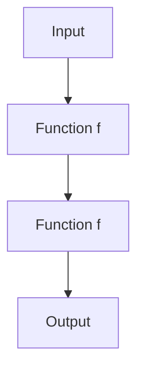
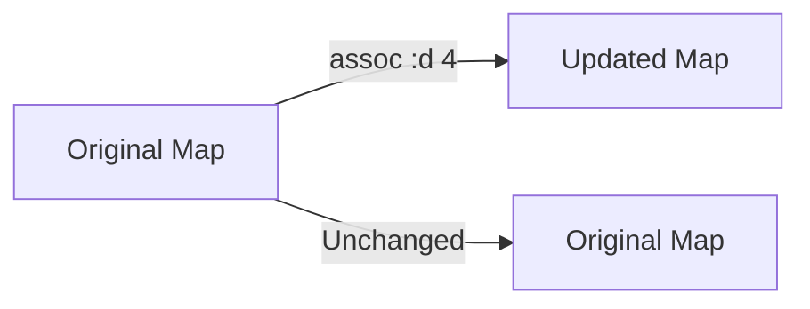
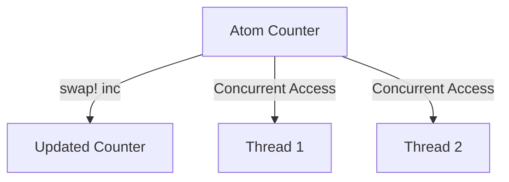

## 13.1.1 Why Use Clojure for Web Development

As experienced Java developers, you are likely familiar with the intricacies of building robust web applications. Transitioning to Clojure for web development offers a unique set of advantages that can enhance your development process and the quality of your applications. In this section, we will explore the key reasons why Clojure is an excellent choice for web development, focusing on its functional programming paradigm, immutability, concurrency support, simplicity, expressiveness, and seamless integration with Java libraries.

### Embracing Functional Programming

Clojure is a functional programming language that encourages a declarative approach to coding. This paradigm shift from Java's imperative style can lead to more predictable and maintainable code. In functional programming, functions are first-class citizens, meaning they can be passed as arguments, returned from other functions, and assigned to variables. This allows for higher-order functions and a more modular codebase.

#### Code Example: Higher-Order Functions

In Clojure, you can easily create higher-order functions that operate on other functions. Consider the following example:

```clojure
(defn apply-twice [f x]
  "Applies a function f to x twice."
  (f (f x)))

(defn increment [n]
  "Increments a number by 1."
  (+ n 1))

;; Usage
(apply-twice increment 5) ; => 7
```

In contrast, achieving the same in Java requires more boilerplate code, often involving interfaces or anonymous classes.

#### Diagram: Function Composition



*Caption: This diagram illustrates the flow of data through a higher-order function that applies a function twice.*

### Leveraging Immutability

Immutability is a core concept in Clojure, where data structures are immutable by default. This means that once a data structure is created, it cannot be changed. Instead, operations on data structures return new versions with the desired changes. This approach reduces side effects and makes your code easier to reason about, especially in concurrent environments.

#### Code Example: Immutable Data Structures

```clojure
(def my-map {:a 1 :b 2 :c 3})

(def updated-map (assoc my-map :d 4))

;; my-map remains unchanged
;; updated-map is {:a 1, :b 2, :c 3, :d 4}
```

In Java, achieving immutability often requires additional effort, such as using `Collections.unmodifiableMap` or creating custom immutable classes.

#### Diagram: Immutability in Clojure



*Caption: This diagram shows how Clojure's immutable data structures create new versions rather than modifying existing ones.*

### Concurrency Made Simple

Clojure provides robust concurrency primitives, such as atoms, refs, agents, and software transactional memory (STM), which simplify the development of concurrent applications. These tools help manage shared state without the complexity of traditional locking mechanisms found in Java.

#### Code Example: Using Atoms for Concurrency

```clojure
(def counter (atom 0))

(defn increment-counter []
  (swap! counter inc))

;; Concurrently increment the counter
(doseq [_ (range 1000)]
  (future (increment-counter)))

;; The final value of counter will be 1000
```

In Java, managing concurrency often involves synchronized blocks or explicit locks, which can be error-prone and difficult to manage.

#### Diagram: Concurrency with Atoms



*Caption: This diagram illustrates how multiple threads can safely update an atom in Clojure.*

### Simplicity and Expressiveness

Clojure's syntax is concise and expressive, allowing developers to write less code to achieve the same functionality as in Java. This simplicity leads to faster development cycles and easier maintenance.

#### Code Example: Expressive Syntax

```clojure
(defn greet [name]
  (str "Hello, " name "!"))

(greet "World") ; => "Hello, World!"
```

In Java, the same functionality would require more verbose syntax, including class and method definitions.

### Seamless Java Integration

Clojure runs on the Java Virtual Machine (JVM), which means you can leverage existing Java libraries and frameworks in your Clojure applications. This interoperability allows you to gradually transition to Clojure while still utilizing your existing Java codebase.

#### Code Example: Java Interoperability

```clojure
(import java.util.Date)

(defn current-date []
  (Date.))

(current-date) ; Returns the current date using Java's Date class
```

This seamless integration enables you to call Java methods, create Java objects, and handle Java exceptions directly from Clojure.

### Try It Yourself

To deepen your understanding of Clojure's advantages, try modifying the provided code examples. For instance, experiment with creating your own higher-order functions or using different concurrency primitives. Observe how Clojure's immutability and expressiveness simplify these tasks compared to Java.

### Further Reading

For more information on Clojure's features and benefits, consider exploring the following resources:

- [Official Clojure Documentation](https://clojure.org/)
- [ClojureDocs](https://clojuredocs.org/)
- [Clojure GitHub Repository](https://github.com/clojure/clojure)

### Exercises

1. Write a Clojure function that takes a list of numbers and returns a new list with each number incremented by 2.
2. Implement a simple web server in Clojure using the Ring library.
3. Create a Clojure program that uses refs to manage a shared bank account balance across multiple transactions.

### Key Takeaways

- **Functional Programming**: Clojure's functional paradigm promotes modular and maintainable code.
- **Immutability**: Immutable data structures reduce side effects and simplify concurrency.
- **Concurrency**: Clojure's concurrency primitives make it easier to write concurrent applications.
- **Expressiveness**: Clojure's concise syntax leads to faster development and easier maintenance.
- **Java Interoperability**: Clojure's seamless integration with Java allows for gradual adoption and reuse of existing libraries.

By embracing Clojure for web development, you can leverage these advantages to build more robust, maintainable, and efficient web applications. Now that we've explored why Clojure is a compelling choice for web development, let's dive deeper into setting up your Clojure web development environment.

## Quiz: Test Your Understanding of Clojure for Web Development



### What is a key advantage of using Clojure's functional programming paradigm for web development?

- [x] It promotes modular and maintainable code.
- [ ] It requires more boilerplate code.
- [ ] It is incompatible with Java libraries.
- [ ] It relies heavily on mutable state.

> **Explanation:** Clojure's functional programming paradigm encourages modular and maintainable code by using functions as first-class citizens and reducing side effects.

### How does Clojure handle data immutability?

- [x] By creating new versions of data structures with changes.
- [ ] By modifying existing data structures in place.
- [ ] By using synchronized blocks.
- [ ] By relying on mutable collections.

> **Explanation:** Clojure handles data immutability by creating new versions of data structures with changes, ensuring that the original data remains unchanged.

### Which concurrency primitive in Clojure allows safe updates to shared state?

- [x] Atoms
- [ ] Locks
- [ ] Threads
- [ ] Synchronized blocks

> **Explanation:** Atoms in Clojure allow safe updates to shared state by using atomic operations like `swap!`.

### What is a benefit of Clojure's expressiveness in web development?

- [x] It allows developers to write less code for the same functionality.
- [ ] It requires more verbose syntax.
- [ ] It limits the use of Java libraries.
- [ ] It complicates code maintenance.

> **Explanation:** Clojure's expressiveness allows developers to write less code for the same functionality, leading to faster development cycles and easier maintenance.

### How does Clojure integrate with Java libraries?

- [x] By running on the Java Virtual Machine (JVM).
- [ ] By using a separate runtime environment.
- [ ] By converting Java code to Clojure.
- [ ] By requiring Java code to be rewritten.

> **Explanation:** Clojure integrates with Java libraries by running on the Java Virtual Machine (JVM), allowing seamless interoperability.

### What is a common use case for higher-order functions in Clojure?

- [x] Passing functions as arguments to other functions.
- [ ] Creating synchronized blocks.
- [ ] Modifying mutable state.
- [ ] Implementing inheritance.

> **Explanation:** Higher-order functions in Clojure are commonly used to pass functions as arguments to other functions, enabling more flexible and reusable code.

### Which Clojure feature simplifies concurrency compared to Java?

- [x] Concurrency primitives like atoms and refs.
- [ ] Synchronized blocks.
- [ ] Explicit locks.
- [ ] Thread pools.

> **Explanation:** Clojure's concurrency primitives like atoms and refs simplify concurrency by providing safe and easy-to-use mechanisms for managing shared state.

### What is a key difference between Clojure and Java in terms of syntax?

- [x] Clojure's syntax is more concise and expressive.
- [ ] Java's syntax is more concise and expressive.
- [ ] Clojure requires more boilerplate code.
- [ ] Java supports first-class functions.

> **Explanation:** Clojure's syntax is more concise and expressive, allowing developers to write less code for the same functionality compared to Java.

### How does Clojure's immutability benefit concurrent applications?

- [x] It reduces side effects and simplifies reasoning about code.
- [ ] It increases the complexity of managing shared state.
- [ ] It requires explicit locks for thread safety.
- [ ] It limits the use of Java libraries.

> **Explanation:** Clojure's immutability reduces side effects and simplifies reasoning about code, making it easier to write concurrent applications.

### True or False: Clojure can seamlessly call Java methods and create Java objects.

- [x] True
- [ ] False

> **Explanation:** True. Clojure can seamlessly call Java methods and create Java objects due to its integration with the Java Virtual Machine (JVM).




