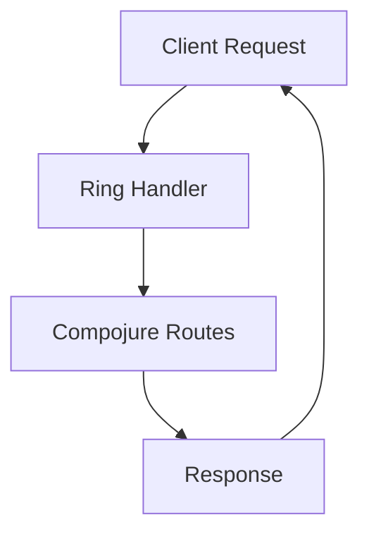

## 13.1.3 Setting Up the Development Environment

Welcome to the exciting world of web development with Clojure! As experienced Java developers, you're already familiar with setting up development environments, but Clojure introduces some unique tools and concepts that will enhance your web development experience. In this section, we'll guide you through setting up your environment, installing necessary tools like Leiningen, configuring dependencies, and creating a basic project structure. By the end of this guide, you'll be ready to dive into Clojure web development with confidence.

### Why Clojure for Web Development?

Before we dive into the setup, let's briefly discuss why Clojure is a great choice for web development. Clojure is a functional programming language that runs on the Java Virtual Machine (JVM), offering seamless interoperability with Java. Its emphasis on immutability and first-class functions makes it well-suited for building robust, scalable web applications. Additionally, Clojure's rich set of libraries and frameworks, such as Ring and Compojure, provide powerful tools for web development.

### Installing Leiningen

Leiningen is a build automation tool for Clojure, similar to Maven or Gradle in the Java ecosystem. It simplifies project management, dependency resolution, and builds processes. Let's start by installing Leiningen.

#### Step 1: Download Leiningen Script

First, download the Leiningen script. Open your terminal and run the following command:

```bash
curl -O https://raw.githubusercontent.com/technomancy/leiningen/stable/bin/lein
```

#### Step 2: Make the Script Executable

Next, make the script executable by running:

```bash
chmod +x lein
```

#### Step 3: Move the Script to a Directory in Your PATH

Move the script to a directory that's in your system's PATH. For example:

```bash
sudo mv lein /usr/local/bin/
```

#### Step 4: Run Leiningen

Run Leiningen to download the necessary dependencies and set up your environment:

```bash
lein
```

This command will download the Leiningen self-installation and set up the necessary files.

### Creating a Basic Clojure Project

With Leiningen installed, let's create a basic Clojure project. This will serve as the foundation for our web development work.

#### Step 1: Create a New Project

Use Leiningen to create a new project:

```bash
lein new app my-web-app
```

This command creates a new directory named `my-web-app` with a basic project structure.

#### Step 2: Explore the Project Structure

Navigate to the project directory and explore its structure:

```bash
cd my-web-app
```

Here's a brief overview of the project structure:

- **src/**: Contains the source code for your application.
- **test/**: Contains test files.
- **project.clj**: The project configuration file, similar to `pom.xml` in Maven.

### Configuring Dependencies for Web Development

To build a web application, you'll need to add dependencies for web frameworks like Ring and Compojure. Let's configure these dependencies.

#### Step 1: Open `project.clj`

Open the `project.clj` file in your favorite text editor. You'll see a section for dependencies.

#### Step 2: Add Web Development Dependencies

Add the following dependencies to the `:dependencies` vector:

```clojure
:dependencies [[org.clojure/clojure "1.10.3"]
               [ring/ring-core "1.9.0"]
               [ring/ring-jetty-adapter "1.9.0"]
               [compojure "1.6.2"]]
```

- **Ring**: A Clojure web application library that provides a simple interface for handling HTTP requests.
- **Compojure**: A routing library for Ring that makes it easy to define routes and handlers.

#### Step 3: Save and Exit

Save the changes to `project.clj` and exit the text editor.

### Setting Up a Basic Web Server

Now that we have our dependencies configured, let's set up a basic web server using Ring and Compojure.

#### Step 1: Create a New Namespace

Create a new Clojure file in the `src/my_web_app` directory named `core.clj`.

#### Step 2: Define the Web Server

Add the following code to `core.clj`:

```clojure
(ns my-web-app.core
  (:require [compojure.core :refer :all]
            [compojure.route :as route]
            [ring.adapter.jetty :refer [run-jetty]]))

(defroutes app-routes
  (GET "/" [] "Hello, World!")
  (route/not-found "Not Found"))

(defn -main []
  (run-jetty app-routes {:port 3000}))
```

- **`defroutes`**: Defines the routes for the application.
- **`GET`**: Handles GET requests to the root URL.
- **`run-jetty`**: Starts the Jetty server on port 3000.

#### Step 3: Run the Web Server

Start the web server by running the following command in the terminal:

```bash
lein run
```

Open your web browser and navigate to `http://localhost:3000`. You should see "Hello, World!" displayed.

### Try It Yourself

Experiment with the web server by adding new routes and handlers. For example, add a route that returns a JSON response:

```clojure
(GET "/json" [] {:status 200
                 :headers {"Content-Type" "application/json"}
                 :body "{\"message\": \"Hello, JSON!\"}"})
```

### Diagram: Basic Web Server Flow

Below is a diagram illustrating the flow of data through our basic web server setup:



**Caption**: This diagram shows the flow of a client request through the Ring handler, routed by Compojure, and back to the client as a response.

### Further Reading

For more information on setting up Clojure projects and using Leiningen, check out the [Leiningen Official Documentation](https://leiningen.org/). To dive deeper into web development with Clojure, explore the [Ring](https://github.com/ring-clojure/ring) and [Compojure](https://github.com/weavejester/compojure) GitHub repositories.

### Exercises

1. **Add a New Route**: Create a new route that returns a personalized greeting based on a query parameter.
2. **Implement a POST Handler**: Add a route that handles POST requests and returns the posted data.
3. **Explore Middleware**: Research and implement a simple middleware function that logs incoming requests.

### Key Takeaways

- **Leiningen** is a powerful tool for managing Clojure projects, similar to Maven or Gradle in Java.
- **Ring and Compojure** are essential libraries for building web applications in Clojure.
- Setting up a basic web server in Clojure involves defining routes and handlers using Compojure and running the server with Ring's Jetty adapter.

Now that we've set up our development environment, you're ready to explore more advanced web development concepts in Clojure. Let's continue this journey and build robust, scalable web applications!

## Quiz: Setting Up the Development Environment for Clojure Web Development



### What is Leiningen used for in Clojure development?

- [x] Build automation and dependency management
- [ ] Database management
- [ ] User interface design
- [ ] Testing frameworks

> **Explanation:** Leiningen is a build automation tool for Clojure, similar to Maven or Gradle in Java, used for project management and dependency resolution.

### Which library is used for routing in Clojure web applications?

- [ ] Ring
- [x] Compojure
- [ ] Jetty
- [ ] Leiningen

> **Explanation:** Compojure is a routing library for Clojure web applications, used in conjunction with Ring to define routes and handlers.

### How do you start a new Clojure project using Leiningen?

- [x] `lein new app my-web-app`
- [ ] `lein create project my-web-app`
- [ ] `lein init my-web-app`
- [ ] `lein start my-web-app`

> **Explanation:** The command `lein new app my-web-app` creates a new Clojure project with a basic structure.

### What is the purpose of the `run-jetty` function in the provided code example?

- [x] To start the Jetty web server
- [ ] To define routes
- [ ] To handle database connections
- [ ] To compile the project

> **Explanation:** The `run-jetty` function is used to start the Jetty web server, which listens for incoming HTTP requests.

### Which file contains the project configuration in a Leiningen project?

- [x] `project.clj`
- [ ] `pom.xml`
- [ ] `build.gradle`
- [ ] `settings.xml`

> **Explanation:** The `project.clj` file contains the project configuration in a Leiningen project, similar to `pom.xml` in Maven.

### What is the default port number used in the provided web server example?

- [x] 3000
- [ ] 8080
- [ ] 80
- [ ] 443

> **Explanation:** The default port number used in the provided web server example is 3000, as specified in the `run-jetty` function.

### Which of the following is NOT a dependency added for web development in the example?

- [ ] Ring
- [ ] Compojure
- [x] Hibernate
- [ ] Jetty

> **Explanation:** Hibernate is not a dependency added for web development in the example. The dependencies added are Ring, Compojure, and Jetty.

### What command is used to run the Clojure web server?

- [x] `lein run`
- [ ] `lein start`
- [ ] `lein execute`
- [ ] `lein launch`

> **Explanation:** The command `lein run` is used to start the Clojure web server.

### What is the purpose of the `GET` function in Compojure?

- [x] To define a route for handling GET requests
- [ ] To start the web server
- [ ] To handle POST requests
- [ ] To configure the database

> **Explanation:** The `GET` function in Compojure is used to define a route for handling GET requests.

### True or False: Clojure's Ring library provides a simple interface for handling HTTP requests.

- [x] True
- [ ] False

> **Explanation:** True. Clojure's Ring library provides a simple interface for handling HTTP requests, making it a fundamental part of Clojure web development.


