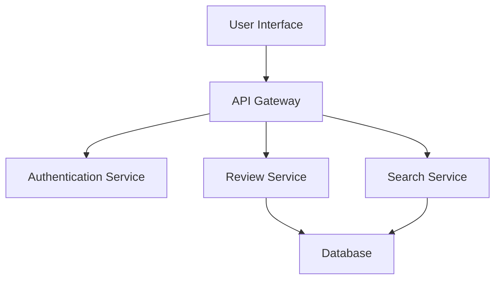

## 13.10.1 Project Overview

In this section, we embark on a detailed exploration of developing a web service using Clojure, specifically designed for experienced Java developers transitioning to this functional programming language. This case study will guide you through the process of building a robust, scalable, and maintainable web application, highlighting the unique advantages of Clojure and its ecosystem.

### Introduction to the Project

The project we will be developing is a **Book Review Web Service**, a platform that allows users to submit, view, and manage book reviews. This service will include features such as user authentication, review submission, and a searchable database of reviews. Our goal is to leverage Clojure's strengths in functional programming, immutability, and concurrency to build an efficient and reliable application.

#### Purpose of the Application

The primary purpose of the Book Review Web Service is to provide a seamless experience for users to share and discover book reviews. By utilizing Clojure, we aim to create a service that is not only performant but also easy to maintain and extend.

#### Key Requirements

1. **User Authentication**: Secure login and registration system.
2. **Review Management**: CRUD (Create, Read, Update, Delete) operations for book reviews.
3. **Search Functionality**: Ability to search reviews by book title, author, or reviewer.
4. **Responsive Design**: Ensure the application is accessible on various devices.
5. **Scalability**: Design the system to handle a growing number of users and reviews.

#### Project Goals

- **Leverage Clojure's Functional Paradigms**: Utilize higher-order functions and immutability to simplify code and improve reliability.
- **Implement Concurrency with Ease**: Use Clojure's concurrency primitives to manage state and handle asynchronous tasks.
- **Ensure Java Interoperability**: Seamlessly integrate Java libraries and tools where necessary.
- **Adopt Best Practices**: Follow idiomatic Clojure practices to write clean, maintainable code.

### Application Architecture

The architecture of our web service will be designed to maximize the benefits of Clojure's functional programming model. We'll use a microservices approach, where each service is responsible for a specific aspect of the application, such as authentication or review management.

#### High-Level Architecture Diagram

Below is a high-level architecture diagram of our Book Review Web Service:



*Diagram 1: High-Level Architecture of the Book Review Web Service.*

### Core Technologies and Tools

- **Clojure**: The primary language for developing the application.
- **Ring and Compojure**: For handling HTTP requests and routing.
- **PostgreSQL**: As the database for storing user and review data.
- **ClojureScript**: For building the frontend interface.
- **Docker**: To containerize the application for easy deployment.
- **Leiningen**: For project management and building.

### Detailed Feature Breakdown

#### User Authentication

We'll implement a secure authentication system using Clojure's libraries, ensuring that user data is protected. This will involve creating endpoints for registration, login, and password management.

**Clojure Code Example: User Registration Endpoint**

```clojure
(ns book-review.auth
  (:require [ring.util.response :refer [response]]
            [crypto.password.bcrypt :as bcrypt]))

(defn register-user [request]
  (let [user-data (:body request)
        hashed-password (bcrypt/generate (:password user-data))]
    ;; Save user to database with hashed password
    (response {:status "User registered successfully"})))

;; Example usage
(register-user {:body {:username "johndoe" :password "securepassword"}})
```

*Code Explanation*: This function handles user registration by hashing the password before storing it in the database, ensuring security.

#### Review Management

The core functionality of our service is managing book reviews. We'll provide endpoints for creating, reading, updating, and deleting reviews, leveraging Clojure's immutable data structures for efficient data handling.

**Clojure Code Example: Creating a Review**

```clojure
(ns book-review.reviews
  (:require [ring.util.response :refer [response]]))

(defn create-review [request]
  (let [review-data (:body request)]
    ;; Save review to database
    (response {:status "Review created successfully"})))

;; Example usage
(create-review {:body {:title "Clojure for the Brave and True" :review "An excellent book!"}})
```

*Code Explanation*: This function processes the incoming review data and stores it in the database, returning a success message.

#### Search Functionality

To enable users to search for reviews, we'll implement a search service that queries the database based on various criteria. This will involve using Clojure's powerful sequence operations to filter and sort results.

**Clojure Code Example: Searching Reviews**

```clojure
(ns book-review.search
  (:require [ring.util.response :refer [response]]))

(defn search-reviews [query]
  (let [results (filter #(clojure.string/includes? (:title %) query) (get-all-reviews))]
    (response {:results results})))

;; Example usage
(search-reviews "Clojure")
```

*Code Explanation*: This function filters reviews by title, demonstrating Clojure's concise syntax for data manipulation.

### Concurrency and State Management

Clojure's concurrency primitives, such as atoms and refs, will be utilized to manage application state and handle concurrent requests efficiently.

#### Using Atoms for State Management

Atoms provide a way to manage shared, mutable state in a thread-safe manner. We'll use atoms to store session data and other transient state information.

**Clojure Code Example: Managing Session State**

```clojure
(ns book-review.sessions)

(def session-store (atom {}))

(defn add-session [session-id user-data]
  (swap! session-store assoc session-id user-data))

;; Example usage
(add-session "session123" {:username "johndoe"})
```

*Code Explanation*: This example demonstrates using an atom to store session data, ensuring thread safety with `swap!`.

### Java Interoperability

While Clojure is a powerful language on its own, there are instances where leveraging existing Java libraries can be beneficial. We'll explore how to integrate Java libraries for tasks such as sending emails or processing payments.

**Clojure Code Example: Using Java Libraries**

```clojure
(ns book-review.email
  (:import [javax.mail Message Session Transport]
           [javax.mail.internet InternetAddress MimeMessage]))

(defn send-email [to subject body]
  (let [props (System/getProperties)
        session (Session/getDefaultInstance props nil)
        message (MimeMessage. session)]
    (.setFrom message (InternetAddress. "noreply@bookreview.com"))
    (.setRecipients message Message$RecipientType/TO (InternetAddress. to))
    (.setSubject message subject)
    (.setText message body)
    (Transport/send message)))

;; Example usage
(send-email "user@example.com" "Welcome" "Thank you for registering!")
```

*Code Explanation*: This function demonstrates calling Java classes and methods from Clojure to send an email, showcasing Clojure's seamless Java interoperability.

### Challenges and Solutions

Developing a web service involves overcoming various challenges, such as handling concurrent requests, ensuring data consistency, and maintaining security. We'll discuss how Clojure's features help address these challenges.

#### Handling Concurrency

Clojure's immutable data structures and concurrency primitives simplify managing concurrent requests, reducing the risk of race conditions and data corruption.

#### Ensuring Data Consistency

By using Clojure's software transactional memory (STM) and refs, we can ensure that data updates are atomic and consistent, even in a concurrent environment.

### Conclusion

Through this case study, we've explored the process of developing a web service using Clojure, highlighting the language's strengths in functional programming, concurrency, and Java interoperability. By leveraging these features, we can build a robust and scalable application that meets modern web development demands.

### Key Takeaways

- **Functional Programming**: Clojure's emphasis on immutability and higher-order functions leads to cleaner, more maintainable code.
- **Concurrency**: Clojure's concurrency primitives simplify state management and improve application performance.
- **Java Interoperability**: Seamlessly integrate Java libraries and tools to enhance functionality.
- **Scalability**: Design applications to handle growth in users and data efficiently.

### Exercises

1. **Implement a New Feature**: Add a feature to allow users to rate reviews. Consider how you would store and retrieve this data.
2. **Optimize Search**: Modify the search functionality to include author names and reviewer usernames.
3. **Enhance Security**: Implement additional security measures, such as rate limiting or two-factor authentication.

### Further Reading

- [Official Clojure Documentation](https://clojure.org/)
- [ClojureDocs](https://clojuredocs.org/)
- [Ring and Compojure GitHub Repositories](https://github.com/ring-clojure/ring)

By following this guide, you'll gain a deeper understanding of how to develop web services using Clojure, leveraging its unique features to create efficient and maintainable applications.

## Quiz Time!



### What is the primary purpose of the Book Review Web Service?

- [x] To provide a seamless experience for users to share and discover book reviews.
- [ ] To manage book sales and inventory.
- [ ] To offer book recommendations based on user preferences.
- [ ] To create a social network for book enthusiasts.

> **Explanation:** The primary purpose of the Book Review Web Service is to allow users to share and discover book reviews.

### Which Clojure library is used for handling HTTP requests and routing in the project?

- [x] Ring and Compojure
- [ ] Luminus
- [ ] Pedestal
- [ ] Reagent

> **Explanation:** Ring and Compojure are used for handling HTTP requests and routing in the project.

### What is the main advantage of using Clojure's immutable data structures?

- [x] They simplify concurrent programming by eliminating race conditions.
- [ ] They allow for dynamic type checking.
- [ ] They improve the performance of sorting algorithms.
- [ ] They enable the use of object-oriented design patterns.

> **Explanation:** Immutable data structures simplify concurrent programming by eliminating race conditions.

### How does the project handle user authentication?

- [x] By implementing secure login and registration endpoints.
- [ ] By using third-party authentication services.
- [ ] By storing passwords in plain text.
- [ ] By allowing anonymous access to all features.

> **Explanation:** The project implements secure login and registration endpoints for user authentication.

### What concurrency primitive is used to manage session state in the project?

- [x] Atoms
- [ ] Refs
- [ ] Agents
- [ ] Vars

> **Explanation:** Atoms are used to manage session state in the project.

### Which database is used for storing user and review data?

- [x] PostgreSQL
- [ ] MySQL
- [ ] MongoDB
- [ ] SQLite

> **Explanation:** PostgreSQL is used for storing user and review data.

### What is the role of Docker in the project?

- [x] To containerize the application for easy deployment.
- [ ] To provide a database management system.
- [ ] To handle HTTP requests and responses.
- [ ] To manage user authentication.

> **Explanation:** Docker is used to containerize the application for easy deployment.

### How does the project ensure data consistency in a concurrent environment?

- [x] By using Clojure's software transactional memory (STM) and refs.
- [ ] By implementing manual locking mechanisms.
- [ ] By using a single-threaded architecture.
- [ ] By avoiding concurrent operations altogether.

> **Explanation:** Clojure's software transactional memory (STM) and refs ensure data consistency in a concurrent environment.

### What is a key benefit of Clojure's Java interoperability?

- [x] It allows seamless integration of Java libraries and tools.
- [ ] It provides automatic code conversion between Java and Clojure.
- [ ] It enables the use of Java's garbage collector in Clojure.
- [ ] It restricts the use of Java syntax in Clojure code.

> **Explanation:** Clojure's Java interoperability allows seamless integration of Java libraries and tools.

### True or False: The project uses ClojureScript for building the backend interface.

- [ ] True
- [x] False

> **Explanation:** ClojureScript is used for building the frontend interface, not the backend.


