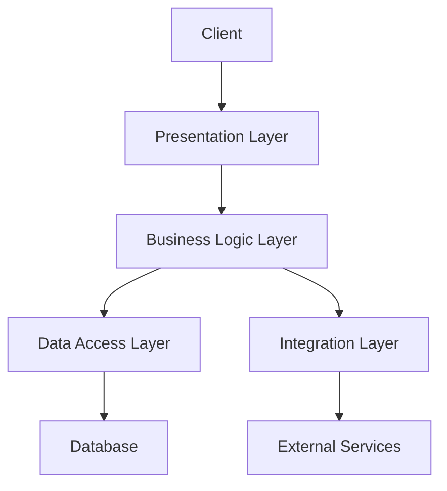
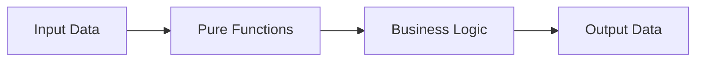

## 13.10.2 Design and Architecture

In this section, we delve into the design and architecture of a web service built using Clojure. We'll explore the architectural decisions made, including the choice of frameworks, database, and deployment strategy. Our goal is to provide you with a comprehensive understanding of how to structure a Clojure-based web application, leveraging your existing Java knowledge to ease the transition.

### Architectural Overview

The architecture of our Clojure web service is designed to be modular, scalable, and maintainable. It follows a typical layered architecture, consisting of the following layers:

1. **Presentation Layer**: Handles HTTP requests and responses, utilizing Clojure's Ring and Compojure libraries for routing and middleware.
2. **Business Logic Layer**: Implements the core functionality of the application using pure functions and Clojure's functional programming paradigms.
3. **Data Access Layer**: Manages interactions with the database, using libraries like `next.jdbc` for SQL databases or Datomic for more complex data needs.
4. **Integration Layer**: Facilitates communication with external services and APIs, ensuring seamless interoperability.

Let's break down each layer and the decisions involved in their design.

### Presentation Layer

The presentation layer is responsible for handling HTTP requests and responses. In Clojure, this is typically achieved using the **Ring** library, which provides a simple and flexible abstraction for web applications. **Compojure** is often used alongside Ring to define routes and handle HTTP methods.

#### Ring and Compojure

**Ring** is a Clojure library that abstracts the HTTP request/response cycle. It provides a simple interface for building web applications, allowing developers to focus on the logic rather than the underlying HTTP details.

**Compojure** is a routing library that works with Ring to define routes in a concise and readable manner. It allows you to map HTTP methods and paths to handler functions.

Here's a simple example of a Compojure route definition:

```clojure
(ns myapp.routes
  (:require [compojure.core :refer :all]
            [ring.util.response :refer [response]]))

(defroutes app-routes
  (GET "/" [] (response "Welcome to our Clojure Web Service!"))
  (GET "/hello/:name" [name] (response (str "Hello, " name "!"))))
```

In this example, we define two routes: one for the root path `/` and another for `/hello/:name`, which dynamically responds with a greeting.

#### Middleware

Middleware in Ring is a powerful concept that allows you to modify requests and responses. Middleware functions are composed to form a pipeline, enabling cross-cutting concerns like logging, authentication, and error handling.

Here's an example of a simple logging middleware:

```clojure
(defn wrap-logging [handler]
  (fn [request]
    (println "Request received:" request)
    (handler request)))
```

You can apply this middleware to your application like so:

```clojure
(def app
  (-> app-routes
      wrap-logging))
```

### Business Logic Layer

The business logic layer is where the core functionality of your application resides. In Clojure, this layer is typically composed of pure functions, which are functions that have no side effects and always produce the same output for the same input.

#### Pure Functions and Immutability

Clojure's emphasis on pure functions and immutability leads to code that is easier to reason about, test, and maintain. By avoiding side effects, you can ensure that your business logic is predictable and reliable.

Here's an example of a pure function that calculates the total price of items in a shopping cart:

```clojure
(defn calculate-total [cart]
  (reduce + (map :price cart)))
```

This function takes a collection of items, each with a `:price` key, and returns the total price.

#### Higher-Order Functions

Clojure's support for higher-order functions allows you to create flexible and reusable components. Higher-order functions are functions that take other functions as arguments or return them as results.

For example, you can create a function that applies a discount to each item in a cart:

```clojure
(defn apply-discount [discount]
  (fn [item]
    (update item :price #(* % (- 1 discount)))))
```

You can then use this function with `map` to apply the discount to all items:

```clojure
(def discounted-cart (map (apply-discount 0.1) cart))
```

### Data Access Layer

The data access layer is responsible for interacting with the database. Clojure provides several libraries for database access, including `next.jdbc` for SQL databases and Datomic for more complex data needs.

#### SQL Database Access with next.jdbc

`next.jdbc` is a modern Clojure library for interacting with SQL databases. It provides a simple and efficient API for executing queries and managing connections.

Here's an example of using `next.jdbc` to query a database:

```clojure
(ns myapp.db
  (:require [next.jdbc :as jdbc]))

(def db-spec {:dbtype "h2" :dbname "test"})

(defn get-users []
  (jdbc/execute! db-spec ["SELECT * FROM users"]))
```

In this example, we define a database specification and a function to retrieve all users from the `users` table.

#### Datomic for Complex Data Needs

Datomic is a distributed database designed for complex data needs. It provides a powerful query language and supports immutable data, making it a great fit for Clojure applications.

Here's a simple example of querying Datomic:

```clojure
(ns myapp.datomic
  (:require [datomic.api :as d]))

(def conn (d/connect "datomic:mem://mydb"))

(defn find-users []
  (d/q '[:find ?e
         :where [?e :user/name]]
       (d/db conn)))
```

This example connects to a Datomic database and retrieves all entities with a `:user/name` attribute.

### Integration Layer

The integration layer handles communication with external services and APIs. This layer ensures that your application can interact with other systems, whether through RESTful APIs, message queues, or other protocols.

#### RESTful API Integration

Integrating with RESTful APIs in Clojure is straightforward, thanks to libraries like `clj-http` for making HTTP requests.

Here's an example of using `clj-http` to fetch data from an external API:

```clojure
(ns myapp.api
  (:require [clj-http.client :as client]))

(defn fetch-data [url]
  (client/get url {:as :json}))
```

This function makes a GET request to the specified URL and returns the response as JSON.

### Deployment Strategy

Deploying a Clojure web service involves packaging your application and deploying it to a server or cloud platform. Common deployment strategies include using Docker containers, deploying to cloud platforms like AWS or Heroku, or using traditional server setups.

#### Docker Containers

Docker is a popular choice for deploying Clojure applications, as it allows you to package your application and its dependencies into a single container. This ensures consistency across development, testing, and production environments.

Here's a simple Dockerfile for a Clojure web service:

```dockerfile
FROM clojure:openjdk-11-lein

WORKDIR /app
COPY . /app

RUN lein uberjar

CMD ["java", "-jar", "target/myapp-standalone.jar"]
```

This Dockerfile uses the official Clojure image, copies the application code, builds an uberjar (a standalone JAR file), and runs it.

#### Cloud Deployment

Cloud platforms like AWS and Heroku offer scalable and flexible deployment options for Clojure applications. They provide managed services for databases, caching, and more, allowing you to focus on your application logic.

For example, deploying to Heroku can be as simple as pushing your code to a Git repository:

```bash
git push heroku main
```

Heroku automatically detects your Clojure application and builds it using Leiningen.

### Diagrams and Illustrations

To better understand the architecture of our Clojure web service, let's look at a few diagrams that illustrate the application's structure.

#### Application Architecture Diagram



*Diagram 1: This diagram illustrates the layered architecture of our Clojure web service, showing the flow of data from the client to the database and external services.*

#### Data Flow in Business Logic



*Diagram 2: This diagram represents the flow of data through pure functions in the business logic layer, emphasizing the use of functional programming paradigms.*

### Key Takeaways

- **Modular Architecture**: Our Clojure web service follows a modular architecture, with distinct layers for presentation, business logic, data access, and integration.
- **Functional Programming**: Clojure's emphasis on pure functions and immutability leads to maintainable and testable code.
- **Flexible Deployment**: Clojure applications can be deployed using Docker containers or cloud platforms like AWS and Heroku, providing flexibility and scalability.

### Exercises

1. **Implement a New Route**: Add a new route to the Compojure application that returns a JSON response.
2. **Create a Middleware**: Write a middleware function that adds a custom header to all responses.
3. **Query a Database**: Use `next.jdbc` to query a database and return the results as JSON.
4. **Integrate an API**: Use `clj-http` to fetch data from an external API and display it in your application.

### Further Reading

- [Official Clojure Documentation](https://clojure.org/)
- [Ring GitHub Repository](https://github.com/ring-clojure/ring)
- [Compojure GitHub Repository](https://github.com/weavejester/compojure)
- [next.jdbc Documentation](https://github.com/seancorfield/next-jdbc)
- [Datomic Documentation](https://docs.datomic.com/)

Now that we've explored the design and architecture of a Clojure web service, you're equipped to build scalable and maintainable applications using Clojure's powerful features. Let's continue to the next section, where we'll dive deeper into implementing these concepts in a real-world project.

## Quiz: Test Your Knowledge on Clojure Web Service Architecture



### Which library is commonly used in Clojure for routing HTTP requests?

- [ ] Datomic
- [x] Compojure
- [ ] core.async
- [ ] clj-http

> **Explanation:** Compojure is a routing library used in Clojure to define routes and handle HTTP methods.

### What is the primary purpose of middleware in a Clojure web application?

- [x] To modify requests and responses
- [ ] To handle database transactions
- [ ] To manage application state
- [ ] To define application routes

> **Explanation:** Middleware functions in Clojure are used to modify requests and responses, providing a way to implement cross-cutting concerns like logging and authentication.

### Which Clojure library is used for interacting with SQL databases?

- [ ] Ring
- [ ] Compojure
- [x] next.jdbc
- [ ] core.async

> **Explanation:** next.jdbc is a modern Clojure library for interacting with SQL databases, providing a simple and efficient API for executing queries.

### What is a key advantage of using pure functions in Clojure's business logic layer?

- [x] Predictability and reliability
- [ ] Faster execution
- [ ] Easier integration with Java
- [ ] Reduced memory usage

> **Explanation:** Pure functions are predictable and reliable because they have no side effects and always produce the same output for the same input.

### Which deployment strategy involves packaging a Clojure application into a container?

- [x] Docker
- [ ] Heroku
- [ ] AWS Lambda
- [ ] Kubernetes

> **Explanation:** Docker is a popular choice for deploying Clojure applications, allowing you to package your application and its dependencies into a single container.

### What does the `wrap-logging` middleware function do in the provided example?

- [x] Logs incoming requests
- [ ] Handles authentication
- [ ] Manages database connections
- [ ] Defines application routes

> **Explanation:** The `wrap-logging` middleware function logs incoming requests, demonstrating how middleware can be used to implement cross-cutting concerns.

### Which Clojure library is used for making HTTP requests to external APIs?

- [ ] Ring
- [ ] Compojure
- [ ] Datomic
- [x] clj-http

> **Explanation:** clj-http is a Clojure library used for making HTTP requests to external APIs, providing a simple interface for interacting with RESTful services.

### What is the role of the integration layer in a Clojure web service?

- [x] To facilitate communication with external services
- [ ] To handle HTTP requests and responses
- [ ] To manage database interactions
- [ ] To implement business logic

> **Explanation:** The integration layer handles communication with external services and APIs, ensuring seamless interoperability in a Clojure web service.

### Which diagram illustrates the flow of data through pure functions in the business logic layer?

- [ ] Application Architecture Diagram
- [x] Data Flow in Business Logic
- [ ] Deployment Strategy Diagram
- [ ] Database Interaction Diagram

> **Explanation:** The "Data Flow in Business Logic" diagram represents the flow of data through pure functions in the business logic layer, emphasizing functional programming paradigms.

### True or False: Clojure's emphasis on immutability leads to code that is easier to reason about and maintain.

- [x] True
- [ ] False

> **Explanation:** Clojure's emphasis on immutability leads to code that is easier to reason about, test, and maintain, as it avoids side effects and ensures predictable behavior.


