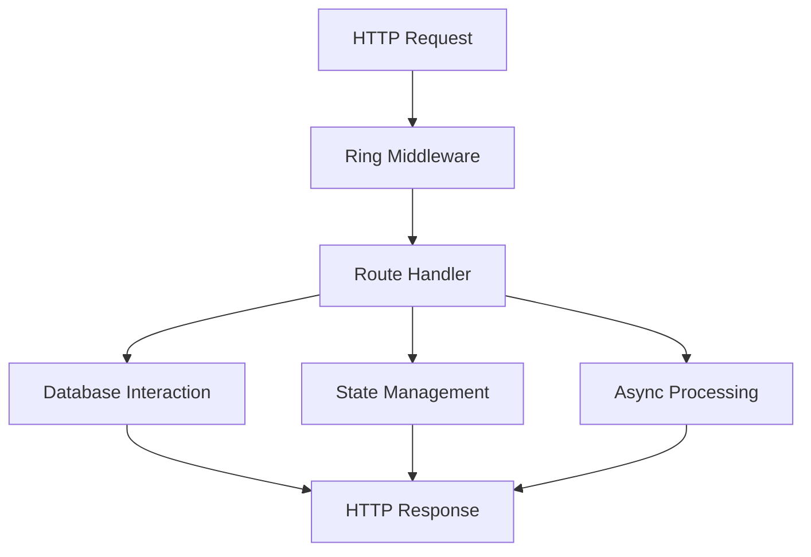

## 13.10.3 Implementation Highlights

In this section, we will delve into the implementation highlights of developing a web service using Clojure. This journey will showcase how the concepts from earlier sections, such as functional programming, immutability, and concurrency, are applied in practice. We'll explore key components of the web service, including setting up routes, handling HTTP requests, managing state, and integrating with databases. By the end of this section, you'll have a comprehensive understanding of how to leverage Clojure's strengths in web development.

### Setting Up the Web Server

The foundation of any web service is the web server. In Clojure, we often use the **Ring** library, which provides a simple and flexible way to handle HTTP requests and responses. Ring abstracts the HTTP protocol into a series of middleware functions, allowing us to build modular and composable web applications.

Here's a basic setup for a Ring-based web server:

```clojure
(ns my-web-service.core
  (:require [ring.adapter.jetty :refer [run-jetty]]
            [ring.middleware.defaults :refer [wrap-defaults site-defaults]]
            [compojure.core :refer [defroutes GET POST]]
            [compojure.route :as route]))

(defroutes app-routes
  (GET "/" [] "Welcome to My Web Service!")
  (POST "/submit" request (handle-submit request))
  (route/not-found "Page not found"))

(def app
  (wrap-defaults app-routes site-defaults))

(defn -main []
  (run-jetty app {:port 3000 :join? false}))
```

**Explanation:**

- **Ring Adapter Jetty**: We use Jetty as the HTTP server, which is a popular choice for Clojure web applications.
- **Compojure**: This library is used for routing. We define routes using `GET` and `POST` macros.
- **Middleware**: `wrap-defaults` applies a set of default middleware, such as session handling and security headers.

**Try It Yourself**: Modify the `GET` route to return a JSON response instead of plain text. Use the `cheshire` library to encode a Clojure map into JSON.

### Handling HTTP Requests and Responses

Handling HTTP requests in Clojure involves parsing the request data and generating appropriate responses. Let's look at how we can handle a POST request to submit data:

```clojure
(ns my-web-service.handlers
  (:require [cheshire.core :as json]))

(defn handle-submit [request]
  (let [body (slurp (:body request))
        data (json/parse-string body true)]
    {:status 200
     :headers {"Content-Type" "application/json"}
     :body (json/generate-string {:message "Data received" :data data})}))
```

**Explanation:**

- **Request Parsing**: We use `slurp` to read the request body and `cheshire` to parse the JSON data.
- **Response Generation**: The response is a map with `:status`, `:headers`, and `:body` keys, which Ring uses to construct the HTTP response.

**Try It Yourself**: Add error handling to return a 400 status code if the JSON parsing fails.

### Managing State with Immutability

In Clojure, managing state is often done using immutable data structures. For scenarios where state changes are necessary, we use constructs like **atoms**. Let's see how we can manage a simple counter state:

```clojure
(ns my-web-service.state)

(def counter (atom 0))

(defn increment-counter []
  (swap! counter inc))

(defn get-counter []
  @counter)
```

**Explanation:**

- **Atom**: An atom is a reference type that allows for safe, concurrent updates to a value.
- **swap!**: This function applies a given function (`inc` in this case) to the current value of the atom, updating it atomically.

**Try It Yourself**: Implement a decrement function for the counter and expose it via a new API endpoint.

### Integrating with Databases

Database integration is a crucial part of web services. In Clojure, we often use libraries like **clojure.java.jdbc** or **next.jdbc** for interacting with relational databases. Here's an example of how to connect to a database and perform CRUD operations:

```clojure
(ns my-web-service.db
  (:require [next.jdbc :as jdbc]))

(def db-spec {:dbtype "h2" :dbname "test"})

(defn create-user [user]
  (jdbc/execute! db-spec ["INSERT INTO users (name, email) VALUES (?, ?)" (:name user) (:email user)]))

(defn get-user [id]
  (jdbc/execute-one! db-spec ["SELECT * FROM users WHERE id = ?" id]))
```

**Explanation:**

- **Database Specification**: `db-spec` defines the connection details for the database.
- **CRUD Operations**: We use `execute!` for insertions and `execute-one!` for queries.

**Try It Yourself**: Extend the database schema to include a `created_at` timestamp and modify the `create-user` function to set this value.

### Middleware for Authentication

Middleware in Clojure allows us to add cross-cutting concerns like authentication. Here's a simple example of an authentication middleware:

```clojure
(ns my-web-service.middleware)

(defn wrap-authentication [handler]
  (fn [request]
    (if-let [user (authenticate (:headers request))]
      (handler (assoc request :user user))
      {:status 401 :body "Unauthorized"})))

(defn authenticate [headers]
  ;; Dummy authentication logic
  (when (= "secret-token" (get headers "Authorization"))
    {:id 1 :name "John Doe"}))
```

**Explanation:**

- **Middleware Function**: `wrap-authentication` checks for an authorization token and either proceeds with the request or returns a 401 status.
- **Authentication Logic**: This is a simple example; in a real application, you would verify the token against a user database.

**Try It Yourself**: Implement role-based access control by extending the `authenticate` function to include user roles.

### Concurrency with Core.async

Clojure's **core.async** library provides powerful tools for managing concurrency. Let's explore how we can use channels to handle asynchronous tasks:

```clojure
(ns my-web-service.async
  (:require [clojure.core.async :refer [chan go >! <!]]))

(defn process-data [data]
  (let [c (chan)]
    (go
      (let [result (expensive-computation data)]
        (>! c result)))
    c))

(defn expensive-computation [data]
  ;; Simulate a long-running computation
  (Thread/sleep 1000)
  (str "Processed " data))
```

**Explanation:**

- **Channel**: A channel is a conduit for passing messages between different parts of a program.
- **Go Block**: `go` is used to create a lightweight thread that performs asynchronous operations.

**Try It Yourself**: Modify `process-data` to handle multiple data items concurrently and return a collection of results.

### Diagram: Data Flow in a Clojure Web Service



**Diagram Explanation**: This flowchart illustrates the data flow in a Clojure web service. It starts with an HTTP request, passes through middleware, and reaches the route handler. The handler may interact with the database, manage state, or perform asynchronous processing before sending an HTTP response.

### Key Takeaways

- **Functional Programming**: Emphasizes immutability and pure functions, leading to more predictable and maintainable code.
- **Concurrency**: Clojure provides powerful abstractions like atoms and core.async for managing concurrent operations safely.
- **Middleware**: Enables modular and reusable components for handling cross-cutting concerns.
- **Database Integration**: Libraries like next.jdbc make it straightforward to interact with relational databases.
- **Asynchronous Processing**: Core.async allows for efficient handling of concurrent tasks without blocking threads.

### Exercises

1. **Extend the Web Service**: Add a new endpoint that returns a list of users from the database.
2. **Implement Caching**: Use an atom to cache database results and reduce load on the database.
3. **Enhance Authentication**: Implement JWT-based authentication for more secure token handling.
4. **Optimize Performance**: Profile the web service and identify bottlenecks in request handling or database interactions.

### Further Reading

- [Official Clojure Documentation](https://clojure.org/)
- [ClojureDocs](https://clojuredocs.org/)
- [Ring GitHub Repository](https://github.com/ring-clojure/ring)
- [Compojure GitHub Repository](https://github.com/weavejester/compojure)

Now that we've explored the implementation highlights of a Clojure web service, let's apply these concepts to build robust and scalable applications. Embrace the power of functional programming and concurrency to create efficient and maintainable web services.

## Quiz: Test Your Knowledge on Clojure Web Development



### What library is commonly used in Clojure for handling HTTP requests and responses?

- [x] Ring
- [ ] Express
- [ ] Flask
- [ ] Spring

> **Explanation:** Ring is a popular library in Clojure for handling HTTP requests and responses, providing a simple and flexible way to build web applications.

### Which Clojure library is used for routing in web applications?

- [x] Compojure
- [ ] React Router
- [ ] Django
- [ ] Sinatra

> **Explanation:** Compojure is a routing library for Clojure web applications, allowing developers to define routes using simple macros.

### What is the purpose of the `wrap-defaults` middleware in Ring?

- [x] To apply a set of default middleware, such as session handling and security headers
- [ ] To handle database connections
- [ ] To manage user authentication
- [ ] To perform data validation

> **Explanation:** `wrap-defaults` applies a set of default middleware in Ring, including session handling, security headers, and more.

### How do you parse JSON data in Clojure?

- [x] Using the `cheshire` library
- [ ] Using the `json` library
- [ ] Using the `gson` library
- [ ] Using the `jackson` library

> **Explanation:** The `cheshire` library is commonly used in Clojure for parsing and generating JSON data.

### What Clojure construct is used for safe, concurrent updates to a value?

- [x] Atom
- [ ] Var
- [ ] Ref
- [ ] Agent

> **Explanation:** An atom is a reference type in Clojure that allows for safe, concurrent updates to a value.

### Which function is used to update the value of an atom in Clojure?

- [x] swap!
- [ ] reset!
- [ ] alter
- [ ] update

> **Explanation:** `swap!` is used to apply a function to the current value of an atom, updating it atomically.

### What is the role of channels in Clojure's core.async library?

- [x] To pass messages between different parts of a program
- [ ] To manage database connections
- [ ] To handle HTTP requests
- [ ] To perform data validation

> **Explanation:** Channels in core.async are used to pass messages between different parts of a program, facilitating asynchronous communication.

### How do you create a lightweight thread in Clojure for asynchronous operations?

- [x] Using the `go` macro
- [ ] Using the `thread` macro
- [ ] Using the `async` macro
- [ ] Using the `future` macro

> **Explanation:** The `go` macro in Clojure is used to create lightweight threads for asynchronous operations.

### What is the purpose of the `execute!` function in next.jdbc?

- [x] To perform database insertions and updates
- [ ] To parse JSON data
- [ ] To handle HTTP requests
- [ ] To manage user authentication

> **Explanation:** The `execute!` function in next.jdbc is used to perform database insertions and updates.

### True or False: Middleware in Clojure allows for modular and reusable components.

- [x] True
- [ ] False

> **Explanation:** Middleware in Clojure enables modular and reusable components, allowing developers to handle cross-cutting concerns efficiently.


