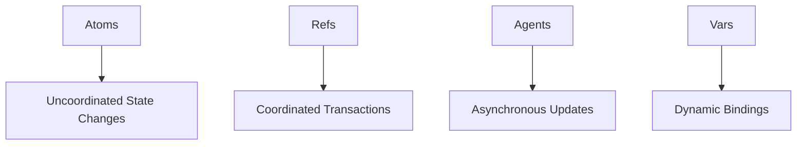

## 13.10.4 Challenges and Solutions

In the journey of developing a web service using Clojure, developers often encounter a variety of challenges. These can range from handling concurrency and scaling issues to integration difficulties with existing systems. In this section, we will delve into these challenges and explore the solutions that can help overcome them. By leveraging Clojure's unique features and functional programming paradigms, we can address these challenges effectively.

### Handling Concurrency

Concurrency is a common challenge in web development, especially when dealing with high-traffic applications. Clojure offers several concurrency primitives that make it easier to manage state and execute parallel tasks.

#### Challenge: Managing Shared State

In a concurrent environment, managing shared state can lead to race conditions and data inconsistencies. Traditional Java approaches often rely on locks and synchronization, which can be error-prone and difficult to manage.

#### Solution: Using Atoms and Refs

Clojure provides **atoms** and **refs** as concurrency primitives to manage shared state safely. Atoms are used for uncoordinated, independent state changes, while refs are suitable for coordinated, transactional updates.

**Example: Using Atoms**

```clojure
(def counter (atom 0))

(defn increment-counter []
  (swap! counter inc))

;; Increment the counter concurrently
(doseq [i (range 1000)]
  (future (increment-counter)))

;; The counter will be 1000 after all futures complete
```

In this example, the `swap!` function is used to safely update the atom's state, ensuring that the increment operation is atomic.

**Example: Using Refs and Transactions**

```clojure
(def account-balance (ref 1000))

(defn transfer [amount]
  (dosync
    (alter account-balance - amount)))

;; Perform a transaction
(transfer 100)
```

The `dosync` block ensures that the operations within it are executed as a single transaction, providing consistency and isolation.

### Scaling Issues

As web applications grow, scaling becomes a critical concern. Clojure's immutable data structures and functional programming model can help address scaling challenges.

#### Challenge: Efficient Data Handling

Handling large volumes of data efficiently is crucial for scaling web applications. In Java, this often involves complex data structures and algorithms.

#### Solution: Leveraging Persistent Data Structures

Clojure's persistent data structures offer efficient data handling by sharing structure between versions, reducing the need for copying.

**Example: Persistent Vectors**

```clojure
(def large-vector (vec (range 1000000)))

;; Adding an element to a persistent vector
(def new-vector (conj large-vector 1000000))

;; The original vector remains unchanged
```

Persistent data structures allow for efficient updates and access, making them ideal for scalable applications.

### Integration Difficulties

Integrating Clojure with existing Java systems or third-party libraries can pose challenges, especially when dealing with different paradigms and data representations.

#### Challenge: Interoperability with Java

Java and Clojure have different approaches to object-oriented and functional programming, which can complicate integration.

#### Solution: Java Interoperability Features

Clojure provides robust interoperability features that allow seamless integration with Java code and libraries.

**Example: Calling Java Methods from Clojure**

```clojure
(import 'java.util.Date)

(defn current-time []
  (.toString (Date.)))

;; Call a Java method from Clojure
(current-time)
```

Clojure's interop syntax allows you to call Java methods and access fields directly, making it easy to integrate with Java codebases.

### Concurrency Models in Clojure

To further understand how Clojure handles concurrency, let's explore its concurrency models using a diagram.



**Diagram Description:** This diagram illustrates the different concurrency models in Clojure. Atoms are used for uncoordinated state changes, refs for coordinated transactions, agents for asynchronous updates, and vars for dynamic bindings.

### Try It Yourself: Experiment with Concurrency

To deepen your understanding, try modifying the atom and ref examples. Experiment with different operations and observe how Clojure's concurrency primitives handle state changes.

### Best Practices for Concurrency in Clojure

- **Use Atoms for Simple State Changes:** Atoms are ideal for independent state updates.
- **Leverage Refs for Transactions:** Use refs when multiple state changes need to be coordinated.
- **Consider Agents for Asynchronous Tasks:** Agents are useful for tasks that can be executed asynchronously.
- **Avoid Unnecessary Locks:** Clojure's concurrency primitives reduce the need for explicit locks.

### Scaling with Clojure's Functional Paradigm

Clojure's functional paradigm offers unique advantages for scaling applications. By embracing immutability and pure functions, we can build scalable systems that are easier to reason about and maintain.

#### Challenge: Statelessness and Immutability

In a functional paradigm, maintaining state across requests can be challenging, especially in a stateless web environment.

#### Solution: Functional State Management

Clojure's approach to state management involves using immutable data structures and functional transformations.

**Example: Functional State Management**

```clojure
(defn update-state [state event]
  (assoc state :last-event event))

(def initial-state {:count 0})

;; Update state functionally
(def new-state (update-state initial-state :increment))
```

By using pure functions to manage state, we can ensure that our applications remain stateless and scalable.

### Integration with Existing Systems

Integrating Clojure with existing systems often requires bridging the gap between different paradigms and technologies.

#### Challenge: Data Representation and Conversion

Converting data between Clojure's data structures and Java's object-oriented model can be complex.

#### Solution: Data Conversion Utilities

Clojure provides utilities for converting between its data structures and Java's, facilitating integration.

**Example: Data Conversion**

```clojure
(import 'java.util.HashMap)

(defn clojure-map-to-java [clj-map]
  (let [java-map (HashMap.)]
    (doseq [[k v] clj-map]
      (.put java-map k v))
    java-map))

;; Convert a Clojure map to a Java HashMap
(clojure-map-to-java {:key "value"})
```

This example demonstrates how to convert a Clojure map to a Java `HashMap`, enabling seamless data exchange.

### Exercises: Overcoming Integration Challenges

1. **Convert Java Collections to Clojure:** Write a function that converts a Java `ArrayList` to a Clojure vector.
2. **Integrate a Java Library:** Use a Java library in a Clojure project and call its methods from Clojure code.

### Summary and Key Takeaways

- **Concurrency:** Clojure's concurrency primitives, such as atoms and refs, provide safe and efficient state management.
- **Scaling:** Leveraging persistent data structures and functional paradigms can help scale applications effectively.
- **Integration:** Clojure's interoperability features facilitate seamless integration with Java systems and libraries.

By understanding and addressing these challenges, we can harness the full potential of Clojure in web development. Now that we've explored these solutions, let's apply them to build robust and scalable web services.

### Further Reading

- [Clojure Official Documentation](https://clojure.org/reference/documentation)
- [ClojureDocs](https://clojuredocs.org/)
- [Java Interoperability in Clojure](https://clojure.org/reference/java_interop)

### SEO optimized quiz title



### What is the primary use of atoms in Clojure?

- [x] Managing uncoordinated state changes
- [ ] Coordinating transactions
- [ ] Asynchronous updates
- [ ] Dynamic bindings

> **Explanation:** Atoms are used for managing uncoordinated state changes in Clojure.

### Which Clojure primitive is suitable for coordinated state changes?

- [ ] Atoms
- [x] Refs
- [ ] Agents
- [ ] Vars

> **Explanation:** Refs are used for coordinated state changes in Clojure, ensuring consistency through transactions.

### How does Clojure handle data immutability?

- [x] By using persistent data structures
- [ ] By copying data on every update
- [ ] By using mutable data structures
- [ ] By locking data during updates

> **Explanation:** Clojure uses persistent data structures to handle data immutability efficiently.

### What is the purpose of the `dosync` block in Clojure?

- [ ] To manage asynchronous tasks
- [x] To execute transactions
- [ ] To create dynamic bindings
- [ ] To handle errors

> **Explanation:** The `dosync` block is used to execute transactions in Clojure, ensuring atomicity and consistency.

### How can Clojure integrate with Java libraries?

- [x] By using Java interop syntax
- [ ] By converting all Java code to Clojure
- [ ] By using a separate integration framework
- [ ] By avoiding Java libraries

> **Explanation:** Clojure integrates with Java libraries using its interop syntax, allowing direct method calls and field access.

### What is a key advantage of using persistent data structures in Clojure?

- [x] Efficient updates and access
- [ ] Increased memory usage
- [ ] Complexity in data handling
- [ ] Slower performance

> **Explanation:** Persistent data structures in Clojure allow for efficient updates and access by sharing structure between versions.

### How does Clojure's functional paradigm aid in scaling applications?

- [x] By promoting immutability and pure functions
- [ ] By using mutable state
- [ ] By relying on inheritance
- [ ] By increasing code complexity

> **Explanation:** Clojure's functional paradigm aids in scaling applications by promoting immutability and pure functions.

### What is the role of agents in Clojure's concurrency model?

- [ ] Managing coordinated state changes
- [ ] Creating dynamic bindings
- [x] Handling asynchronous updates
- [ ] Executing transactions

> **Explanation:** Agents in Clojure are used for handling asynchronous updates, allowing tasks to be executed in the background.

### Which Clojure feature facilitates seamless integration with Java?

- [ ] Persistent data structures
- [ ] Functional programming
- [x] Java interoperability
- [ ] Concurrency primitives

> **Explanation:** Java interoperability in Clojure facilitates seamless integration with Java code and libraries.

### True or False: Clojure requires explicit locks for concurrency management.

- [ ] True
- [x] False

> **Explanation:** Clojure does not require explicit locks for concurrency management, as it provides concurrency primitives like atoms and refs.


